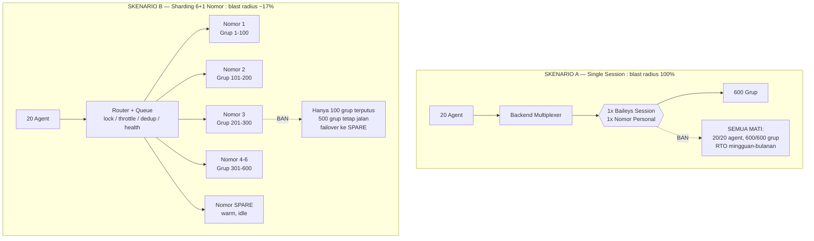

# Analisa Risiko Teknis: WhatsApp Automation via Baileys
### Skenario: 1 nomor personal, 1 session Baileys, 600 grup, 20 agent manusia

> **Catatan kejujuran data:** WhatsApp/Meta TIDAK mempublikasikan angka ban rate, threshold rate limit, maupun detail heuristik anti-spam untuk akun unofficial. Semua angka di dokumen ini adalah **ESTIMASI KONSERVATIF** berbasis pengetahuan umum, pengalaman komunitas, dan penalaran teknis — bukan fakta resmi. Angka bertanda `[ESTIMASI]` wajib dibaca sebagai orde-besaran, bukan SLA.

---

## 1. Ringkasan Verdict Risiko

**Verdict: HIGH RISK (mendekati Critical untuk kelangsungan operasional).**

Satu kalimat: Setup ini menumpuk hampir semua sinyal anti-abuse WhatsApp secara simultan (client unofficial + fan-out 600 grup + velocity 20 operator + pola non-human) di atas **satu titik kegagalan tunggal**, sehingga bukan pertanyaan *apakah* kena ban, tapi *kapan* — dan saat kena, seluruh operasi (20 agent, 600 grup) mati serentak tanpa jalur pemulihan cepat.

| Dimensi | Level | Catatan singkat |
|---|---|---|
| Probabilitas suspend/ban | **High** | Kombinasi unofficial client + mass-group + high velocity |
| Dampak saat terjadi (blast radius) | **Critical** | 1 session = 100% operasi mati |
| Waktu pemulihan (RTO) | **Buruk** | Ban permanen = nomor hilang; re-join 600 grup manual = mingguan |
| Risiko korupsi data/ordering | **Medium-High** | Concurrency 20 penulis di 1 socket |
| Risiko legal/ToS | **High (kontraktual)** | Baileys melanggar WhatsApp ToS secara eksplisit |
| Kelayakan migrasi ke API resmi | **Rendah untuk usecase grup** | Cloud API tidak support kirim ke grup |

---

## 2. Jawaban Eksplisit 3 Pertanyaan

### Q1: Apakah setup ini meningkatkan suspend/ban rate? Seberapa besar, kenapa secara teknis?

**Jawaban: Ya, meningkat signifikan — dan bukan dari satu faktor, tapi dari perkalian beberapa faktor independen.**

Seberapa besar: **tidak ada angka resmi**, dan siapa pun yang bilang "ban rate 37%" mengarang. Yang bisa dinyatakan jujur adalah **arah dan orde-besaran relatif**:

- Nomor personal biasa, pakai app resmi, chat normal → baseline risiko ban praktis mendekati nol.
- Nomor personal + Baileys, traffic rendah, sedikit grup → risiko naik, tapi banyak yang bertahan lama. `[ESTIMASI]`
- Nomor personal + Baileys + **600 grup** + **20 operator concurrent** → risiko naik ke kategori tertinggi. Dalam pengalaman komunitas, profil seperti ini umumnya bertahan **hitungan hari sampai beberapa minggu**, bukan bulan, terutama pada fase awal sebelum "trust" nomor terbangun. `[ESTIMASI, bukan jaminan]`

**Kenapa secara teknis** — heuristik yang kena trigger:

1. **Unofficial client signature.** Baileys reverse-engineer protokol WA Web multi-device. Handshake, urutan protobuf, versi client string, kapabilitas yang diiklankan, pola keep-alive, dan cara library ini menangani sinkronisasi app-state semuanya berbeda dari client resmi. Meta punya sisi server penuh — mereka bisa fingerprint deviasi ini kapan saja, dan setiap update protokol WA adalah kesempatan mendeteksi implementasi pihak ketiga yang belum menyesuaikan.
2. **Velocity pengiriman.** 20 manusia menulis paralel dari satu identitas menghasilkan laju pesan per menit yang tidak mungkin dicapai satu manusia dengan satu jempol. Ini sinyal paling mudah dan paling murah untuk dideteksi server-side — tidak butuh ML, cukup counter.
3. **Fan-out ke banyak percakapan.** Jumlah distinct conversation yang disentuh per jam melompat jauh di atas distribusi user normal. 600 grup berarti potensi fan-out ratusan thread aktif.
4. **Pola non-human.** Inter-message interval yang terlalu rapi atau terlalu rapat, pesan mengalir 24/7 tanpa pola tidur, tidak ada jeda mengetik yang wajar, burst tepat setelah event tertentu, template teks berulang antar grup. Semua ini terukur.
5. **Duplikasi konten lintas grup.** Kalau agent mengirim pesan mirip/sama ke banyak grup, itu tanda tangan broadcast/spam klasik. Ditambah penanda `forwarded many times` bila konten diteruskan.
6. **Signal dari user, bukan dari mesin.** Ini yang paling berbahaya dan paling sering diremehkan: **block dan report dari anggota grup**. Heuristik mesin bisa diakali dengan throttling; report manusia tidak bisa. Dengan 600 grup, populasi orang yang bisa menekan "Report" terhadap nomor ini bisa mencapai puluhan ribu. Rasio report per pesan yang naik sedikit saja langsung memindahkan akun ke bucket enforcement yang lebih agresif.
7. **Perilaku join yang abnormal.** Cara nomor ini bergabung ke 600 grup (kecepatan join, join via link massal, diinvite oleh akun yang juga sudah ditandai) adalah sinyal terpisah dari perilaku kirim pesan.

Poin kunci: faktor-faktor ini **tidak aditif, tapi multiplikatif**. Menurunkan satu faktor (misal throttle velocity) tidak menghapus risiko dari 600 grup dan unofficial client.

---

### Q2: Risiko 20 agent aktif bersamaan di grup yang SAMA (1 identitas, banyak operator)

**Jawaban: Risiko tinggi, dua lapis — lapis deteksi platform dan lapis kualitas operasional/UX.**

**Lapis deteksi platform:**
- Dari sisi WhatsApp, satu identitas mengirim beberapa pesan ke grup yang sama dalam jendela beberapa detik, dengan gaya bahasa berbeda-beda, adalah pola yang tidak konsisten dengan satu manusia. Tidak ada mekanisme di protokol untuk mengatakan "ini operator berbeda".
- Typing indicator (`presence: composing`) akan bertabrakan: agent A mulai typing, agent B stop typing, presence terakhir yang menang. Server melihat presence flapping cepat yang tidak natural.
- Read receipt: 20 agent membuka thread yang sama menghasilkan burst read-receipt/ack yang tidak wajar. Jika kebijakan read-receipt tidak diserialisasi, pesan bisa ditandai terbaca sebelum agent yang ditugaskan benar-benar melihatnya.

**Lapis operasional/UX (sering lebih merusak bisnis daripada ban):**
- **Tabrakan balasan.** Dua agent membaca pertanyaan yang sama, keduanya menjawab. Anggota grup melihat satu "orang" menjawab dua kali dengan isi berbeda — kredibilitas hancur, dan itu justru memicu report.
- **Tidak ada atribusi.** Semua keluar sebagai satu nomor. Audit trail siapa mengirim apa hanya ada di backend, tidak di WhatsApp. Kalau ada pesan bermasalah, forensik bergantung penuh pada log internal.
- **Kepribadian tidak konsisten.** 20 gaya bahasa dari satu "orang" terasa aneh bagi anggota grup dan meningkatkan kecurigaan bahwa ini bot.
- **Konteks basi.** Agent B menjawab berdasarkan state thread 30 detik lalu, sementara agent A sudah menutup isu itu.
- **Escalation loop.** Dua agent saling membalas komentar anggota yang sama, thread jadi kacau.

**Mitigasi wajib jika tetap jalan:** assignment lock per conversation (satu grup = satu agent aktif pada satu waktu, dengan lease + timeout), plus indikator "sedang ditangani oleh X" di UI backend. Tanpa ini, 20 agent di 1 identitas adalah resep kekacauan bahkan tanpa mempertimbangkan ban.

---

### Q3: Risiko 20 orang kirim chat bersamaan dari 1 nomor identik (concurrency, ordering, rate)

**Jawaban: Risiko tinggi di tiga sumbu — rate, ordering, dan integritas session.**

**Rate.** Satu socket Baileys adalah satu jalur keluar. 20 penulis menekan agregat throughput jauh di atas profil manusia. Jika backend tidak melakukan throttling terpusat, laju kirim naik linear terhadap jumlah agent aktif. Ini sinyal deteksi termudah *dan* penyebab paling umum error/disconnect dari sisi server.

**Ordering & race condition:**
- Urutan pesan yang diterima grup ditentukan oleh urutan pengiriman di socket, bukan oleh urutan agent menekan tombol Send. Tanpa queue FIFO per-conversation, jawaban bisa muncul sebelum pertanyaan klarifikasinya, atau dua bagian dari satu pesan panjang bisa terpisah.
- **Duplikasi.** Retry pada timeout tanpa idempotency key mengirim pesan yang sama dua kali. Dengan 20 agent dan koneksi yang kadang goyang, ini sering terjadi.
- **Race pada state lokal.** Baileys menyimpan app-state, key store (Signal session/sender keys), dan chat state. Akses tulis paralel tanpa serialisasi bisa merusak key store — gejalanya pesan gagal didekripsi, muncul "Waiting for this message", atau session harus di-reset (artinya scan QR lagi, dan itu event yang juga terlihat oleh server).
- **Backpressure.** Kalau socket lambat atau reconnect, queue in-memory menumpuk. Saat koneksi kembali, seluruh backlog tersembur sekaligus — burst tajam, tepat pola yang paling mencurigakan.

**Presence & receipt conflict:** presence global per-device, bukan per-agent. Typing/online/offline dari 20 sumber menghasilkan flapping. Read receipt juga global — tidak bisa "terbaca oleh agent A saja".

**Kesimpulan Q3:** satu identitas WhatsApp secara arsitektural adalah **single-writer resource**. Memaksanya menjadi multi-writer tanpa lapisan serialisasi menghasilkan dua kegagalan sekaligus: risiko ban naik, dan korektnes pesan turun. Serialization queue + dedup + assignment lock bukan optimasi, tapi syarat minimum agar sistem benar.

---

## 3. Analisa Detail per Faktor Risiko

### 3.1 Baileys / unofficial WhatsApp Web = penambah deteksi

Baileys bukan integrasi resmi. Ia meniru client WA Web multi-device dengan hasil reverse engineering. Konsekuensi teknis:

- **Fingerprint client.** Versi client, urutan field, kapabilitas yang diiklankan, cara sinkronisasi app-state, timing keep-alive — semuanya bisa dibandingkan server-side dengan client resmi. Deviasi = penanda.
- **Tidak ada kontrak.** Meta bisa mengubah protokol tanpa pemberitahuan. Perubahan yang membuat Baileys error massal juga sekaligus jadi mekanisme deteksi (client yang gagal beradaptasi menonjol).
- **Tidak ada jalur banding.** Nomor personal yang kena ban tidak punya support channel yang efektif. Business API punya representative; nomor personal tidak.
- **Tidak ada quality rating.** API resmi memberi feedback loop (quality tier, messaging limit) sehingga tim bisa mengoreksi sebelum kena sanksi. Unofficial: tidak ada peringatan, langsung mati.
- **Risiko supply chain.** Library pihak ketiga yang menangani kredensial session penuh. Kompromi dependency = kompromi akses WhatsApp penuh.

### 3.2 Single point of failure — blast radius

Ini risiko struktural terbesar, terpisah dari probabilitas ban.

**Kalau 1 session mati (ban, logout paksa, device unlinked, key store korup, VPS down):**
- 20 agent kehilangan akses total, serentak.
- 600 grup kehilangan kanal komunikasi, serentak.
- Riwayat percakapan sisi WhatsApp tidak bisa dipulihkan ke nomor baru.
- Nomor baru harus **di-invite ulang ke 600 grup** — butuh kerja sama admin di 600 grup berbeda. Realistis: mingguan sampai bulanan, dan sebagian grup tidak akan pernah kembali.
- Kalau ban permanen, nomornya hilang untuk selamanya.

**Diagram blast radius:**

```
╔══════════════════════════════════════════════════════════════════╗
║  SKENARIO A — SEKARANG: SINGLE SESSION (blast radius = 100%)     ║
╚══════════════════════════════════════════════════════════════════╝

   Agent 01 ┐
   Agent 02 ├┐
   Agent 03 ├┤
     ...    ├┼──►  BACKEND  ──►  ╔═════════════════════╗
   Agent 19 ├┤                   ║  1x BAILEYS SESSION ║  ◄── TITIK
   Agent 20 ┘┘                   ║  1x NOMOR PERSONAL  ║      TUNGGAL
                                 ╚══════════╤══════════╝
                                            │
                    ┌───────────────────────┼───────────────────────┐
                    ▼                       ▼                       ▼
              [Grup 001..200]         [Grup 201..400]         [Grup 401..600]

   ╳ BAN / LOGOUT PAKSA / KEY STORE KORUP ╳
                    │
                    ▼
   ┌──────────────────────────────────────────────────────────────┐
   │  DAMPAK:  20/20 agent OFFLINE   (100%)                       │
   │           600/600 grup TERPUTUS (100%)                       │
   │           RTO: mingguan–bulanan (butuh re-invite 600 grup)    │
   │           Ban permanen ⇒ nomor HILANG, riwayat HILANG         │
   └──────────────────────────────────────────────────────────────┘


╔══════════════════════════════════════════════════════════════════╗
║  SKENARIO B — SHARDED: 6 NOMOR (blast radius ≈ 17% per insiden)  ║
╚══════════════════════════════════════════════════════════════════╝

   Agent 01-03 ──►┐                    ┌──► SESSION 1 ──► Grup 001-100
   Agent 04-06 ──►│                    ├──► SESSION 2 ──► Grup 101-200
   Agent 07-09 ──►│   ROUTER / ORKES-  ├──► SESSION 3 ──► Grup 201-300
   Agent 10-12 ──►├──► TRATOR + QUEUE  ├──► SESSION 4 ──► Grup 301-400
   Agent 13-15 ──►│   (lock, throttle, ├──► SESSION 5 ──► Grup 401-500
   Agent 16-18 ──►│    dedup, health)  ├──► SESSION 6 ──► Grup 501-600
   Agent 19-20 ──►┘                    └──► SESSION 7 ──► SPARE (warm)

   ╳ SESSION 3 KENA BAN ╳
                    │
                    ▼
   ┌──────────────────────────────────────────────────────────────┐
   │  DAMPAK:  ~3/20 agent perlu re-assign (~15%)                 │
   │           100/600 grup terputus  (~17%)                      │
   │           500 grup TETAP JALAN                                │
   │           Failover ke SPARE: jam–hari (re-invite 100 grup)    │
   │           Sinyal diagnostik: tahu shard mana yang "panas"     │
   └──────────────────────────────────────────────────────────────┘
```



### 3.3 Concurrency di 1 socket Baileys

| Masalah | Mekanisme | Akibat |
|---|---|---|
| Ordering | 20 penulis, 1 jalur keluar, tanpa FIFO per-conversation | Pesan muncul tidak berurutan; jawaban mendahului konteks |
| Duplikasi | Retry tanpa idempotency key | Pesan ganda di grup; naik sinyal spam |
| Race key store | Tulis paralel ke Signal session/sender key | Gagal dekripsi, "Waiting for this message", perlu re-scan QR |
| Backpressure | Queue menumpuk saat reconnect, lalu flush sekaligus | Burst tajam = pola paling mencurigakan |
| Presence conflict | `composing`/`available` global per device | Typing indicator flapping, tidak natural |
| Read receipt | Ack global, bukan per-agent | Thread ditandai terbaca padahal belum ditangani; burst ack |
| Reply collision | Dua agent balas thread sama | Satu "orang" menjawab dua kali, isi berbeda ⇒ report |
| Head-of-line blocking | Satu pesan besar/lambat menahan queue | Latency semua agent naik saat traffic tinggi |

**Syarat minimum agar benar:** queue FIFO per-conversation, idempotency key per pesan, assignment lock dengan lease + timeout, central rate limiter (token bucket per nomor), persistent outbox agar tidak hilang saat restart, dan single-writer terhadap key store.

### 3.4 600 grup dari 1 akun = red flag mandiri

Ini faktor risiko **terpisah** dari perilaku kirim pesan. Bahkan kalau nomor ini nol mengirim, 600 grup sudah abnormal.

- **Mass-join pattern.** Distribusi normal user WhatsApp: mayoritas di bawah puluhan grup. Ratusan grup menempatkan akun di ekor ekstrem distribusi — mudah difilter dengan satu query.
- **Perkalian surface area laporan.** Kalau rata-rata satu grup berisi ratusan anggota, 600 grup berarti puluhan ribu orang yang punya tombol Report/Block terhadap nomor ini. Bahkan rasio report yang sangat kecil menghasilkan volume absolut laporan yang tinggi. **Ini adalah jalur ban yang paling tidak bisa dimitigasi secara teknis** — tidak ada throttling yang mencegah manusia menekan Report.
- **Honeypot / spam-trap.** Sebagian grup publik (terutama yang didapat dari link massal) memang dipakai untuk menandai akun spam. Bergabung ke grup semacam itu bisa langsung mengasosiasikan nomor dengan klaster abuse.
- **Guilt by association.** Grup yang berisi banyak akun yang sudah ditandai membuat nomor ini masuk klaster yang sama dalam analisis graf.
- **Forwarded-many.** Konten yang diteruskan lintas banyak grup mendapat penanda dan diperlakukan lebih ketat.
- **Beban teknis.** 600 grup berarti ratusan sender-key session, sinkronisasi app-state besar, dan volume event masuk tinggi — memperbesar peluang key store korup dan reconnect loop, yang keduanya adalah event yang terlihat dari sisi server.

### 3.5 Rate limit realistis (ESTIMASI, bukan angka resmi)

**WhatsApp tidak mempublikasikan angka apa pun untuk akun unofficial.** Berikut kerangka konservatif untuk perencanaan kapasitas, bukan jaminan keamanan:

| Dimensi | Estimasi konservatif per nomor | Catatan |
|---|---|---|
| Pesan keluar | orde **beberapa per menit**, bukan puluhan | `[ESTIMASI]` Tujuannya menyerupai satu manusia |
| Jeda antar pesan | acak, orde **beberapa detik ke atas** | `[ESTIMASI]` Hindari interval konstan |
| Distinct grup disentuh per jam | orde **puluhan, bukan ratusan** | `[ESTIMASI]` Fan-out adalah sinyal kuat |
| Jam operasi | jendela terbatas, ada "jam tidur" | `[ESTIMASI]` Aktivitas 24/7 tidak human |
| Nomor baru (warm-up) | mulai sangat rendah, naik bertahap berhari-hari/mingguan | `[ESTIMASI]` Nomor baru paling rapuh |
| Konten identik lintas grup | hindari; variasikan | Duplikasi lintas grup = tanda broadcast |

**Yang penting dipahami:** enforcement WhatsApp kemungkinan besar tidak berbasis satu threshold tunggal, tapi skor komposit (velocity + fan-out + report rate + fingerprint client + umur akun + reputasi jaringan). Artinya: **mengunci satu angka rate limit tidak membuat setup aman.** Rate limiting menurunkan salah satu komponen skor, tidak menghapus yang lain.

### 3.6 Tingkatan enforcement dan efek ke device/nomor

Berdasarkan pola yang umum diamati komunitas `[ESTIMASI struktur, bukan dokumen resmi]`:

1. **Friksi lunak / soft throttle.** Pesan mulai lambat, gagal terkirim, atau ack tertunda. Sering tidak ada notifikasi eksplisit. Ini peringatan paling awal dan paling sering diabaikan.
2. **Logout paksa / device unlinked.** Session Baileys ditendang, perlu scan QR ulang. Sering merupakan sinyal bahwa akun sudah diperhatikan.
3. **Temporary ban.** Durasi bervariasi: hitungan jam sampai hitungan hari. Biasanya ada pesan "akun ini tidak dapat digunakan" dengan hitungan waktu. Sering kambuh dan makin panjang bila perilaku diulang.
4. **Permanent ban.** Nomor tidak bisa dipakai lagi di WhatsApp. Untuk nomor personal, jalur banding praktis sangat terbatas.
5. **Efek meluas.** Enforcement tidak selalu berhenti di satu nomor. Sinyal yang bisa mengaitkan beberapa akun: perangkat/instance yang sama, IP/ASN yang sama (terutama IP datacenter/VPS), pola perilaku identik, dan keanggotaan grup yang tumpang tindih. Konsekuensi praktis: **menjalankan semua nomor sharding di satu VPS/IP dengan pola perilaku identik berisiko membuat mereka ban bersamaan** — yang menghapus seluruh manfaat sharding.

### 3.7 Legal / ToS

- WhatsApp Terms of Service melarang akses layanan melalui cara/klien yang tidak sah dan penggunaan otomatis tanpa izin. **Baileys jelas termasuk kategori itu.** Tidak ada ambiguitas di sisi ini.
- Konsekuensi realistis: penghentian akun (bukan tuntutan pidana untuk kasus umum), tapi Meta punya rekam jejak menempuh jalur hukum terhadap vendor yang mengoperasikan automation unofficial dalam skala besar.
- **Risiko bisnis:** kalau ini melayani pelanggan, kanal yang berdiri di atas pelanggaran ToS tidak bisa diberi SLA. Ketergantungan operasional pada kanal yang bisa dimatikan pihak ketiga sewaktu-waktu, tanpa banding, adalah risiko yang harus disetujui secara eksplisit oleh pemilik bisnis — bukan keputusan engineering.
- **Data & privasi.** Pesan grup dari 600 grup masuk ke backend. Ini pemrosesan data pribadi pihak ketiga yang mungkin tidak sadar percakapan mereka disimpan. Perlu dasar hukum, retensi, dan kontrol akses tersendiri — terpisah dari isu ToS.
- Dokumentasikan penerimaan risiko ini secara tertulis. Kalau tidak, saat nomor kena ban, keputusan teknis akan dibaca sebagai kelalaian engineering.

---

## 4. Rekomendasi Arsitektur Berjenjang

### Tier 0 — PALING AMAN: WhatsApp Business Platform resmi (Cloud API / On-Premises)

**Kejujuran yang wajib disampaikan lebih dulu:** **Cloud API resmi TIDAK mendukung pengiriman pesan ke grup WhatsApp.** API resmi dirancang untuk percakapan bisnis-ke-individu (1:1), bukan partisipasi grup. Jadi usecase "chat ke 600 grup" **tidak bisa dipindahkan apa adanya** ke API resmi. Siapa pun yang menawarkan "Cloud API untuk grup" hampir pasti menjual wrapper unofficial di belakangnya.

Konsekuensinya: Tier 0 hanya berlaku kalau **model interaksinya diubah**, bukan sekadar ganti transport.

| Aspek | Nilai |
|---|---|
| Risiko ban | Sangat rendah (jalur resmi, ada quality rating & peringatan) |
| Multi-agent | Didukung native, atribusi per-agent jelas |
| Concurrency | Dikelola platform, ada rate limit terdokumentasi |
| **Grup** | **TIDAK DIDUKUNG** |
| Biaya | Per-conversation/per-message, ada biaya |
| Legal | Patuh ToS |

**Perubahan model yang diperlukan agar Tier 0 layak:**
- Grup → 1:1. Anggota grup diajak opt-in ke chat langsung dengan nomor bisnis. Kualitas jauh lebih baik, tapi butuh migrasi audiens dan tidak semua orang mau pindah.
- Broadcast satu arah → template message resmi ke penerima opt-in.
- Diskusi komunitas → pindah ke kanal yang memang mendukungnya (Telegram/Discord/forum), sementara WhatsApp dipakai untuk 1:1 resmi.

**Verdict Tier 0:** paling aman dan satu-satunya opsi yang patuh ToS, **tapi tidak menjawab usecase grup tanpa perubahan model interaksi.** Ini trade-off nyata yang harus diputuskan bisnis, bukan disembunyikan.

---

### Tier 1 — HYBRID (rekomendasi paling realistis)

Pisahkan traffic berdasarkan nilai bisnisnya:

- **Cloud API resmi** untuk semua yang bisa 1:1: notifikasi, follow-up, support, transaksi, apa pun yang berkonsekuensi bisnis.
- **Unofficial (Baileys) yang di-sharding dan diperketat** hanya untuk grup, dengan volume ditekan seminimal mungkin, dan diperlakukan sebagai **kanal best-effort tanpa SLA**.
- Aktif memindahkan percakapan bernilai tinggi dari grup ke 1:1 resmi. Ini secara bertahap mengecilkan ketergantungan pada kanal rapuh.

| Aspek | Nilai |
|---|---|
| Risiko ban | Sedang, dan terbatas hanya pada bagian grup |
| Grup | Didukung (via unofficial) |
| Blast radius | Terkendali — jalur bernilai tinggi tidak ikut mati |
| Kompleksitas | Dua integrasi berbeda untuk dipelihara |
| Legal | Sebagian melanggar ToS (bagian grup) |

**Verdict Tier 1:** trade-off terbaik antara kebutuhan grup dan kelangsungan operasional. Ini yang saya rekomendasikan kalau grup wajib ada.

---

### Tier 2 — Unofficial, tapi di-sharding & diperketat (kalau grup wajib dan Tier 1 belum bisa)

Kalau tetap harus grup dan tetap unofficial, minimum yang harus ada:

**a) Multi-nomor sharding.** Bagi 600 grup ke beberapa nomor (misal 6 nomor × ~100 grup, plus 1 spare). Semakin banyak nomor, semakin kecil blast radius per insiden — biaya: makin banyak nomor untuk diurus.

**b) Isolasi per nomor — ini yang paling sering dilanggar dan membuat sharding jadi sia-sia:**
- IP/egress berbeda per nomor. **Hindari menaruh semua nomor di satu VPS/IP datacenter.**
- Fingerprint device berbeda per nomor.
- Pola perilaku berbeda per nomor (jam aktif, kecepatan balas, gaya bahasa).
- Hindari tumpang tindih besar keanggotaan grup antar nomor.

> Sharding tanpa isolasi = memindahkan single point of failure, bukan menghapusnya. Kalau 6 nomor punya IP, fingerprint, dan pola identik, mereka bisa ban bersamaan dan Anda kembali ke blast radius 100%.

**c) Warm-up nomor.** Nomor baru dimulai dengan volume sangat rendah dan sedikit grup, naik bertahap selama berhari-hari sampai mingguan. Jangan pernah menaruh nomor segar langsung ke 100 grup.

**d) Rate limiting terpusat + jitter.** Token bucket per nomor. Delay acak, bukan konstan. Jendela jam operasi dengan "jam tidur". Cap harian per nomor.

**e) Batasi agent per nomor.** Idealnya 1 agent aktif per conversation, dan sedikit agent per nomor (misal 3-4). Semakin banyak agent per nomor, semakin tinggi velocity agregat.

**f) Lapisan concurrency (wajib, bukan opsional):**
- Assignment lock per conversation dengan lease + timeout otomatis.
- Queue FIFO per conversation.
- Idempotency key + dedup window.
- Persistent outbox (selamat dari restart).
- Single-writer ke key store per session.
- Presence & read-receipt diserialisasi lewat satu koordinator.

**g) Monitoring kesehatan & auto-failover.** Pantau ack rate, error rate, latency ack, frekuensi reconnect, dan jumlah pesan gagal. Ini sinyal awal soft-throttle. Kalau shard terdeteksi tidak sehat: **turunkan volume dulu**, jangan langsung retry agresif — retry agresif saat throttled mempercepat ban.

**h) Nomor spare yang sudah warm.** Simpan minimal 1-2 nomor cadangan yang sudah warm dan sudah ada di sebagian grup penting, siap mengambil alih.

| Aspek | Nilai |
|---|---|
| Risiko ban per nomor | Masih tinggi |
| Risiko ban seluruh operasi | Turun signifikan (jika isolasi benar) |
| Grup | Didukung |
| Kompleksitas | Tinggi (orkestrasi multi-session) |
| Legal | Melanggar ToS |

**Verdict Tier 2:** bisa dijalankan, tapi ini manajemen risiko — bukan penghilangan risiko. Anggap setiap nomor sebagai barang habis pakai.

---

### Tier 3 — STATUS QUO (tidak direkomendasikan)

1 nomor, 1 session, 600 grup, 20 agent. Risiko ban tinggi **dan** blast radius 100%. Kombinasi terburuk: probabilitas tinggi bertemu dampak maksimum, tanpa jalur pemulihan cepat.

| Aspek | Nilai |
|---|---|
| Risiko ban | Tinggi |
| Blast radius | 100% |
| RTO | Mingguan-bulanan, atau permanen |
| Legal | Melanggar ToS |

**Verdict Tier 3:** hanya dapat diterima untuk pilot berjangka waktu jelas, dengan volume rendah, data tidak kritis, dan penerimaan risiko tertulis dari pemilik bisnis.

---

### Ringkasan perbandingan

| | Tier 0 (API resmi) | Tier 1 (Hybrid) | Tier 2 (Sharded unofficial) | Tier 3 (Status quo) |
|---|---|---|---|---|
| Risiko ban | Sangat rendah | Sedang (terbatas) | Tinggi per nomor | Tinggi |
| Blast radius | Minimal | Terkendali | ~1/N | **100%** |
| Dukungan grup | **Tidak** | Ya (unofficial) | Ya | Ya |
| Patuh ToS | Ya | Sebagian | Tidak | Tidak |
| Kompleksitas | Rendah | Sedang-tinggi | Tinggi | Rendah |
| Perubahan model bisnis | **Besar** | Sedang | Tidak | Tidak |
| **Rekomendasi** | Paling aman | **Paling realistis** | Minimum jika grup wajib | Hindari |

---

## 5. Fallback & Mitigasi Kalau Tetap Jalan

### 5.1 Prioritas urutan pengerjaan

**Segera (hari ini–minggu ini), dampak besar, biaya kecil:**
1. Central rate limiter + jitter di backend. Satu titik kontrol untuk semua traffic keluar.
2. Assignment lock per conversation. Menghentikan tabrakan balasan — sumber report paling mudah dicegah.
3. Idempotency key + dedup. Menghentikan pesan ganda.
4. Persistent outbox + queue FIFO per conversation. Pesan tidak hilang, urutan terjaga.
5. Monitoring dasar: ack rate, error rate, frekuensi reconnect. Tanpa ini, soft-throttle tidak terdeteksi sampai terlambat.
6. Serialisasi presence & read-receipt lewat satu koordinator.

**Jangka pendek (2-6 minggu):**
7. Siapkan 1-2 nomor spare dan mulai warm-up sekarang, sebelum dibutuhkan. Nomor spare yang baru dibeli saat krisis tidak berguna.
8. Ekspor dan simpan inventaris 600 grup: nama grup, group ID, kontak admin, prioritas bisnis, jumlah anggota. **Ini artefak pemulihan paling penting** — tanpa daftar kontak admin, re-invite 600 grup praktis mustahil.
9. Klasifikasi grup: tier A (kritis), B (penting), C (bisa hilang). Menentukan urutan pemulihan.
10. Mulai sharding untuk grup tier A ke nomor terpisah dengan isolasi IP/fingerprint.

**Jangka menengah (1-3 bulan):**
11. Integrasi Cloud API resmi untuk semua traffic 1:1.
12. Kampanye memindahkan percakapan bernilai tinggi dari grup ke 1:1 resmi.
13. Sharding penuh 600 grup + auto-failover.

### 5.2 Runbook kalau nomor kena ban

Urutan ini penting — jangan diacak.

1. **Hentikan semua pengiriman ke session terdampak.** Matikan worker, jangan andalkan retry logic. Retry agresif ke akun yang di-throttle mempercepat eskalasi dari temporary ke permanent.
2. **Klasifikasi jenis enforcement.** Soft-throttle, logout paksa, temporary ban, atau permanent ban. Responsnya berbeda total.
   - Soft-throttle: turunkan volume drastis, tunggu, jangan re-scan QR berulang.
   - Logout paksa: re-link **sekali**, lalu jalankan dengan volume jauh lebih rendah. Kalau ditendang lagi, perlakukan sebagai peringatan serius.
   - Temporary ban: **tunggu penuh sampai selesai.** Jangan coba akal-akalan device/IP baru — itu sinyal evasion dan bisa mempercepat ban permanen.
   - Permanent ban: nomor dianggap hilang. Lanjut ke langkah 3.
3. **Aktifkan nomor spare yang sudah warm.** Bukan nomor yang baru dibeli.
4. **Beri tahu agent dan stakeholder.** Alihkan agent ke shard yang masih sehat.
5. **Pulihkan grup berdasarkan tier.** Hubungi admin grup tier A lebih dulu untuk invite nomor baru. Realistis: hari sampai minggu, dan sebagian grup tidak akan kembali.
6. **Post-mortem.** Cari apa yang berubah sebelum ban: lonjakan volume, konten baru, agent baru, perubahan pola. Sesuaikan rate limiter.
7. **Jangan ulangi pola yang sama di nomor baru.** Ban pertama adalah data. Nomor baru dengan pola identik akan mengikuti nasib yang sama.

### 5.3 Yang jangan dilakukan

- Jangan retry agresif saat terdeteksi throttle.
- Jangan pakai beberapa nomor dengan IP, fingerprint, dan pola perilaku identik — mereka akan ban bersamaan.
- Jangan taruh semua session di satu VPS/IP datacenter.
- Jangan kirim konten identik ke banyak grup dalam jendela waktu pendek.
- Jangan menaruh nomor baru langsung ke ratusan grup.
- Jangan menjanjikan SLA di atas kanal unofficial.
- Jangan biarkan dua agent memegang conversation yang sama.
- Jangan lupa inventaris grup + kontak admin. Tanpa itu, pemulihan tidak mungkin.
- Jangan coba menghindari temporary ban dengan device/IP baru — perlakukan sebagai evasion signal.

### 5.4 Sinyal peringatan awal yang harus dipantau

| Sinyal | Arti | Tindakan |
|---|---|---|
| Ack rate turun | Soft-throttle mulai | Turunkan volume segera |
| Latency ack naik | Server mulai membatasi | Turunkan volume |
| Reconnect makin sering | Session tidak stabil / diperhatikan | Turunkan volume, cek key store |
| Error kirim naik | Pembatasan aktif | Berhenti, jangan retry |
| Logout paksa | Peringatan serius | Re-link sekali, volume minimum |
| Pesan gagal dekripsi | Key store korup | Perbaiki single-writer, hindari re-scan berulang |
| Keluar dari grup tanpa sebab | Kemungkinan di-kick karena report | Cek konten & frekuensi di grup itu |

---

## Penutup — tiga hal yang paling penting

1. **Cloud API resmi tidak mendukung grup.** Ini fakta yang tidak bisa dinegosiasikan secara teknis. Usecase "chat ke 600 grup" tidak punya jalur resmi. Pilihannya: ubah model interaksi (ke 1:1), atau terima risiko unofficial secara sadar dan tertulis. Tidak ada opsi ketiga.
2. **Blast radius adalah masalah yang lebih mendesak daripada probabilitas ban.** Probabilitas ban sulit dikendalikan dan tidak bisa diukur dengan angka jujur. Blast radius sepenuhnya di bawah kendali Anda. Sharding + isolasi + nomor spare + inventaris grup adalah pekerjaan dengan hasil paling pasti.
3. **Concurrency 20 agent di 1 identitas butuh serialisasi, apa pun keputusan soal ban.** Assignment lock, FIFO queue, idempotency, dan serialisasi presence bukan optimasi — tanpa itu sistemnya salah secara fungsional, dan tabrakan balasan justru memicu report yang mempercepat ban.

**Semua angka dalam laporan ini bertanda `[ESTIMASI]` adalah perkiraan berbasis penalaran teknis dan pengalaman komunitas. WhatsApp tidak mempublikasikan ban rate, threshold rate limit, maupun detail heuristik anti-spam. Jangan gunakan angka-angka ini sebagai jaminan keamanan atau dasar SLA.**