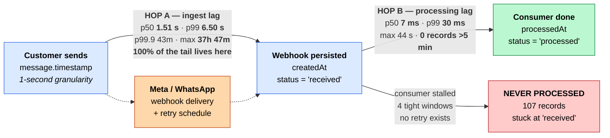
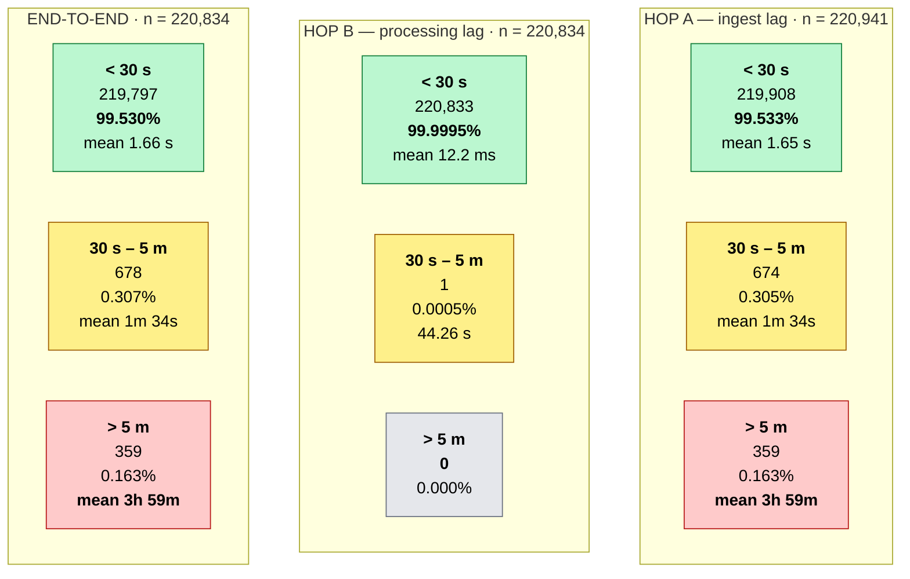
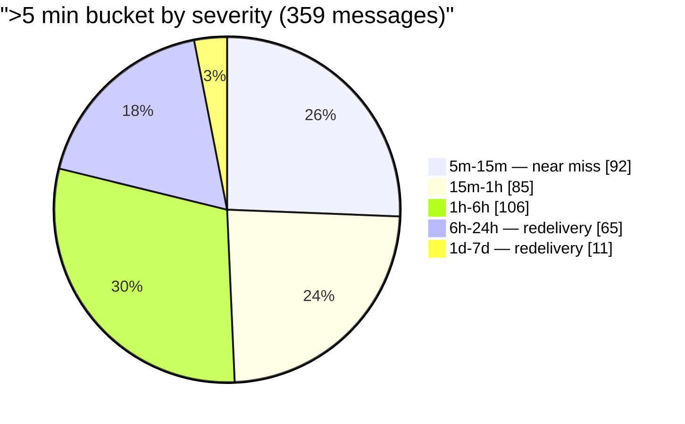
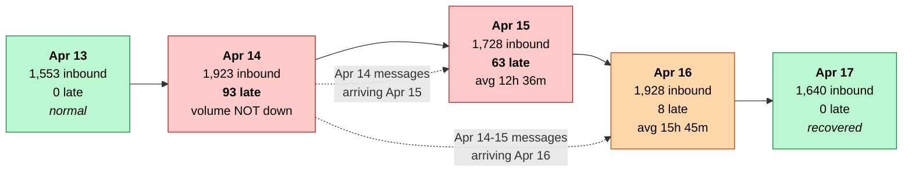
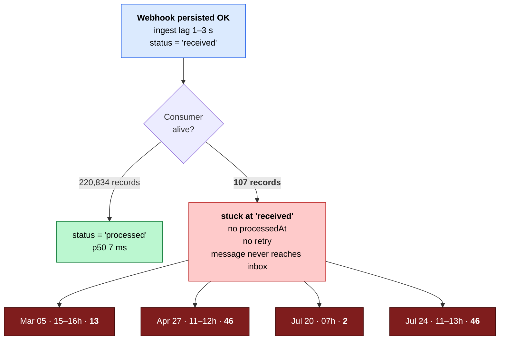

# WhatsApp API Inbound Webhook — Latency Pipeline and Distribution

Companion to [`reports/whatsapp-api-inbound-webhook-latency-analysis.md`](../reports/whatsapp-api-inbound-webhook-latency-analysis.md).

All figures from 220,941 inbound message webhooks in
`whatsapp_api.whatsappapiwebhooklogs`, 2026-02-27 → 2026-08-05.

---

## 1. Where the time actually goes

Two hops, three timestamps. The first hop owns effectively all of the latency;
the second is measured in milliseconds.

**Reading:** Hop B is three to four orders of magnitude faster than Hop A at every
percentile. The `> 5 minute` category is an inbound-delivery phenomenon, not a
SatuInbox processing phenomenon.

---

## 2. The three categories, side by side

End-to-end is Hop A plus a rounding error — 359 late in both, identical 3 h 59 m
average. That equality *is* the finding.

---

## 3. Inside the `> 5 minute` bucket

359 messages, average lateness **3 h 59 m 04 s**, median **1 h 00 m 25 s**. The gap
between mean and median is explained by the shape below: half the bucket is a
near-miss, a fifth of it is a multi-hour redelivery.

| Sub-band | Count | Share | Avg late | Bar |
|---|---|---|---|---|
| 5 m – 15 m | 92 | 25.6% | 7 m 54 s | `██████████████████████████` |
| 15 m – 1 h | 85 | 23.7% | 39 m 14 s | `████████████████████████` |
| 1 h – 6 h | 106 | 29.5% | 2 h 00 m | `██████████████████████████████` |
| 6 h – 24 h | 65 | 18.1% | 12 h 59 m | `██████████████████` |
| 1 d – 7 d | 11 | 3.1% | 27 h 48 m | `███` |
| > 7 d | 0 | 0% | — | |

**49.3%** of the bucket resolves within an hour. The **76 messages beyond 6 hours
(21.2%)** carry most of the 59.6 cumulative late-days and are what pulls the
average up to 3 h 59 m.

---

## 4. The tail is incident-shaped

125 of 160 days are completely clean. Five days hold 76.6% of all late messages.

| Date | > 5 min | Rate | Avg late | Bar (count) |
|---|---|---|---|---|
| **2026-04-14** | 93 | 4.84% | 1 h 10 m | `█████████████████████████████████████` |
| **2026-05-19** | 65 | 4.38% | 3 h 53 m | `██████████████████████████` |
| **2026-04-15** | 63 | 3.65% | 12 h 36 m | `█████████████████████████` |
| **2026-03-09** | 39 | 1.78% | 37 m | `████████████████` |
| 2026-04-08 | 15 | 0.88% | 23 m | `██████` |
| 2026-06-12 | 11 | 0.62% | 1 h 14 m | `████` |
| 2026-07-27 | 10 | 0.43% | 2 h 11 m | `████` |
| 2026-07-29 | 10 | 0.56% | 3 h 16 m | `████` |
| 2026-04-16 | 8 | 0.41% | **15 h 45 m** | `███` |
| 2026-07-13 | 8 | 0.47% | 19 m | `███` |
| 2026-04-23 | 6 | 0.44% | 11 m | `██` |
| 2026-03-25 | 4 | 0.23% | 10 m | `█` |
| *19 other days* | 1 each | — | — | `▪` |

### The 14–16 April redelivery event — 164 messages, 45.7% of all lateness

Fresh traffic kept flowing at normal volume (1,923 on Apr 14 vs. a 1,466 median)
**while** messages stamped Apr 14 kept arriving through Apr 16. That combination —
no volume loss, plus long-delayed arrivals of older messages — is the signature of
**partial webhook non-acknowledgement and Meta retry**, not of an endpoint outage
or of Meta being uniformly slow.

---

## 5. The 107 that never finished

Invisible to every percentile in this document, because a record with no
`processedAt` cannot enter a latency distribution.

Clean ingest (1–3 s) followed by no processing at all, in four windows one to two
hours wide — a **stalled consumer after persist**, with no reconciliation path.
Types: 99 text, 6 image, 2 `user_changed_number`.

Latency dashboards report **100% under 30 s** on the exact days this happened.

---

## 6. Percentile reference

| | Hop A — ingest | Hop B — processing | End-to-end |
|---|---|---|---|
| p50 | 1.51 s | **7 ms** | 1.52 s |
| p75 | 1.82 s | 20 ms | 1.83 s |
| p90 | 2.27 s | 22 ms | 2.28 s |
| p95 | 2.71 s | 23 ms | 2.72 s |
| p99 | **6.50 s** | **30 ms** | 6.55 s |
| p99.9 | **43 m 53 s** | 101 ms | 43 m 53 s |
| max | **37 h 47 m** | 44.26 s | 37 h 47 m |
| mean | 25.23 s | 12.41 ms | 25.26 s |

Mean ingest lag is **16× the median** — an artifact of 359 records out of 220,941.
Track p99 as the SLO and p99.9 as the incident signal; the mean describes no real
message.
