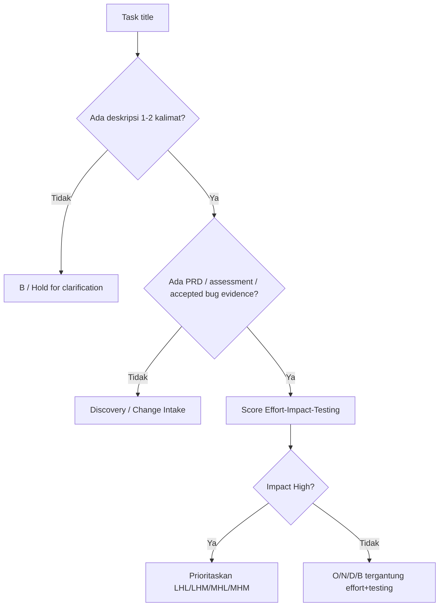

# Assessment Report — SatuInbox Task Timeline Review

| Metadata | Nilai |
|---|---|
| Version | 2.0 |
| Date | 2026-09-08 |
| Owner | Analyst |
| Author | Dany Christian |
| Scope | Review CSV task timeline dan prioritas SONDB berbasis effort-impact-testing |
| Source | `C:\Users\MyBook SAGA 12\.hermes\attachments\satuinbox task timeline - Sheet1-7.csv` |
| Decision | PROCEED_WITH_CAUTION |

## Executive Summary

- Prinsip user **LHL dulu** benar, tapi belum cukup. Tambahkan **readiness gate**: task tanpa deskripsi/PRD/assessment tidak boleh masuk bulan delivery; masuk `B` atau discovery dulu.
- Jangan anggap kolom usage kosong sebagai low. Kosong = **unknown**, terutama kolom FEATURE.
- Current CSV terlalu berat di September: `notification service improvement` (HHH), `advance exporting` (HHM), `fraud dashboard` (HHM), dan `email summary` tidak aman ditaruh semua di `S`.
- Timeline yang lebih aman: **Sept = research + scoped low/medium work**, **Oct = high-impact medium/testing work**, **Nov = high-effort scoped work**, **Dec/Backlog = core redesign, DB topology, new channels, AI, ambiguous features**.

## Big Picture Alignment

Acuan dari list rekomendasi di CSV dipakai sebagai domain weighting, bukan sebagai komitmen semua domain harus masuk timeline.

| Tier | Domain dari CSV | Prinsip timeline |
|---|---|---|
| Core platform | omnichannel chat, ticket, notification, analytics, sales | Prioritaskan jika memperbaiki workflow existing, reliability, visibility, atau revenue decision. |
| Revenue / business enablement | broadcast, payment, affiliate, open api | Masuk setelah scope jelas dan tidak membuka risiko billing/security/tenant isolation. |
| Product expansion | tools / add ons, AI, mobile app, theme | Backlog/discovery sampai ada demand dan acceptance criteria. |

Rule praktis: satu bulan jangan diisi banyak task high-testing. Testing adalah bottleneck timeline, bukan formalitas setelah dev selesai.

## Recommended Scoring Rule

Kode 3 huruf tetap: `Effort Impact Testing`.

Ranking praktis:
1. `LHL`
2. `LHM`
3. `MHL`
4. `MHM`
5. `LHH` jika impact tinggi tapi testing besar
6. `HHM/HHH` hanya jika foundation/P0 dan sudah scoped
7. `*M*` medium impact setelah high-impact selesai
8. low-impact atau unknown → akhir / backlog

Tambahan gate sebelum masuk SONDB:

## Proposed Timeline Table

| Source | Task | Current Score | Current Time | Recommended Score | Recommended Time | Decision | Reason | Clarification Needed |
|---|---|---|---|---|---|---|---|---|
| CURRENT TASK | GTM | MML | S | MML | S | Keep | Sudah ada brief GTM; impact bisnis jelas, testing rendah untuk Phase 1 attribution/dashboard internal. | No |
| FEATURE | wa official adujstmen research |  | S | LHL | S | Keep as research | Research rendah effort/testing dan bisa unlock keputusan WA Official sebelum build besar. | No |
| FEATURE | cost simulation WA officials and guarding |  | S/O | LHL | S | Keep as research only | Simulasi/research boleh Sept; implementasi guardrail WA official butuh PRD terpisah. | Yes — research artifact atau product feature? |
| CURRENT TASK | demo data base and dashboard | MML | S | MML | S | Keep if demo-only | Masuk Sept hanya jika non-production/demo enablement, bukan schema prod baru. | Yes — demo tenant/data atau dashboard produk? |
| CURRENT TASK | super admin internal | MMM | S | MMM | S | Conditional keep | Boleh Sept jika internal tooling yang unblock operasi; tidak boleh mengubah RBAC/customer visibility tanpa brief. | Yes — internal tool apa? |
| CURRENT TASK | email summary | LMM | S | MHH | O | Move later / split | Known artifact menunjukkan email summary menyentuh close conversation + email SMTP + external contract; testing tinggi walau Phase 1 menurunkan effort. | No |
| CURRENT TASK | advance exporting | HHM | S | HHM | O | Move | High effort + medium/high testing; prior timeline butuh window data incremental, lebih aman selesai Okt. | No |
| UI/UX | UI conversation redesign | LHM |  | LHM | O | Conditional | Kalau hanya targeted UI cleanup, bisa Okt; kalau full redesign, score naik ke HHM dan geser Nov/Des. | Yes — full redesign atau pain-point list? |
| UI/UX | simplicity settings | LHH |  | LHH | O | Schedule if scoped | Low effort + high impact, tapi testing tinggi lintas settings; cocok setelah Sept stabil. | Yes — settings area mana? |
| UI/UX | ticketing KPI | MHM |  | MHM | O | Schedule | High-impact dashboard/reporting, effort/testing masih menengah. | No |
| UI/UX | informative utilities | MHM |  | MHM | O | Conditional | Cocok Okt jika utility spesifik dan tidak menyentuh core service. | Yes — utilities apa? |
| FEATURE | grouping contact |  | O | MML | B | Hold until brief | FEATURE item tanpa score/deskripsi; bisa earliest O hanya jika scope sederhana grouping/tagging contact dan impact Broadcast/Contact visibility sudah dinilai. | Yes — group/tag/list segment? |
| UI/UX | create prospect from converesation | LML |  | MHL | O | Conditional after Sales scope | Arah task jelas: create lead/prospect dari chat. Impact sales lebih tinggi dari M, tapi dependency ke Sales PRD/P0. | Yes — field minimal dan target status prospect? |
| FEATURE | sales module |  | ? | HHH | B | Split before scheduling | Jangan jadikan satu task. Jika maksudnya PRD Sales + P0 fixes saja, targetkan O; full sales module tetap backlog sampai scope pecah. | Yes — full CRM atau P0 fixes + PRD? |
| CURRENT TASK | notification service improvement | HHH | S | HHH | N | Move / split | High effort + high impact + high testing tidak cocok Sept kecuali dipotong jadi bugfix P0 kecil. | Yes — reliability bugfix atau redesign service? |
| FEATURE | widget modules (termasuk widget domain config) |  |  | MHM | B | Hold until brief | Arah mungkin jelas tapi scope multi-feature; kalau slice domain config sudah jelas, earliest N. | Yes — module apa dan domain config rule apa? |
| CURRENT TASK | fraud dashboard | HHM | S | HHM | B | Hold until definition | Dashboard butuh sumber data, definisi fraud, dan action policy; earliest N setelah scope jelas. | Yes — fraud signup/payment/WA/broadcast? |
| UI/UX | wizard settings onboarding | HHM |  | HHM | N | Schedule after settings simplification | High impact tapi heavy UI/regression; lebih aman setelah simplicity settings. | Yes — onboarding untuk tenant baru atau admin settings? |
| FEATURE | infra redesign + stability |  | O | HHH | B | Split, do not timeline as one item | Terlalu besar. Jadikan incident-specific stability fixes dengan SLO/metrik; redesign masuk backlog/roadmap. | Yes — target incident/SLO apa? |
| FEATURE | exclude converesation group |  |  | HHH | B | Hold | Kemungkinan WA Import Mode/Exclude Conversations, tapi title ambiguous dan testing tinggi. | Yes — exclude dari import, chat list, broadcast, atau group conversation? |
| FEATURE | DB topoogy update (conversation + ticket) | HHH | B | HHH | B | Keep backlog | Core Conversation+Ticket DB topology = high blast radius; hanya maju jika ada RCA/perf evidence. | Yes — topology problem dan success metric apa? |
| UI/UX | informative error messages | HMM |  | HMM | D | Move late / split | High effort + medium impact; lebih baik split top errors per module, bukan big-bang. | Yes — error area prioritas? |
| UI/UX | faq |  |  | LML | B | Hold by demand | FAQ low effort, tapi impact belum terbukti; backlog kecuali support ticket volume tinggi. | Yes — FAQ untuk user/admin/widget/chatbot? |
| BACKLOG | chat bot auto response |  |  | HHH | B | Keep backlog | Mirip Auto Reply: touches scheduler, templates, SLA/duplicate-send risk. | Yes — office-hour auto reply atau AI bot? |
| BACKLOG | converesation AI summary |  |  | MHH | B | Keep backlog | AI summary butuh privacy, accuracy, cost, language, hallucination testing; jangan early tanpa use case. | Yes — summary untuk agent, supervisor, ticket handoff, atau customer? |
| BACKLOG | chat tools API |  |  | HHM | B | Hold | Open/API tooling ambiguous; potential security/tenant scope risk. | Yes — public API, internal tool, atau agent tools? |
| BACKLOG | widget app |  |  | HHM | B | Hold | Title terlalu luas; bisa berarti livechat widget rewrite, marketplace widget, atau mobile widget. | Yes — app apa? |
| BACKLOG | telegram |  |  | HHH | B | Keep backlog | New channel integration high effort/testing: webhook, billing, message mapping, SLA/contact. | No |
| BACKLOG | shopee & tiktok chat |  |  | HHH | B | Keep backlog | Marketplace channel integration lebih kompleks dari Telegram; simpan backlog sampai channel foundation matang. | No |

## Month View

| Time | Fokus |
|---|---|
| S | GTM, WA official research, cost simulation research, demo/dashboard if non-prod, super admin internal if scoped |
| O | Email summary Phase 1, advanced exporting, ticketing KPI, simplicity settings, create prospect from conversation after Sales scope |
| N | Notification improvement if scoped, settings onboarding wizard; widget/domain-config only if brief is ready |
| D | Informative error messages full pass; only after split into target modules |
| B | DB topology, infra redesign, fraud dashboard, contact grouping, exclude conversation group, full sales module, chatbot/AI/new channels/open API/widget app until clarified/scoped |

## Review Notes by Principle

### 1. Big picture SatuInbox
Prioritas produk sebaiknya tetap mengarah ke core platform: omnichannel conversation, ticket, WhatsApp reliability, analytics/reporting, notification, sales workflow, dan settings/onboarding. New channels, AI, and broad infra redesign are useful, but should not displace fixes that improve current reliability and operator workflow.

### 2. LHL logic
Setuju dengan LHL, tapi urutannya perlu memasukkan readiness:

`Readiness > Impact > Effort > Testing > Dependency`

Alasannya: task `LHL` tanpa scope bisa lebih berbahaya daripada `MHM` yang sudah punya brief dan test path jelas.

### 3. Testing weight
Testing harus menghitung:
- metode testing: unit/API/UI/E2E/regression/UAT/external integration
- durasi testing: perlu data harian, email real, QR/WA account, payment, scheduler, atau multi-role
- impact area: Conversation, Ticket, Contact, Broadcast, Auth, Analytics, Notification, RBAC, Socket/Queue

### 4. Items that should not be early
- `notification service improvement` HHH di Sept: split dulu jadi P0 bugfix vs redesign.
- `fraud dashboard` HHM di Sept: definisi fraud dan sumber data belum jelas.
- `infra redesign + stability` di Okt: terlalu luas; jadikan stability slices.
- `DB topology update (conversation + ticket)`: core DB blast radius tinggi; butuh RCA/perf evidence.

## Open Questions Before Final Fill

- **cost simulation WA officials and guarding** — research artifact atau product feature?
- **demo data base and dashboard** — demo tenant/data atau dashboard produk?
- **super admin internal** — internal tool apa?
- **UI conversation redesign** — full redesign atau pain-point list?
- **simplicity settings** — settings area mana?
- **informative utilities** — utilities apa?
- **grouping contact** — group/tag/list segment?
- **create prospect from converesation** — field minimal dan target status prospect?
- **sales module** — full CRM atau P0 fixes + PRD?
- **notification service improvement** — reliability bugfix atau redesign service?
- **widget modules (termasuk widget domain config)** — module apa dan domain config rule apa?
- **fraud dashboard** — fraud signup/payment/WA/broadcast?
- **wizard settings onboarding** — onboarding untuk tenant baru atau admin settings?
- **infra redesign + stability** — target incident/SLO apa?
- **exclude converesation group** — exclude dari import, chat list, broadcast, atau group conversation?
- **DB topoogy update (conversation + ticket)** — topology problem dan success metric apa?
- **informative error messages** — error area prioritas?
- **faq** — FAQ untuk user/admin/widget/chatbot?
- **chat bot auto response** — office-hour auto reply atau AI bot?
- **converesation AI summary** — summary untuk agent, supervisor, ticket handoff, atau customer?
- **chat tools API** — public API, internal tool, atau agent tools?
- **widget app** — app apa?

## Decision

**PROCEED_WITH_CAUTION.** Pakai LHL sebagai dasar, tapi timeline final harus memakai readiness gate. Untuk task ambiguous, jangan isi `S/O/N/D` sebagai delivery month dulu; isi `B` atau discovery sampai ada deskripsi minimum. Pengecualian: boleh masuk bulan awal hanya sebagai **research/discovery**, bukan komitmen delivery.

### Async Analyzer Reconciliation

Worker analyzer selesai dengan partial output setelah artifact v1.1. Temuan metodologi diterima: blank score = unknown, FEATURE tanpa PRD jangan committed. Satu koreksi diterapkan di v1.2: `grouping contact` dipindah dari `O` ke `B` sampai ada brief. Rekomendasi worker yang menaruh `email summary`, `UI conversation redesign`, dan `infra redesign + stability` lebih awal **tidak diadopsi** karena bertentangan dengan readiness/testing gate final.

## Final Priority (v2.0 — deskripsi task sudah dilengkapi user 2026-09-08)

Semua open question utama terjawab. Scoring di-update berdasarkan deskripsi; readiness gate tetap berlaku untuk item `B`.

Kapasitas: dengan 2 dev + 1 QA, realistis **2–3 task delivery per bulan**. Daftar di bawah = urutan prioritas; item yang tidak muat digeser ke bulan berikutnya sesuai rank, bukan diparalelkan.

| Rank | Task | Source | Score (E-I-T) | Time | Priority | Catatan |
|---|---|---|---|---|---|---|
| 1 | super admin internal (paket: approval pendaftaran) | CURRENT TASK | MMM | S | P1 | Internal-only superadmin, in-flight; regression risk ke customer rendah. |
| 2 | GTM (statistik Google Ads, bagian superadmin internal) | CURRENT TASK | MML | S | P1 | Satu paket dengan superadmin internal; brief GTM sudah ada. |
| 3 | demo data base and dashboard (kandidat request demo) | CURRENT TASK | MML | S | P1 | Satu paket superadmin internal; data internal, testing rendah. |
| 4 | wa official adujstmen research (perubahan pricing Meta) | FEATURE | LHL | S | P1 | LHL murni. Output = decision memo pricing per-message; prasyarat cost simulation. |
| 5 | infra stability — slice 1: SLO + top incident fixes | FEATURE | MHM | S | P1 | Stability 50% = impact tertinggi. Mulai sebagai track bulanan ber-slice, bukan redesign big-bang. |
| 6 | notification service improvement (targeting tepat sasaran) | CURRENT TASK | MHH | O | P1 | Correctness fix bernilai tinggi; testing tinggi (multi-role/tenant), butuh regression matrix notif. |
| 7 | sales module — PRD + P0 fixes (security scope, transition guard, team transfer) | FEATURE | MHM | O | P1 | P0 dari assessment existing (GAP-002/003/004, transition guard) dulu; revamp UI/workflow belakangan. |
| 8 | cost simulation WA official + guarding | FEATURE | MHM | O | P2 | Build setelah research #4. Guarding menyentuh send path → test hati-hati. |
| 9 | advance exporting (export statistik dinamis) | CURRENT TASK | HHM | O | P2 | High effort; testing butuh window data incremental — jangan ditumpuk dengan #6 di sprint sama. |
| 10 | informative utilities (deskripsi fitur + utility message conversation) | UI/UX | MHM | O | P2 | Menurunkan kebingungan user; mostly FE + copy, testing sedang. |
| 11 | faq (halaman FAQ in-app) | UI/UX | LML | O | P3 | Quick win filler; konten sudah ada di landing page. |
| 12 | ticketing KPI card + dynamic status | UI/UX | MHM | N | P2 | Improvement UI halaman ticket; dynamic status config butuh test per-tenant. |
| 13 | simplicity settings (redesign + guidance) | UI/UX | MHH | N | P2 | UI redesign settings; regression lintas settings tinggi. |
| 14 | grouping contact (unifikasi contact lintas channel) | FEATURE | HHH | N | P2 | Identity merge = blast radius besar (broadcast, visibility, duplicate merge race). Wajib PRD + migration/dedupe plan dulu. |
| 15 | create prospect from conversation | UI/UX | MHL | N | P2 | Interconnection conversation→sales; jalan setelah sales PRD/P0 (#7). |
| 16 | UI conversation redesign — audit UX | UI/UX | LHL | N | P2 | Audit dulu (reuse Track B uiux existing), implementasi di D. |
| 17 | UI conversation redesign — implementasi | UI/UX | MHM | D | P2 | Eksekusi hasil audit #16; scope dari pain-point list, bukan full rewrite. |
| 18 | wizard setting onboarding (quick guide sekali muncul) | UI/UX | MMM | D | P3 | FE-only; P1 requirement replay guide masuk fase ini juga. |
| 19 | widget module (UI/UX + workflow + domain per widget) | FEATURE | MMM | D | P3 | Improvement widget existing; jalan setelah settings/onboarding beres. |
| 20 | sales module — revamp UI/workflow | FEATURE | HHM | D | P3 | Fase 2 setelah PRD+P0 (#7) stabil. |
| 21 | DB topology HOT/WARM/COLD (+ exclude conversation group) | FEATURE | HHH | B | P3 | Assessment existing: HOLD_FEATURE (audit/database). Butuh RCA/perf evidence + keputusan exclude-group sebelum maju. |
| 22 | fraud dashboard (invoice fraud via broadcast + integrasi Lincah) | CURRENT TASK | HHM | B | P3 | Blocked: menunggu final requirement user fraud & Lincah. Jangan masuk bulan delivery. |
| 23 | chat bot auto response (AI agent + eskalasi human) | BACKLOG | HHH | B | P3 | Feature besar; butuh PRD, guard, SLA/escalation design. |
| 24 | converesation AI summary | BACKLOG | MHH | B | P3 | Menyusul setelah AI agent foundation (#23). |
| 25 | chat tools API (communication layer pihak ketiga) | BACKLOG | HHM | B | P3 | Public API: auth, tenant isolation, versioning — butuh design dulu. |
| 26 | widget app (web/mobile app, Google login) | BACKLOG | HHM | B | P3 | Produk baru; discovery dulu. |
| 27 | telegram channel (resume pending dev) | BACKLOG | HHH | B | P3 | Resume saat kapasitas ada; estimasi lama ~18 FS-days (impact matrix #168). |
| 28 | shopee chat | BACKLOG | HHH | B | P3 | Blocked: menunggu seller test account. |
| 29 | tiktok chat | BACKLOG | HHH | B | P3 | Setelah shopee/foundation channel marketplace. |

### Keputusan scoring penting (delta vs v1.2)

1. **superadmin internal + GTM + demo database = satu paket** internal-only → aman di `S`, testing rendah karena tidak menyentuh customer-facing flow.
2. **notification improvement** = targeting correctness, bukan redesign service → turun dari HHH ke MHH, naik ke `O` sebagai P1 (salah kirim notif = salah sasaran user).
3. **fraud dashboard** = blocked eksternal (final requirement Lincah + user fraud) → `B` sampai requirement lock, bukan masalah effort.
4. **DB topology** = sudah ada keputusan **HOLD_FEATURE** di `Assessments/audit/database/` → tetap `B`; exclude conversation group ikut keputusan yang sama (belum decided).
5. **grouping contact** = unifikasi identity lintas channel → HHH. Ini bukan improvement kecil: duplicate merge race + broadcast dependency ada di open risks global memory. Masuk `N` hanya dengan PRD + dedupe/migration plan.
6. **sales module dipecah 2 fase**: PRD + P0 security/invariant fixes (`O`), revamp UI/workflow (`D`).
7. **UI conversation redesign dipecah 2 fase**: audit UX (`N`, reuse Track B) lalu implementasi (`D`).
8. **infra stability** dimulai `S` sebagai slice track (SLO + top incidents) karena skor stabilitas 50% = impact tertinggi di daftar; redesign penuh tetap tidak dijadwalkan sebagai satu item.
9. **shopee** blocked test seller, **telegram** resume-ketika-kapasitas — dua-duanya `B` dengan alasan berbeda.

### Sisa open question (tinggal 2)

- **fraud dashboard** — kapan final requirement Lincah/user fraud lock? Itu trigger pindah `B → N/D`.
- **DB topology** — exclude conversation group ke collection/DB terpisah: keputusan arsitektur masih `blm decided`; harus lewat assessment `audit/database/` yang sama.

## Follow-up

1. ~~User jawab open questions~~ — selesai 2026-09-08, lihat Final Priority v2.0. Sisa: fraud dashboard requirement lock + keputusan exclude conversation group.
2. Update CSV final dengan `recommended_time`.
3. Untuk task yang masuk delivery month, buat/update Phase 0 Change Intake Brief sebelum PRD/implementation.
