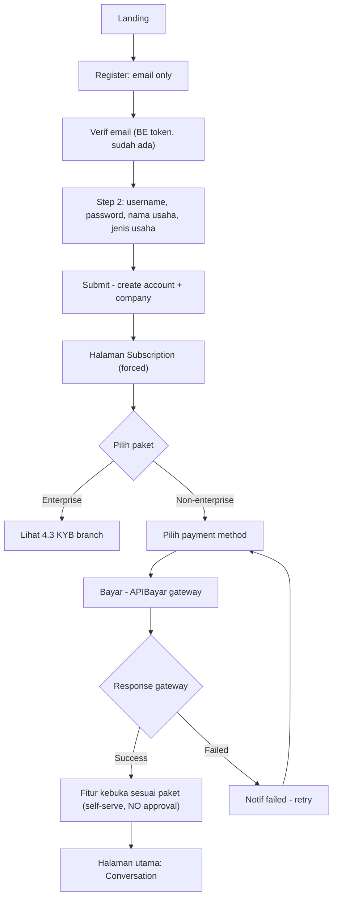
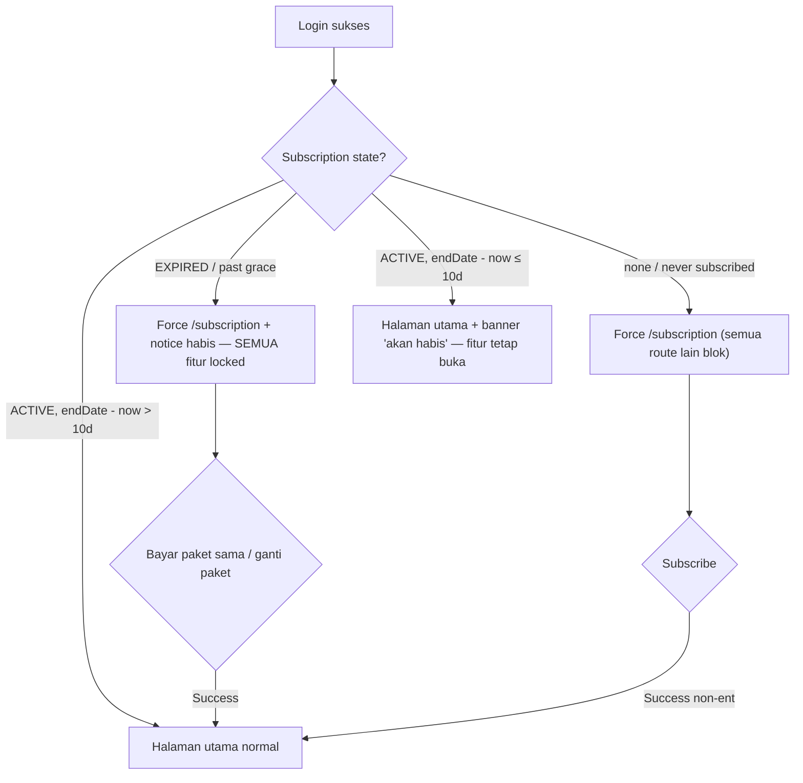
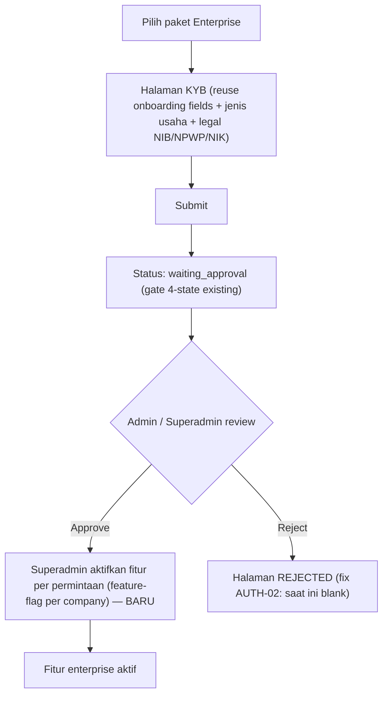
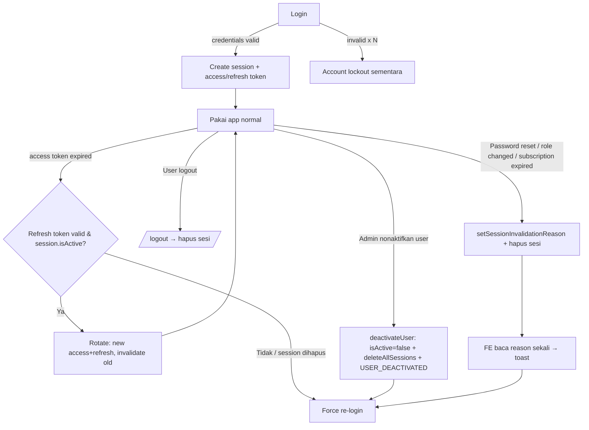

# Assessment Report: Redesign Flow Auth / Register / Onboarding / Subscription (Change Intake)

> **Assessment Type:** Phase 0 Change Intake & Classification + Gap/Delta analysis (target flow vs as-built code-verified)
> **Owner:** Analyst (PM: Dany Christian) — Engineering Lead: Naftal Yunior
> **Source Input:** User request (chat, 2026-10-02): redesign 6 skenario flow (new user register, login tanpa subscription, subscribe, subscription akan habis, subscription habis, enterprise KYB)
> **Assessment Artifact Path:** `Assessments/audit/detail-auth/auth-flow-redesign-change-intake.md`
> **Version:** `v1.1` | **Previous Version:** `v1.0 (inline — no separate file yet)`
> **Depends on:** `detail-auth/auth-register-onboard-subscription-audit.md` (as-built audit, register Track K `AUTH-01..12`, FE+BE code-verified)
> **Rules Applied:** `Rules/core/task-router.md`, `Rules/core/change-management.md`, `Rules/core/analysis-and-risk.md`, `Rules/profiles/satuinbox.yml`
> **Evidence base:** FE `omnichannel-satuinbox-fe` (branch `data-cy`), BE `omnichannel-satuinbox-be` (branch `v2.7.0`, commit `3e2d9bc1`) — keduanya code-verified
> **Tanggal:** 2026-10-02 | **Status:** Draft — butuh Reviewer Gate A (requirement intake) sebelum PRD v0

---

## 0. Ringkasan Perubahan Analisa

Request mengubah **behavior inti** 4 domain shadow (auth/register/onboarding/subscription) yang baru di-audit. Per `change-management.md`, ini **Phase 0 Change Intake** wajib sebelum draft PRD. Dokumen ini: klasifikasi perubahan, delta target-vs-as-built (code-verified), blast radius, risk, dan diagram flow target. **Bukan** PRD final, bukan patch kode.

**Perubahan paling fundamental:** flow target **membelah onboarding/approval jadi 2 jalur** — non-enterprise **self-serve** (bayar → fitur kebuka, TANPA approval manual) vs enterprise **KYB + approval + aktivasi fitur via superadmin**. Ini **membalik kondisi as-built** di mana *semua* user kena manual approval gate (temuan `AUTH-07`). Juga menambah **subscription-gating** yang saat ini **tidak ada sama sekali** di routing FE.

> **v1.1 — tambahan scope (existing-user session lifecycle):** dokumen v1.0 hanya mencakup flow yang berkaitan dengan subscription. Ditambahkan **§9 flow terpisah existing-user session lifecycle** (login, invalidate/force-logout, refresh token, inactive-user-tanpa-logout). **Temuan code-verified: lifecycle ini SUDAH ADA dan matang di BE** — jadi deltanya adalah **dokumentasi + wiring/gap**, bukan bangun dari nol (koreksi anggapan "yang ada hanya subscription").

---

## 1. Change Classification (Phase 0)

| Aspek | Nilai |
|---|---|
| Change type | **Modify behavior** (register, gating) + **Add behavior** (subscription gate, expiring banner, enterprise KYB branch, superadmin feature activation) + **Remove behavior** (approval gate untuk non-enterprise) |
| Domain tersentuh | Auth, Register, Onboarding, Subscription, **+ Routing/Middleware (`proxy.ts`)**, **+ Superadmin/system** |
| Shared behavior? | **YA** — `proxy.ts` `firstRedirect[]` chain dipakai SEMUA route; JWT/session shape dipakai semua auth |
| Blast radius | **Besar** — middleware gating + token shape + register BE DTO + onboarding schema + billing state machine FE |
| Removal / revive? | **Removal:** approval gate untuk self-serve. **Revive:** mendekati usulan dual-registration 2026-06 (`auth/dual-registration-flow`) tapi sumbu beda (enterprise-vs-self-serve, bukan personal-vs-org) |
| Decision class (sementara) | `CONDITIONAL_GO` — perlu lock kebijakan produk + Reviewer Gate A |

---

## 2. Flow Target (ringkas, per skenario user)

1. **New user register:** email-only → verif email → isi `username, password, nama usaha, jenis usaha` → submit → **halaman subscription**.
2. **Login tanpa subscription aktif:** semua halaman lain diblok → force ke halaman subscription.
3. **Subscribe:** pilih paket → pilih payment method → bayar → tunggu response gateway → notif success/failed → fitur kebuka sesuai paket.
4. **Login dgn subscription akan habis (≤10 hari):** masuk ke halaman utama (conversation) + **banner/popup** paket akan habis; semua fitur tetap kebuka.
5. **Login dgn subscription habis:** force ke halaman subscription + notice; **semua fitur locked** sampai bayar paket sama / ganti paket lalu bayar.
6. **Pilih paket enterprise:** diarahkan ke **halaman KYB** → isi field onboarding → submit → **tunggu approval** → fitur diaktifkan **via superAdmin** sesuai permintaan.

---

## 3. Delta: Target vs As-Built (code-verified)

| # | Area | As-built (verified) | Target | Delta | Effort |
|---|---|---|---|---|---|
| D1 | **Register step** | **1 step**, `RegisterDto` minta `fullName, email, username, phone, password` sekaligus (`api-gateway/.../auth/dtos/register.dto.ts:23-56`) | **2 step**: email-only → verif → `username, password, nama usaha, jenis usaha` | Split DTO + flow; email-first account creation; `fullName`/`phone` saat ini wajib → perlu keputusan (drop/pindah) | M |
| D2 | **Email verification** | Sudah ENFORCED di BE login (`local.strategy.ts:231` reject `!emailVerified`) + token verif ada | Verif email **sebagai gate antar-step register** (bukan cuma gate login) | Reposisi: verif harus selesai sebelum step-2 form muncul. Mekanisme BE sudah ada, tinggal wiring FE | S |
| D3 | **"Jenis usaha" field** | **TIDAK ADA**. `RegisterCompanyDto` cuma `name` (wajib) + NIB/NPWP/NIK (optional) (`company-service/.../register-company.dto.ts`) | Field baru `jenis usaha` (kategori bisnis) wajib di step-2 | Tambah field BE schema + DTO + FE `onboardingSchema.ts`. Perlu daftar enum kategori | S |
| D4 | **Subscription gate (routing)** | **NOL**. `proxy.ts` `firstRedirect[]` (11 handler) gating **onboarding-only** (`handleOnboardingRedirect:394-416`). Token **tak bawa** subscription/package/expiry (`authOption.ts` session fields: onboardingStatus, company, role, organization — no subscription) | Gate: no-active-subscription → force `/subscription`; expired → lock all + force `/subscription` | **Baru total**: (a) subscription state masuk JWT, (b) handler `handleSubscriptionRedirect` di chain, (c) definisi "active" | **L** |
| D5 | **Subscription state → FE** | BE **punya** `SubscriptionStatusEnum` (ACTIVE/INACTIVE/CANCELLED/EXPIRED/PENDING) + `isActive` + grace 10d + expiry processor set EXPIRED (`subscription.constant.ts:14-19`, `subscription-expiry.processor.ts:107,137`). Tapi **tak terhubung ke token/routing FE** | FE tahu status + endDate real-time untuk gating + banner | Wiring: endpoint "my subscription" → inject ke JWT callback / fetch di middleware. Hati-hati: JWT basi (lihat Risk R3) | M |
| D6 | **Expiring banner (≤10 hari)** | **TIDAK ADA**. Grace 10d yang ada = **setelah** endDate (`SUBSCRIPTION_GRACE_PERIOD_DAYS=10`), beda semantik | Banner saat `now ≥ endDate - 10d` (SEBELUM habis), fitur tetap buka | Hitung `daysUntilExpiry` di FE dari `endDate`; jangan samakan dgn grace. Komponen banner baru | S |
| D7 | **Expired → lock all** | Expiry processor set status EXPIRED tapi **tak ada enforcement FE** (tak ada lock) | Semua fitur locked, hanya `/subscription` + logout yang boleh | Gate D4 + definisi "locked" (route-level block vs feature-level). Grace 10d: apakah grace = masih buka atau sudah lock? **Perlu lock kebijakan** | M |
| D8 | **Enterprise package** | `enterprise` = **0 hit** di payment+company service. Paket = package/addon generic, tak ada tipe enterprise | Pilih enterprise → cabang ke KYB + approval + superadmin activation | **Baru**: tandai package sbg enterprise; cabang flow by package type | M |
| D9 | **Approval gate scope** | **SEMUA** user lewat onboarding→waiting_approval→approved/rejected (`OnboardingStatusEnum`, 4-state). Manual admin approval (`AUTH-07`) | Approval **hanya enterprise (KYB)**. Non-enterprise **self-serve** (bayar → langsung buka) | **Membalik AUTH-07.** Non-enterprise: lewati waiting_approval. Enterprise: pertahankan. Perlu rework state machine onboarding | **L** |
| D10 | **Superadmin feature activation** | `superadmin` ada di konteks lain; **tak ada** per-feature activation untuk enterprise | Superadmin aktifkan fitur enterprise per permintaan | **Baru**: model feature-flag per-company + UI superadmin + enforcement | **L** |
| D11 | **Payment flow** | Sudah ada: package/payment-method/gateway (APIBayar)/webhook. **Tapi** topup webhook double-credit (`AUTH-12` P0) | "tunggu response gateway → notif success/failed → fitur kebuka" | Flow sudah ada; **fix `AUTH-12` dulu** (money path) + wiring "fitur kebuka" ke D4 gate | S (+AUTH-12) |

Effort: S=kecil, M=sedang, L=besar.

---

## 4. Diagram Flow Target

### 4.1 Lifecycle new user → active (non-enterprise self-serve)

### 4.2 Gating per login (subscription state machine)

### 4.3 Enterprise KYB branch

---

## 5. Risk & Konflik (analysis-and-risk)

| ID | Risk | Dampak | Mitigasi |
|---|---|---|---|
| R1 | **Zero-perf-impact (standing user constraint):** gating subscription di `proxy.ts` jalan **tiap request**. Kalau fetch subscription per-request → latency semua route | Perf regresi global | Taruh subscription state di **JWT claim** (bukan fetch per-request); refresh saat login/renewal via event (pola `COMPANY_APPROVE` sudah ada) |
| R2 | **Removal approval gate (D9) membalik AUTH-07** — kebijakan produk, bukan bug | Keputusan bisnis; salah ambil = KYC hilang untuk yang butuh | **Lock PM:** mana paket butuh KYB (hanya enterprise?); non-enterprise benar-benar tanpa verifikasi legal? |
| R3 | **JWT staleness:** subscription baru dibayar / baru expired, tapi JWT lama masih "active"/"none" → gating salah (sama kelas dgn `AUTH-05` session-refresh) | User bayar tapi masih ke-lock; atau expired tapi masih bisa akses | Event-driven refresh (RabbitMQ sudah dipakai company approve) + TTL pendek untuk subscription claim, ATAU revalidate di `/subscription` entry |
| R4 | **"10 hari" ambigu vs grace 10d** | Salah implementasi (banner muncul setelah habis, bukan sebelum) | Pisahkan: `endDate - 10d` = banner (pre-expiry); `endDate + 10d` (grace) = window bayar sebelum hard-lock. **Konfirmasi: saat grace, fitur buka atau lock?** |
| R5 | **AUTH-12 (P0 money path) belum fix** — flow baru makin bergantung payment webhook | Double-credit saldo saat subscribe/topup | Fix `AUTH-12` (idempotency guard) **sebelum** flow subscribe baru live |
| R6 | **"Locked" belum terdefinisi:** route-level block vs feature-level disable | Scope implementasi beda jauh | Default lazy: **route-level** (force `/subscription`, semua route lain redirect) — lebih kecil dari feature-flag per-fitur. Konfirmasi cukup/tidak |
| R7 | **Superadmin feature-flag per company (D10)** = subsistem baru | Scope besar, bisa jadi over-eng | Default lazy: mulai dari **flag kasar per-paket** (fitur = fungsi paket), bukan toggle granular per-fitur, kecuali enterprise memang minta custom per-fitur |

---

## 6. Open Questions (butuh keputusan sebelum PRD v0)

1. **`fullName` & `phone`** saat ini wajib di register step-1. Flow baru email-only → keduanya dibuang, dipindah ke step-2, atau diminta nanti?
2. **"Jenis usaha"** = enum kategori (daftar tetap) atau free-text? Butuh daftar kategori.
3. **Non-enterprise = benar-benar tanpa approval & tanpa KYC legal?** (membalik AUTH-07 penuh)
4. **Grace period 10d (existing):** saat grace, fitur **buka** (masih bisa pakai, cuma diingatkan) atau **lock** (sudah di halaman subscription)? Ini beda dari banner pre-expiry.
5. **"Locked"** = route-level (hanya `/subscription` + logout) atau feature-level disable per-tombol?
6. **Enterprise feature activation** = per-paket (kasar) atau per-fitur granular via superadmin?
7. **Ganti paket saat expired:** downgrade/upgrade proration (`calculateProrata` existing) berlaku atau fresh billing?

---

## 7. Rekomendasi Urutan Eksekusi (lazy-first, blast radius naik)

1. **Fix `AUTH-12`** (P0 money path) — prasyarat semua flow subscribe. Kecil.
2. **D5 + D4** subscription state ke JWT + `handleSubscriptionRedirect` di `proxy.ts` — fondasi gating. Reuse pola event refresh (R1/R3).
3. **D6/D7** banner pre-expiry + lock expired (route-level default) — setelah gating ada.
4. **D1/D2/D3** split register 2-step + jenis usaha — independен, bisa paralel.
5. **D9** split approval (self-serve vs enterprise) — butuh keputusan R2 dulu.
6. **D8/D10** enterprise KYB + superadmin feature activation — terakhir, scope terbesar; mulai kasar (R7).

> **Skipped (ponytail):** tidak mendesain skema feature-flag granular, enum jenis-usaha, atau UI superadmin di dokumen ini — itu PRD v0 setelah open questions ke-lock. Reviewer Gate A dulu.

---

## 9. Flow Terpisah: Existing-User Session Lifecycle (BARU v1.1)

> Scope v1.0 cuma subscription. Section ini flow **user yang sudah punya akun** — login, invalidasi/force-logout, refresh token, dan inactive-user-tanpa-logout. **Semua code-verified di BE `v2.7.0`/`3e2d9bc1`.** Temuan utama: **lifecycle ini sudah ada & matang** — delta = dokumentasi + wiring FE + gap kecil, bukan greenfield.

### 9.1 As-Built (code-verified)

| Kapabilitas | Bukti kode | Status |
|---|---|---|
| **Login + session create** | `auth.controller.ts:103 /login`; auth-service buat session + access/refresh token, track ipAddress/userAgent; **lockout failed-attempts** (`app.controller.ts:117,130`) | ADA |
| **Session model** | `session.schema.ts` — `sessionId, accessToken, refreshToken, ipAddress, userAgent, deviceId, deviceInfo, location, isActive, lastActivity, expiresAt, invalidatedAt, reason` | ADA |
| **Refresh token (rotation)** | `auth.controller.ts:228 /refresh-token` — "token rotation … old refresh token invalidated after successful refresh" (:218-219); `refresh.strategy.ts:94-95` cek `session && session.isActive`, reject kalau tidak | ADA |
| **Logout** | `auth.controller.ts:343 /logout` → `authService.logout` | ADA |
| **Force-logout / invalidate session** | `session.service.ts` — `setSessionInvalidationReason(userId, reason)` (set `invalidatedAt`+`reason`), `getAndClearSessionInvalidationReason` (one-time read → toast FE), `deleteActiveSessionByUserId`, `deleteAllSessionsByUserId` | ADA |
| **Invalidation reason enum** | `libs/common/.../enums/index.ts:1577` `SessionInvalidationReasonEnum` = `MEMBER_DELETED, PASSWORD_RESET, ROLE_CHANGED, SUBSCRIPTION_EXPIRED` + `SESSION_INVALIDATION_MESSAGES` (pesan toast FE per reason) | ADA |
| **Inactive user tanpa logout** (user sedang login lalu dinonaktifkan) | `app.controller.ts:741 deactivateUser` → `deactivateAuthByUserId` (soft: `auth.isActive=false`, :360) + `deleteAllSessionsByUserId` (**paksa logout semua sesi**) + emit `USER_DEACTIVATED` → people-service set `member.isActive=false` + `currentState.status=LOGOUT` (:735-742) | ADA |
| **Reactivate** | `app.controller.ts:721 activateUser` → `auth.isActive=true` | ADA |
| **FE handling** | `app/api/auth/[...nextauth]/authOption.ts` (session fields + refresh), reason → toast via `SESSION_INVALIDATION_MESSAGES` | ADA (partial) |

### 9.2 Delta: yang perlu dikerjakan

| # | Area | As-built | Gap / Target | Effort |
|---|---|---|---|---|
| D12 | **Dokumentasi flow** | Lifecycle ada di kode, **tak terdokumentasi** di change-intake/PRD | Section/diagram resmi (ini) → masuk PRD v0 sebagai flow eksplisit | S |
| D13 | **Reason enum coverage** | 4 reason (`MEMBER_DELETED/PASSWORD_RESET/ROLE_CHANGED/SUBSCRIPTION_EXPIRED`) | Tambah `USER_DEACTIVATED` (admin nonaktifkan) & `FORCE_LOGOUT`? `deactivateUser` hapus sesi tapi **tak set reason** → FE tak tahu kenapa ter-logout | S |
| D14 | **Idle/expiry → refresh UX** | `expiresAt` + rotation ada; `lastActivity` disimpan | Definisikan: idle-timeout vs absolute-expiry; silent refresh vs force re-login. Belum ada kebijakan FE tegas | M |
| D15 | **Overlap dgn subscription gate** | `SUBSCRIPTION_EXPIRED` sudah ada di reason enum | Flow §4.2 (subscription) harus pakai mekanisme invalidation ini, **bukan** bikin paralel. Wiring, bukan baru | S |

### 9.3 Diagram — Existing-User Session Lifecycle

### 9.4 Catatan governance

- Ini **bukan removal/revive** — menambah dokumentasi + gap kecil atas behavior existing. Change type: **Document + minor Add** (reason coverage, policy idle).
- Zero-perf: refresh & session check sudah pakai cache (`handleGetCacheSession`) — jangan tambah fetch per-request. Pertahankan.
- Hubungkan ke `AUTH-05` (session-refresh staleness) di Track K bila relevan.

---

## 10. Next Step (governance)

- **Reviewer Gate A** (requirement intake) atas change intake ini — `satuinbox.yml`.
- Jawab Open Questions §6 (PM: Dany).
- Setelah lock → PRD v0 per `requirements.md`, dengan freeze package per `satuinbox.yml`.
- Update register Track K bila ada finding baru dari redesign (saat ini murni change-intake, belum fold finding).
