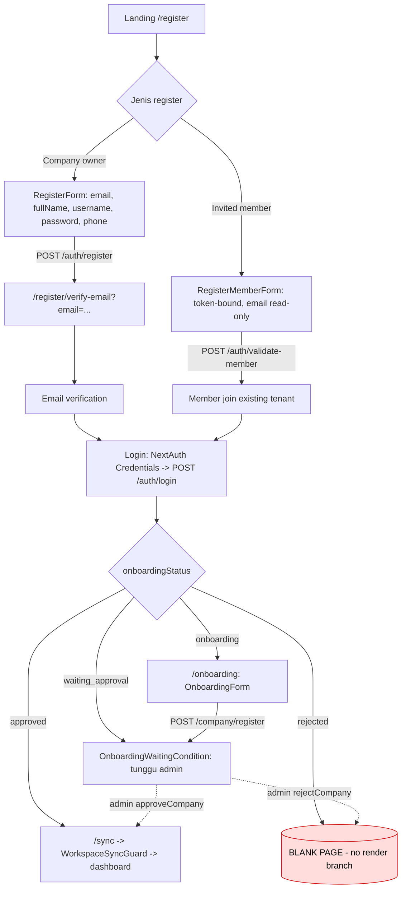
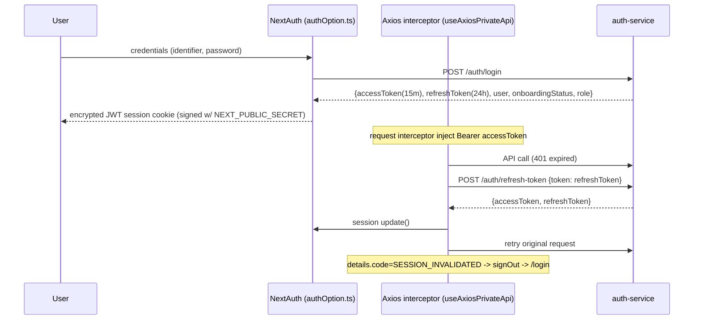
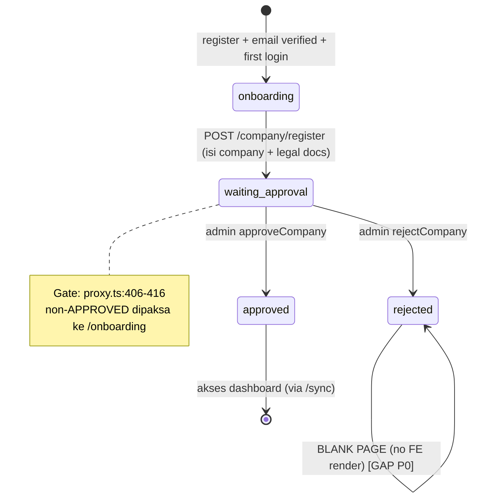
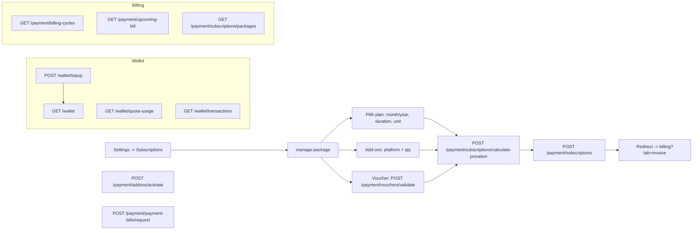

# Assessment Report: Audit Auth / Register / Onboarding / Subscription + Flow + Benchmark Kompetitor

> **Assessment Type:** Audit existing-state (code + memory) + Type 3 Interconnection + Competitor benchmark
> **Owner:** Analyst (PM: Dany Christian)
> **Source Input:** User request (chat, 2026-10-01): "audit soal auth, register, onboard dan subscription, audit juga soal flow-nya, deep research ke beberapa kompetitor"
> **Assessment Artifact Path:** `Assessments/audit/detail-auth/auth-register-onboard-subscription-audit.md` (folded ke register `01` sebagai Track K: `AUTH-01..11`)
> **Version:** `v1.0`
> **Previous Version:** `none`
> **Rules Applied:** `Rules/core/task-router.md`, `Rules/core/audit.md`, `Rules/core/analysis-and-risk.md`, `Rules/profiles/satuinbox.yml`
> **Reference Context:** `Memory/global-memory.md`, `Memory/CLAUDE-be.md` (BE, verified 2026-08-11 / branch v2.8.0), `Memory/CLAUDE-fe.md`
> **Benchmark (reference/):** `competitor-register-onboarding-benchmark.md`, `competitor-subscription-billing-benchmark.md`
> **Tanggal Analisa:** 2026-10-01
> **Status:** Draft

---

## 0. Ringkasan Perubahan Analisa

- Initial audit. Domain auth/register/onboarding/subscription **tidak punya PRD** di `PRD/` dan **tidak tercatat** di `Memory/global-memory.md` — ini corpus pertama yang mendokumentasikan kondisi existing-nya.
- Scope dikonfirmasi user: audit semua sumber (PRD + BE + FE), fitur sudah ada sebagian → audit gap, kompetitor campuran, output Assessment Report + diagram.
- Cross-reference 3 assessment lama yang menyentuh domain ini **sebagai konteks, bukan duplikasi**: `auth/dual-registration-flow` (2026-06), `auth/superadmin-global-company-access`, `cross-domain/referral-subscription-and-superadmin-global-access` (2026-06).

---

## 1. Overview

**Yang diaudit:** kondisi existing (as-built) dari 4 domain + flow antar-mereka:
1. **Auth** — login, session, token refresh, logout, invalidation.
2. **Register** — self-signup (company owner) + invited member.
3. **Onboarding** — pengisian company/legal data + lifecycle approval.
4. **Subscription** — package/plan, add-on, voucher, proration, wallet/top-up, invoice, quota/usage.

**Objective audit:** memetakan as-built flow, menemukan gap/risk, dan membandingkannya dengan praktik industri (Intercom, Zendesk, Freshchat, Qiscus, Crisp, + Slack/Notion/Linear untuk billing) agar jadi dasar keputusan PRD-isasi domain yang selama ini undocumented.

### 1.1 Evidence base & confidence

| Sumber | Status | Confidence |
|---|---|---|
| FE `omnichannel-satuinbox-fe` (branch `data-cy`, commit `7632dd92`) | **code-verified session ini** | Tinggi |
| BE (`auth-service`, `company-service`, `payment-service`, `api-gateway`) | repo **ter-clone & code-verified sesi lanjutan 2026-10-01** (branch `v2.7.0`, commit `3e2d9bc1`) | **Tinggi** (code-verified) |
| Benchmark kompetitor | web research, URL per klaim, gap ditandai | Sedang (public sources) |

> **Honesty note (update 2026-10-01):** repo BE **ditemukan sudah ter-clone** (`C:\Users\...\Desktop\BE satuinbox\omnichannel-satuinbox-be`, branch `v2.7.0`) — klaim "tak ter-clone" di draft awal sudah salah. Temuan BE kini **code-verified** (tanda `[BE-verified]`), bukan `[BE-memory]`. Catatan baseline: branch BE = `v2.7.0` (lebih lama dari operasional canonical `prod-2.8.1` per register ENV-01) — delta 2.7→2.8 belum ditinjau.

**Scope In:** audit as-built flow FE + BE-memory, gap/risk, benchmark.
**Scope Out:** coding, final PRD drafting, test-case authoring, redesign billing.

---

## 2. Decision Summary

### 2.1 Final Decision

**Decision Enum:** `DOCUMENT_AND_PRDIZE`
**Decision Class:** `CONDITIONAL_GO` (untuk PRD-isasi, bukan untuk ship fitur baru)

**Decision Statement:**
> Keempat domain **sudah ter-implement cukup lengkap di FE** (register ganda, onboarding 4-state dengan approval gate, auth JWT+refresh, subscription penuh dengan wallet/voucher/proration) tetapi **tidak punya satu pun PRD, memory canonical, atau test coverage**. Ini adalah **shadow domain**: produk hidup di produksi tanpa requirement source-of-truth. Risiko utama bukan "fitur hilang" melainkan **undocumented behavior + beberapa gap konkret** (lihat §7). Rekomendasi: segera PRD-isasi dengan baseline as-built ini sebagai input, lalu tutup gap P0/P1.

### 2.2 Required Actions

- [ ] Angkat baseline as-built domain ini ke `Memory/global-memory.md` (saat ini nol baris).
- [ ] PRD-isasi 4 domain (minimal Lite PRD per domain, Standard untuk subscription).
- [ ] Verifikasi ulang semua temuan `[BE-memory]` saat repo BE tersedia.
- [ ] Tutup gap P0/P1 di §7 (REJECTED blank page, refresh-storm, `NEXT_PUBLIC_SECRET`).
- [ ] Putuskan apakah manual approval gate tetap (beda dari semua kompetitor yang self-serve).

### 2.3 Complexity & Risk Snapshot

| Dimensi | Nilai |
|---|---|
| Domain tersentuh | 4 (auth, company, payment, people/member) |
| Services (BE) | 3+ (`auth-service`, `company-service`, `payment-service`) `[BE-memory]` |
| Dokumentasi existing | **0 PRD, 0 memory, 0 test** |
| Gap teridentifikasi | 11 (3× P0, 4× P1, 4× P2) |
| Deviasi dari industri | 1 besar (manual approval gate), beberapa kecil |

---

## 3. Flow Analysis (As-Built)

### 3.1 End-to-end lifecycle

### 3.2 Auth / session flow

**Catatan auth:**
- Provider tunggal = **Credentials**. Tidak ada Google/social/SSO/SAML (lihat benchmark: Intercom/Crisp punya Google sign-in; Intercom/Notion punya SAML enterprise).
- Role di-decode dari JWT payload (`decodeTokenRole`) untuk melengkapi `contactScope` → coupling FE ke struktur token BE.
- Refresh pakai flag `_retry` per-request, **tanpa shared mutex/queue** → lihat gap P1 refresh-storm.

### 3.3 Onboarding state machine

`OnboardingStatusEnum` (`packages/types/src/company.ts:25`): `onboarding` → `waiting_approval` → `approved` | `rejected`.

**Onboarding field (`validations/onboardingSchema.ts`):** company `name` (wajib), NIB `businessLicenseNumber` 13-digit (optional), NIK `identificationNumber` 16-digit (optional), NPWP `taxNumber` 15-digit (optional), + URL upload dokumen (optional). KYC khas Indonesia.

### 3.4 Subscription / billing flow

**Endpoint as-built (FE-verified):**
| Area | Endpoint |
|---|---|
| Auth | `/auth/login`, `/auth/refresh-token`, `/auth/register`, `/auth/logout`, `/auth/validate-email`, `/auth/validate-member`, `/auth/send-email-verification`, `/auth/send-link-reset-password`, `/auth/reset-password`, `/auth/validate-reset-token`, `/auth/user-info` |
| Company/onboard | `/company/register`, `/company/me` |
| Subscription | `/payment/subscriptions`, `/payment/subscriptions/packages`, `/payment/subscriptions/calculate-proration`, `/payment/vouchers/validate`, `/payment/billing-cycles` (+`/export`, `/{id}`), `/payment/upcoming-bill` |
| Add-on | `/payment/addons/prices`, `/payment/addons/activate`, `/payment/payment-bills/request` |
| Wallet | `/wallet`, `/wallet/topup`, `/wallet/transactions`, `/wallet/quota-usage` |

---

## 4. Impact / Interconnection Analysis

| Dimensi | Temuan |
|---|---|
| **Module** | auth ↔ company (onboardingStatus di session), company ↔ payment (subscription aktif setelah approved), payment ↔ wallet (quota/token), people (member invite). |
| **Session** | `onboardingStatus` dibawa di JWT session; perubahan status butuh `session.update()` (lihat `useOnboardingForm` set `WAITING_APPROVAL`). Risiko stale: status berubah di BE (admin approve) tapi session FE tak tahu sampai refresh/re-login. |
| **RBAC** | `proxy.ts` gating per-permission; `SUPERADMIN` page key sudah ada di protected paths → superadmin surface mulai dibangun (selaras assessment `superadmin-global-company-access`). |
| **Tenant** | Runtime single-tenant per session (`companyId + organizationId`) — konsisten dengan temuan assessment 2026-06. |
| **Security** | `NEXT_PUBLIC_SECRET` sebagai NextAuth signing secret (gap P0). `SESSION_INVALIDATED` handling ada (admin ganti password / hapus akun → force logout). |

---

## 5. Benchmark Kompetitor (ringkas — detail di reference/)

### 5.1 Register + Onboarding

| Platform | Signup | Email verify | Card upfront | Free trial | Approval gate |
|---|---|---|---|---|---|
| Intercom | email/Google | tdk terkonfirmasi | **Tidak** | 14h, no free-forever | **Tidak** (self-serve) |
| Zendesk | 7-step wizard + subdomain | tdk terkonfirmasi | **Tidak** | 14h | **Tidak** |
| Freshchat | nama/email/company/size/region | tdk terkonfirmasi | **Tidak** | 14h → **Free tier** | **Tidak** |
| Qiscus | register + verify | **Ya** | **Tidak** di awal | 14h | **Tidak** |
| Crisp | email/Google + hCaptcha | tdk terkonfirmasi | **Tidak** (Free forever) | 14h any-plan | **Tidak** |
| **SatuInbox** | email+username+phone+password / invite | (BE) | **Tidak** | **tidak ada trial** | **YA — manual admin approval** |

> **Deviasi terbesar:** SatuInbox adalah **satu-satunya** yang memakai **manual approval gate** (waiting_approval) + **KYC legal upfront** (NIB/NIK/NPWP) dan **tanpa free trial / free tier**. Semua kompetitor self-serve instan. Trade-off: SatuInbox cocok untuk model B2B verified/managed-onboarding; tapi friksi signup jauh lebih tinggi dan tak ada jalur PLG (product-led growth).

### 5.2 Subscription / Billing

| Platform | Pricing basis | Proration | Self-serve up/down | Usage overage | Wallet/top-up |
|---|---|---|---|---|---|
| Intercom | seat + Fin $0.99/outcome | tdk terkonfirmasi | Ya | channels metered | — |
| Qiscus ⭐ | plan(seats+MAU) + overage + WA per-msg | tdk terkonfirmasi | Ya | $18/500 MAU, $18/agent | **prepaid/postpaid + Daily Budget + VA bank ID** |
| Slack | per active user | **Ya (prorated + auto credit)** | Ya | add-on prorated | — |
| Notion | per member + AI credits | **Ya (upgrade + credit sisa)** | Ya | $10/1k credits | — |
| **SatuInbox** | package + add-on + voucher | **punya calculate-proration** | Ya (manage-package) | quota/token (`/wallet/quota-usage`) | **wallet + top-up** |

> **Qiscus = mirror terdekat** (Indonesia, wallet/VA/MAU). SatuInbox punya fitur yang **lebih kaya dari kebanyakan** (voucher — tak ada satu pun kompetitor expose skema voucher publik; proration calc eksplisit; wallet). Yang perlu divalidasi: rumus proration (benchmark ke Slack `(price/seat ÷ days) × days_remaining`), apakah token roll-over atau hangus akhir cycle (industri: hangus), spending cap / Daily Budget untuk cegah tagihan liar (Qiscus & Intercom punya).

---

## 6. Dependency Matrix

| Konsumen | Bergantung pada | Risiko bila putus |
|---|---|---|
| Dashboard access | `onboardingStatus=approved` | user ter-stuck di onboarding/blank |
| Subscription aktif | company approved | — |
| Wallet quota | payment-service + gateway webhook | saldo habis mid-conversation (cek handling) |
| Session validity | refresh-token flow | refresh-storm saat burst 401 |
| Member register | invite token valid | — |
| Role/permission | JWT payload decode | FE coupling ke struktur token BE |

---

## 7. Findings Register (audit utama)

| ID | Domain | Finding | Severity | Evidence | Status | Remediation |
|---|---|---|---|---|---|---|
| **AUTH-01** | Seluruh | Nol PRD + nol memory canonical + nol test untuk 4 domain. Shadow domain di produksi. | **P0** | `PRD/` nol hit; `global-memory.md` tak menyebut; FE no test (CLAUDE-fe §2) | Open | PRD-isasi + angkat baseline ke global-memory |
| **AUTH-02** | Onboarding | `ManageOnboardingPage` hanya handle `onboarding` + `waiting_approval` → status `REJECTED` **dan** `APPROVED` jatuh ke `return undefined` = **blank page**. Rejected/approved user ter-stuck. | **P0** | `components/pages/ManageOnboardingPage.tsx:19-43` (2 branch saja); enum `packages/types/src/company.ts:25-30` | Open | Tambah UI state REJECTED (alasan + re-submit/kontak) + APPROVED (redirect dashboard) |
| **AUTH-03** | Auth/security | **FE-only:** `NEXT_PUBLIC_SECRET` dipakai sebagai NextAuth signing secret — var `NEXT_PUBLIC_*` ter-inline ke bundle browser. **BE aman** (JWT di-sign `jwt.access.secret`/`jwt.refresh.secret` server-only, `getOrThrow`, HS256). | **P0** | FE `authOption.ts:174` + `proxy.ts:448` `secret: process.env.NEXT_PUBLIC_SECRET`; BE `auth-service/.../jwt-token.service.ts:45-46,137-163` (REFUTED weakness) | Open | Pindah ke server-only `SECRET` (sudah ada di README, tak dipakai) / `NEXTAUTH_SECRET` |
| **AUTH-04** | Auth | Axios refresh tanpa shared mutex; tiap request pakai `_retry` sendiri. Burst N×401 paralel → N refresh racing, last-write-wins token. **Single-flight sudah ADA tapi tak dipakai di sini.** | **P1** | `useAxiosPrivateApi.ts:87-88,136-156` (per-request `_retry`); kontras `helpers/refresh-access-token.ts:74-82` (`refreshInFlight` single-flight) | Open | Reuse `refreshInFlight` dari `refresh-access-token.ts` di interceptor `useAxiosPrivateApi` |
| **AUTH-05** | Session | **BE emit event** (`COMPANY_APPROVE`/`COMPANY_REJECTED` via RabbitMQ → auth-service update onboardingStatus+session) — propagasi BE **ADA**. Gap murni FE: session cookie FE tak refresh tanpa `session.update()`/re-login, tak ada socket listener. | **P1** | BE `company-service/.../company.service.ts:180,199,422-449` (emit confirmed); FE `useOnboardingForm` manual `session.update()`, no socket | Open | FE subscribe event approval (socket) → auto `session.update()` saat di waiting_approval |
| **AUTH-06** | Register | Flow "dual registration personal vs org" (assessment 2026-06) **belum terimplementasi**; `register/` = company owner, `register/member/` = invite. Friksi signup tinggi (KYC upfront). | **P1** | FE register components; assessment `dual-registration-flow` | Open | Putuskan revive dual-flow (lihat assessment lama) |
| **AUTH-07** | Onboarding | Tak ada free trial / free tier; semua user wajib lewat approval + legal KYC sebelum pakai produk. Deviasi 100% dari kompetitor. | **P1** | benchmark §5.1; onboardingSchema | Open | Keputusan produk: pertahankan (B2B managed) atau tambah trial/self-serve |
| **AUTH-08** | Subscription | Rumus proration **verified** di BE: `calculateProrata` = `(remainingDays / totalDaysInMonth) × price`, remainingDays inklusif hari ini. Masuk akal (prorate by sisa hari kalender bulan). Upgrade/downgrade punya layer tambahan (`handleSubscriptionProration`). | **P2** | BE `payment-service/.../payment.service.ts:1237-1250` (base) + `subscription.service.ts:975-1061` (upgrade/downgrade) | **verified (BE)** | PRD-kan rumus + tinjau layer upgrade/downgrade vs benchmark Slack |
| **AUTH-09** | Subscription | Roll-over **type-dependent** (verified): quota **CHANNEL/AGENT carry-over** lintas upgrade/downgrade/renewal; quota **BROADCAST reset bulanan** (hangus, tak akumulasi). Expiry (endDate+grace 10d) tak carry-over. | **P2** | BE `payment-service/.../quota-usage.service.ts:282-339` (carry-over, exclude BROADCAST), `broadcast-reset.processor.ts:176-196` (reset) | **verified (BE)** | Dokumentasikan perilaku per-type di PRD (jangan generalisasi "hangus") |
| **AUTH-10** | Wallet / Security | Payment **webhook auth = static shared-secret header** (APIBayar `webhookKey !== expected`), bukan HMAC signature — BE-verified. Payment-bill webhook **idempotent** (guard `billingCycle.status !== COMPLETED`). | **P1** | `api-gateway/.../payment-webhook.controller.ts` + `guards/webhook-payment.guard.ts:28`; `payment-service/.../payment.service.ts:723` | **confirmed (BE)** | Pertimbangkan HMAC + replay-nonce; static secret OK bila rotate + TLS |
| **AUTH-12** | Wallet / Data Integrity | **Topup webhook TIDAK idempotent** → double-credit saldo saat gateway re-deliver "Paid". `handleTopupWebhook` update status lalu `$inc token` **tanpa guard status-sebelumnya** (beda dari payment-bill path yang di-guard). Money path. | **P0** | `payment-service/.../wallet.service.ts:459-498` (credit via `updateToken` `$inc` di `wallet.repository.ts:88`), kontras `payment.service.ts:723` guarded | **confirmed (BE)** | Guard: skip bila `topupTransaction.status` sudah `Paid` sebelum `$inc`; atau atomic `findOneAndUpdate({status:{$ne:Paid}})` lalu credit. Deduct path (`deductToken` `$expr:$gte`) sudah aman |
| **AUTH-11** | Auth | Tak ada SSO/SAML/social login (kecuali none). Enterprise buyer biasa minta SAML. | **P2** | `authOption.ts` single Credentials provider | Open | Keputusan roadmap |

**Statistik:** 12 findings — P0: 4, P1: 4, P2: 4. Domain: auth 5, onboarding 3, subscription 2, wallet 2. (+AUTH-12 topup double-credit, BE code-verified sesi lanjutan 2026-10-01.)

---

## 8. Production Safety

- Audit **read-only** — tidak ada perubahan kode/produksi dari sesi ini.
- Temuan `[BE-memory]` **tidak boleh** diperlakukan sebagai code-verified sampai repo BE dibuka.
- Gap P0 (AUTH-02, AUTH-03) menyentuh security + UX dead-end; prioritaskan sebelum PRD penuh.

---

## 9. Traceability Matrix

| Finding | Sumber evidence | Benchmark terkait | Assessment lama terkait |
|---|---|---|---|
| AUTH-01 | PRD/ + global-memory scan | — | — |
| AUTH-02 | ManageOnboardingPage.tsx | — | dual-registration-flow |
| AUTH-03 | authOption.ts | — | — |
| AUTH-04 | useAxiosPrivateApi.ts | — | skill realtime-request-storm |
| AUTH-05 | useOnboardingForm.ts | — | — |
| AUTH-06 | register components | benchmark §5.1 | dual-registration-flow |
| AUTH-07 | onboardingSchema + proxy.ts | benchmark §5.1 (semua self-serve) | — |
| AUTH-08 | calculate-proration endpoint | benchmark §5.2 (Slack/Notion) | referral-subscription |
| AUTH-09 | wallet/quota-usage | benchmark §5.2 (Freshdesk/Notion hangus) | — |
| AUTH-10 | CLAUDE-be.md payment-service | benchmark §5.2 (Qiscus wallet) | — |
| AUTH-11 | authOption.ts | benchmark §5.1 (Intercom/Crisp Google, SAML) | superadmin-global-company-access |

---

## 10. Rekomendasi Next Steps (urut prioritas)

1. **P0 fix cepat:** AUTH-02 (REJECTED UI), AUTH-03 (`NEXTAUTH_SECRET`). Diff kecil, risiko tinggi.
2. **Angkat baseline** 4 domain ke `Memory/global-memory.md` (hilangkan shadow-domain).
3. **PRD-isasi:** Lite PRD auth + register + onboarding; Standard PRD subscription (paling kompleks).
4. **AUTH-04** single-flight refresh.
5. **Keputusan produk** (PM): manual approval + KYC + no-trial dipertahankan? (AUTH-06/07/11) — ini strategi B2B vs PLG.
6. **Verifikasi BE** semua `[BE-memory]` saat repo tersedia (AUTH-10 wallet/webhook idempotency terutama).
