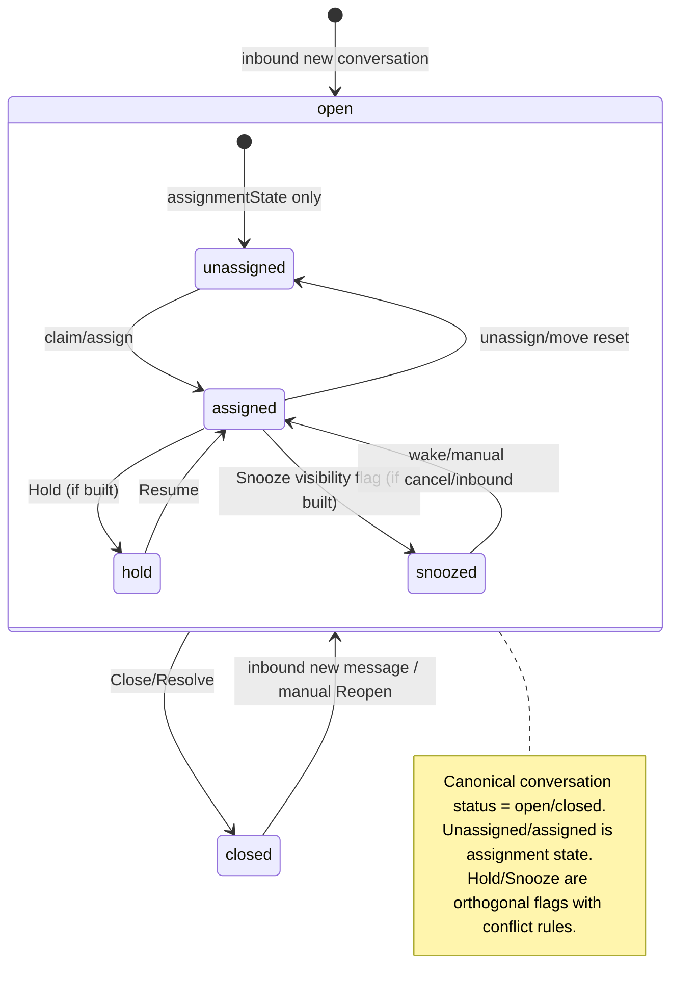
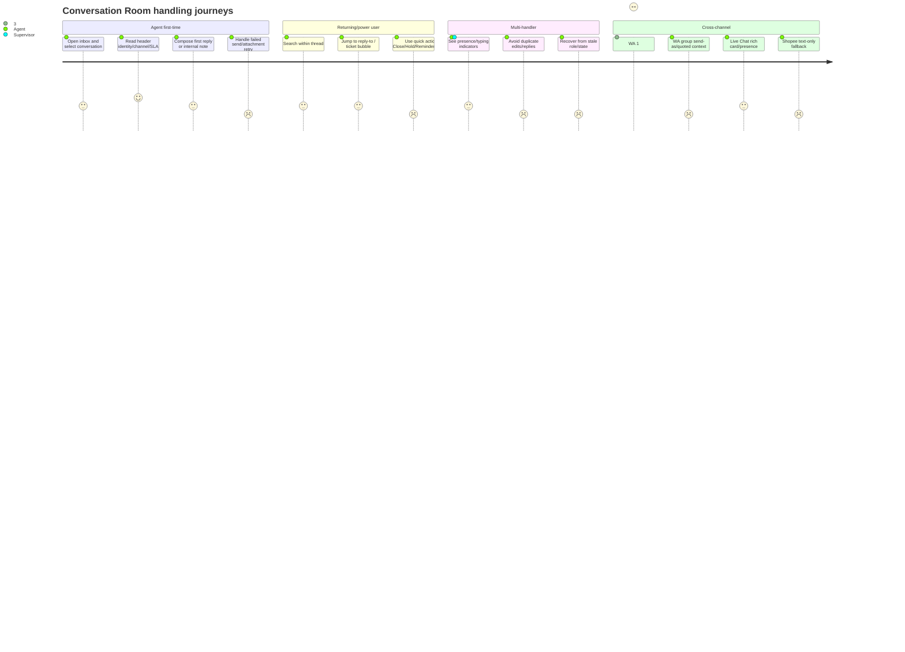

# Conversation Room V2 Deep Audit — SatuInbox

**Tanggal:** 2026-09-07  
**Scope:** interior Conversation Room: header controls, message timeline/bubbles, composer, real-time indicators, attachment, room search, room state machine, assignment/collaboration, channel-specific room behavior, cross-PRD consistency.  
**Output location:** `Assessments/audit/detail-conversation/2026-09-07-conversation-room-deep-audit.md`  
**Register policy:** detail-only. Tidak mengedit `01-audit-master-register.md`; kandidat fold ada di akhir.
**Rev 2 (2026-09-07):** koreksi line citations Room PRD + dedup fold per reviewer Gate.

## 🔗 Objek Bersama — Cross-Reference dengan Audit Room Lain

> Tabel ini memetakan objek/area yang **muncul di kedua audit Room** (PRD-based `deep-audit` ROOM-xx ⇄ product-reality `product-reality-audit` ROOMX-xx). Tujuan: saat menggarap satu objek, kerjakan **sekali** dengan melihat kedua sudut (kontrak PRD + realitas kode). `strong` = fix saling bergantung/overlap; `weak` = area sama, cek koordinasi.

| # | Objek / Area | deep-audit (PRD) | product-reality (kode) | Rel | Kerjakan sekali karena |
|---|---|---|---|---|---|
| 1 | Closed / terminal room state | ROOM-27 | ROOMX-03 | strong | Enum `'close'`≠`'closed'` (kode) + kontrak read-only/reopen composer (PRD) = satu state-machine. |
| 2 | Timeline performance (long thread) | ROOM-05, ROOM-06 | ROOMX-01 | strong | Virtualization + load/search budget satu pekerjaan; InfiniteScroll aktual membuktikan klaim PRD belum terpenuhi. |
| 3 | Accessibility (ARIA/keyboard/WCAG) | ROOM-19, ROOM-30 | ROOMX-05, ROOMX-11, ROOMX-12 | strong | Kriteria WCAG (PRD) → gap ARIA/IME/listbox nyata (kode); satu paket a11y room. |
| 4 | Header PII / identity masking | ROOM-32 | ROOMX-09 | strong | Kontrak masking header (PRD) = titik implementasi masking identity (kode). |
| 5 | Attachment / media (size + download security) | ROOM-04, ROOM-34 | ROOMX-15 | strong | Kontrak size+scan/filename & bug download-fallback signed-media = satu alur media. |
| 6 | Typing / presence indicator | ROOM-08 | ROOMX-06 | strong | Lifecycle/privacy/expiry (PRD) = scope broadcast typing store-driven (kode). |
| 7 | Delivery / read status per channel | ROOM-09 | ROOMX-23 | weak | Channel status matrix (PRD) ~ renderer/type policy fallback (kode) di path sama. |
| 8 | Socket / realtime authz & recovery | ROOM-07, ROOM-11 | ROOMX-07, ROOMX-19 | strong | Reconnect/permission-at-submit (PRD) & object-authz join/send absent (kode) = satu sweep authz+realtime. |
| 9 | Empty / loading / error / degraded states | ROOM-21 | ROOMX-04, ROOMX-16, ROOMX-25 | strong | State kosong/loading/error (PRD) & no-session split-tanpa-state-machine (kode) = satu state-machine. |
| 10 | Header actions layout & propagation | ROOM-22, ROOM-28 | ROOMX-10 | strong | Visual hierarchy/label/destructive Close (kode) & socket propagation mutasi header (PRD) di komponen header sama. |
| 11 | Message bubble rendering / hierarchy | ROOM-29 | ROOMX-13, ROOMX-14 | strong | Dense-thread rules (PRD) & memo stale + refs leak (kode) = `ConversationChatroomBuble` sama. |
| 12 | Error copy leakage / i18n | ROOM-20 | ROOMX-08 | weak | i18n error copy (PRD) & raw backend error leak toast/ACK (kode) di jalur error sama. |
| 13 | Message capability matrix / renderer | ROOM-24, ROOM-15 | ROOMX-17, ROOMX-18, ROOMX-23 | strong | Capability matrix (PRD) = scattered booleans/registry + renderer fragility (kode). |
| 14 | Search in room | ROOM-31 | ROOMX-21 | weak | Scoping/highlight (PRD) & useIsFetching flicker lintas query (kode) di area search sama. |
| 15 | Cross-channel / group room | ROOM-16, ROOM-17 | ROOMX-17, ROOMX-22 | weak | Journey group/Shopee (PRD) & capability scattered + sync-contact disabled (kode). |
| 16 | Composer send reliability / auto-retry | ROOM-10 | ROOMX-11 | weak | Idempotency auto-retry (PRD) & send shortcut/composer path (kode) di composer sama. |

**Unik `deep-audit` (tanpa padanan kode, murni kontrak/PRD gap):** ROOM-01, ROOM-02, ROOM-03 (konflik status/reopen/Hold-SLA), ROOM-12/13/14/26 (fitur belum dibangun: Collaborator/Reminder/Hold-Resume/Auto-reply), ROOM-18/23/25/33/35 (notes leakage, assignment, custom-attr search, audit-log, observability), ROOM-36 (positive).

**Unik `product-reality` (tak terlihat dari PRD, murni realitas kode):** ROOMX-02 (state duplication React-Query/Zustand/localStorage/socket), ROOMX-20 (tenant/userContext tak terlihat di repo filter), ROOMX-24 (FE tanpa automated test).

## Executive verdict

**Decision taxonomy per cluster:**

| Cluster | Decision | Reason |
|---|---|---|
| State machine + SLA + reopen | **Revise** | Room PRD masih membawa `Unassigned → Ongoing → Resolved`, sementara canonical product rule adalah `open` / `closed`; Hold/Snooze/SLA/reopen butuh satu kontrak sebelum implementasi aman. |
| Room UI/UX header + controls | **Proceed with conditions** | Header capability cukup lengkap di PRD, tetapi beberapa aksi P0/P1 belum built dan perlu capability/RBAC matrix, disabled/empty/error copy, dan socket sync ke Chat List. |
| Message bubbles + composer + attachment | **Proceed with conditions** | Bubble/composer requirements ada, tetapi virtualisasi 10k, attachment 100MB/15MB conflict, permission-at-submit, and failed-send recovery perlu validasi implementasi. |
| Real-time reliability | **Proceed with conditions** | FE/BE referensi mengakui Socket.IO, status lifecycle, and pending queue; belum ada bukti replay/resubscribe/missed-event semantics untuk room. |
| Cross-channel journeys | **Split** | WA 1:1, WA group, Live Chat, Shopee berbeda capability. Shopee Phase 1 text-only harus menjadi addendum/channel matrix, bukan default Room universal. |
| Security/RBAC/PII | **Hold for validation on read paths and room send paths** | Existing audit sudah menemukan send endpoint authz gap; room-level read/history/notes/search path perlu sweep terpisah sebelum klaim aman. |
| Accessibility + i18n | **Revise** | WCAG 2.1 AA claim terlalu umum; PRD belum punya keyboard model detail, focus order, screen-reader behavior, and hardcoded English/Indonesian mixed copy conflict. |
| Undeveloped features | **Split** | Collaborator, Snooze, Hold/Resume, Room Reminder, Auto-reply, custom attributes, rich cards perlu delivery tracks sendiri; beberapa sudah explicitly not built. |

## Evidence boundaries

- **Evidence** = kutipan dokumen/memory/file:line.
- **Inference** = dampak/risiko logis dari evidence.
- **Assumption** = asumsi eksplisit karena repo FE/BE live tidak tersedia di task ini atau file reference tidak ditemukan.
- **Status** = `confirmed` bila ada kontradiksi dokumen/memory atau reference code-state; `inference` bila diturunkan dari PRD; `needs-validation` bila butuh kode/UAT/load test.

## Source map

- `Room PRD` = `PRD/Conversationv2/PRD Ticket - Omnichannel Inbox - Conversation Room.md`
- `Sessions PRD` = `PRD/Conversationv2/PRD Ticket - Omnichannel Chat Sessions (Group Handling + Multi-number Send as).md`
- `Snooze PRD` = `PRD/Conversationv2/PRD Ticket - Conversation Snooze (Conversation List).md`
- `SLA contract` = `PRD/Conversationv2/PRD - SLA Engine Contract (Conversation x Ticket).md`
- `Permission PRD` = `PRD/Conversationv2/PRD Ticket - Assignees and Collaborators Permission Model.md`
- `Shopee PRD` = `PRD/Conversationv2/PRD - Omnichannel Inbox - Shopee Channel Add-On.md`
- `Detail PRD` = `PRD/Conversationv2/PRD Ticket - Omnichannel Inbox - Conversation Detail.md`
- `Chat List PRD` = `PRD/Conversationv2/PRD Ticket - Omnichannel Inbox - Chat List.md`
- `Custom Attributes PRD` = `PRD/Conversationv2/PRD Ticket - Conversation Custom Attributes (Single + Collections).md`
- `Auto-reply PRD` = `PRD/Conversationv2/PRD Ticket - Availability Auto-Reply with Conversation and Ticket Templates.md`

## State machine diagram — canonical vs PRD Room conflict

## User journey diagram — room-first handling

## Findings

### ROOM-01 — Status taxonomy mismatch in Room PRD

| Field | Detail |
|---|---|
| ID | ROOM-01 |
| Domain/aspek | App flow & state machine |
| Deskripsi | Room PRD defines assignment workflow status as `Unassigned → Ongoing → Resolved`, but canonical Conversation V2 status is only `open` / `closed`; `Unassigned/Assigned` is an assignment state. |
| Severity | **Catastrophe** |
| Severity note | PRD/QA release blocker; not a production-outage claim. |
| Evidence | `PRD/Conversationv2/PRD Ticket - Omnichannel Inbox - Conversation Room.md:99` says `Status: Unassigned → Ongoing → Resolved`; `Memory/global-memory.md:22-25` says status flow is `open` / `closed`, legacy `unassigned -> ongoing -> resolved` deprecated, closed room immutable; `Memory/global-memory.md:66-67` says Room canonical status `open` / `closed` and Close/Resolve transitions to `closed`. |
| Inference | If UI/API treat `Ongoing/Resolved` as status, Chat List, SLA, history, and reopen can branch on different taxonomies. |
| Assumption | None. This is a document-vs-canonical conflict. |
| Status | confirmed |
| Impact | QA cannot write one state-machine suite; BE/FE may persist or filter wrong values; reporting uses inconsistent lifecycle labels. |
| Remediation | Revise Room PRD: use `conversation.status=open/closed`; model `assignmentState=unassigned/assigned`; map UI label “Resolve/Close” to `closed`. |
| Next safe action | PM/Engineering sign-off on canonical state table, then fold as register blocker candidate. |

### ROOM-02 — Reopen behavior conflicts across Room, Sessions, SLA contract, and canonical memory

| Field | Detail |
|---|---|
| ID | ROOM-02 |
| Domain/aspek | App flow, reopen, SLA lifecycle |
| Deskripsi | Room says resolved chats reopen on new message; Sessions says new session may be created for closed legacy thread; SLA contract chooses same-document reopen with new TTC cycle, pending PM sign-off. |
| Severity | **Catastrophe** |
| Severity note | PRD/QA release blocker; not a production-outage claim. |
| Evidence | Room PRD `:99` says `Resolved chats reopen on new message`; Sessions PRD `:57-58` says create new session when no open session and Unassigned-first intake; Sessions PRD `:89` says closed legacy threads receiving inbound prompt reopen routing while creating a new session; SLA contract `:92-105` chooses Room-style same-document reopen and new TTC cycle; `Memory/global-memory.md:24,43-49` says reopen toggles `closed` → `open`, ticket SLA reopen new cycle, but Conversation SLA reopen behavior still undefined. |
| Inference | Same inbound event can mean reopen same conversation, create new session, or show modal depending on which PRD implementer reads. |
| Assumption | SLA contract is draft/pending sign-off because line `SLA contract :14` marks draft pending PM sign-off. |
| Status | confirmed |
| Impact | Duplicate conversations, broken ticket linkages, wrong SLA cycle, and inconsistent agent journey after customer returns. |
| Remediation | Adopt SLA contract §5.4 as canonical or explicitly reject it; update Room/Sessions/Reassign references. |
| Next safe action | Decision meeting: PM + BE + FE lock reopen base case and cross-team remap exception. |

### ROOM-03 — Hold/Snooze/SLA conflict blocks safe room header actions

| Field | Detail |
|---|---|
| ID | ROOM-03 |
| Domain/aspek | Header controls, SLA, hold/resume/snooze |
| Deskripsi | Room requires Hold/Resume in header and says Hold pauses SLA; Snooze PRD says Snooze does not change status and excludes SLA pause changes; SLA contract proposes final policy but is draft. |
| Severity | **Catastrophe** |
| Severity note | PRD/QA release blocker; not a production-outage claim. |
| Evidence | Room PRD `:73` says header Snooze/Resume and Resume restores SLA timer; Room PRD `:89` says SLA countdown pauses on Hold; Snooze PRD `:18-27` defines Snooze as hide/wake-up without status change and out-of-scope SLA pause policy; Snooze PRD `:170` says no SLA pause changes; SLA contract `:79-90` locks Hold pauses FRT/TTC/RLT and Snooze pauses none; `Memory/global-memory.md:73` says Hold/Snooze/SLA 3-way conflict still open. |
| Inference | If Hold and Snooze ship independently, SLA and list visibility can contradict each other. |
| Assumption | No production behavior verified in code in this task. |
| Status | confirmed |
| Impact | Agents may hide or pause conversations in ways reporting does not understand; SLA breach dashboards become untrustworthy. |
| Remediation | Land one pause truth table before implementing Hold/Resume header or Snooze room action. |
| Next safe action | Treat Hold/Resume and Snooze as blocked until SLA contract sign-off; add explicit disabled state if UI exists before backend support. |

### ROOM-04 — Room attachment max size is internally contradictory: 100MB vs 15MB
> 🔗 **Objek sama** (Attachment / media): lihat `product-reality (2026-09-07-conversation-room-product-reality-audit.md)` → ROOMX-15. Kerjakan sekali, dua sudut (PRD + kode). Lihat tabel *Objek Bersama* di kepala file.

| Field | Detail |
|---|---|
| ID | ROOM-04 |
| Domain/aspek | Attachment handling, data contract, UX copy |
| Deskripsi | Room PRD mostly says attachment max 100MB, but limitations say 15MB. |
| Severity | **Major** |
| Evidence | Room PRD `:76`, `:96`, `:109-110` require max 100MB; Room PRD `:203` says max file size 15MB; `Memory/global-memory.md:72,125` says attachment max 100MB per V2 Room v1.1. |
| Inference | FE validation, BE upload limit, media-service S3 limits, and user error copy can diverge. |
| Assumption | Media-service actual limit not code-verified here. |
| Status | confirmed |
| Impact | Users may see rejected uploads that PRD says are allowed, or backend may accept files frontend blocks. |
| Remediation | Update Room §15 limitation to 100MB or define channel-specific caps; add a single shared constant for upload size. |
| Next safe action | Verify BE media/gateway body limits and FE `useFileUpload` max size against 100MB. |

### ROOM-05 — 10k message thread support lacks explicit room virtualization contract
> 🔗 **Objek sama** (Timeline performance (long thread)): lihat `product-reality (2026-09-07-conversation-room-product-reality-audit.md)` → ROOMX-01. Kerjakan sekali, dua sudut (PRD + kode). Lihat tabel *Objek Bersama* di kepala file.

| Field | Detail |
|---|---|
| ID | ROOM-05 |
| Domain/aspek | Performance & scalability |
| Deskripsi | Room NFR requires ≥10k messages per chat thread but does not specify timeline virtualization, pagination cursor, anchor/jump behavior, or memory ceiling. |
| Severity | **Major** |
| Evidence | Room PRD `:122` says support ≥10k messages per chat thread; Room PRD `:135` requires scroll and reply-to jump; Room PRD `:75,95` requires thread search next/previous/date filter; FE reference `Memory/CLAUDE-fe.md:297-303` identifies `ConversationChatRoom` as center messages + composer, while only list virtualization is explicitly named at `:300`; existing coverage gap `03-coverage-gap-check.md:59` says room reconnect/resubscribe not audited and `:53` says performance hot paths only partial/no load-soak. |
| Inference | Without virtualized timeline and anchor-aware loading, 10k messages can cause high memory, slow search, broken reply-to jump, or browser freeze. |
| Assumption | Actual room implementation may have pagination; not verified from repo source in this task. |
| Status | needs-validation |
| Impact | Room load ≤1s claim is not credible for large threads; agents handling long WA groups/live chats may see unusable rooms. |
| Remediation | Define and verify message timeline virtualization/windowing, cursor paging, reverse scroll, anchor preload, and search result jump. |
| Next safe action | Code audit `ConversationChatRoom`, message service hook, and BE message pagination/indexes with a seeded 10k thread. |

### ROOM-06 — Room load ≤1s and search ≤2s claims are unproven against backend/index reality
> 🔗 **Objek sama** (Timeline performance (long thread)): lihat `product-reality (2026-09-07-conversation-room-product-reality-audit.md)` → ROOMX-01. Kerjakan sekali, dua sudut (PRD + kode). Lihat tabel *Objek Bersama* di kepala file.

| Field | Detail |
|---|---|
| ID | ROOM-06 |
| Domain/aspek | Performance, search, observability |
| Deskripsi | PRD claims room load ≤1s and thread search ≤2s, but evidence corpus says Conversation performance/search is only partially audited and Atlas/global search fast path is dark by default. |
| Severity | **Major** |
| Evidence | Room PRD `:54`, `:121`, `:178`, `:181` claim search ≤2s and room load ≤1s; BE reference `Memory/CLAUDE-be.md:233-242` says `GLOBAL_SEARCH_ATLAS_ENABLED=false` default and fast global search is not true until flag/indexes enabled; gap check `03-coverage-gap-check.md:53` says performance hot paths partial and no load/soak profiling; `03-coverage-gap-check.md:73` says Global Search none. |
| Inference | Room thread search may be separate from global search, but no PRD/API distinction or measurement plan proves the SLA. |
| Assumption | Thread search may use message DB indexes not Atlas; needs code verification. |
| Status | needs-validation |
| Impact | Product may commit to ≤1s/≤2s without indexes, pagination, cache, or telemetry that can prove it. |
| Remediation | Specify metrics source, dataset size, index requirements, and fallback path for room thread search. |
| Next safe action | Run BE query plan/index audit for message search and capture p95 on 10k-message seed. |

### ROOM-07 — Socket update latency and room missed-event recovery are underspecified
> 🔗 **Objek sama** (Socket / realtime authz & recovery): lihat `product-reality (2026-09-07-conversation-room-product-reality-audit.md)` → ROOMX-07, ROOMX-19. Kerjakan sekali, dua sudut (PRD + kode). Lihat tabel *Objek Bersama* di kepala file.

| Field | Detail |
|---|---|
| ID | ROOM-07 |
| Domain/aspek | Real-time/socket reliability |
| Deskripsi | Room requires socket updates ≤2s for presence, typing, status, and actions, but reconnection replay/resubscribe/order semantics are not defined for room. |
| Severity | **Major** |
| Evidence | Room PRD `:66-67`, `:90`, `:121`, `:137`, `:167` rely on socket updates; FE reference `Memory/CLAUDE-fe.md:257-280` lists Socket.IO events and 5 reconnect attempts plus offline outbound queue; coverage gap `03-coverage-gap-check.md:59` says no audit of room re-subscription after reconnect, missed-event replay, at-least-once vs exactly-once emit, ordering. |
| Inference | A reconnecting agent can miss close/reopen/assignment/message status events and see stale room state. |
| Assumption | No socket replay API verified. |
| Status | needs-validation |
| Impact | Multi-handler rooms can leak stale actions: reply after closed, close after reopened, or duplicate send. |
| Remediation | Add room resync-on-reconnect contract: refetch conversation snapshot + messages after reconnect, idempotent event handling, monotonic status ordering. |
| Next safe action | Test disconnect/reconnect during inbound, close, assignment, and delivery/read status events. |

### ROOM-08 — Typing/presence UX lacks lifecycle, privacy, and stale-state rules
> 🔗 **Objek sama** (Typing / presence indicator): lihat `product-reality (2026-09-07-conversation-room-product-reality-audit.md)` → ROOMX-06. Kerjakan sekali, dua sudut (PRD + kode). Lihat tabel *Objek Bersama* di kepala file.

| Field | Detail |
|---|---|
| ID | ROOM-08 |
| Domain/aspek | UI/UX indicators, real-time collaboration |
| Deskripsi | Room says show online/offline and typing agent names up to 5, but does not define expiry TTL, cross-tab behavior, privacy masking, or unsupported-channel fallback. |
| Severity | **Medium** |
| Evidence | Room PRD `:66-67` says presence and typing update via socket; Room PRD `:90` repeats max 5 typing names and “and x more”; Chat List PRD `:81,107` defines typing fades after 5s inactivity, but Room PRD does not; Room PRD `:202` says some channels may not support presence. |
| Inference | Without TTL/fallback, stale typing/presence can mislead agents into waiting or avoiding a room that nobody is editing. |
| Assumption | Existing socket hook may implement TTL; not verified here. |
| Status | inference |
| Impact | Agent coordination degrades; privacy risk if names visible outside allowed team scope. |
| Remediation | Copy TTL/fade/unsupported-channel rules into Room; define visibility scope for agent names. |
| Next safe action | Verify FE typing hook and presence payload includes scoped user display names only. |

### ROOM-09 — Delivery/read status mapping must not fabricate unsupported channel states
> 🔗 **Objek sama** (Delivery / read status per channel): lihat `product-reality (2026-09-07-conversation-room-product-reality-audit.md)` → ROOMX-23. Kerjakan sekali, dua sudut (PRD + kode). Lihat tabel *Objek Bersama* di kepala file.

| Field | Detail |
|---|---|
| ID | ROOM-09 |
| Domain/aspek | Message status indicators, cross-channel consistency |
| Deskripsi | Room requires pending/sent/delivered/read/error/retry states globally, but channel capability varies; Shopee PRD explicitly says status levels must not be fabricated. |
| Severity | **Major** |
| Evidence | Room PRD `:69,92` defines Pending/Sent/Delivered/Read/Failed/Retry and auto-retry; BE reference `Memory/CLAUDE-be.md:216-217` lists message lifecycle and `tempMessageId`; Shopee PRD `:133` says if provider does not expose a status level, system must not fabricate it; `Memory/global-memory.md:71` says room feature availability follows channel/account-channel capability matrix. |
| Inference | Uniform double-check UI can falsely imply delivered/read for providers that do not support those callbacks. |
| Assumption | Capability matrix implementation not verified. |
| Status | needs-validation |
| Impact | Agents make wrong assumptions about customer receipt/read state; support disputes become harder. |
| Remediation | Add per-channel status capability matrix and render “sent/unknown” where delivered/read unsupported. |
| Next safe action | Audit status renderer against WA Web, WA API, Live Chat, Email, Shopee Phase 1. |

### ROOM-10 — Auto-retry every 5s max 3 attempts can duplicate sends without idempotency contract at composer level
> 🔗 **Objek sama** (Composer send reliability / auto-retry): lihat `product-reality (2026-09-07-conversation-room-product-reality-audit.md)` → ROOMX-11. Kerjakan sekali, dua sudut (PRD + kode). Lihat tabel *Objek Bersama* di kepala file.

| Field | Detail |
|---|---|
| ID | ROOM-10 |
| Domain/aspek | Composer, reliability, idempotency |
| Deskripsi | Room specifies auto-retry for failed sends, while FE/BE reference mentions `tempMessageId` reconciliation; PRD does not require client action idempotency for retries/double-click. |
| Severity | **Major** |
| Evidence | Room PRD `:69,92,123` says auto-retry failures and 99% delivery; FE reference `Memory/CLAUDE-fe.md:371-372` says pending messages reconciled by `tempMessageId` instead of `id`; BE reference `Memory/CLAUDE-be.md:216-217` says outbound messages carry `tempMessageId`; Shopee PRD `:189,372-374` explicitly requires double-click/idempotency guard. |
| Inference | If retry uses new IDs or send button double-click bypasses guard, customers can receive duplicates. |
| Assumption | Actual current send mutation may already prevent duplicates; not source-verified. |
| Status | needs-validation |
| Impact | Duplicate customer-facing messages, billing impact for paid channels, and confusing conversation history. |
| Remediation | Make idempotency key explicit in Room PRD: one `clientMessageId/tempMessageId` persists through retry until terminal result. |
| Next safe action | Negative test: force timeout, retry, reconnect replay, and double-click send; assert one provider send. |

### ROOM-11 — Composer permission-at-submit is unclear for Collaborator and reassignment races
> 🔗 **Objek sama** (Socket / realtime authz & recovery): lihat `product-reality (2026-09-07-conversation-room-product-reality-audit.md)` → ROOMX-07, ROOMX-19. Kerjakan sekali, dua sudut (PRD + kode). Lihat tabel *Objek Bersama* di kepala file.

| Field | Detail |
|---|---|
| ID | ROOM-11 |
| Domain/aspek | RBAC/authorization, composer, multi-handler |
| Deskripsi | Collaborator PRD requires collaborators cannot reply and submit-time blocks when role changes while composing; Room PRD does not include this in composer/send flow. |
| Severity | **Major** |
| Evidence | Permission PRD `:48-52` defines Assignee/Collaborator reply differences; Permission PRD `:66` says customer reply tab enabled for Assignees only and disabled for Collaborators; Permission PRD `:79,94-95` says keep draft/block send on role loss; `:140-143` says collaborators must never send customer-facing messages and disabled controls need accessible labels; Room PRD `:113` only says send disabled if text area empty or file upload in progress. |
| Inference | A user can open room as assignee, lose assignment/collaborator status, and still attempt sending unless server validates at submit. |
| Assumption | Backend send authz already has known gap in existing audit; exact current fix state not reverified. |
| Status | needs-validation |
| Impact | Unauthorized customer-facing replies and PII exposure from internal collaborators. |
| Remediation | Add submit-time authorization and live role-state refresh to Room composer contract. |
| Next safe action | Trace send endpoint permissions and FE disabled state for assignee/collaborator/removed-assignee cases. |

### ROOM-12 — Collaborator role is undeveloped but room PRD promises collaboration semantics

| Field | Detail |
|---|---|
| ID | ROOM-12 |
| Domain/aspek | Undeveloped feature gap, collaboration |
| Deskripsi | Room purpose/outcome promises collaboration and private notes, but collaborator role UI/BE is explicitly not built. |
| Severity | **Major** |
| Evidence | Room PRD `:27-30` promises collaborative communication; Room PRD `:68,91` defines private notes; Permission PRD `:16-25` defines Collaborators; FE reference `Memory/CLAUDE-fe.md:381-386` says collaborator role UI not built; BE reference `Memory/CLAUDE-be.md:268-283` says `collaboratorIds` not present. |
| Inference | Current room collaboration is limited to multi-assignee/private notes, not safe view-only collaborator participation. |
| Assumption | Memory references are authoritative over older branch labels per task context. |
| Status | confirmed |
| Impact | Product may sell safe collaboration while implementation lacks role separation; agents may over-assign helpers to give visibility. |
| Remediation | Split Collaborator as separate feature track; mark Room collaborator-specific UX out-of-scope until model lands. |
| Next safe action | Do not backlog room-only UI tweaks before BE field + permission model exists. |

### ROOM-13 — Room Reminder is P0 in Room but explicitly not built

| Field | Detail |
|---|---|
| ID | ROOM-13 |
| Domain/aspek | Header controls, reminders, undeveloped feature gap |
| Deskripsi | Room PRD marks reminders from header and reminder log/history as P0, but FE/BE references say room reminder engine is not present. |
| Severity | **Major** |
| Evidence | Room PRD `:70-72` requires reminder modal and reminder history log; Room PRD `:89` includes Reminder in header; Detail PRD `:101` says reminders appear only if feature is activated and only for the user who activated it; FE reference `Memory/CLAUDE-fe.md:381-386` says room reminder not built; BE reference `Memory/CLAUDE-be.md:282` says room reminder engine not present; `Memory/global-memory.md:122` says reminder user-specific unless clarified shared/team. |
| Inference | UI may expose a non-functional or local-only reminder path, or users may expect team-visible reminders that are user-specific. |
| Assumption | No live repo verification in this pass. |
| Status | confirmed |
| Impact | Missed follow-ups, false accountability, and inconsistent Conversation Detail/Chat List reminder sorting. |
| Remediation | Split Room Reminder track: scheduler, notification, user/team scope, history event, list sorting. |
| Next safe action | Validate whether any FE stub remains; hide or feature-flag reminder action until backend exists. |

### ROOM-14 — Hold/Resume header is P1 but explicitly not built

| Field | Detail |
|---|---|
| ID | ROOM-14 |
| Domain/aspek | Header controls, undeveloped feature gap |
| Deskripsi | Room requires Hold/Resume visible in header and Chat List, but FE/BE references say Hold/Resume state is not present. |
| Severity | **Major** |
| Evidence | Room PRD `:73,89` requires Hold/Resume; Chat List PRD `:75,101` requires hold indicator/filter; FE reference `Memory/CLAUDE-fe.md:386` says hold/resume not built; BE reference `Memory/CLAUDE-be.md:283` says hold/resume state on conversations not present; SLA contract `:168-170` says Hold/Resume UI depends on SLA contract sections. |
| Inference | Any visible Hold/Resume UI before backend state would be misleading or local-only. |
| Assumption | Memory references reflect latest audited code state. |
| Status | confirmed |
| Impact | Agents cannot safely pause workload/SLA; Chat List indicators cannot be trusted. |
| Remediation | Implement after state/SLA policy sign-off; add `holdState`, audit events, socket propagation, and Chat List metadata sync. |
| Next safe action | Keep Hold/Resume disabled/not shown until BE state and SLA events exist. |

### ROOM-15 — Rich cards are specified for Live Chat but undeveloped capability matrix is missing
> 🔗 **Objek sama** (Message capability matrix / renderer): lihat `product-reality (2026-09-07-conversation-room-product-reality-audit.md)` → ROOMX-17, ROOMX-18, ROOMX-23. Kerjakan sekali, dua sudut (PRD + kode). Lihat tabel *Objek Bersama* di kepala file.

| Field | Detail |
|---|---|
| ID | ROOM-15 |
| Domain/aspek | Rich content, cross-channel capability |
| Deskripsi | Room PRD allows rich cards for Live Chat only and says not WhatsApp, but does not define capability gating, fallback, validation schema, or unsupported-channel UX. |
| Severity | **Medium** |
| Evidence | Room PRD `:81,102,153,205` defines Live Chat rich cards, invalid payload error, and non-WA limitation; `Memory/global-memory.md:71` requires feature availability follows channel/account-channel capability matrix; Shopee PRD `:37,120,412` says Shopee Phase 1 excludes attachments/rich messages and supports text only. |
| Inference | Without gating, shared composer/API could attempt rich payloads on unsupported channels. |
| Assumption | Rich card API may not be built; not verified. |
| Status | inference |
| Impact | Failed sends, confusing disabled state, or provider rejection leakage. |
| Remediation | Add `supportsRichCards` capability and schema validation; expose disabled tooltip per channel. |
| Next safe action | Verify message composer feature flags and Live Chat renderer schema. |

### ROOM-16 — Shopee room journey conflicts with universal attachment/rich-content assumptions
> 🔗 **Objek sama** (Cross-channel / group room): lihat `product-reality (2026-09-07-conversation-room-product-reality-audit.md)` → ROOMX-17, ROOMX-22. Kerjakan sekali, dua sudut (PRD + kode). Lihat tabel *Objek Bersama* di kepala file.

| Field | Detail |
|---|---|
| ID | ROOM-16 |
| Domain/aspek | Cross-channel journey, Shopee add-on |
| Deskripsi | Room PRD's generic room capability includes attachments, presence, delivery/read, and rich cards; Shopee Phase 1 is text-only with uncertain delivered/read capability. |
| Severity | **Medium** |
| Evidence | Room PRD `:76,96,109-110` requires attachment types up to 100MB; Room PRD `:69` requires delivered/read status; Shopee PRD `:37-39` excludes attachments/rich messages and only includes basic sent/failed if available; Shopee PRD `:126-127` blocks unsupported outbound content; Shopee PRD `:133` says must not fabricate status levels; Shopee PRD `:424` lists whether read/delivered is available as open question. |
| Inference | A shared room UI must hide/disable file upload and unsupported status indicators for Shopee. |
| Assumption | Shopee not currently built in production; this is future channel add-on risk. |
| Status | confirmed as PRD conflict/phase boundary |
| Impact | Pilot agents may attempt unsupported uploads or misread delivery state. |
| Remediation | Add channel capability matrix to Room PRD and QA matrix per channel. |
| Next safe action | Before Shopee build, test default bubble/input with text-only and explicit disabled attachment affordance. |

### ROOM-17 — WA group room needs send-as, quoted context, and system-message rules not present in base Room
> 🔗 **Objek sama** (Cross-channel / group room): lihat `product-reality (2026-09-07-conversation-room-product-reality-audit.md)` → ROOMX-17, ROOMX-22. Kerjakan sekali, dua sudut (PRD + kode). Lihat tabel *Objek Bersama* di kepala file.

| Field | Detail |
|---|---|
| ID | ROOM-17 |
| Domain/aspek | Cross-channel WA group journey |
| Deskripsi | Base Room covers identity, bubbles, and inline reply, but Chat Sessions PRD adds group-specific send-as, quoted preview deeplink, metadata system messages, and legacy-bound state. |
| Severity | **Major** |
| Evidence | Room PRD `:64,91` includes WA group identity and inline reply-to; Sessions PRD `:63-65` requires quoted context, group metadata changes, and default sender identity; Sessions PRD `:91-92` requires Send as selector in send area; Sessions PRD `:133-139` defines header, quoted preview card, group system messages, Send Area with “Send as”, reopen routing modal; Sessions PRD `:150-154` defines `sender_of_record`, `legacy_bound`, status enum, and SLA state. |
| Inference | Base room UI is insufficient for WA group/multi-number room; sending from wrong number is a compliance and customer-trust risk. |
| Assumption | Actual FE may have partial group handling; not source-verified. |
| Status | needs-validation |
| Impact | Wrong outbound identity, lost quote context, and noisy group metadata can break high-volume group handling. |
| Remediation | Split group-room addendum: send-as component, quoted jump, metadata event collapse, sender audit. |
| Next safe action | Audit current WA group room path for `send as`, quoted reply deep-link, and sender-of-record display. |

### ROOM-18 — Private notes risk leakage without explicit customer-visible boundary and styling contract

| Field | Detail |
|---|---|
| ID | ROOM-18 |
| Domain/aspek | Security/PII, message leakage, UI styling |
| Deskripsi | Room says private notes are yellow/agent-only, but needs explicit API field, renderer isolation, transcript/export exclusion/inclusion rules, and collaborator note permissions. |
| Severity | **Major** |
| Evidence | Room PRD `:68,91` says private notes styled separately/yellow; Permission PRD `:49,66` says Collaborators can add internal notes and customer reply disabled; Auto-reply PRD `:73,121` says internal notes must not trigger auto-reply and do not cancel pending auto-reply; coverage gap `03-coverage-gap-check.md:58` says read/search/history/notes READ paths not systematically checked for tenant scoping. |
| Inference | Internal notes can leak via transcript, search, customer-facing APIs, or wrong renderer if not typed separately end-to-end. |
| Assumption | Existing audit may have send-path findings; room notes path not fully audited. |
| Status | needs-validation |
| Impact | PII/internal strategy leakage to customers or unauthorized users. |
| Remediation | Define `visibility=internal/customer` or message type invariant, transcript/export policy, search visibility, and BE enforcement. |
| Next safe action | Trace note create/read/export/transcript/search endpoints for visibility and tenant scope. |

### ROOM-19 — WCAG 2.1 AA claim is not backed by concrete room acceptance criteria
> 🔗 **Objek sama** (Accessibility (ARIA/keyboard/WCAG)): lihat `product-reality (2026-09-07-conversation-room-product-reality-audit.md)` → ROOMX-05, ROOMX-11, ROOMX-12. Kerjakan sekali, dua sudut (PRD + kode). Lihat tabel *Objek Bersama* di kepala file.

| Field | Detail |
|---|---|
| ID | ROOM-19 |
| Domain/aspek | Accessibility |
| Deskripsi | Room claims WCAG 2.1 AA, ARIA labels, and ≥5 keyboard shortcuts, but lacks focus order, virtualized timeline semantics, composer tab model, status announcement, contrast, and screen-reader copy. |
| Severity | **Major** |
| Evidence | Room PRD `:125` claims WCAG 2.1 AA; Room PRD `:134-138` describes interaction but not accessibility details; Permission PRD `:143` says disabled controls must include accessible labels and keyboard focus explanation; existing list audit register `01-audit-master-register.md:153` confirms virtualized list a11y defect for list, showing similar risk pattern in shared virtualized UI. |
| Inference | “ARIA labels” alone is insufficient for WCAG AA; message status changes need live regions and keyboard navigation. |
| Assumption | Actual room DOM not audited here. |
| Status | needs-validation |
| Impact | Screen-reader/keyboard users may not understand message order, failed sends, typing status, or disabled composer reason. |
| Remediation | Add a11y acceptance matrix: roles, aria-live for status/typing, focus management, shortcuts, contrast, keyboard traps. |
| Next safe action | Run manual screen-reader/keyboard audit on Room with 10+ messages, failed send, attachment upload, and collaborator-disabled state. |

### ROOM-20 — i18n and language consistency conflict: Room mixes English feature labels with Indonesian error copy
> 🔗 **Objek sama** (Error copy leakage / i18n): lihat `product-reality (2026-09-07-conversation-room-product-reality-audit.md)` → ROOMX-08. Kerjakan sekali, dua sudut (PRD + kode). Lihat tabel *Objek Bersama* di kepala file.

| Field | Detail |
|---|---|
| ID | ROOM-20 |
| Domain/aspek | i18n, Bahasa consistency |
| Deskripsi | Room PRD mixes English labels (`Close`, `More`, `Resolve`, `Search`) and Indonesian error toasts; Snooze and Shopee PRDs require Bahasa Indonesia UI copy for their surfaces. |
| Severity | **Medium** |
| Evidence | Room PRD `:65,89,95,134-138` uses English UI labels; Room PRD `:152-154` uses Indonesian error copy; Snooze PRD `:101-117` lists Bahasa Indonesia strings; Shopee PRD `:307` says user-facing UI copy must be Bahasa Indonesia; FE reference `Memory/CLAUDE-fe.md:331-335` says locales `en`/`id`, default `id`, and new user-facing strings must land in both JSON files. |
| Inference | Inconsistent copy causes mixed UI in default Indonesian workspace and incomplete translation coverage. |
| Assumption | Lint blocks many hardcoded strings, but PRD copy still needs key mapping. |
| Status | confirmed as PRD inconsistency |
| Impact | Confusing user experience and QA ambiguity over expected copy. |
| Remediation | Add UI-copy table with `id` and `en` translation keys for Room. |
| Next safe action | Audit Room namespace strings and replace PRD labels with translation-key references. |

### ROOM-21 — Empty/loading/error states for Room are incomplete
> 🔗 **Objek sama** (Empty / loading / error / degraded states): lihat `product-reality (2026-09-07-conversation-room-product-reality-audit.md)` → ROOMX-04, ROOMX-16, ROOMX-25. Kerjakan sekali, dua sudut (PRD + kode). Lihat tabel *Objek Bersama* di kepala file.

| Field | Detail |
|---|---|
| ID | ROOM-21 |
| Domain/aspek | UI/UX states, error recovery journey |
| Deskripsi | Room error handling covers several failures, but UI/UX section lacks complete empty/loading/error states for no selected room, loading history, disconnected channel, closed immutable room, permission loss, and failed thread search. |
| Severity | **Medium** |
| Evidence | Room PRD `:144-154` lists error types and messages; Room PRD `:134-138` UI table covers header/bubbles/composer/indicators/search but not empty/loading/error states; Sessions PRD `:134` includes queue empty/loading/error examples; Shopee PRD `:206` defines error/empty state for channel-specific account state. |
| Inference | Agents get generic toasts instead of recovery paths; first-time and error-recovery journeys are underdesigned. |
| Assumption | Some states may exist in Figma but not captured in PRD lines. |
| Status | inference |
| Impact | Higher support load; users stuck on blank room or stale composer after failure. |
| Remediation | Add Room state table: no conversation selected, loading skeleton, load failed retry, closed read-only, disconnected/relogin, permission denied, unsupported capability. |
| Next safe action | Compare implemented Room states against PRD and Figma; add missing states before GA. |

### ROOM-22 — Header actions mutating list state require socket propagation contract
> 🔗 **Objek sama** (Header actions layout & propagation): lihat `product-reality (2026-09-07-conversation-room-product-reality-audit.md)` → ROOMX-10. Kerjakan sekali, dua sudut (PRD + kode). Lihat tabel *Objek Bersama* di kepala file.

| Field | Detail |
|---|---|
| ID | ROOM-22 |
| Domain/aspek | Cross-PRD interconnection, real-time sync |
| Deskripsi | Room header actions Close/Hold/Resume/Reminder/Tag/Priority/Assignment change must update Chat List and Detail; Room PRD lists dependencies but not event payload/ordering contract. |
| Severity | **Major** |
| Evidence | Room PRD `:89,99-101` includes header controls, assignment, tagging, logging; `Memory/global-memory.md:70,123` says Room/Detail mutations affecting list metadata must update Chat List via socket/event; Chat List PRD `:75,98-103` shows Hold, Reminder, Assign, Star, Pin actions on list; coverage gap `03-coverage-gap-check.md:56,59` says event ordering and room reconnect are not audited. |
| Inference | Room and list can show different status/SLA/reminder/assignment after action or reconnect. |
| Assumption | Exact event payloads not read from repo. |
| Status | needs-validation |
| Impact | Agents may act on stale list rows, miss closed/snoozed states, or duplicate assignments. |
| Remediation | Define event names, payload fields, version/sequence, and post-mutation invalidation/refetch rules. |
| Next safe action | Trace close/reopen/assign/reminder mutations to socket emissions and React Query invalidations. |

### ROOM-23 — Assignment workflow is underspecified for multi-assignee, assignment source, and move

| Field | Detail |
|---|---|
| ID | ROOM-23 |
| Domain/aspek | Assignment workflow, user journey |
| Deskripsi | Room only says show Assigned to/Opened by/Closed by and status flow; Detail/Permission/Sessions add multi-assignee, assignment source, role overlap, and move reset rules. |
| Severity | **Major** |
| Evidence | Room PRD `:99` says show Assigned to, Opened by, Closed by; Detail PRD `:99` says team inbox single mandatory, assignees multi-select; BE reference `Memory/CLAUDE-be.md:195` says assignment source tracking exists; Permission PRD `:60-69` defines assignee/collaborator separation; Sessions PRD `:61,83-85,93` requires assign/unassign/reassign/resolve/move/merge-link and SLA carry-over/stop rules. |
| Inference | Room header/sidebar can render incomplete ownership context and allow wrong role actions if assignment state is not unified. |
| Assumption | Current Detail panel may cover some fields; Room-specific header behavior still unclear. |
| Status | needs-validation |
| Impact | Multi-handler confusion, wrong SLA attribution, and unclear accountability after reassignment/move. |
| Remediation | Update Room to reference Detail assignment model and Permission model; avoid redefining lifecycle status. |
| Next safe action | Build one ownership matrix: status, assignment state, assigneeIds, collaboratorIds, openedBy, closedBy, assignmentSource. |

### ROOM-24 — Data model/API contract lacks one canonical message content capability matrix
> 🔗 **Objek sama** (Message capability matrix / renderer): lihat `product-reality (2026-09-07-conversation-room-product-reality-audit.md)` → ROOMX-17, ROOMX-18, ROOMX-23. Kerjakan sekali, dua sudut (PRD + kode). Lihat tabel *Objek Bersama* di kepala file.

| Field | Detail |
|---|---|
| ID | ROOM-24 |
| Domain/aspek | Data model/API contract consistency |
| Deskripsi | Room supports text/images/audio/video/docs/voice notes/rich cards/private notes/tags; Shopee text-only and channel status variance show the need for one typed message capability contract. |
| Severity | **Major** |
| Evidence | Room PRD `:76,81,91-102,109-113` lists supported message and content features; Shopee PRD `:120,126-127,140` says text-only Phase 1 and reuse default bubble/input; Auto-reply PRD `:84,160,283-288` defines bot message type and delivery status only if supported; BE reference `Memory/CLAUDE-be.md:216` lists statuses but not content schema in memory excerpt. |
| Inference | Shared renderer/composer can drift across channels without `messageType`, `visibility`, `capabilities`, `statusCapabilities`, and validation rules. |
| Assumption | Existing proto/DTO may already define parts; not read in this task. |
| Status | needs-validation |
| Impact | Invalid payloads, broken rendering, unsupported uploads, and inconsistent search/transcript behavior. |
| Remediation | Define message content schema per type + channel capability matrix in Room/API contract. |
| Next safe action | Audit conversation proto/DTO/message renderer for type coverage and fallback behavior. |

### ROOM-25 — Custom Attributes and room/detail/sidebar search interconnection is underspecified

| Field | Detail |
|---|---|
| ID | ROOM-25 |
| Domain/aspek | Cross-PRD interconnection, Custom Attributes, search |
| Deskripsi | Room search is current-thread only, Chat List/Team Inbox search includes custom properties, and Custom Attributes PRD requires attribute search; boundaries are not explicit in Room UX. |
| Severity | **Medium** |
| Evidence | `Memory/global-memory.md:69` says Room search scope current conversation only; Room PRD `:75,95,138` defines thread search; Chat List PRD `:73,99` allows search by custom properties; Custom Attributes PRD `:87,136,162,164` requires Team Inbox attribute search and tenant visibility. |
| Inference | Users may expect room search to find sidebar attributes or linked tickets, while actual scope may only be messages. |
| Assumption | Search UI labels may clarify this in implementation; not verified. |
| Status | inference |
| Impact | Search trust degrades; agents may miss operational identifiers like AWB/order ID. |
| Remediation | Label search scopes clearly: “Cari di percakapan ini” vs “Cari di semua inbox”; include attribute links in detail panel but not room thread search unless designed. |
| Next safe action | Review Room search UI copy and route behavior against global/chat-list search. |

### ROOM-26 — Auto-reply bot bubbles can pollute room/SLA if not typed and rendered separately

| Field | Detail |
|---|---|
| ID | ROOM-26 |
| Domain/aspek | Bot messages, SLA, analytics, bubble rendering |
| Deskripsi | Auto-reply PRD requires SatuInbox Bot bubbles in room and zero SLA/agent-performance attribution; Room bubble/status spec does not mention bot/system sender differentiation. |
| Severity | **Major** |
| Evidence | Auto-reply PRD `:28-30` says always record auto-reply event and must not count as FRT/ART/Ticket SLA/agent reply; Auto-reply PRD `:84,160` says display auto-reply as outbound bot message from SatuInbox Bot; Auto-reply PRD `:215,226,306` forces SLA exclusion; Room PRD `:68,91` only differentiates agent/client/private notes. |
| Inference | Bot bubble may be styled like agent reply and counted by analytics if sender/message type not explicit. |
| Assumption | Auto-reply engine not built per references, but room renderer must be ready before feature ships. |
| Status | confirmed as PRD gap |
| Impact | SLA pollution and agent performance metrics become wrong; customer may think bot reply is human. |
| Remediation | Add bot/system bubble type and analytics exclusion invariant to Room. |
| Next safe action | Ensure future Auto-reply implementation adds `senderType=bot` and Room renderer label. |

### ROOM-27 — Closed room immutability conflicts with composer availability and reopen affordance
> 🔗 **Objek sama** (Closed / terminal room state): lihat `product-reality (2026-09-07-conversation-room-product-reality-audit.md)` → ROOMX-03. Kerjakan sekali, dua sudut (PRD + kode). Lihat tabel *Objek Bersama* di kepala file.

| Field | Detail |
|---|---|
| ID | ROOM-27 |
| Domain/aspek | App flow, composer, error recovery |
| Deskripsi | Canonical memory says closed room immutable; Room PRD does not specify read-only closed state, disabled composer copy, or reopen CTA behavior. |
| Severity | **Major** |
| Evidence | `Memory/global-memory.md:25` says closed room immutable; `Memory/global-memory.md:66-67` says Close/Resolve transitions to `closed`; Permission PRD `:83` says object closed disables customer reply and shows “Percakapan ditutup. Buka kembali untuk membalas”; Room PRD `:113` only disables send when text area empty or upload in progress; Room PRD `:99` says resolved chats reopen on new message. |
| Inference | Users can face ambiguous composer state: disabled, hidden, or allowed after reopen. |
| Assumption | Actual FE may display closed banner; not verified. |
| Status | needs-validation |
| Impact | Agents may lose draft or try sending into closed thread; support cases around “why can’t I reply”. |
| Remediation | Add closed-room read-only state: composer disabled with reopen CTA if role allows; preserve draft through reopen where safe. |
| Next safe action | UX review of closed conversation room, manual reopen, inbound auto-reopen, and draft preservation. |

### ROOM-28 — Header visual hierarchy risks: too many equal-weight controls in limited width
> 🔗 **Objek sama** (Header actions layout & propagation): lihat `product-reality (2026-09-07-conversation-room-product-reality-audit.md)` → ROOMX-10. Kerjakan sekali, dua sudut (PRD + kode). Lihat tabel *Objek Bersama* di kepala file.

| Field | Detail |
|---|---|
| ID | ROOM-28 |
| Domain/aspek | UI/UX & visual hierarchy |
| Deskripsi | Header includes avatar, channel, identity, SLA countdown, screenshot, resolve, hold/resume, reminder, more menu, priority/star, assignment metadata; PRD does not prioritize responsive collapse or critical vs secondary actions. |
| Severity | **Medium** |
| Evidence | Room PRD `:65,89,134` lists many header controls; Room PRD `:79,100` adds priority/star; UIUX audit `Assessments/audit/detail-uiux/uiux-audit-report-sabrina.md:106` flags small laptop top panel consuming too much space and chat bubbles becoming difficult to read. |
| Inference | On smaller screens, header controls can crowd message area and bury SLA/identity. |
| Assumption | Figma may define responsive variants; not in PRD lines. |
| Status | inference |
| Impact | Slower agent identification/actions; higher chance of wrong close/hold/reminder click. |
| Remediation | Define header hierarchy: identity + status/SLA primary; destructive/rare actions under More; responsive collapse breakpoints. |
| Next safe action | Review Figma/header implementation at 1366×768 and 1280×720 with right detail panel open. |

### ROOM-29 — Message bubble visual hierarchy lacks dense-thread rules
> 🔗 **Objek sama** (Message bubble rendering / hierarchy): lihat `product-reality (2026-09-07-conversation-room-product-reality-audit.md)` → ROOMX-13, ROOMX-14. Kerjakan sekali, dua sudut (PRD + kode). Lihat tabel *Objek Bersama* di kepala file.

| Field | Detail |
|---|---|
| ID | ROOM-29 |
| Domain/aspek | UI/UX & visual hierarchy, message bubbles |
| Deskripsi | Bubble spec covers color/alignment/timestamps/inline reply/private notes, but lacks dense-mode grouping, consecutive sender collapse, date separators, long content/media layout, and system event noise handling. |
| Severity | **Medium** |
| Evidence | Room PRD `:68,91,135` defines bubble basics; Sessions PRD `:64,137` says group metadata changes should inject non-blocking collapsible system messages; Room PRD `:191-192` pushes rich media previews/threaded replies to future considerations. |
| Inference | Long WA group threads can become visually noisy and hard to scan without grouping/collapse/date dividers. |
| Assumption | Implementation may already have date separators; not verified. |
| Status | inference |
| Impact | Agent scan time increases; quoted context and system events drown customer messages. |
| Remediation | Add message timeline visual rules for consecutive messages, date separators, system event collapse, long text/media truncation. |
| Next safe action | UAT with 200-message mixed thread: WA group metadata storm, private notes, attachments, failed sends. |

### ROOM-30 — Composer/text area behavior has shortcut ambiguity and lacks accessibility/error states
> 🔗 **Objek sama** (Accessibility (ARIA/keyboard/WCAG)): lihat `product-reality (2026-09-07-conversation-room-product-reality-audit.md)` → ROOMX-05, ROOMX-11, ROOMX-12. Kerjakan sekali, dua sudut (PRD + kode). Lihat tabel *Objek Bersama* di kepala file.

| Field | Detail |
|---|---|
| ID | ROOM-30 |
| Domain/aspek | Composer/text area UI/UX |
| Deskripsi | Room says Enter sends and Ctrl+Enter newline; many chat products use Shift+Enter newline, and PRD lacks IME/composition, screen-reader, upload-progress, and draft persistence rules. |
| Severity | **Medium** |
| Evidence | Room PRD `:109-113` defines paste/drag/drop/emoji/send action and `Ctrl+Enter adds new line`; Room PRD `:125` claims keyboard shortcuts; FE reference `Memory/CLAUDE-fe.md:187-189` mentions input drafts/message store/offline queue; FE reference `:371-372` says paste handler fixed modal input issue. |
| Inference | Users can accidentally send while composing multiline/IME text; failed uploads can block composer without clear recovery. |
| Assumption | Current composer may support drafts/IME correctly; not verified. |
| Status | needs-validation |
| Impact | Accidental customer-facing sends and lost drafts. |
| Remediation | Define shortcut scheme, IME guard, draft persistence, upload cancel/retry, and accessible labels. |
| Next safe action | Manual QA: multiline, IME, paste image, drag invalid file, offline draft, reconnect send. |

### ROOM-31 — Search in room needs current-thread scoping and highlight/anchor behavior clarified
> 🔗 **Objek sama** (Search in room): lihat `product-reality (2026-09-07-conversation-room-product-reality-audit.md)` → ROOMX-21. Kerjakan sekali, dua sudut (PRD + kode). Lihat tabel *Objek Bersama* di kepala file.

| Field | Detail |
|---|---|
| ID | ROOM-31 |
| Domain/aspek | Room search UX/performance |
| Deskripsi | Room search requires highlight, counter, next/previous, date filter; it needs scoped-current-thread label, anchor navigation with virtualized/paginated history, and permission-safe results. |
| Severity | **Medium** |
| Evidence | Room PRD `:75,95,138,178` defines thread search and ≤2s locate target; `Memory/global-memory.md:69` says Room search scope current conversation only; coverage gap `03-coverage-gap-check.md:58` says search/read paths not systematically checked for tenant scope. |
| Inference | Search can show wrong scope or fail jumping to unloaded result in long thread. |
| Assumption | Thread search API not audited. |
| Status | needs-validation |
| Impact | Agents cannot reliably find prior context; possible IDOR/search leakage if scope filters missing. |
| Remediation | Define search API scope, pagination anchor, result indexing, and highlight behavior for unloaded messages. |
| Next safe action | Query audit and UAT with 10k messages, private notes, and deleted/hidden messages. |

### ROOM-32 — RBAC/PII masking for header identity is underspecified at room level
> 🔗 **Objek sama** (Header PII / identity masking): lihat `product-reality (2026-09-07-conversation-room-product-reality-audit.md)` → ROOMX-09. Kerjakan sekali, dua sudut (PRD + kode). Lihat tabel *Objek Bersama* di kepala file.

| Field | Detail |
|---|---|
| ID | ROOM-32 |
| Domain/aspek | RBAC/authorization & PII/security |
| Deskripsi | Chat List specifies phone masking for non-admins; Room header identity rules do not say whether masking applies inside room, profile hover, attachments, transcripts, or search. |
| Severity | **Major** |
| Evidence | Room PRD `:64,89,134` says header identity shows phone/alias/contact/name/channel; Chat List PRD `:66,92` says WhatsApp phone masked for non-admins; FE reference `Memory/CLAUDE-fe.md:251` mentions `usePrivacyMasking` hook; BE reference `Memory/CLAUDE-be.md:221-229` says tenant scoping/encryption/rate limiting, but not room-specific PII display. |
| Inference | Opening room may reveal full phone even if list masks it. |
| Assumption | `usePrivacyMasking` may be applied in room; needs validation. |
| Status | needs-validation |
| Impact | PII exposure to unauthorized roles and inconsistent privacy settings. |
| Remediation | Apply same privacy masking to room header, hover card, message metadata, search results, and attachment filename previews. |
| Next safe action | Test non-admin role across Chat List and Room for same conversation identity. |

### ROOM-33 — Audit/logging requirement lacks synchronous query/readback path expectations

| Field | Detail |
|---|---|
| ID | ROOM-33 |
| Domain/aspek | Auditability, observability |
| Deskripsi | Room requires action logs accessible to Admin/Supervisor, but BE reference says audit-service is RabbitMQ-only with no gRPC surface; readback/access path is unclear. |
| Severity | **Medium** |
| Evidence | Room PRD `:80,101,126` requires logs for handover/open/close/tagging/read receipts and accessible audit panel; BE reference `Memory/CLAUDE-be.md:104-108` says audit-service has no gRPC surface and only consumes events off RabbitMQ; Permission PRD `:68,142,144` requires collaborator events and 100% role changes in activity log. |
| Inference | “Accessible to Admin/Supervisor” may require a new read API not described. |
| Assumption | Activity log may be stored in conversation-service separately; not verified. |
| Status | needs-validation |
| Impact | Compliance/audit UX may show incomplete or delayed events; support cannot confirm actions. |
| Remediation | Define audit read model: source service, latency SLO, permissions, and fallback if audit bus delayed. |
| Next safe action | Trace room activity log panel data source and audit event consumers. |

### ROOM-34 — Attachment download confirmation must include security scanning and filename/PII handling
> 🔗 **Objek sama** (Attachment / media): lihat `product-reality (2026-09-07-conversation-room-product-reality-audit.md)` → ROOMX-15. Kerjakan sekali, dua sudut (PRD + kode). Lihat tabel *Objek Bersama* di kepala file.

| Field | Detail |
|---|---|
| ID | ROOM-34 |
| Domain/aspek | Attachment security, UX |
| Deskripsi | Room says download requires confirmation and attachments encrypted AES-256, but PRD lacks malware scan, content-type sniffing, signed URL expiry, preview safety, and PII-safe filename display rules. |
| Severity | **Major** |
| Evidence | Room PRD `:96` says download requires confirmation; Room PRD `:124` says encrypt attachments AES-256; BE reference `Memory/CLAUDE-be.md:34-37,95` says AWS S3/CloudFront signed URLs, media-service upload/download, field encryption; Room PRD `:109-110,152` defines upload validation/errors. |
| Inference | Large 100MB files increase risk of malicious files and leaked identifiers in filenames/URLs. |
| Assumption | Media-service may already scan/validate; not verified. |
| Status | needs-validation |
| Impact | Security exposure through downloaded files and PII leakage in object keys or logs. |
| Remediation | Add media security contract: allowed MIME, server-side validation, AV scan if available, signed URL TTL, filename sanitization, preview sandbox. |
| Next safe action | Audit media-service upload/download path and S3 key/log redaction. |

### ROOM-35 — Observability metrics are broad but not actionable for room SLOs

| Field | Detail |
|---|---|
| ID | ROOM-35 |
| Domain/aspek | Observability, performance claims |
| Deskripsi | Room lists metrics/log stack names but not event names, dimensions, alert thresholds, or user/session correlation for room load/search/socket/send. |
| Severity | **Medium** |
| Evidence | Room PRD `:126,177-181` lists Prometheus/ELK and KPIs; Shopee PRD `:351-364` gives more concrete metrics/events for channel add-on; coverage gap `03-coverage-gap-check.md:62` says observability logging/metrics/tracing/alerts not audited. |
| Inference | Team cannot prove ≤1s load, ≤2s search/socket, or ≥99% delivery without instrumentation. |
| Assumption | Infra may collect generic metrics; room-specific dimensions not verified. |
| Status | needs-validation |
| Impact | SLO breach discovered by customers rather than alerts; no per-channel diagnosis. |
| Remediation | Define room metrics: `room_load_ms`, `thread_search_ms`, `socket_event_lag_ms`, `message_send_terminal_ms`, `attachment_upload_ms`, with channel/tenant/status dimensions and alert rules. |
| Next safe action | Instrumentation audit before claiming PRD NFRs met. |

### ROOM-36 — Positive: Room PRD has unusually broad coverage of interior room components

| Field | Detail |
|---|---|
| ID | ROOM-36 |
| Domain/aspek | Positive / PRD coverage |
| Deskripsi | Room PRD covers core room surfaces: header, presence, bubbles, message status, composer, search, attachment, assignment, tagging, logs, rich cards, error handling, dependencies, and KPIs. |
| Severity | **Positive** |
| Evidence | Room PRD `:28` lists key capabilities; `:92-105` functional requirements cover Header through Rich Cards; `:112-116` covers composer; `:124-129` NFRs; `:147-157` error handling. |
| Inference | The document is a good base once conflicts and capability matrices are fixed. |
| Assumption | None. |
| Status | confirmed |
| Impact | Reduces discovery work for implementation; requirements are concentrated in one room-specific file. |
| Remediation | Preserve structure; patch conflicting clauses and add missing matrices instead of rewriting from scratch. |
| Next safe action | Use this audit as patch checklist for Room PRD v1.2. |

## Severity count

| Severity | Count |
|---|---:|
| Catastrophe | 3 |
| Major | 21 |
| Medium | 11 |
| Low | 0 |
| Positive | 1 |
| Total | 36 |

## Top 5 critical risks

1. **ROOM-01** — status taxonomy mismatch (`Unassigned/Ongoing/Resolved` vs `open/closed`).
2. **ROOM-02** — reopen behavior has competing definitions and can duplicate/split lifecycle.
3. **ROOM-03** — Hold/Snooze/SLA policy conflict blocks safe header actions.
4. **ROOM-05** — 10k-thread rendering/search not proven; room load ≤1s claim not credible without virtualization proof.
5. **ROOM-11** — composer permission-at-submit unclear for collaborator/reassignment race.

## Assumptions

- Live FE/BE repository source was not available in this delegated pass; `Memory/CLAUDE-fe.md` and `Memory/CLAUDE-be.md` were used as code-state references. Task context says newer `Codex-fe.md`/`Codex-be.md` are authoritative, but files were not present in workspace; search found only stale references in `AGENTS.md` and `02-reading-list-and-conflicts.md`.
- Existing audit corpus was treated as prior coverage; this report avoids re-filing Chat List/sidebar defects unless they directly affect Room.
- SLA contract is treated as a draft/pending sign-off because its own revision history marks it pending.
- “Confirmed” is limited to PRD/canonical conflicts or explicit reference code-state/not-built evidence; runtime, security, and performance behavior remains `needs-validation` unless code/UAT/load evidence exists.

## Risks if no action

- Product/QA continue using incompatible status/reopen models.
- Header P0/P1 controls appear before backend state exists, causing misleading or no-op actions.
- 100MB attachment and 10k message claims ship without measurable safeguards.
- Collaborator/internal-note boundaries leak customer-facing replies or internal data.
- Cross-channel Room UX silently breaks Shopee/WA group capability limits.

## Follow-up tasks

1. PM/Engineering decision meeting for ROOM-01/02/03; update Room/Sessions/Snooze/SLA references.
2. Source-code audit of `ConversationChatRoom`, composer, message renderer, room search, and socket hooks.
3. Load test 10k-message room: open, scroll, search, reply-to jump, attachment preview.
4. Security sweep for room read/history/search/notes/transcript/export tenant scope and internal-note visibility.
5. Accessibility audit for room timeline/composer/status updates with keyboard and screen reader.
6. Build channel capability matrix for WA 1:1, WA group, Live Chat, Email, Shopee.

## Usulan fold ke `01-register`

> Jangan edit register dari report ini. Kandidat ID memakai `ROOM-xx` agar orchestrator bisa fold/dedup.

| Candidate ID | Severity | Domain | Finding ringkas | Suggested decision | Dedup note |
|---|---|---|---|---|---|
| ROOM-01 | Catastrophe | State model | Room PRD status `Unassigned/Ongoing/Resolved` konflik dengan canonical `open/closed`. | Revise | Link to existing V1/F-01/V2 state/reopen cluster if folded. |
| ROOM-02 | Catastrophe | Reopen | Room/Sessions/SLA reopen definitions conflict. | Revise | Fold sebagai evidence Room-specific ke existing register V2/F-02 (reopen 3 definisi), bukan ID baru. |
| ROOM-03 | Catastrophe | Hold/Snooze/SLA | Hold pauses SLA vs Snooze no pause vs draft contract. | Revise | Fold sebagai evidence Room header ke existing register V1/F-01 (SLA pause 3-way conflict), bukan ID baru. |
| ROOM-04 | Major | Attachment | Room PRD says both 100MB and 15MB. | Revise | New room-specific contradiction. |
| ROOM-05 | Major | Performance | 10k message thread support lacks virtualization/search anchor proof. | Proceed with conditions | Linked room-specific acceptance/evidence ke existing perf/socket gap (V8/P-01); bukan double-count. |
| ROOM-06 | Major | Performance/Search | ≤1s room load/≤2s search claims unproven. | Proceed with conditions | Linked room-specific acceptance/evidence ke existing perf/socket gap (P-02/global search); bukan double-count. |
| ROOM-07 | Major | Realtime | Room socket reconnect/missed-event recovery not specified. | Proceed with conditions | Linked room-specific acceptance/evidence ke existing perf/socket gap (FS-02/P-05 socket/event ordering); bukan double-count. |
| ROOM-09 | Major | Status indicators | Delivery/read status can be fabricated on unsupported channels. | Proceed with conditions | Channel capability matrix. |
| ROOM-10 | Major | Composer reliability | Auto-retry needs stable idempotency key. | Proceed with conditions | Link to tempMessageId existing references. |
| ROOM-11 | Major | RBAC/composer | Collaborator/reassignment race needs submit-time permission check. | Hold validation | Related to authz gap; room-specific. |
| ROOM-12 | Major | Collaborator | Collaborator role promised but not built. | Split | Undeveloped feature gap. |
| ROOM-13 | Major | Reminder | Room Reminder P0 but not built. | Split | Fold jadi satu cluster reminder dengan Track D reminder stub (`detail-conversation/2026-09-02-conversation-audit-merged.md`) + reading-list note; bukan backlog baru terpisah. |
| ROOM-14 | Major | Hold/Resume | Hold/Resume header/list state not built. | Split | Depends ROOM-03. |
| ROOM-17 | Major | WA group | Group room needs send-as/quoted/system-message rules. | Split | Cross-channel journey. |
| ROOM-18 | Major | Security/notes | Private-note leakage boundary not audited. | Hold validation | Multi-tenant read/notes sweep. |
| ROOM-19 | Major | Accessibility | WCAG AA claim lacks concrete room acceptance criteria. | Revise | Room-specific, separate from list a11y. |
| ROOM-22 | Major | Cross-surface sync | Room header mutations need socket/list/detail propagation contract. | Proceed with conditions | Linked room-specific acceptance/evidence ke existing perf/socket gap (FS-02/P-05 socket/event ordering); bukan double-count. |
| ROOM-23 | Major | Assignment | Room assignment workflow incomplete vs Detail/Permission/Sessions. | Revise | Ownership model. |
| ROOM-24 | Major | API contract | Message content capability matrix missing. | Revise | Channel capability matrix. |
| ROOM-26 | Major | Bot/SLA | Auto-reply bot bubble must be excluded from SLA/agent metrics. | Split | Future auto-reply dependency. |
| ROOM-27 | Major | Closed state | Closed immutable room needs read-only/reopen composer state. | Revise | State machine. |
| ROOM-32 | Major | PII | Room header PII masking not aligned with list masking. | Hold validation | Security/RBAC sweep. |
| ROOM-34 | Major | Attachment security | Attachment download/upload security contract incomplete. | Hold validation | Media-service audit. |

## [analyzer] summary

Conversation Room V2 punya coverage PRD cukup luas, tetapi tiga blocker utama tetap status model, reopen, dan Hold/Snooze/SLA. Room-specific gaps yang belum tertutup audit list/sidebar: bubble/composer/attachment/search/typing/presence/delivery-read/closed-room/cross-channel matrix. 36 finding dicatat: 3 Catastrophe, 21 Major, 11 Medium, 0 Low, 1 Positive. Output disimpan di `Assessments/audit/detail-conversation/2026-09-07-conversation-room-deep-audit.md`; register tidak diedit.
