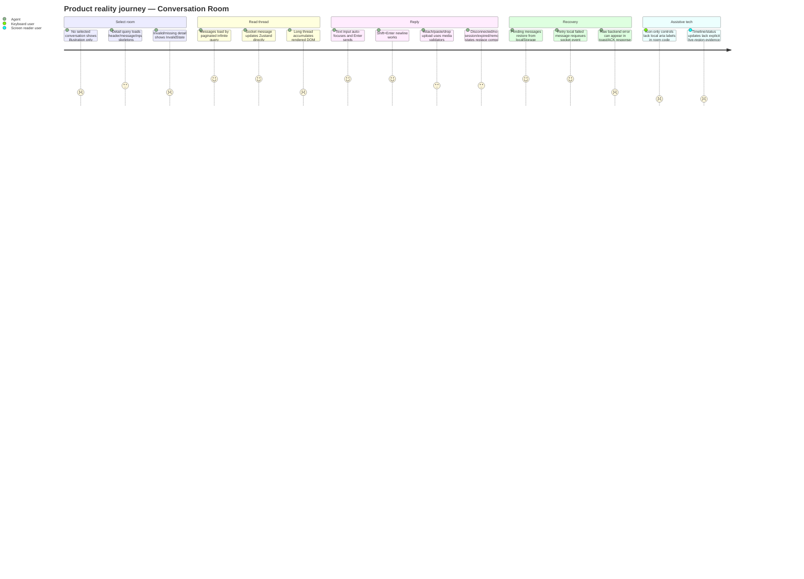

# Conversation Room Product-Reality Audit — SatuInbox

**Tanggal:** 2026-09-07  
**Scope:** Conversation Room aktual yang sudah dibangun: room shell, header, message timeline, bubble renderer, composer, socket flow, attachment/media, empty/no-session/error states, privacy/a11y/perf/engineering coupling.  
**Output location:** `Assessments/audit/detail-conversation/2026-09-07-conversation-room-product-reality-audit.md`  
**Register policy:** detail-only. Tidak mengedit `01-audit-master-register.md`; kandidat fold ada di akhir.  
**Sifat audit:** **product-reality + expert heuristic**, bukan PRD-conformance. PRD audit lama hanya dipakai sebagai pembanding sekunder pada section khusus; bukan standar penilaian.

## 🔗 Objek Bersama — Cross-Reference dengan Audit Room Lain

> Tabel ini memetakan objek/area yang **muncul di kedua audit Room** (PRD-based `deep-audit` ROOM-xx ⇄ product-reality `product-reality-audit` ROOMX-xx). Tujuan: saat menggarap satu objek, kerjakan **sekali** dengan melihat kedua sudut (kontrak PRD + realitas kode). `strong` = fix saling bergantung/overlap; `weak` = area sama, cek koordinasi.

| # | Objek / Area | deep-audit (PRD) | product-reality (kode) | Rel | Kerjakan sekali karena |
|---|---|---|---|---|---|
| 1 | Closed / terminal room state | ROOM-27 | ROOMX-03 | strong | Enum `'close'`≠`'closed'` (kode) + kontrak read-only/reopen composer (PRD) = satu state-machine. |
| 2 | Timeline performance (long thread) | ROOM-05, ROOM-06 | ROOMX-01 | strong | Virtualization + load/search budget satu pekerjaan; InfiniteScroll aktual membuktikan klaim PRD belum terpenuhi. |
| 3 | Accessibility (ARIA/keyboard/WCAG) | ROOM-19, ROOM-30 | ROOMX-05, ROOMX-11, ROOMX-12 | strong | Kriteria WCAG (PRD) → gap ARIA/IME/listbox nyata (kode); satu paket a11y room. |
| 4 | Header PII / identity masking | ROOM-32 | ROOMX-09 | strong | Kontrak masking header (PRD) = titik implementasi masking identity (kode). |
| 5 | Attachment / media (size + download security) | ROOM-04, ROOM-34 | ROOMX-15 | strong | Kontrak size+scan/filename & bug download-fallback signed-media = satu alur media. |
| 6 | Typing / presence indicator | ROOM-08 | ROOMX-06 | strong | Lifecycle/privacy/expiry (PRD) = scope broadcast typing store-driven (kode). |
| 7 | Delivery / read status per channel | ROOM-09 | ROOMX-23 | weak | Channel status matrix (PRD) ~ renderer/type policy fallback (kode) di path sama. |
| 8 | Socket / realtime authz & recovery | ROOM-07, ROOM-11 | ROOMX-07, ROOMX-19 | strong | Reconnect/permission-at-submit (PRD) & object-authz join/send absent (kode) = satu sweep authz+realtime. |
| 9 | Empty / loading / error / degraded states | ROOM-21 | ROOMX-04, ROOMX-16, ROOMX-25 | strong | State kosong/loading/error (PRD) & no-session split-tanpa-state-machine (kode) = satu state-machine. |
| 10 | Header actions layout & propagation | ROOM-22, ROOM-28 | ROOMX-10 | strong | Visual hierarchy/label/destructive Close (kode) & socket propagation mutasi header (PRD) di komponen header sama. |
| 11 | Message bubble rendering / hierarchy | ROOM-29 | ROOMX-13, ROOMX-14 | strong | Dense-thread rules (PRD) & memo stale + refs leak (kode) = `ConversationChatroomBuble` sama. |
| 12 | Error copy leakage / i18n | ROOM-20 | ROOMX-08 | weak | i18n error copy (PRD) & raw backend error leak toast/ACK (kode) di jalur error sama. |
| 13 | Message capability matrix / renderer | ROOM-24, ROOM-15 | ROOMX-17, ROOMX-18, ROOMX-23 | strong | Capability matrix (PRD) = scattered booleans/registry + renderer fragility (kode). |
| 14 | Search in room | ROOM-31 | ROOMX-21 | weak | Scoping/highlight (PRD) & useIsFetching flicker lintas query (kode) di area search sama. |
| 15 | Cross-channel / group room | ROOM-16, ROOM-17 | ROOMX-17, ROOMX-22 | weak | Journey group/Shopee (PRD) & capability scattered + sync-contact disabled (kode). |
| 16 | Composer send reliability / auto-retry | ROOM-10 | ROOMX-11 | weak | Idempotency auto-retry (PRD) & send shortcut/composer path (kode) di composer sama. |

**Unik `deep-audit` (tanpa padanan kode, murni kontrak/PRD gap):** ROOM-01, ROOM-02, ROOM-03 (konflik status/reopen/Hold-SLA), ROOM-12/13/14/26 (fitur belum dibangun: Collaborator/Reminder/Hold-Resume/Auto-reply), ROOM-18/23/25/33/35 (notes leakage, assignment, custom-attr search, audit-log, observability), ROOM-36 (positive).

**Unik `product-reality` (tak terlihat dari PRD, murni realitas kode):** ROOMX-02 (state duplication React-Query/Zustand/localStorage/socket), ROOMX-20 (tenant/userContext tak terlihat di repo filter), ROOMX-24 (FE tanpa automated test).

## Executive verdict

Produk aktual sudah punya fondasi kuat untuk room: query paging BE, dual cache/Zustand untuk realtime, pending-message dedup, channel-specific input registry, privacy masking di bubble, disconnected/no-session/expired/removed states. Masalah utama bukan “fit ke PRD”, tetapi biaya operasional produk nyata: timeline tidak virtualized, socket/cache/Zustand sangat coupled, a11y aktual minim, state closed menggunakan `close` di FE sementara memory/data model canonical `closed`, dan send path socket masih terlalu mengandalkan auth + conversation existence tanpa bukti submit-time authorization per participant.

**Decision taxonomy per cluster:**

| Cluster | Decision | Reason |
|---|---|---|
| Room rendering + large timeline | **Revise** | FE memakai `react-infinite-scroll-component` + `combinedItems.map` tanpa virtualization; acceptable untuk thread kecil, risk untuk long-running WA/email threads. |
| Composer + outbound reliability | **Proceed with conditions** | `tempMessageId` + FE queue + BE L1/L2 Redis dedup sudah ada; kondisi: permission-at-submit, closed state, raw error, and cache-fail behavior divalidasi. |
| State machine + empty/no-session | **Revise** | Produk aktual punya banyak state, tetapi `close` vs `closed`, empty state tanpa copy, and removed/expired/no-session split perlu konsistensi UX. |
| Socket/realtime sync | **Proceed with conditions** | Ada direct Zustand update + query invalidation + reconnect handler; coupling tinggi dan event storm/ordering masih needs-validation. |
| Accessibility actual | **Hold** | Room folder hampir tidak punya `aria-*`; icon-only buttons and live timeline/status changes belum punya evidence accessible names/live regions. |
| Privacy/security actual | **Proceed with conditions** | Bubble masking ada; BE gateway uses `PrivacyMaskingInterceptor`; but room socket emission unmasked and frontend handles masking, so must validate every renderer/modal/search. |
| Engineering maintainability | **Revise** | `ConversationChatRoom`, `ChatRoomInputBase`, `ConversationChatroomBuble`, and socket hook are large multi-responsibility files with explicit lint suppressions. |
| Cross-channel product journey | **Proceed with conditions** | Email exception, platform input registry, disconnected banner, and group channel selector exist; capability matrix still implicit in scattered branches. |

## Evidence boundaries

- **Memory evidence** = `Memory/CLAUDE-fe.md`, `Memory/CLAUDE-be.md`, `Memory/global-memory.md` line references.
- **Kode evidence** = repo FE/BE spot-read file:line. No runtime/load/browser test was executed; performance runtime claims are `needs-validation` unless code structure is enough to confirm risk.
- **Heuristik evidence** = Nielsen usability heuristics, WCAG 2.1 AA, web performance/state-management first principles.
- **Inference** = impact/failure mechanism derived from evidence.
- **Assumption** = explicit condition not proven by memory/code.
- **Status:** `confirmed` if visible in memory/kode; `inference` if derived from implementation shape; `needs-validation` if needs runtime/security/perf test.

## Product model aktual

```mermaid
flowchart LR
  Agent[Agent/Supervisor] --> FE[ConversationChatRoom]
  FE --> Header[ConversationChatRoomHeader]
  FE --> Timeline[ConversationChatRoomContainer]
  FE --> Composer[ChatRoomInputBase / platform input registry]

  Timeline --> Infinite[InfiniteScroll + combinedItems.map]
  Infinite --> Bubble[MessageItem -> getPlatformBubble -> ConversationChatroomBuble]
  Bubble --> Renderers[Media/Audio/Doc/Contact/Location/Event/Email renderers]

  Composer --> InputStore[conversation-input Zustand]
  Timeline --> MessageStore[message.store Zustand]
  SocketHook[useConversationSocketHandler] --> MessageStore
  SocketHook --> RQ[TanStack Query cache invalidation]
  Composer --> Queue[pending-socket-queue + localStorage]

  FE --> REST[GET /conversation/:id/messages]
  FE --> WS[/conversations Socket.IO]
  REST --> Gateway[api-gateway ConversationController]
  WS --> WSGateway[ConversationGateway]
  Gateway --> GRPC[conversation-service gRPC]
  WSGateway --> Async[conversation async event]
  GRPC --> MsgRepo[MessageRepository paginated aggregate]
  Async --> MsgService[MessageService send/retry]
  MsgService --> Redis[Redis duplicate key 10m]
  MsgService --> Outbound[OutboundQueueRouter / channel services]
```

## User journey aktual



## Findings

### ROOMX-01 — Timeline produk aktual infinite-scroll, bukan virtualized; DOM tumbuh mengikuti semua page yang sudah dibuka
> 🔗 **Objek sama** (Timeline performance (long thread)): lihat `deep-audit (2026-09-07-conversation-room-deep-audit.md)` → ROOM-05, ROOM-06. Kerjakan sekali, dua sudut (PRD + kode). Lihat tabel *Objek Bersama* di kepala file.

| Field | Detail |
|---|---|
| ID | ROOMX-01 |
| Aspek | Performance & scalability |
| Deskripsi | Room message list memakai `react-infinite-scroll-component` dan render semua `combinedItems` via `.map`; tidak ada virtualizer/windowing di room folder. Ini bukan mismatch PRD; ini risiko produk nyata untuk percakapan panjang. |
| Severity | **Major** |
| Evidence — memory | `Memory/CLAUDE-fe.md:41` menyebut React Virtual tersedia, tetapi `:297-303` hanya menyebut ConversationChatLists sebagai virtualized; room hanya “messages + composer”. |
| Evidence — kode | `ConversationChatRoomMessage.tsx:5` imports `react-infinite-scroll-component`; `:57-72` renders `<InfiniteScroll>`; `:73-82` maps every `combinedItems` to `MessageItem`; search room folder for `useVirtualizer` returned 0 matches. |
| Evidence — heuristik | Web perf best practice: infinite pagination is not virtualization; after N pages, DOM/memory still grows O(N). |
| Inference | Long-running WA/email/group threads can degrade scroll, layout, memory, and screen-reader navigation. |
| Assumption | No runtime profiling executed; exact break point depends message/media mix and default `INFO.DEFAULT_LIMIT`. |
| Status | confirmed code-shape, runtime needs-validation |
| Impact | Agent can experience slow thread, jump lag, high memory; engineering gets harder perf bugs because issue scales with reading history. |
| Remediation | Use existing installed TanStack React Virtual (no new dep) for message timeline, or cap loaded DOM with windowing around viewport and explicit anchor restoration. |
| Next safe action | Seed/read a long thread; capture DOM node count + scroll FPS before deciding virtualizer scope. |

### ROOMX-02 — Message sync path duplicates source of truth: React Query, Zustand, localStorage, socket queue

| Field | Detail |
|---|---|
| ID | ROOMX-02 |
| Aspek | State management, realtime reliability, engineering maintainability |
| Deskripsi | Produk aktual keeps messages in React Query, Zustand `chatroomMessages`, localStorage pending entries, and pending socket queue. It works around real channel issues, but coupling is high and ordering bugs become likely. |
| Severity | **Major** |
| Evidence — memory | `Memory/CLAUDE-fe.md:96-98` says React Query owns server state and Zustand owns UI/client state; `:187` says offline message buffer replayed on reconnect; `:371-372` says pending messages reconciled by `tempMessageId`. |
| Evidence — kode | `use-chat-room-message.ts:77-141` merges React Query pages with Zustand and pending localStorage; `use-conversation-socket-event.ts:70-86` documents direct Zustand update because React Query infinite queries did not reliably re-render; `:254-278` updates React Query cache, latest message, file lists, Zustand, and SLA invalidation in one path. |
| Evidence — heuristik | State-management sanity: one domain entity with 4 writeable stores needs strict invariants or it drifts under reconnect/concurrent events. |
| Inference | A stale cache update, reconnect replay, or ticket-created invalidation can reorder, duplicate, or drop visible messages. |
| Assumption | Current dedup fixes cover many happy-path duplicates; not load/concurrency tested here. |
| Status | confirmed implementation risk |
| Impact | Engineering changes in one layer can regress another; realtime bugs are hard to reproduce. |
| Remediation | Document one message-state invariant: React Query = persisted pages, Zustand = active room projection, localStorage = unsent only, queue = transport only. Add a small dedup/order test around merge and socket insert functions. |
| Next safe action | Extract and unit-check `mergeMessages`/`updateOrInsertRegularMessage` before adding new room features. |

### ROOMX-03 — Closed-room detection uses `status === 'close'`, while product memory/data model uses `closed`
> 🔗 **Objek sama** (Closed / terminal room state): lihat `deep-audit (2026-09-07-conversation-room-deep-audit.md)` → ROOM-27. Kerjakan sekali, dua sudut (PRD + kode). Lihat tabel *Objek Bersama* di kepala file.

| Field | Detail |
|---|---|
| ID | ROOMX-03 |
| Aspek | App flow & state machine |
| Deskripsi | Actual FE type and input disabling check use `close`, not `closed`. If API/memory emits `closed`, composer stays enabled. This finding comes from actual code, not PRD. |
| Severity | **Catastrophe** |
| Evidence — memory | `Memory/global-memory.md:270` says confirmed product data model status is `"open" / "closed"`; `:25` says closed room immutable. |
| Evidence — kode | `apps/omnichannel/types/conversation/conversation.ts:10-13` defines `ConversationStatusEnum.CLOSE = 'close'`; `use-chat-room-properties.ts:12-14` disables input only when `activeConversation?.status === 'close'`; header `ConversationChatRoomHeader.tsx:306` treats anything not `open` as reopen state. |
| Evidence — heuristik | State machine invariant: terminal/immutable state must use one canonical enum at every enforcement point. |
| Inference | A real `closed` room can show reopen button in header but composer not disabled, creating attempted sends into immutable conversation. |
| Assumption | Shared `@satuinbox/types` may still define `close`; memory is primary per task and says production model `closed`. Needs API payload readback to confirm current runtime. |
| Status | confirmed inconsistency; runtime impact needs-validation |
| Impact | User confusion, failed sends, possible backend rejection loop; engineering drift between FE enum and BE/memory. |
| Remediation | Normalize status at API mapper boundary or update FE enum/useChatRoomProperties to accept only canonical `closed`; avoid scattered string checks. |
| Next safe action | Inspect actual `/conversation/:id` payload for a closed room, then patch one shared status helper if mismatch confirmed. |

### ROOMX-04 — No-selected-room empty state is visual-only and weak recovery UX
> 🔗 **Objek sama** (Empty / loading / error / degraded states): lihat `deep-audit (2026-09-07-conversation-room-deep-audit.md)` → ROOM-21. Kerjakan sekali, dua sudut (PRD + kode). Lihat tabel *Objek Bersama* di kepala file.

| Field | Detail |
|---|---|
| ID | ROOMX-04 |
| Aspek | UI/UX, empty state, user journey |
| Deskripsi | When no conversation selected, product shows only an illustration with alt text. There is no visible title, explanation, CTA, keyboard target, or reason-aware state. |
| Severity | **Medium** |
| Evidence — kode | `ConversationChatRoom.tsx:240` returns `<EmptyState />` when no active conversation id; `ConversationChatRoomEmpty.tsx:14-23` renders centered image only; alt is hardcoded English `No conversation selected.` at `:18`. |
| Evidence — heuristik | Nielsen: visibility of system status + recognition over recall; empty state should explain what happened and next action. WCAG: non-text alt alone is not a full visible instruction. |
| Inference | First-time agents and keyboard/screen-reader users get a blank-looking center panel and must infer they should select a chat. |
| Assumption | Surrounding left list may provide context, but room surface itself does not. |
| Status | confirmed |
| Impact | Lower learnability, more confusion after filters yield no selected room, bad default workspace polish. |
| Remediation | Add localized title + one-line instruction + optional “Pilih percakapan dari daftar” CTA/focus hint. |
| Next safe action | Update the existing EmptyState component only; no new abstraction. |

### ROOMX-05 — Actual ARIA footprint in room folder is near-zero; icon-only controls rely on hidden assumptions
> 🔗 **Objek sama** (Accessibility (ARIA/keyboard/WCAG)): lihat `deep-audit (2026-09-07-conversation-room-deep-audit.md)` → ROOM-19, ROOM-30. Kerjakan sekali, dua sudut (PRD + kode). Lihat tabel *Objek Bersama* di kepala file.

| Field | Detail |
|---|---|
| ID | ROOMX-05 |
| Aspek | Accessibility actual, WCAG 2.1 AA |
| Deskripsi | Room code has no `aria-*` matches in audited chat-room folder. Header and composer include multiple icon-only `<button>`/`Button>` controls without local accessible labels in the room code. |
| Severity | **Major** |
| Evidence — kode | Search `aria-` in `components/.../chat-room` returned 0 matches; `ChatRoomInputBase.tsx:265-287` renders macro, attach, emoji icon buttons without `aria-label`; `ConversationChatRoomHeader.tsx:89-96` generic `ActionIconButton` renders only icon children; `:225-229` uses this for ticket icon, `:172-176` for details toggle. |
| Evidence — heuristik | WCAG 2.1 AA: controls require accessible names (2.5.3/4.1.2), focus state, keyboard operation; status updates should be announced when relevant. |
| Inference | Screen-reader users may hear unlabeled “button”; keyboard users lack clear purpose for slash/camera/ticket/sidebar buttons. |
| Assumption | Shared UI `Button`, `EmojiPicker`, or SVG titles may provide some names, but no evidence in room components. |
| Status | confirmed code absence, needs assistive-tech validation |
| Impact | Accessibility blocker for core agent workflow; QA cannot claim WCAG for the built room. |
| Remediation | Add explicit localized `aria-label`/tooltip to icon buttons and live regions for typing/status/load more; keep in existing components. |
| Next safe action | Run axe/screen-reader pass on room; first patch `ActionIconButton` to require a label. |

### ROOMX-06 — Typing indicators are company-broadcast and store-driven; visibility scope/expiry is product-sensitive
> 🔗 **Objek sama** (Typing / presence indicator): lihat `deep-audit (2026-09-07-conversation-room-deep-audit.md)` → ROOM-08. Kerjakan sekali, dua sudut (PRD + kode). Lihat tabel *Objek Bersama* di kepala file.

| Field | Detail |
|---|---|
| ID | ROOMX-06 |
| Aspek | Realtime UX, privacy, multi-handler |
| Deskripsi | Typing events are broadcast to company room and rendered from `typingUsersMap`; room UI displays other typing users. This is useful, but product actual needs scoped participant/team visibility and expiry guarantees. |
| Severity | **Medium** |
| Evidence — kode | BE `conversation.gateway.ts:291-296` emits `typing.indicator` to `company:{companyId}` with `user`; FE `ConversationChatRoomContainer.tsx:63-68` reads `customerTypingId` and `typingUsersMap`; `:107-111` renders customer and user typing indicators. |
| Evidence — memory | `Memory/CLAUDE-fe.md:257-280` confirms `/conversations` socket events include typing and singleton reconnect behavior. |
| Evidence — heuristik | Nielsen visibility of system status: typing status is high-trust realtime UI; stale or overshared presence misleads coordination. Privacy principle: company-wide event payload must be filtered before display. |
| Inference | If hook filtering/TTL fails, users may see stale or out-of-scope staff names. |
| Assumption | `useListenIsTyping` may enforce TTL/scope; not inspected in this pass. |
| Status | needs-validation |
| Impact | Agent coordination errors and internal identity exposure across teams. |
| Remediation | Verify hook filters active conversation and scoped visibility, and expires typing after short TTL even without stop event. |
| Next safe action | Spot-read/test `use-listen-is-typing` with missing stop event and cross-team payload. |

### ROOMX-07 — Outbound send authorization is not evident at the socket service boundary
> 🔗 **Objek sama** (Socket / realtime authz & recovery): lihat `deep-audit (2026-09-07-conversation-room-deep-audit.md)` → ROOM-07, ROOM-11. Kerjakan sekali, dua sudut (PRD + kode). Lihat tabel *Objek Bersama* di kepala file.

| Field | Detail |
|---|---|
| ID | ROOMX-07 |
| Aspek | Security/RBAC, submit-time permission, multi-handler race |
| Deskripsi | Socket outbound path validates auth and conversation/account-channel eligibility, but the spot-read did not find explicit participant/permission authorization in `handleOutboundMessage`/`sendMessageFromConversation`. Edit/delete have a dedicated authorization service; send does not visibly call it. |
| Severity | **Catastrophe** |
| Evidence — kode | BE `ConversationGateway.handleSendMessageOutbound` only extracts `client.data.sender.userId` and calls `conversationService.handleOutboundMessage` (`conversation.gateway.ts:230-243`); gateway service emits async send with `senderId` (`conversation.service.ts:82-110`); conversation-service `sendMessageFromConversation` checks duplicate, active conversation, WhatsApp window, sender info, then creates message (`message.service.ts:164-205`); `MessageAuthorizationService` exists for edit/delete (`message-authorization.service.ts:57-76`), not shown in send path. |
| Evidence — memory | `Memory/CLAUDE-be.md:221-229` says guards/RBAC and tenant scoping exist generally; not room-send specific. |
| Evidence — heuristik | Never treat UI-hidden button/authenticated socket as authorization. Submit-time authorization must survive reassignment while composing. |
| Inference | A user with authenticated socket and guessed/stale conversation id may attempt outbound send unless deeper `validateConversation`/repository enforces ownership. |
| Assumption | `findActiveConversationById` or downstream repository may enforce tenant only, not participant; exact authz needs full trace. |
| Status | needs-validation, high risk |
| Impact | Unauthorized customer-facing messages, cross-team leakage, audit/compliance incident. |
| Remediation | Add/reuse one `canSendMessage(conversation, userContext)` check in service before `createOutboundMessage`; use server-side role/participant/team state, not FE state. |
| Next safe action | Security trace `findActiveConversationById`, `getValidatedSenderInfo`, and socket `client.data.sender.user.company` into send DTO. |

### ROOMX-08 — Raw backend errors can leak through socket ACK and toast paths
> 🔗 **Objek sama** (Error copy leakage / i18n): lihat `deep-audit (2026-09-07-conversation-room-deep-audit.md)` → ROOM-20. Kerjakan sekali, dua sudut (PRD + kode). Lihat tabel *Objek Bersama* di kepala file.

| Field | Detail |
|---|---|
| ID | ROOMX-08 |
| Aspek | Error handling, security, UX |
| Deskripsi | Actual room/socket code returns or displays `error.message` in multiple core paths. Existing memory already warns raw error leakage broadly; room has concrete instances. |
| Severity | **Major** |
| Evidence — memory | Task context references existing F-07 raw error leakage at 278 sites; `Memory/CLAUDE-fe.md:54` says frontend has no functional tests, increasing regression risk. |
| Evidence — kode | BE socket gateway returns `{ error: error.message, success: false }` on join/leave/outbound/group/edit/delete (`conversation.gateway.ts:121-123`, `:240-243`, `:268-270`, `:341-343`, `:367-369`); FE bubble download toast uses `error.message ?? 'Failed to download document'` and hardcoded titles (`ConversationChatroomBuble.tsx:214-225`); retry toast uses `error.message` at `:292-299`. |
| Evidence — heuristik | Secure UX: map internal/provider errors to safe localized copy; log details server-side with correlation id. |
| Inference | Provider/S3/DB/internal messages can appear to users or attackers; copy becomes inconsistent and untranslated. |
| Assumption | Some errors may already be sanitized upstream; not proven. |
| Status | confirmed pattern |
| Impact | PII/implementation leakage, confusing recovery, i18n breakage. |
| Remediation | Centralize safe error mapping for room send/download/retry; never show raw `error.message` unless code is whitelisted user-safe. |
| Next safe action | Patch room-facing toasts first; separately fix socket ACK error contract. |

### ROOMX-09 — Header contact identity lacks visible room-level privacy masking
> 🔗 **Objek sama** (Header PII / identity masking): lihat `deep-audit (2026-09-07-conversation-room-deep-audit.md)` → ROOM-32. Kerjakan sekali, dua sudut (PRD + kode). Lihat tabel *Objek Bersama* di kepala file.

| Field | Detail |
|---|---|
| ID | ROOMX-09 |
| Aspek | Privacy/PII, visual hierarchy |
| Deskripsi | Message bubble sender info masks customer names/phone/email, but header `ContactInfo` renders `contactName` directly. Gateway has a privacy masking interceptor, but room header code itself does not apply masking. |
| Severity | **Major** |
| Evidence — memory | `Memory/CLAUDE-fe.md:251` mentions `usePrivacyMasking`; `Memory/CLAUDE-be.md:221-229` says sensitive data/encryption and auth controls exist generally. |
| Evidence — kode | `ConversationChatRoomHeader.tsx:57-68` renders `name` as plain text; `:401-405` resolves widget/contact display name; `:443` passes `contactName` into `ContactInfo`; contrast: `ConversationChatroomBuble.tsx:92-106` masks sender contact and `:111-120` masks customer sender name. |
| Evidence — heuristik | Privacy consistency: same PII classification should be masked uniformly across list/header/bubble/search/modals. |
| Inference | Header may reveal display name/phone-like alias even when bubble body masks it or role privacy requires masking. |
| Assumption | `PrivacyMaskingInterceptor` may mask `items.contactInfo.displayName` before FE gets it; not verified with runtime role. |
| Status | needs-validation |
| Impact | PII exposure to roles that should see masked identity; inconsistent trust in privacy settings. |
| Remediation | Apply `usePrivacyMasking().maskDisplayName`/phone/email helpers at header render boundary or assert interceptor output is already masked with tests. |
| Next safe action | Log in non-admin privacy-masked role and compare list/header/bubble identity for same conversation. |

### ROOMX-10 — Header action buttons lack labels and action hierarchy; destructive Close is visually peer with utility actions
> 🔗 **Objek sama** (Header actions layout & propagation): lihat `deep-audit (2026-09-07-conversation-room-deep-audit.md)` → ROOM-22, ROOM-28. Kerjakan sekali, dua sudut (PRD + kode). Lihat tabel *Objek Bersama* di kepala file.

| Field | Detail |
|---|---|
| ID | ROOMX-10 |
| Aspek | UI/UX visual hierarchy, error prevention |
| Deskripsi | Header packs screenshot, ticket, close/reopen, detail toggle as equal-height controls; icon controls have no local label/tooltip evidence, while Close is one click except ticket warning. |
| Severity | **Medium** |
| Evidence — kode | `ConversationChatRoomHeader.tsx:185-190` returns screenshot/ticket icons for non-group; `:310-331` renders action row; `:141-149` Close button calls `onClose(id)`; warning dialog appears only when `openTickets` exists (`:359-399`). |
| Evidence — heuristik | Nielsen error prevention and recognition: destructive/terminal actions need stronger affordance/confirmation when irreversible or high-impact; primary identity/status should dominate header. |
| Inference | Agents can close the wrong active room when rapidly switching or mis-clicking near utility icons. |
| Assumption | `useHandleCloseConversation` may show a confirmation for other conditions; only header component inspected. |
| Status | inference |
| Impact | Accidental closure, context loss, support escalations. |
| Remediation | Separate destructive action from utility icons; add tooltip/aria labels; show a brief confirm/undo for close if no open-ticket warning. |
| Next safe action | Inspect `useHandleCloseConversation` and run click-path UAT on close/reopen. |

### ROOMX-11 — Composer send shortcut ignores IME composition state
> 🔗 **Objek sama** (Composer send reliability / auto-retry): lihat `deep-audit (2026-09-07-conversation-room-deep-audit.md)` → ROOM-19, ROOM-30, ROOM-10. Kerjakan sekali, dua sudut (PRD + kode). Lihat tabel *Objek Bersama* di kepala file.

| Field | Detail |
|---|---|
| ID | ROOMX-11 |
| Aspek | Composer UX, i18n/input correctness |
| Deskripsi | Enter sends unless Shift is held; code does not check `e.nativeEvent.isComposing` or composition events. IME users can accidentally send unfinished text. |
| Severity | **Medium** |
| Evidence — kode | `ChatRoomInputBase.tsx:182-194` handles Enter, returns only if key is not Enter or `e.shiftKey`; no composition guard visible. |
| Evidence — memory | `Memory/CLAUDE-fe.md:331-335` says locales are `en`/`id`; product may still receive multilingual customer names/messages through channels. |
| Evidence — heuristik | International text input best practice: do not treat Enter during IME composition as submit. |
| Inference | Japanese/Chinese/Korean/complex IME input can send partial conversion; Indonesian agents may still paste/use emoji/autocomplete safely, but global readiness suffers. |
| Assumption | `AutoGrowingInput` may internally suppress composition keydown; not verified. |
| Status | needs-validation |
| Impact | Accidental customer-facing messages. |
| Remediation | Add one guard in `handleKeyDown`: if composing, return. |
| Next safe action | Manual IME test in composer; patch local handler if failing. |

### ROOMX-12 — Macro overlay is not modeled as accessible combobox/listbox
> 🔗 **Objek sama** (Accessibility (ARIA/keyboard/WCAG)): lihat `deep-audit (2026-09-07-conversation-room-deep-audit.md)` → ROOM-19, ROOM-30. Kerjakan sekali, dua sudut (PRD + kode). Lihat tabel *Objek Bersama* di kepala file.

| Field | Detail |
|---|---|
| ID | ROOMX-12 |
| Aspek | Macro/quick reply UX, accessibility |
| Deskripsi | Macro autocomplete renders a scrollable div and buttons, with visual highlighted index, but no ARIA listbox/option/active-descendant evidence in room component. |
| Severity | **Medium** |
| Evidence — kode | `ChatRoomMacroSection.tsx:32` wrapper is plain `<div>`; `:57-70` maps macros to `<button>`; highlight is class-only at `:63-65`; no `role=listbox`, `role=option`, `aria-selected`, or `aria-activedescendant`. |
| Evidence — heuristik | WCAG/name-role-value and ARIA combobox pattern: autocomplete suggestions need navigable roles and selected state announcement. |
| Inference | Keyboard/screen-reader users may not know macro list opened, which item is highlighted, or how to select. |
| Assumption | `useMacroAutocomplete` may handle keyboard behavior, but semantic roles absent here. |
| Status | confirmed semantic gap |
| Impact | Power-user quick reply feature excludes assistive tech and can confuse keyboard-only users. |
| Remediation | Add listbox/option roles, selected state, input `aria-controls`, and announcement for empty/loading. |
| Next safe action | Patch existing macro component; no new dependency. |

### ROOMX-13 — Bubble memo comparator ignores important props; stale UI possible after selection/action-disable/edit/pin changes
> 🔗 **Objek sama** (Message bubble rendering / hierarchy): lihat `deep-audit (2026-09-07-conversation-room-deep-audit.md)` → ROOM-29. Kerjakan sekali, dua sudut (PRD + kode). Lihat tabel *Objek Bersama* di kepala file.

| Field | Detail |
|---|---|
| ID | ROOMX-13 |
| Aspek | Re-render pattern, correctness, maintainability |
| Deskripsi | `ConversationChatroomBuble` custom memo comparator only checks id/status/content/sender data. It ignores `isActionsDisabled`, pinned/deleted/edited/ticket/reply/attachment changes and conversation context. |
| Severity | **Major** |
| Evidence — kode | Component receives `conversation`, `onReplyClick`, `isActionsDisabled` (`ConversationChatroomBuble.tsx:63-72`); builds UI from many message fields (`:541-560`) including `isPinned`, `isDeleted`, `isEdited`, `hasTicket`; comparator at `:668-681` checks only `message.id`, `status`, `content`, and sender phone/email/name. |
| Evidence — heuristik | React perf rule: custom memo comparators must include every prop/state-derived field that affects render, or UI becomes stale. |
| Inference | After removal, pin, ticket link, delete/edit, or attachment update, bubble may not re-render if changed data is not in comparator and parent props are memoized. |
| Assumption | Store hooks inside component can force re-render for some internal state; parent prop changes still at risk. |
| Status | confirmed risk |
| Impact | Agents may see actions enabled after removal, missing pin/ticket state, or stale edited/deleted indicators. |
| Remediation | Delete custom comparator and use default memo, or include a compact `message.updatedAt/version` plus `isActionsDisabled` and key fields. Deletion is lazier and safer unless profiling proves need. |
| Next safe action | Reproduce pin/remove/delete update; if stale appears, remove comparator first. |

### ROOMX-14 — Bubble refs map mutates Zustand state in place and is never cleared on room switch in inspected path
> 🔗 **Objek sama** (Message bubble rendering / hierarchy): lihat `deep-audit (2026-09-07-conversation-room-deep-audit.md)` → ROOM-29. Kerjakan sekali, dua sudut (PRD + kode). Lihat tabel *Objek Bersama* di kepala file.

| Field | Detail |
|---|---|
| ID | ROOMX-14 |
| Aspek | State management, memory growth, reply-to navigation |
| Deskripsi | Bubble refs are stored in Zustand but `setBubleRef` mutates `get().bubleRefsMap` directly. Refs can accumulate across loaded pages/rooms and not notify subscribers. |
| Severity | **Medium** |
| Evidence — kode | Store defines `bubleRefsMap` and `clearBubleRefs` (`message.store.ts:58-65`, `:124-125`); `setBubleRef` mutates map in place at `:259-260`; `ConversationChatRoomMessage.tsx:53` uses `getBubleRefs()` for reply jump; no `clearBubleRefs` call found in spot-read room switch path. |
| Evidence — heuristik | React/Zustand state mutation without `set` breaks subscription semantics and can retain stale DOM refs after unmount. |
| Inference | Reply-to jump can target stale/missing DOM nodes; memory grows with historical loaded messages. |
| Assumption | React ref callback with null may clean some entries if implemented elsewhere; in `MessageItem` ref callback passes null but store assignment keeps key with null. |
| Status | confirmed implementation smell |
| Impact | Broken reply navigation and avoidable memory retention in long sessions. |
| Remediation | Use a mutable `useRef` local to timeline for DOM refs, or have `setBubleRef` delete null entries and clear on active conversation change. |
| Next safe action | Add `delete` on null + `clearBubleRefs` on room switch; cheapest safe patch. |

### ROOMX-15 — Attachment download fallback can bypass signed-media path and uses hardcoded unsafe copy
> 🔗 **Objek sama** (Attachment / media): lihat `deep-audit (2026-09-07-conversation-room-deep-audit.md)` → ROOM-04, ROOM-34. Kerjakan sekali, dua sudut (PRD + kode). Lihat tabel *Objek Bersama* di kepala file.

| Field | Detail |
|---|---|
| ID | ROOMX-15 |
| Aspek | Attachment security, UX, i18n |
| Deskripsi | If signed media fetch fails, code shows raw/hardcoded error then triggers download from original attachment URL. This may be intentional CORS fallback, but from product reality it weakens central media controls and localization. |
| Severity | **Major** |
| Evidence — kode | `ConversationChatroomBuble.tsx:214-227` on getMedia error logs raw error, shows toast `error.message ?? 'Failed to download document'` with title `'Download Failed'`, then `triggerDownload(attachment.url, ...)`; `:395-414` constructs a synthetic anchor to navigate/download. |
| Evidence — memory | `Memory/CLAUDE-be.md:34-37,95` says media-service + S3/CloudFront signed URLs; `Memory/CLAUDE-fe.md:331-335` says user-visible strings should be in i18n. |
| Evidence — heuristik | Secure file handling: fallback paths should preserve authorization, expiry, logging, and safe copy. |
| Inference | Expired/direct URLs, content-disposition issues, and unlocalized error copy can confuse or leak implementation details. |
| Assumption | Original `attachment.url` may already be a signed URL safe for direct navigation; not verified. |
| Status | needs-validation |
| Impact | Inconsistent download authorization and support confusion when media proxy fails. |
| Remediation | If fallback is required, map to safe localized copy and record download-fallback metric; ensure original URL is signed and expires. |
| Next safe action | Audit `attachment.url` source and signed URL TTL; patch hardcoded copy regardless. |

### ROOMX-16 — No-session/disconnected/expired/removed states exist but are split across components without one state machine
> 🔗 **Objek sama** (Empty / loading / error / degraded states): lihat `deep-audit (2026-09-07-conversation-room-deep-audit.md)` → ROOM-21. Kerjakan sekali, dua sudut (PRD + kode). Lihat tabel *Objek Bersama* di kepala file.

| Field | Detail |
|---|---|
| ID | ROOMX-16 |
| Aspek | Flow, user journey, state machine |
| Deskripsi | Actual product has many useful degraded states, but each state is guarded in a different component and store flag. Precedence/conflicts are implicit. |
| Severity | **Medium** |
| Evidence — kode | No active conversation -> `EmptyState` (`ConversationChatRoom.tsx:240`); missing detail -> `InvalidState` (`:241`); removed -> `RemovedFromConversationBanner` (`:162-164`); expired -> `ExpiredConversationWindow` (`:166-171`); disconnected -> `DisconnectedAccountBanner` in `Input.tsx:79-83`; no-session component exists `ConversationChatRoomNoSession.tsx:10-29`. |
| Evidence — heuristik | State-machine sanity: mutually exclusive UX states need an ordered decision table, otherwise edge cases show wrong recovery action. |
| Inference | Example: removed + expired + disconnected can show only the first branch; no-session may be unreachable or duplicate disconnected handling. |
| Assumption | Parent routes may render NoSession elsewhere; not traced. |
| Status | confirmed structure, needs journey validation |
| Impact | Agents see wrong remediation: relogin channel vs reopen template vs “you were removed”. Engineering adds future states by patching branches. |
| Remediation | Create a simple `deriveRoomComposerState(conversation, flags)` decision helper and table-test it; render existing components from that one value. |
| Next safe action | Inventory which component renders `ConversationChatRoomNoSession`; fold duplicate states. |

### ROOMX-17 — Group/cross-channel capability is implemented by scattered booleans and registry, not an explicit capability object
> 🔗 **Objek sama** (Cross-channel / group room): lihat `deep-audit (2026-09-07-conversation-room-deep-audit.md)` → ROOM-24, ROOM-15, ROOM-16, ROOM-17. Kerjakan sekali, dua sudut (PRD + kode). Lihat tabel *Objek Bersama* di kepala file.

| Field | Detail |
|---|---|
| ID | ROOMX-17 |
| Aspek | Cross-channel journey, component coupling |
| Deskripsi | Product handles platform-specific input and group channel choice, but capability decisions are spread across `isGroup`, `isGroupComment`, `platform`, `hasPlatformInput`, accountChannel active checks, and bubble registry. |
| Severity | **Medium** |
| Evidence — memory | `Memory/global-memory.md:71` says room feature availability follows channel/account-channel capability matrix; `Memory/CLAUDE-fe.md:383-386` says conversation built features include room CRUD, multiple tickets, group presence; not built features include WA group mention, reminders, hold/resume. |
| Evidence — kode | Header hides screenshot/ticket for group via `getActionIcons` (`ConversationChatRoomHeader.tsx:185-189`); input uses `hasPlatformInput/renderPlatformInput` (`Input.tsx:66-75`) and group account channels (`:55-59`); message item resolves `getPlatformBubble(platform)` (`MessageItem.tsx:28-30`). |
| Evidence — heuristik | Maintainability: channel capability should be declarative to avoid contradictory affordances across header/input/bubble. |
| Inference | New channels or features can show upload/status/reply/ticket actions inconsistently. |
| Assumption | A central registry may exist deeper; not fully inspected. |
| Status | inference |
| Impact | Cross-channel bugs: unsupported action visible in one surface, hidden in another. |
| Remediation | Use one `roomCapabilities` object derived from platform/conversation/accountChannel; components consume capabilities, not raw booleans. |
| Next safe action | Start by documenting current booleans in one table before refactor. |

### ROOMX-18 — Email channel has product-specific pagination workaround; good fix, but it proves renderer/load path is channel-fragile
> 🔗 **Objek sama** (Message capability matrix / renderer): lihat `deep-audit (2026-09-07-conversation-room-deep-audit.md)` → ROOM-24, ROOM-15. Kerjakan sekali, dua sudut (PRD + kode). Lihat tabel *Objek Bersama* di kepala file.

| Field | Detail |
|---|---|
| ID | ROOMX-18 |
| Aspek | Performance, channel reliability, Positive/Risk |
| Deskripsi | BE caps email message page size to avoid MongoDB BSON 16MB errors and FE uses explicit Load More for email. This is a positive product reality adaptation, but it shows channel-specific message payloads can break generic room assumptions. |
| Severity | **Positive** |
| Evidence — kode | FE comment says email uses explicit pagination 2 msg/page to avoid MongoDB BSON 16 MB errors (`ConversationChatRoomContainer.tsx:121-124`); BE `MessageService.getMessages` caps email page size (`message.service.ts:901-958`). |
| Evidence — memory | `Memory/CLAUDE-fe.md:48` lists email/media player stack; `Memory/CLAUDE-be.md:5` confirms unified inbox includes Email. |
| Evidence — heuristik | Product maturity: real channel payload constraints should be handled close to source rather than pretending all messages are equal. |
| Inference | Similar explicit caps may be needed for album/media-rich WA and long HTML replies. |
| Assumption | Runtime cap value `EMAIL_MESSAGE_PAGE_SIZE` not inspected. |
| Status | confirmed positive with follow-up risk |
| Impact | Avoids one class of email room crashes; creates need for clear UX around why email loads differently. |
| Remediation | Keep workaround, surface consistent loading UX, and document channel-specific page sizes. |
| Next safe action | Add metric/log for capped email queries and UX copy if load-more differs visibly. |

### ROOMX-19 — Socket join permits authenticated clients to join any conversation room by id unless deeper read authorization exists
> 🔗 **Objek sama** (Socket / realtime authz & recovery): lihat `deep-audit (2026-09-07-conversation-room-deep-audit.md)` → ROOM-07, ROOM-11. Kerjakan sekali, dua sudut (PRD + kode). Lihat tabel *Objek Bersama* di kepala file.

| Field | Detail |
|---|---|
| ID | ROOMX-19 |
| Aspek | Security/RBAC, realtime data leakage |
| Deskripsi | `JOIN_CONVERSATION` handler joins `conversation:{id}` after `WsAuthGuard`; no visible check that the user may read that conversation before joining the socket room. |
| Severity | **Catastrophe** |
| Evidence — kode | `conversation.gateway.ts:110-120` with `WsAuthGuard` reads `conversationId` and immediately `client.join(...)`; emits room messages unmasked to that room (`conversation.service.ts:196-199`). |
| Evidence — memory | `Memory/CLAUDE-be.md:54` says tenant scoping is mandatory; `:221-229` says guards/RBAC exist generally. |
| Evidence — heuristik | Object-level authorization: authenticated transport is insufficient; room subscription must enforce same read scope as REST detail/history. |
| Inference | If a user can guess/obtain another visible-id outside scope, they may subscribe to live unmasked messages. |
| Assumption | `WsAuthGuard` may validate payload scope; not inspected. Current handler body has no check. |
| Status | needs-validation, high risk |
| Impact | PII and message leakage across teams/roles/tenants if guard lacks object check. |
| Remediation | In join handler, call conversation read authorization with user context before `client.join`; return safe error on deny. |
| Next safe action | Inspect `WsAuthGuard` and add a negative socket test for cross-team conversation id. |

### ROOMX-20 — BE message pagination is optimized after pagination, but tenant/userContext is not visible in repository filter

| Field | Detail |
|---|---|
| ID | ROOMX-20 |
| Aspek | API/data contract, security, performance |
| Deskripsi | Message read endpoint passes `userContext`, but repository spot-read filters by `conversationId` and optional pinned/media/file only. Tenant/read-scope enforcement may happen elsewhere, but not visible in this hot repository path. |
| Severity | **Major** |
| Evidence — kode | Gateway builds `userContext` for `GET /conversation/:id/messages` (`conversation.controller.ts:1009-1022`); service calls `messageRepository.findByConversationId` (`message.service.ts:906-912`); repository filter uses `conversationId` plus parent/email filters (`message.repository.ts:62-87`) and no visible company/user filter in that method; positive perf evidence: lookups after pagination (`:93-118`) and album children separate (`:120-188`). |
| Evidence — memory | `Memory/CLAUDE-be.md:54` says every query carries companyId/organizationId; `:225` says every query is tenant-scoped. |
| Evidence — heuristik | API security: read path must enforce object-level auth close to data access or before it with provable invariant. |
| Inference | If gateway route is called with a valid but unauthorized conversation id, messages might be fetched unless service/controller checked conversation ownership elsewhere. |
| Assumption | Proto interceptor/base repository might inject tenant scope; not confirmed. |
| Status | needs-validation |
| Impact | Potential cross-scope message read; also hard for auditors to prove safety. |
| Remediation | Add explicit conversation access validation before fetching messages, or include tenant/company in message filter. |
| Next safe action | Trace `BaseRepository`, proto request context, and add negative REST test. |

### ROOMX-21 — Actual input loading detection uses broad `useIsFetching` predicates and can flicker across room/detail queries
> 🔗 **Objek sama** (Search in room): lihat `deep-audit (2026-09-07-conversation-room-deep-audit.md)` → ROOM-31. Kerjakan sekali, dua sudut (PRD + kode). Lihat tabel *Objek Bersama* di kepala file.

| Field | Detail |
|---|---|
| ID | ROOMX-21 |
| Aspek | Performance/UI responsiveness, React Query usage |
| Deskripsi | Header/input show loading based on global query-key inclusion predicates, not exact active room query. In multi-room rapid switching, unrelated detail fetches can blank header/input. |
| Severity | **Low** |
| Evidence — kode | Header `useIsFetching` predicate checks `query.queryKey.includes(CONVERSATION_QUERY_KEY.FETCH_CONVERSATIONS_DETAIL)` (`ConversationChatRoomHeader.tsx:427-432`); input uses similar predicate (`ChatRoomInputBase.tsx:408-413`). |
| Evidence — heuristik | UI state should scope loading to the entity currently displayed; broad global fetching creates jitter. |
| Inference | Background invalidation from assignment/ticket/socket events can cause skeleton or disabled-feeling composer while current room data is usable. |
| Assumption | React Query key inclusion may include active id consistently; not verified. |
| Status | inference |
| Impact | Minor perceived instability, especially during socket storms. |
| Remediation | Scope fetching predicates to `[FETCH_CONVERSATIONS_DETAIL, activeConversation.id]`. |
| Next safe action | Patch exact key match if flicker observed; one-line predicate change. |

### ROOMX-22 — Current product contains explicit “temporary disabled” sync-contact route; contact-card journey may dead-end
> 🔗 **Objek sama** (Cross-channel / group room): lihat `deep-audit (2026-09-07-conversation-room-deep-audit.md)` → ROOM-16, ROOM-17. Kerjakan sekali, dua sudut (PRD + kode). Lihat tabel *Objek Bersama* di kepala file.

| Field | Detail |
|---|---|
| ID | ROOMX-22 |
| Aspek | User journey, cross-channel contact handling |
| Deskripsi | BE route for syncing saved contact to WA address book is intentionally disabled. If room contact card UI exposes save/sync, agent journey can end in no-op success-ish response. |
| Severity | **Medium** |
| Evidence — kode | `conversation.controller.ts:652-660` says sync saved contact to WA address book, note “Temporarily disabled in the backend”, and returns early to prevent timeout. |
| Evidence — kode related | Bubble renderer supports CONTACT messages (`ConversationChatroomBuble.tsx:426-428`) and header has AddContactModal in room shell (`ConversationChatRoom.tsx:254-259`). |
| Evidence — heuristik | Nielsen match/recovery: if a feature is disabled, UI should clearly state unavailable and not imply completed sync. |
| Inference | Agents receiving WA contact cards may save locally but fail channel address-book sync without clear feedback. |
| Assumption | UI may not call this route; not traced. |
| Status | needs-validation |
| Impact | Broken contact-management expectation and support tickets for saved contacts not appearing in WhatsApp. |
| Remediation | Hide/disable sync action or show explicit “sinkronisasi kontak WA sementara tidak tersedia”; track backend re-enable separately. |
| Next safe action | Trace contact card save action from `ContactMessage` renderer. |

### ROOMX-23 — Message renderer supports many structured types; product value positive, but fallback copy/type policy is implicit
> 🔗 **Objek sama** (Message capability matrix / renderer): lihat `deep-audit (2026-09-07-conversation-room-deep-audit.md)` → ROOM-09, ROOM-24, ROOM-15. Kerjakan sekali, dua sudut (PRD + kode). Lihat tabel *Objek Bersama* di kepala file.

| Field | Detail |
|---|---|
| ID | ROOMX-23 |
| Aspek | UI/UX, cross-channel message rendering, Positive/Risk |
| Deskripsi | Actual bubble renderer supports image, album, document, sticker, video, audio, contact, location, utility, event, CSAT, reply. Good product coverage. Risk: unsupported/new provider types rely on implicit fallback to raw content. |
| Severity | **Positive** |
| Evidence — kode | `messageTypeRenderer` maps many `MessageTypeEnum` values (`ConversationChatroomBuble.tsx:417-431`); structured types suppress duplicated raw text (`:433-480`). |
| Evidence — memory | `Memory/CLAUDE-fe.md:383-386` lists screenshot capture, voice-note playback, linked-ticket bubble sync among built conversation features. |
| Evidence — heuristik | Recognition/scannability improves when structured messages render as cards instead of raw text. |
| Inference | The implementation is a product strength, but every new channel type needs fallback and a11y labels. |
| Assumption | Shared renderer components were not deeply audited for accessibility/security. |
| Status | confirmed positive |
| Impact | Better agent comprehension for rich inbound messages; future renderer drift risk. |
| Remediation | Keep renderer map; add explicit unknown-type fallback with safe localized label and telemetry. |
| Next safe action | Check renderer components for `alt`, labels, sanitization, and download safety. |

### ROOMX-24 — Actual frontend has no automated tests; room is too stateful to rely on lint/typecheck only

| Field | Detail |
|---|---|
| ID | ROOMX-24 |
| Aspek | Engineering quality gate, regression risk |
| Deskripsi | Product room has socket, optimistic messages, pending retry, privacy masking, channel-specific renderers, and state machine branches, but FE memory says no test framework/scripts. |
| Severity | **Major** |
| Evidence — memory | `Memory/CLAUDE-fe.md:52-54` says no Vitest/Jest dependency/config and functional verification is manual; `:430` says no `test` script exists. |
| Evidence — kode | Room files include complex/lint-suppressed components: `ChatRoomInputBase.tsx:1` disables max-lines/complexity; `ConversationChatRoomContainer.tsx:55` disables max-lines/complexity; `ConversationChatroomBuble.tsx:243` disables max-lines and `:665` no-restricted-syntax. |
| Evidence — heuristik | Stateful realtime UI needs at least small pure-function tests for dedup, state derivation, permission disabling, and renderer fallbacks. |
| Inference | Regression probability is high when adding room features; manual QA will miss reconnect and race cases. |
| Assumption | External Playwright suite may cover some flows; memory says frontend repo itself has no automated tests. |
| Status | confirmed |
| Impact | Slower releases and repeated bugs around duplicate bubbles, stale disabled state, and socket updates. |
| Remediation | Do not add a full test stack casually; first extract pure helpers and add minimal existing-check path if repo policy allows. If no runner, cover via existing automation repo. |
| Next safe action | Add Playwright cases in sixV2Automation for send/retry/closed/removed/a11y smoke, or introduce minimal FE test runner only if approved. |

### ROOMX-25 — Product reality has useful degraded account states, but no-session CTA hardcodes WA settings path
> 🔗 **Objek sama** (Empty / loading / error / degraded states): lihat `deep-audit (2026-09-07-conversation-room-deep-audit.md)` → ROOM-21. Kerjakan sekali, dua sudut (PRD + kode). Lihat tabel *Objek Bersama* di kepala file.

| Field | Detail |
|---|---|
| ID | ROOMX-25 |
| Aspek | No-session UX, cross-channel journey |
| Deskripsi | No-session banner sends users to `/settings/channels/whatsapp-web`. In a multi-channel room, a generic no-session state can misroute non-WA or WA API users. |
| Severity | **Medium** |
| Evidence — memory | `Memory/CLAUDE-be.md:5` says unified inbox spans WA Web, WA Business API, Instagram, Messenger, Email, Widget; `Memory/CLAUDE-fe.md:116-125` conversation route spans many sections/channels. |
| Evidence — kode | `ConversationChatRoomNoSession.tsx:19-27` links only to `/settings/channels/whatsapp-web`. |
| Evidence — heuristik | Error recovery should route to the exact failed dependency; generic recovery path creates dead ends. |
| Inference | Agents/admins handling WA API/Instagram/Email may be directed to wrong channel settings. |
| Assumption | Component may only be rendered for WA Web no-session; usage not traced. |
| Status | needs-validation |
| Impact | Slower channel recovery and wrong admin action. |
| Remediation | Pass platform/accountChannel into no-session banner and derive settings URL/copy per channel. |
| Next safe action | Search usage of `ConversationChatRoomNoSession`; if WA-only, rename component/copy to make scope explicit. |

## Perbedaan vs audit PRD

Audit PRD sebelumnya (`2026-09-07-conversation-room-deep-audit.md`) menilai dokumen/spec conformance: status taxonomy, reopen, Hold/Snooze/SLA, missing feature, and requirement gaps. Audit ini menilai **produk yang sungguh dibangun**. Temuan yang baru terlihat dari lensa product-reality:

- `ROOMX-01`: infinite-scroll timeline aktual tidak virtualized, dibuktikan dari `ConversationChatRoomMessage.tsx`.
- `ROOMX-02`: message state aktual terduplikasi di React Query + Zustand + localStorage + pending socket queue.
- `ROOMX-03`: FE closed-state check memakai `close`, sementara memory/data model confirmed `closed`.
- `ROOMX-05`, `ROOMX-12`: ARIA aktual hampir tidak ada di room folder dan macro overlay belum semantik listbox.
- `ROOMX-13`, `ROOMX-14`: re-render/memo comparator dan DOM refs map mutation adalah risiko implementasi nyata, tidak akan muncul dari PRD.
- `ROOMX-18`, `ROOMX-23`: positive product-reality — email BSON workaround dan structured renderer coverage — tidak perlu dianggap defect meski tidak dibahas PRD.
- `ROOMX-19`, `ROOMX-20`: socket join/read-path object authorization risk muncul dari kode gateway/repository, bukan dari requirement wording.
- `ROOMX-21`: broad query fetching predicates and UI flicker risk hanya terlihat dari implementation detail.

Overlap dengan audit PRD tetap ada pada area besar (closed/reopen/security/a11y/perf), tetapi dasar penilaian berbeda: di sini produk boleh beda PRD selama usable/safe; produk tetap finding jika implementasinya rapuh walau spec diam atau sesuai.

## Severity count

| Severity | Count |
|---|---:|
| Catastrophe | 3 |
| Major | 9 |
| Medium | 10 |
| Low | 1 |
| Positive | 2 |
| Total | 25 |

## Top risks

1. **ROOMX-19** — authenticated socket join appears to accept any `conversationId`; room messages are emitted unmasked to joined room.
2. **ROOMX-07** — outbound send authorization not evident at socket/service boundary.
3. **ROOMX-03** — closed state `close` vs `closed` can leave immutable room composer enabled.
4. **ROOMX-01** — long timeline not virtualized; DOM grows with every loaded page.
5. **ROOMX-13** — custom bubble memo comparator can hide pin/delete/action-disable updates.

## Assumptions

- Repo spot-read covered primary room FE components, selected socket/message hooks, and selected BE gateway/message paths; not a full repo audit.
- No browser, load, axe, screen-reader, or API runtime test was executed. Runtime claims are marked `needs-validation`.
- `Memory/CLAUDE-fe.md`, `Memory/CLAUDE-be.md`, and `Memory/global-memory.md` are primary ground truth per task, even where code suggests legacy naming.
- Shared UI primitives may add some accessibility behavior not visible in room components; this audit only confirms room-level absence of labels/roles.
- Existing audit PRD finding IDs `ROOM-xx` are treated as separate; this report uses `ROOMX-` to avoid collision.

## Risks if no action

- PII/message leakage through socket subscription or room send path if object authorization is absent.
- Long conversations become progressively slower and harder to debug.
- Closed/reopened room behavior remains inconsistent between FE, memory, and BE payloads.
- Accessibility debt blocks WCAG claims for the core agent workflow.
- Room feature work continues to increase coupling across React Query, Zustand, sockets, localStorage, and channel-specific branches.

## Follow-up tasks

1. Security validation: inspect `WsAuthGuard`, `findActiveConversationById`, BaseRepository tenant scope, and add negative socket/REST read/send tests.
2. Patch/validate `close` vs `closed` with one shared FE status helper or mapper.
3. Profile long thread and decide whether existing TanStack React Virtual is needed for the timeline.
4. Remove or widen `ConversationChatroomBuble` memo comparator; clear/delete bubble refs on room switch/unmount.
5. Add minimal accessibility fixes: labels for icon buttons, macro listbox semantics, live-region for typing/status/load more.
6. Make room degraded states explicit with one decision table/helper.

## Usulan fold ke `01-register`

> Jangan edit register dari report ini. Kandidat fold memakai `ROOMX-xx`; dedup note menandai overlap dengan `ROOM-` audit PRD bila ada.

| Candidate ID | Severity | Domain | Finding ringkas | Suggested decision | Dedup / overlap note |
|---|---|---|---|---|---|
| ROOMX-01 | Major | Performance | Message timeline infinite-scroll tanpa virtualization/windowing. | Revise | Overlap conceptual dengan ROOM-05/06 perf, tapi evidence baru produk aktual. |
| ROOMX-02 | Major | State/realtime | Message state tersebar di RQ/Zustand/localStorage/socket queue. | Revise | New implementation-only finding; no PRD duplicate. |
| ROOMX-03 | Catastrophe | State machine | FE disables composer on `close`, memory model says `closed`. | Revise | Overlap ROOM-01/27 state, but actual code-specific. |
| ROOMX-04 | Medium | Empty UX | Empty room is illustration-only, no visible guidance/CTA. | Proceed with conditions | Overlap ROOM-21 empty states; product evidence baru. |
| ROOMX-05 | Major | Accessibility | No `aria-*` in room folder; icon buttons unlabeled in room code. | Hold | Overlap ROOM-19 a11y, stronger actual-code evidence. |
| ROOMX-07 | Catastrophe | Security/send | Send authz not evident at socket/service boundary. | Hold | Overlap ROOM-11 authz, but actual path evidence. |
| ROOMX-08 | Major | Error handling | Raw `error.message` exposed in socket ACK/toasts. | Revise | Overlap global F-07; fold as room evidence, not new root issue if F-07 exists. |
| ROOMX-09 | Major | PII | Header identity lacks room-level masking while bubble masks. | Hold validation | Overlap ROOM-32, actual code-specific. |
| ROOMX-11 | Medium | Composer | Enter send lacks visible IME composition guard. | Proceed with conditions | New implementation-only UX issue. |
| ROOMX-12 | Medium | Macro/a11y | Macro autocomplete lacks listbox/option semantics. | Revise | New room actual a11y detail. |
| ROOMX-13 | Major | Re-render | Bubble memo comparator ignores render-affecting props. | Revise | New implementation-only finding. |
| ROOMX-14 | Medium | State/memory | Bubble refs mutate Zustand map in place and retain null/stale refs. | Revise | New implementation-only finding. |
| ROOMX-15 | Major | Attachment | Download error fallback uses raw copy and original URL navigation. | Hold validation | Overlap ROOM-34 attachment security; actual code evidence. |
| ROOMX-16 | Medium | Flow states | Degraded states split without one precedence table. | Revise | Overlap ROOM-21; product evidence baru. |
| ROOMX-18 | Positive | Email/perf | Email page-size cap avoids BSON 16MB, useful product adaptation. | Proceed | Positive; do not register as defect unless register tracks positives. |
| ROOMX-19 | Catastrophe | Security/socket | Join room by id lacks visible object authorization in handler. | Hold | New critical actual-code validation item; related to ROOM-18/32 security sweep. |
| ROOMX-20 | Major | Read path | Message repository filter lacks visible tenant/user scope. | Hold validation | Related to ROOM-31/32 read/search auth; actual code evidence. |
| ROOMX-21 | Low | UI perf | Broad `useIsFetching` predicate can flicker header/input. | Proceed with conditions | New implementation-only polish/perf issue. |
| ROOMX-24 | Major | Quality gate | FE no automated tests for highly stateful room. | Revise | Broader FE risk; fold if audit register has quality-gate cluster. |
| ROOMX-25 | Medium | No-session UX | No-session CTA hardcodes WhatsApp Web settings path. | Proceed with conditions | New actual UX unless WA-only usage confirmed. |

## [analyzer] summary

Conversation Room aktual punya pondasi bagus: BE paginated query optimized, pending `tempMessageId` dedup, email-specific load workaround, structured renderers, privacy masking di bubble, and multiple degraded states. Risiko utama yang hanya terlihat dari produk nyata: no virtualization in timeline, state duplication RQ/Zustand/localStorage/socket, `close` vs `closed`, ARIA actual gap, socket object-authz uncertainty, raw error exposure, and stale memo/ref patterns. 25 findings dicatat: 3 Catastrophe, 9 Major, 10 Medium, 1 Low, 2 Positive. Output disimpan di `Assessments/audit/detail-conversation/2026-09-07-conversation-room-product-reality-audit.md`; register tidak diedit.
