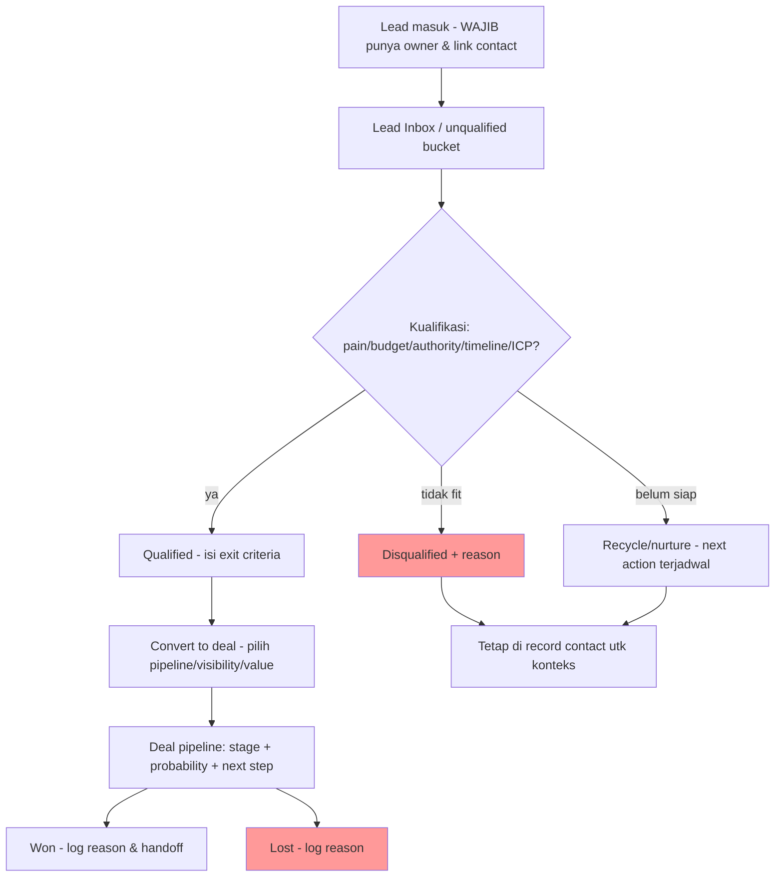
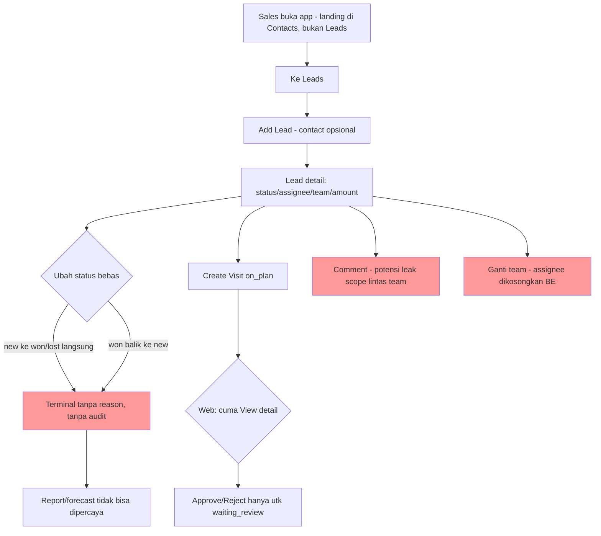

# Assessment Report — Sales SatuInbox vs External Sales/CRM Benchmark (Market Benchmark Assessment)

| Metadata | Nilai |
|---|---|
| Version | 1.0 |
| Date | 2026-09-08 |
| Owner | Analyst |
| Author | Dany Christian |
| Scope | Modul Sales / Lead Management SatuInbox dibandingkan dengan praktik benchmark eksternal (HubSpot, Pipedrive) untuk lead/prospect/sales pipeline |
| Decision | REVISE_PRD |
| Basis | Prior audit v1.1 (`sales-module-qa-assessment.md`) + referensi internet terverifikasi (5 sumber valid) + spot-check kode BE/FE |

## Executive Summary

- Audit v1.1 sudah valid dan akurat pada level kode (spot-check ulang mengonfirmasi GAP-004 `lead.service.ts:950-969` mengosongkan `assignees` saat ganti team, dan GAP-005 hook check-in visit ada di service tapi tidak dipakai komponen FE mana pun). Namun v1.1 adalah audit **internal-konsistensi**: ia membandingkan implementasi terhadap PRD corpus (yang tidak ada) dan menilai kode terhadap dirinya sendiri. Yang belum dilakukan v1.1 adalah membandingkan modul terhadap **model fungsional CRM sales yang sudah mapan** — inilah yang report ini tambahkan.
- Benchmark eksternal (HubSpot, Pipedrive) menunjukkan modul lead/prospect yang baik memisahkan **lead belum-ternilai (unqualified) dari deal aktif**, mewajibkan **owner/assigned**, memakai **pipeline stages dengan exit criteria dan transisi**, memiliki **kriteria kualifikasi eksplisit**, dan **handoff lead→deal/opportunity** yang eksplisit.[3][2]
- SatuInbox saat ini menggabungkan konsep lead dan pipeline deal dalam satu entity (`lead.pipelineStatus`: new→contacted→qualified→proposal→negotiation→won/lost) tanpa pemisahan unqualified/qualified, tanpa transisi terkontrol, tanpa reason untuk terminal state, dan tanpa tahap konversi ke deal/opportunity yang terpisah. Ini menyimpang dari model HubSpot (lead pipeline 5 tahap terpisah dari deal pipeline yang ber-probability)[2] dan Pipedrive (Leads Inbox → convert to deal)[3].
- Temuan benchmark utama: (MBG-001) tidak ada pemisahan unqualified/qualified & tidak ada handoff ke deal/opportunity; (MBG-002) tidak ada kriteria kualifikasi/exit criteria per stage; (MBG-003) tidak ada audit history / status history pipeline; (MBG-004) tidak ada next-action/follow-up yang terjadwal; (MBG-005) visibility/permission tidak memakai model owner-scope standar.
- Rekomendasi: tetap **REVISE_PRD** seperti v1.1 — buat PRD Sales yang mengadopsi model benchmark (lead stage terpisah, kriteria kualifikasi, transisi terkontrol, audit trail, handoff deal) — lalu patch P0 keamanan/invariant yang sudah diidentifikasi v1.1. Jangan over-build: jalan terpendek yang aman adalah PRD + transisi + scope fix, bukan modul deal terpisah penuh di iterasi pertama.

### Finding count (benchmark gap, report ini)

| Prioritas | Count |
|---|---:|
| P0 (harus sebelum GA / keamanan-invariant) | 3 |
| P1 (mayor, roadmap terdekat) | 6 |
| P2 (peningkatan, iterasi lanjut) | 4 |

| Kategori | Count |
|---|---:|
| Benchmark gap (market/practice) | 10 |
| Konfirmasi prior audit (diadopsi ulang) | 5 |
| UX / user journey gap | 4 |

## Sources and Method

### Method

1. **Review prior audit v1.1** secara penuh (baca ulang 403 baris) dan spot-check klaim kode kunci terhadap BE `apps/sales-service` dan FE `apps/omnichannel` (validasi GAP-004, GAP-005, keberadaan entity lead/visit/comment).
2. **Teliti referensi eksternal**: dari 16 file yang di-fetch parent, hanya 5 yang berisi konten substantif valid; 11 lainnya adalah shell 404/error page (lihat daftar tidak-valid di bawah). Kutipan verbatim dari 5 sumber valid dilampirkan ke citation ledger dan diverifikasi cocok kata-per-kata dengan teks file lokal.
3. **Bangun benchmark model** (Bagian "External benchmark model") dari 5 sumber valid, dikelompokkan per capability yang diminta task.
4. **Bandingkan** benchmark vs rekonstruksi current state SatuInbox (dari v1.1 + spot-check) menjadi matrix.
5. **Susun user journey comparison**, gap analysis ber-ID **MBG-XXX**, roadmap prioritas P0/P1/P2, risiko & open questions.
6. **Tanpa runtime test claim** — laporan ini static audit + external benchmark. Tidak ada klaim hasil eksekusi/Pass-Fail.

### Sources valid (dipakai, dengan evidence verbatim)

| ID | Sumber | URL | Tipe | Isi utama |
|---|---|---|---|---|
| [1] | HubSpot KB — Manage leads (prospecting workspace) | https://knowledge.hubspot.com/prospecting/manage-leads-in-the-prospecting-workspace | Product doc | Lead butuh assigned owner utk muncul di sales workspace; unassigned tetap ada di leads index/contact; Super Admin/View-as-user bisa lihat semua; edit stage setelah Qualified/Disqualified butuh Super Admin. |
| [2] | HubSpot KB — Set up and manage object pipelines | https://knowledge.hubspot.com/object-settings/set-up-and-customize-your-deal-pipelines-and-deal-stages | Product doc | Pipelines visualisasi proses lewat stages; pipeline terpisah hanya jika proses punya unique stages; default lead pipeline New/Attempting/Connected/Qualified/Disqualified; deal pipeline punya probability + weighted amount; pipeline rules kontrol akses edit/approval. |
| [3] | Pipedrive KB — Leads Inbox | https://support.pipedrive.com/en/article/leads-inbox | Product doc | Leads Inbox tempat unqualified leads; convert ke deal saat siap; lead wajib ter-link person/organization; archive/delete/restore 30 hari. |
| [4] | Pipedrive blog — Sales lead qualification guide (2026-07-31) | https://www.pipedrive.com/en/blog/sales-lead-qualification | Blog/reference | Kualifikasi = evaluasi fit & readiness; kriteria (pain, budget, authority/decision, timeline, ICP); disqualify vs recycle; framework BANT/CHAMP/MEDDIC. |
| [5] | HubSpot blog — Sales pipelines walkthrough | https://blog.hubspot.com/sales/sales-pipeline | Blog/reference | Pipeline = snapshot visual posisi deal; stage butuh objective exit criteria; terminal won/lost wajib log reason; follow-up cadence 6 jam / 10-12 touches; yield probability per stage utk forecast. |

### Sumber tidak valid (tidak dipakai, hindari sitasi)

File berikut ter-fetch sebagai error/shell tanpa konten substantif dan **tidak** dikutip di report ini:
- `hubspot_lead_pipelines.txt` → 404 (Hubspot 404)
- `hubspot_lifecycle_stages.txt` → 404 (Hubspot 404)
- `pipedrive_crm_pipeline.txt` → "The page you are looking for doesn't exist."
- `pipedrive_pipeline_customization.txt` → "Target URL returned error 404: Not Found"
- `pipedrive_sales_pipeline.txt` → "Target URL returned error 404: Not Found"
- `salesforce_lead_management_blog.txt` → 404
- `salesforce_trailhead_leads_opps.txt` → 404 Trailhead
- `zoho_crm_leads_convert.txt`, `zoho_crm_leads_docs.txt`, `zoho_leads.txt` → navigation shell tanpa body konten (Zoho page wrapper)

## Prior Audit Review (v1.1)

### Status: VALID, dengan catatan

| Aspek | Penilaian |
|---|---|
| Akurasi klaim kode | **Valid** — spot-check ulang mengonfirmasi: (a) `lead.service.ts` baris 950-969 komentar "Change lead team inbox and clear assignees" + `{ assignees: [], teamInbox, ... }` → GAP-004 benar; (b) hook `services/sales/use-action-check-in-visit.service.ts` ada tapi tidak ada komponen FE yang memanggilnya → GAP-005 benar; (c) entity lead/visit/comment + pipelineStatus enum new→...→won/lost ada. |
| Keputusan REVISE_PRD | **Valid** — tidak ada PRD Sales di corpus PRD; role-management PRD hanya menyebut permission lead. Keputusan tetap tepat. |
| Kekuatan | Identifikasi 2 security scope issue (comment scoping GAP-002, approve/reject visit GAP-003), invariant schema (GAP-004), dead-end check-in FE (GAP-005), UX pipeline free-jump (UX-001). |
| **Yang dilewatkan v1.1 (diisi report ini)** | v1.1 tidak membandingkan modul terhadap **model CRM eksternal**: (1) tidak ada pemisahan unqualified vs qualified / handoff ke deal — padahal ini norma HubSpot/Pipedrive[2][3]; (2) tidak ada kriteria kualifikasi / exit criteria per stage — norma industri[5][4]; (3) tidak ada audit/status history pipeline sebagai kebutuhan eksplisit — norma CRM; (4) tidak ada model next-action/follow-up — norma pipeline sehat[5]; (5) tidak menilai absence of reason utk terminal state sebagai gap benchmark (baru sebagai UX). v1.1 juga belum memetakan visibilitas ke model owner-scope standar. |

**Kesimpulan prior-audit review:** v1.1 tetap menjadi dasar yang benar untuk defect internal; report ini adalah **lapisan tambahan** (external benchmark) yang memperkuat alasan REVISE_PRD dan memberi target fungsional konkret untuk PRD Sales yang akan ditulis.

## External Benchmark Model

Model berikut disusun dari 5 sumber valid. Ini adalah **target capability** untuk modul Sales/prospect yang baik, dikelompokkan per area yang diminta task.

### 1. Lead ownership

> "For a lead to appear in the sales workspace, it must have an assigned owner. Unassigned leads will still appear on the leads index page and on the associated contact or company record."[1]

- Setiap lead punya **assigned owner** untuk masuk alur kerja aktif; unassigned bukan state terlarang tapi state "belum diambil", tetap terlihat di index/record terkait, bukan hilang.[1]
- Reassign/transfer owner adalah operasi eksplisit dan massal didukung (bulk reassign dari leads index/sales workspace).[1]

### 2. Pemisahan unqualified vs qualified + pipeline terpisah

> "In the early stages of your lead generation process, it's common to have potential opportunities that aren't ready to move through your pipeline yet. Keeping these leads in your pipeline can create clutter and make it harder to focus on active opportunities."[3]
> "The Leads Inbox in Pipedrive offers a dedicated space to store and organize your unqualified leads. When a lead is ready to move forward, you can convert it into a deal and add it to your pipeline to begin your sales process."[3]
> "Leads : a default Lead pipeline with five lead stages: New , Attempting , Connected , Qualified , Disqualified."[2]
> "Separate pipelines are only recommended if your processes have unique stages that require different pipelines. Otherwise, you can use the same pipeline across multiple users and teams and manage access via user permissions."[2]

- **Dua konsep berbeda**: (a) lead/prospect = early, belum ternilai, dikelola di Leads Inbox/lead pipeline; (b) deal/opportunity = sudah qualified, masuk pipeline penjualan aktif dengan probability.[3][2]
- HubSpot default lead pipeline = New → Attempting → Connected → Qualified/Disqualified — **Qualified/Disqualified adalah stage terminal dari fase lead**, bukan "menang". Menang/kalah adalah urusan deal pipeline.[2]
- Jangan buat pipeline terpisah tanpa alasan proses; satu pipeline + permission team cukup bila proses sama.[2]

### 3. Pipeline stages & transisi

> "Pipelines help visualize your processes through stages, which are steps that signal where a record is in a process."[2]
> "Each stage needs an objective exit criterion — such as 'discovery completed with decision maker,' not 'feels warm.'"[5]
> "deals should have the mobility to move up and down the pipeline until they are signed, sealed, and delivered."[5]
> "Super Admin permissions are required to edit a lead's stage after it has moved to a Qualified or Disqualified stage."[1]

- Stage = penanda posisi dalam proses; tiap stage butuh **exit criterion objektif**.[5][2]
- Beberapa stage (won/lost, qualified/disqualified) bersifat **terminal dan dilindungi**: edit mundur setelah terminal butuh privilege tinggi (Super Admin) — bukan bebas loncat.[1][2]
- Mobility maju-mundur diperbolehkan selama belum terminal; terminal state harus dijaga.[5]
- Pipeline rules dapat "control editing access, require approval".[2]

### 4. Kriteria kualifikasi lead

> "Sales lead qualification is the process of identifying high-quality prospects by evaluating their fit and readiness to buy."[4]
> "Successful sales lead qualification involves defining clear criteria, creating scoring frameworks, automating repetitive tasks and continuously refining your process."[4]

- Kriteria praktis yang dipakai industri (versi sederhana): **pain/need** ("Does the lead have pain points that your product or service solves?"), **budget** ("Is there budget available, or realistic funding potential?"), **authority/decision** ("Who is involved in the buying decision?"), **timeline** ("Are they actively looking to solve this now?"), **ICP fit** ("Does this fit our ICP?").[4]
- Kerangka formal: BANT / CHAMP / MEDDIC — tujuannya konsistensi pertanyaan antar-rep.[4]
- **Disqualify vs recycle** harus dibedakan: disqualified = hapus dari database; recycled = tetap dirawat marketing sampai kondisinya berubah.[4]

### 5. Handoff lead → deal/opportunity

> "When you've qualified a lead and are ready to pursue it as a deal in your pipeline, you can click 'Convert to deal'... The lead will then be deleted from your Lead Inbox and you can track the deal progress further in the selected pipeline."[3]
> "In the bottom-left corner of the panel, you can also archive the lead or convert it to a deal."[3]

- Konversi lead→deal adalah **aksi eksplisit** dengan dialog (pilih pipeline, visibility, value); data (person, organization, notes, files) ikut terbawa; lead asal diarsip/dihapus dari inbox aktif.[3]
- Data lead yang ditolak/di-disqualify tidak hilang dari konteks contact/company — unqualified lead tetap muncul di record terkait.[1]

### 6. Activity / next action / follow-up

> "Every inbound lead is contacted within six hours or less. Every lead receives 10–12 touches over one month. Every lead gets a mix of email, phone, and social touches."[5]
> "if a lead doesn't engage after the full cadence, I recycle it to nurture."[5]

- Pipeline sehat = setiap lead punya **next step terjadwal**; "a deal... sitting without a scheduled next step" dianggap tidak sehat.[5]
- Follow-up cadence eksplisit (6 jam first contact, 10-12 touches/bulan) dan recycle setelah tidak engage — praktik, bukan aturan keras, tapi menunjukkan modul harus mendukung **jadwal aktivitas/next action**, bukan sekadar status statis.[5]

### 7. Contact/company linkage

> "A lead must always be linked to a person or organization in Pipedrive, but all other fields are optional."[3]

- Lead wajib terhubung ke person/organization; field lain opsional. Linkage adalah fondasi data, bukan opsi.[3]
- Pipedrive: composer/notes/email/activities menempel pada linked contact; history mencatat semuanya.[3]

### 8. Visibility / team permission

> "Users with Super Admin permissions or View sales workspace as another user permissions can view all leads in the sales workspace."[1]
> "you can use the same pipeline and set Team only user permissions so each team can only access their brand's deals."[2]

- Model visibility bertingkat: **own → team → all**, dengan admin/super-admin sebagai pemegang "view all"; pipeline yang sama bisa dibatasi per-team via permission.[2][1]
- Akses "view all"/edit pasca-terminal adalah privilege terpisah dan tinggi.[1]

### 9. Audit / history

- Benchmark implisit: setiap perubahan stage/owner/transfer terekam (Pipedrive History section mencatat notes, completed activities, emails, files; HubSpot recent-activity view menampilkan lead dengan aktivitas terbaru).[3][1]
- Terminal state yang dilindungi + required reason (log why deal didn't go through) menuntut **riwayat status + reason yang persist**.[5][1]

### 10. Reporting / forecast

> "A well-built sales pipeline also gives you visibility into your revenue. Sales managers can forecast more accurately by looking at where each deal sits in the pipeline, how long it's been there, and how likely it is to close."[5]
> "Deals : a default Sales Pipeline for which each stage has an associated probability... Stage probability is used to determine the weighted amount."[2]

- Forecast berbasis pipeline = deal stage + probability + weighted amount; butuh data stage yang bersih dan riwayat konversi.[2][5]
- Tanpa stage/transisi terkontrol dan data reason terminal, forecast tidak bisa dipercaya.[5]

### 11. Mobile / field visit path

- Tidak ada sumber valid yang mengatur field-visit check-in secara spesifik (semua 404 file Salesforce/Zoho yang berpotensi membahasnya tidak ter-fetch). Posisi ini ditandai **[unverified untuk benchmark eksternal]** — hanya konteks internal SatuInbox (visit planning/check-in/approval) yang bisa dinilai dari kode + v1.1. Pipedrive menawarkan Mobile CRM app namun tanpa detail field-visit di halaman yang ter-fetch.[3]

## Comparison Matrix

| # | Benchmark capability | External reference | SatuInbox current | Gap | Priority | Recommendation |
|---|---|---|---|---|---|---|
| B-01 | Lead ownership: assigned owner wajib utk alur aktif; unassigned tetap terlihat di index | HubSpot: "must have an assigned owner"; unassigned tetap di index/contact[1] | Lead punya `assignees[]`; schema mewajibkan ≥1 assignee; tapi **change team mengosongkan assignees** (`lead.service.ts:969`) menciptakan state invalid | GAP-004 (v1.1) + model unassigned tidak didukung konsisten | P0 | Fix transfer team: wajib pilih assignee target team dalam 1 langkah atomik ATAU formalisasi state unassigned (schema+PRD). Jangan clear diam-diam. |
| B-02 | Pemisahan unqualified vs qualified; lead pipeline terpisah dari deal pipeline | Pipedrive Leads Inbox utk unqualified; convert to deal[3]; HubSpot lead pipeline New/Attempting/Connected/Qualified/Disqualified[2] | Satu entity `lead` dengan `pipelineStatus` new→contacted→qualified→proposal→negotiation→won/lost; tidak ada bucket unqualified terpisah, tidak ada entity deal | Tidak ada pemisahan konsep lead vs deal; qualified → won/lost dicampur dalam satu status | P0 (keputusan model data) | PRD Sales harus memutuskan: (a) lead stage berhenti di qualified/disqualified, atau (b) qualified lead di-convert ke deal/opportunity terpisah. Iterasi pertama cukup: tambah stage terminal qualified/disqualified + reason, tanpa entity deal baru bila scope internal. |
| B-03 | Stage transisi terkontrol; terminal state dilindungi | HubSpot: edit stage setelah Qualified/Disqualified butuh Super Admin[1]; deals mobility sampai signed[5] | FE menampilkan semua status selectable; BE tanpa transition matrix (`lead.service.ts:800-803`); won/lost bisa balik ke new | UX-001 (v1.1) | P0 | Implementasi transition guard di BE: hanya transisi valid yang diterima; won/lost/qualified/disqualified terminal; downgrade/terminal butuh reason + permission tinggi. |
| B-04 | Kriteria kualifikasi eksplisit (pain/budget/authority/timeline/ICP) | Pipedrive guide: kriteria + framework BANT/CHAMP/MEDDIC[4] | Tidak ada field kriteria kualifikasi, tidak ada scoring, tidak ada checklist; transisi ke qualified bebas | Tidak ada definisi "qualified" yang bisa diaudit | P1 | PRD definisikan minimum qualification criteria (bisa checklist ringan: need/budget/decision-maker/timeline) dan wajib isi saat pindah ke qualified. Jangan bangun scoring engine dulu. |
| B-05 | Disqualify vs recycle dibedakan | Pipedrive: disqualified = remove; recycled = nurture[4] | Status `lost` campur aduk (no reason); tidak ada konsep recycle/nurture | Tidak ada jalur nurture utk lead yang belum siap | P2 | Tambah status/label "recycle/nurture" atau map `lost` + reason "not ready" ke nurture list. Keputusan di PRD. |
| B-06 | Handoff eksplisit lead→deal | Pipedrive Convert to deal dialog[3] | Tidak ada aksi konversi; lead menang = status `won` di entity yang sama | Tidak ada boundary qualified→opportunity | P1 (setelah keputusan B-02) | Jika model deal diadopsi: tambah "Convert to deal" dengan snapshot contact/amount. Jika tidak: dokumentasikan `won` sebagai terminal lead dan pastikan event `lead.pipeline_status.updated` membawa reason. |
| B-07 | Activity / next action / follow-up terjadwal | HubSpot blog: next step wajib; cadence 6 jam/10-12 touches[5] | Tidak ada field next action / follow-up date di schema lead; visit adalah satu-satunya aktivitas terstruktur | Tidak ada reminder follow-up; lead bisa diam tanpa tindakan | P1 | Tambah `nextActionAt`/follow-up date + list "butuh follow-up" (bisa reuse visit on_plan utk kunjungan lapangan). Minimal: kolom follow-up date + filter. |
| B-08 | Contact/company linkage wajib | Pipedrive: lead wajib link person/organization[3] | Contact opsional saat create lead (mode none); area context dibuat hanya saat contact ada | Lead tanpa contact kehilangan konteks cross-module | P1 | Keputusan PRD (OQ-001 v1.1): apakah lead tanpa contact valid? Benchmark condong wajib-link; minimal tampilkan warning + blokir jalur dead-end. |
| B-09 | Visibility own/team/all + privilege view-all | HubSpot: Super Admin view all; Team only permission[2][1] | Permission key `lead:read_own/read_team` ada; tapi comment scoping bisa bypass (GAP-002) dan approve/reject visit tidak team-scoped (GAP-003) | Dua security scope gap | P0 | Patch deny-by-default comment access + team-scope approve/reject (rekomendasi v1.1 GAP-002/003). Definisikan matrix own/team/all di PRD. |
| B-10 | Audit/status history + reason terminal | HubSpot/Pipedrive: history & log why lost[5][3][1] | Tidak ada schema status history; update menimpa status/assignee/team; tidak ada audit log domain | GAP-010 (v1.1) | P1 | Tambah collection/embedded history: {status/assignee/team, from, to, actor, reason, at} untuk setiap transisi + approval. Tanpa ini reporting & governance tidak bisa diverifikasi. |
| B-11 | Reporting/forecast berbasis stage + probability | HubSpot: weighted amount = amount × stage probability[2]; blog: forecast dari posisi stage[5] | `amount` ada di lead; tidak ada probability per stage; tidak ada weighted value; tidak ada report pipeline | Tidak ada dasar forecast | P2 | Setelah transisi terkontrol (B-03) dan history (B-10), tambah report sederhana: lead count/stage + sum amount + (opsional) probability per stage. Jangan sebelum P0. |
| B-12 | Archive/restore & recycle bucket | Pipedrive: archive/unarchive, restore 30 hari[3] | Lead dihapus soft via `deletedAt`; tidak ada archive bucket/restore UX khusus | Fungsionalitas restore tidak terdokumentasi | P2 | PRD definisikan perilaku archive vs delete vs restore; pastikan soft-delete konsisten antar service. |
| B-13 | Mobile/field visit path | Tidak ada referensi eksternal valid (unverified)[3] | Visit plan/check-in/approval ada di BE; **web FE tidak punya entry point check-in** (GAP-005) | Dead-end alur visit di web | P0 (keputusan saluran) | Putuskan: web check-in ATAU mobile-only + copy eksplisit di web. Ini P0 karena approval queue tidak bisa terisi dari web. |

## User Journey Comparison

### Ideal journey (benchmark)

**Karakteristik ideal:** setiap tahap punya exit criterion, setiap transisi tercatat, setiap lead punya next action, terminal state dilindungi + reason wajib, owner selalu jelas, data mengalir ke contact record.

### SatuInbox current journey

**Bad UX / user journey (highlights):**
1. **Landing salah sasaran** (UX-005 v1.1): Sales role dibuka di Contacts padahal Leads adalah inti modul — user harus navigasi manual.
2. **Status bisa loncat sewenang-wenang** (UX-001): user bisa menandai `new` → `won` tanpa lewat contacted/qualified/proposal; pipeline reporting jadi tidak bermakna, dan tanpa konfirmasi reason, data salah tidak bisa diperbaiki/ditelusuri.
3. **Dead-end visit di web** (GAP-005/UX-004): visit `on_plan` tidak bisa di-check-in dari web; supervisor tidak punya antrean review kecuali ada alur di luar web yang tidak terlihat.
4. **Transfer team memutus kontinuitas** (GAP-004): ganti team → assignee kosong → lead "yatim" tanpa penanggung jawab, bertentangan dengan norma "lead harus punya owner".[1]
5. **Tab visit tidak sinkron** (UX-002): setelah ubah status lead ke won/lost, tab Visit History tetap di bucket lama sampai remount — user membaca data basi.
6. **Aksi gagal tanpa penjelasan**: tombol ubah contact muncul walau tanpa permission (GAP-013), komentar gagal tanpa toast (UX-006), description edit tanpa error handling (UX-007) — user mengira berhasil padahal ditolak server.
7. **Tidak ada "apa berikutnya"**: tidak ada next-action/follow-up date; lead bisa diam berhari-hari tanpa trigger tindakan — berlawanan dengan pipeline sehat yang mensyaratkan next step.[5]

## Gap Analysis (Market/Practice Gap — MBG)

| ID | Prioritas | Gap | Benchmark vs Current | Evidence | Rekomendasi singkat |
|---|---|---|---|---|---|
| MBG-001 | P0 | Tidak ada pemisahan konsep lead (unqualified) vs deal (qualified opportunity) | Pipedrive Leads Inbox→convert to deal[3]; HubSpot lead pipeline terpisah dari deal pipeline[2]; SatuInbox: satu status pipeline new..won/lost | `lead.pipelineStatus` enum + FE selectable semua status (v1.1 UX-001) | Keputusan model data di PRD; iterasi 1 cukup: qualified/disqualified terminal + reason, deal entity menyusul bila perlu |
| MBG-002 | P0 | Transisi status tidak terkontrol & terminal state tidak dilindungi | HubSpot: edit pasca-Qualified/Disqualified butuh Super Admin[1]; mobility sampai signed[5]; SatuInbox bebas loncat | BE tanpa transition matrix `lead.service.ts:800-803`; FE `LeadPipelineStatusCell` selectable semua (v1.1) | Transition guard BE + reason wajib utk terminal/downgrade + permission tinggi utk edit pasca-terminal |
| MBG-003 | P0 | Dua security scope gap (comment read lintas team; approve/reject visit lintas team) | HubSpot: view all = privilege khusus, team-only permission[1][2]; SatuInbox: comment scope bisa bypass, approval tanpa team check | GAP-002/GAP-003 v1.1 (validasi ulang: comment.controller/service & visit.service) | Patch deny-by-default comment + team-scope approve/reject |
| MBG-004 | P1 | Tidak ada kriteria kualifikasi / exit criteria per stage | Pipedrive: kriteria pain/budget/authority/timeline/ICP[4]; HubSpot blog: exit criterion objektif[5] | Tidak ada field/checklist kualifikasi di schema lead | PRD definisikan minimum criteria; wajib isi saat →qualified |
| MBG-005 | P1 | Tidak ada audit/status history + reason terminal | HubSpot blog: log why lost[5]; Pipedrive History[3] | Tidak ada schema history; update menimpa (v1.1 GAP-010) | Tambah status/assignee/team history + reason |
| MBG-006 | P1 | Tidak ada next action / follow-up terjadwal | HubSpot blog: next step wajib, cadence[5] | Tidak ada field follow-up date; visit satu-satunya aktivitas | Tambah nextActionAt + filter "butuh follow-up" |
| MBG-007 | P1 | Handoff ke deal/opportunity tidak ada | Pipedrive convert dialog[3] | Lead `won` = terminal di entity sama | Keputusan PRD (B-02/B-06); kalau deal diadopsi, siapkan konversi |
| MBG-008 | P1 | Contact linkage opsional → lead yatim konteks | Pipedrive: lead wajib link person/organization[3] | Add lead mode "none" (v1.1) | Keputusan PRD; benchmark condong wajib |
| MBG-009 | P2 | Disqualify vs recycle tidak dibedakan; lost tanpa reason | Pipedrive: disqualified vs recycled[4] | Status lost tanpa taxonomy | Status/label recycle + reason taxonomy |
| MBG-010 | P2 | Reporting/forecast tidak berdasar stage-probability | HubSpot: weighted amount[2]; blog forecast[5] | amount ada, probability tidak ada | Setelah B-03/B-10, tambah report sederhana |

**Konfirmasi gap prior audit yang diadopsi ulang (masih terbuka):** GAP-001 (no PRD Sales) → P0 untuk proses; GAP-004 (team transfer clear assignees) → P0; GAP-005 (check-in FE dead-end) → P0 saluran; UX-001/UX-002 → P0/P1.

## Prioritized Recommendation Roadmap

Prinsip: **shortest safe path**. P0 fokus pada no-PRD / security / dead-end / transisi-correctness. Tidak membangun modul deal penuh di iterasi pertama bila belum diperlukan.

### P0 — Sebelum GA / blokir (keamanan, invariant, dead-end)

1. **PRD Sales formal** (menutup GAP-001/MBG-001): tulis `PRD/Sales/PRD Sales - Lead Management.md` dengan: model lead vs deal (keputusan B-02), state machine lead (transisi valid + terminal + reason), state machine visit, permission matrix own/team/all, kriteria kualifikasi minimum, audit/event spec, test traceability. Ini prasyarat semua langkah lain.
2. **Transition guard pipeline (BE)** (UX-001/MBG-002): validasi transisi di service; hanya transisi legal; won/lost/qualified/disqualified terminal; reason wajib utk terminal & downgrade; edit pasca-terminal butuh privilege tinggi (Super Admin/Supervisor dengan flag).
3. **Fix security scope**: comment access deny-by-default (GAP-002) + approve/reject visit scoped ke team/area (GAP-003).
4. **Fix team transfer atomik** (GAP-004): ganti team + pilih assignee target dalam satu operasi; tolak bila target team tanpa assignee; atau resmi dukung unassigned state di schema+PRD.
5. **Putuskan & tutup dead-end visit** (GAP-005/UX-004): web check-in ATAU deklarasi mobile-only + state copy di web. Approval queue harus bisa terisi dari kanal yang terdokumentasi.

### P1 — Roadmap terdekat (setelah P0)

6. **Audit/status history** (GAP-010/MBG-005): simpan tiap transisi {from,to,actor,reason,at} + approval/team change; ini juga menyuplai data report.
7. **Kriteria kualifikasi minimum** (MBG-004): checklist ringan saat →qualified; definisikan di PRD dulu.
8. **Next action / follow-up date** (MBG-006): field + list "butuh follow-up"; reuse visit on_plan utk kunjungan lapangan.
9. **Event contract pipeline** (GAP-008): emit `lead.pipeline_status.updated` hanya saat status berubah + bawa old/new/actor/reason.
10. **Keputusan contact-wajib & cross-module nav** (GAP-009/OQ-001/MBG-008): lead→contact detail→conversation/ticket; perjelas apakah lead tanpa contact valid.

### P2 — Iterasi lanjut (jangan sekarang)

11. **Deal/opportunity entity + Convert to deal** (B-06/MBG-007) bila model deal diputuskan; sampai itu `won` terminal + reason cukup.
12. **Recycle/nurture bucket** (MBG-009) + **archive/restore UX** (B-12).
13. **Reporting/forecast** (MBG-010): count/stage + sum amount + probability per stage — hanya setelah transisi terkontrol & history ada.
14. **i18n label Sales** (UX-010) & sinkronisasi tab visit semantics (GAP-006) saat PRD menetapkan istilah.

## Risks

| Risk | Severity | Description | Mitigation |
|---|---|---|---|
| R-B1 | Critical | Model data lead≈deal dicampur tanpa keputusan → setiap fitur berikutnya (report, deal, handoff) dibangun di atas konsep yang salah | P0.1 PRD harus lock keputusan lead-vs-deal sebelum iterasi fitur |
| R-B2 | Critical | Transisi bebas + tanpa history → data pipeline tidak bisa dipercaya utk forecast/coaching (norma: stage harus bersih[5]) | P0.2 guard + P1.6 history |
| R-B3 | High | Security scope gaps (comment/approval) tetap terbuka saat GA → kebocoran data lintas team | P0.3 |
| R-B4 | High | Dead-end check-in web berlanjut → supervisor tidak bisa review, nilai modul visit turun | P0.5 |
| R-B5 | Medium | Referensi eksternal terbatas pada 2 vendor (HubSpot, Pipedrive); Salesforce/Zoho gagal fetch (404) → model benchmark tidak mencakup sudut pandang enterprise CRM | Ditandai; tambah sumber Salesforce/Zoho di iterasi berikut bila dibutuhkan |
| R-B6 | Medium | Risiko over-build: membangun deal entity/forecast sebelum PRD & transisi beres | Roadmap P0→P1→P2 menahan; review gate tiap fase |

## Open Questions

| ID | Question | Owner |
|---|---|---|
| OQ-B1 | Apakah SatuInbox Sales mengadopsi model 2-entity (lead → deal/opportunity) atau 1-entity dengan stage terminal qualified/won/lost? | PM |
| OQ-B2 | Apa definisi "qualified" yang berlaku (kriteria minimum) untuk modul ini? | PM + Sales ops |
| OQ-B3 | Apakah won/lost butuh reason wajib, dan siapa yang boleh edit pasca-terminal? | PM |
| OQ-B4 | Saluran check-in visit: web, mobile, atau hybrid? | PM/Engineering |
| OQ-B5 | Lead tanpa contact: valid (dengan warning) atau ditolak? | PM |
| OQ-B6 | Kapan deal/opportunity & reporting dibutuhkan oleh tenant pertama (menentukan P1 vs P2)? | PM/BD |

## Decision

**Decision: REVISE_PRD**

Rationale: prior audit v1.1 sudah membuktikan tidak ada PRD Sales dan ada defect internal (security scope, invariant team-transfer, dead-end visit). Benchmark eksternal memperkuat: modul saat ini menyimpang dari model CRM standar pada pemisahan lead-vs-deal, transisi terkontrol, kriteria kualifikasi, audit history, dan next-action — gap yang tidak bisa ditutup hanya dengan patch kode karena butuh keputusan model data & perilaku. Urutan aman: (1) tulis PRD Sales yang mengadopsi benchmark model secukupnya, (2) patch P0 (guard transisi, scope security, transfer atomik, dead-end visit), (3) baru iterasi P1/P2. Tidak perlu HOLD_FEATURE penuh bila scope tetap internal/limited, tetapi tidak layak PROCEED tanpa PRD dan patch P0.

## Next Actions

1. Tulis PRD Sales (P0.1) dengan keputusan OQ-B1/B2/B3 — ini membuka semua langkah lain.
2. Patch P0.2–P0.5 (transition guard, comment/approval scope, team-transfer atomik, dead-end visit) + regression test.
3. Tambah status history & reason (P1.6) segera setelah PRD mengunci state machine.
4. Keputusan cross-module navigation & contact-wajib (OQ-B5/B6) bersama PM.
5. Review Gate A/B/C sesuai governance SatuInbox sebelum implementasi luas.

## Sources

[1] https://knowledge.hubspot.com/prospecting/manage-leads-in-the-prospecting-workspace — HubSpot KB — Manage leads (prospecting workspace)
    > "For a lead to appear in the sales workspace, it must have an assigned owner. Unassigned leads will still appear on the leads index page and on the associated contact or company record."
    > "Super Admin permissions are required to edit a lead's stage after it has moved to a Qualified or Disqualified stage."
    > "Users with Super Admin permissions or View sales workspace as another user permissions can view all leads in the sales workspace."
[2] https://knowledge.hubspot.com/object-settings/set-up-and-customize-your-deal-pipelines-and-deal-stages — HubSpot KB — Set up and manage object pipelines
    > "Pipelines help visualize your processes through stages, which are steps that signal where a record is in a process."
    > "Separate pipelines are only recommended if your processes have unique stages that require different pipelines. Otherwise, you can use the same pipeline across multiple users and teams and manage access via user permissions."
    > "Leads : a default Lead pipeline with five lead stages: New , Attempting , Connected , Qualified , Disqualified ."
    > "Deals : a default Sales Pipeline for which each stage has an associated probability that indicates the likelihood of closing deals in that stage."
    > "Pipeline rules (control editing access, require approval)"
[3] https://support.pipedrive.com/en/article/leads-inbox — Pipedrive KB — Leads Inbox
    > "In the early stages of your lead generation process, it’s common to have potential opportunities that aren’t ready to move through your pipeline yet."
    > "Keeping these leads in your pipeline can create clutter and make it harder to focus on active opportunities."
    > "The Leads Inbox in Pipedrive offers a dedicated space to store and organize your unqualified leads. When a lead is ready to move forward, you can convert it into a deal and add it to your pipeline to begin your sales process."
    > "A lead must always be linked to a person or organization in Pipedrive, but all other fields are optional."
    > "In the bottom-left corner of the panel, you can also archive the lead or convert it to a deal ."
    > "You can view and restore your deleted leads for 30 days after deletion."
[4] https://www.pipedrive.com/en/blog/sales-lead-qualification — Pipedrive blog — Sales lead qualification guide
    > "Sales lead qualification is the process of identifying high-quality prospects by evaluating their fit and readiness to buy."
    > "Successful sales lead qualification involves defining clear criteria, creating scoring frameworks, automating repetitive tasks and continuously refining your process."
    > "Does the lead have pain points that your product or service solves?"
    > "Disqualified leads. These leads don’t fit the qualification criteria and will never be suitable. Remove these from your database to save your team’s time."
    > "Recycled leads. These people are good fits and interested, but can’t move forward right now. Continue nurturing them through marketing until circumstances change."
[5] https://blog.hubspot.com/sales/sales-pipeline — HubSpot blog — Sales pipelines walkthrough
    > "A sales pipeline is a visual snapshot of where your deals are in the sales process."
    > "Each stage needs an objective exit criterion — such as “discovery completed with decision maker,” not “feels warm.”"
    > "If you close successfully, you move forward with onboarding or implementation. If not, you need to log why the deal didn't go through."
    > "deals should have the mobility to move up and down the pipeline until they are signed, sealed, and delivered."
    > "A well-built sales pipeline also gives you visibility into your revenue. Sales managers can forecast more accurately by looking at where each deal sits in the pipeline, how long it‘s been there, and how likely it is to close. It’s a simple tool, but when used right, it becomes a powerful engine for growth."
    > "I also assign yield probabilities by stage (e.g., Lead Gen: 10%, Nurturing: 20%, MQL: 30%, Sales Accepted: 40%, Sales Qualified: 50-75%, Closed: 100%) based on our data."
    > "Every inbound lead is contacted within six hours or less."
    > "Every lead receives 10–12 touches over one month."
    > "if a lead doesn't engage after the full cadence, I recycle it to nurture ."
