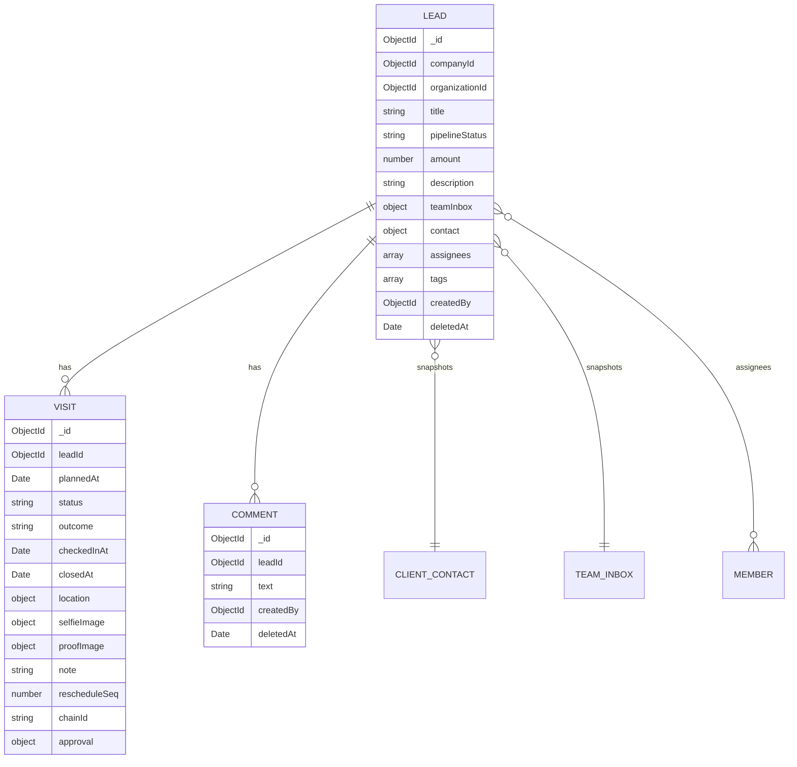
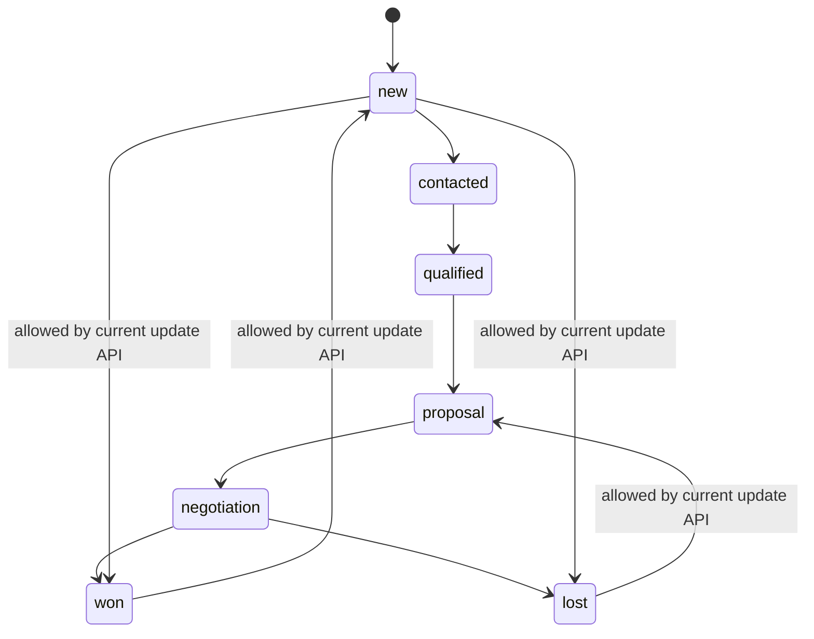
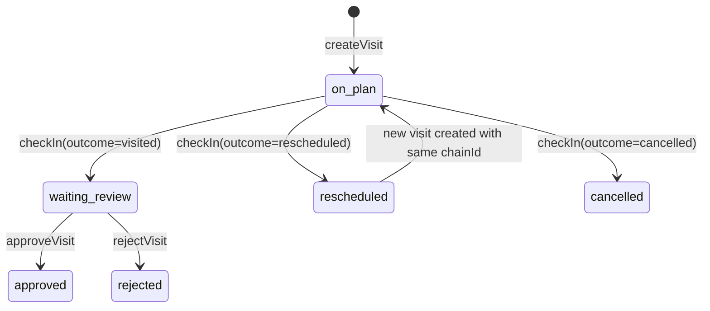
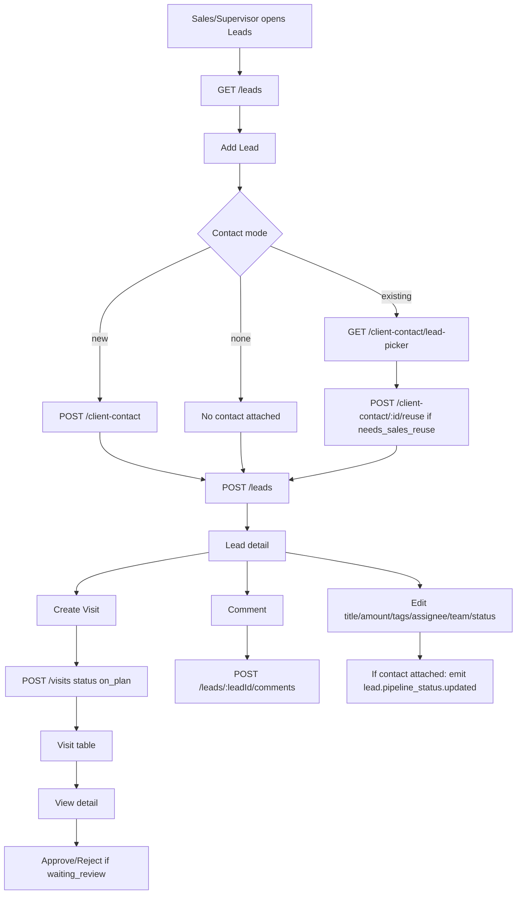

# Assessment Report — Sales SatuInbox (Lead Management)

| Metadata | Nilai |
|---|---|
| Version | 1.1 |
| Date | 2026-09-08 |
| Owner | Analyst |
| Author | Dany Christian |
| Scope | Modul Sales / Lead Management: Lead, Visit, Comment, Contact linkage, RBAC Sales Area Context |
| Decision | REVISE_PRD |

## Executive Summary

- Modul Sales sudah punya implementasi BE/FE untuk lead, assignment, pipeline status, visit planning/check-in/review, comment, dan link ke Client Contact, tetapi tidak punya PRD Sales sebagai source of truth di `PRD/`.
- Current state hanya bisa direkonstruksi dari kode. Ini membuat status pipeline, approval visit, integrasi Contact/Conversation/Ticket, audit trail, dan permission matrix tidak punya acceptance criteria formal.
- Temuan utama: no PRD Sales, alur visit check-in tidak punya entry point FE, comment scoping memakai permission comment yang tidak seeded untuk Sales/Supervisor Sales, approval visit tidak membatasi reviewer ke scope lead, change team mengosongkan assignee walau schema lead mewajibkan minimal 1 assignee.
- UX utama bermasalah: status pipeline bisa loncat bebas, default tab visit berubah berdasarkan status lead tetapi state lokal tidak ikut sync, alur check-in visit tidak punya entry point web yang jelas, dan Sales role diarahkan ke Contacts walau modul Leads adalah inti Sales.
- Overall assessment: modul belum aman untuk dianggap requirements-complete. Perlu PRD Sales formal + patch implementasi pada auth/flow kritis sebelum proceed luas.

### Finding count

| Severity | Count |
|---|---:|
| Critical | 2 |
| High | 7 |
| Medium | 11 |
| Low | 4 |

| Category | Count |
|---|---:|
| REQUIREMENT GAP | 4 |
| DEFECT | 8 |
| SECURITY ISSUE | 3 |
| INCONSISTENCY | 2 |
| DESIGN FLAW | 4 |
| OPERABILITY ISSUE | 2 |
| DATA INTEGRITY ISSUE | 1 |

## Scope

### In scope
- BE sales-service: controllers, services, repositories, schemas, constants, `permission.util.ts`.
- API Gateway Sales REST controllers and DTOs.
- FE sales module: pages, tables, modals, detail cards, hooks/services/stores/types, side nav, proxy, role helper.
- Contact visibility integration where directly used by Add Lead / Attach Contact.

### Out of scope
- Runtime test execution against live DB/API. Tidak dilakukan; laporan ini code-review/static assessment.
- Mobile app Sales flow. Tidak ditemukan/ditelusuri dalam task ini.
- Full Contact/Conversation/Ticket PRD review kecuali integrasi langsung Sales.

## Current-State Reconstruction

### Actors
- Sales: default permissions `lead:read_own`, `lead:create`, `lead:update_own`, `visit:read_own`, `visit:create`, `visit:check_in`, `comment:read`, `comment:create`, `client_contact:read_own`, `client_contact:create`.
- Supervisor Sales: default permissions `lead:read_team`, `lead:create`, `lead:update_team`, `lead:delete`, `lead:change_team_inbox`, `visit:read_team`, `visit:create`, `visit:check_in`, `visit:approve`, `visit:reject`, `comment:read`, `comment:create`, `client_contact:*`, `client_contact:read_team`.
- Admin/Super Admin: wildcard access via `*` or `resource:*`.

Evidence: `libs/common/src/lib/constants/default-permission.constant.ts:155-185`, `:232-248`, `:294-315`; wildcard matcher `apps/sales-service/src/app/utils/permission.util.ts:8-23`.

### Entity model

Evidence: `apps/sales-service/src/app/schemas/lead.schema.ts:120-186`, `visit.schema.ts:85-155`, `comment.schema.ts:14-34`.

### Pipeline status flow

Evidence: enum status exists in `libs/common/src/lib/enums/index.ts:1645-1653`; FE renders all statuses as selectable in `LeadPipelineStatusCell.tsx:76-100`; BE accepts any enum in DTO/schema without transition matrix in `api-gateway/src/app/sales/dtos/lead.dto.ts:204-210` and `sales-service/src/app/services/lead.service.ts:800-803`.

### Visit status flow

Evidence: `VisitRepository.checkInVisited/checkInRescheduled/cancelVisit/approveVisit/rejectVisit` in `visit.repository.ts:61-204`; `VisitService.checkInVisit` enforces only `ON_PLAN` at `visit.service.ts:617-657`.

### End-to-end journey currently implemented

Evidence: FE Add Lead `AddLeadModal.tsx:936-972`, form submit `useAddLeadForm.ts:539-628`, visit section `LeadVisitHistory.tsx:184-224`, comment section `CommentSection.tsx:45-68`; REST hooks `use-manage-sales-api-request.ts:28-106`; BE contact artifacts `lead.service.ts:456-488`, event emit `lead.service.ts:928-944`.

## Findings Table

| ID | Severity | Category | Evidence | Inference | Assumption | Open Question | Recommendation |
|---|---|---|---|---|---|---|---|
| GAP-001 | Critical | REQUIREMENT GAP | Search PRD shows no dedicated Sales PRD; only Role Management mentions Lead permissions (`PRD/Company n people/PRD Setting - Role management.md:565-582`). | Sales module has no source of truth for behavior, AC, state transitions, and integration rules. | Orchestrator's verified fact “TIDAK ADA PRD Sales” is accepted. | Should Sales become its own PRD domain or addendum under Contact/CRM? | Create Full PRD Sales before expanding feature; include lead lifecycle, visit lifecycle, permission matrix, integration contracts, audit/event specs, test traceability. |
| GAP-002 | Critical | SECURITY ISSUE | API Gateway comment passes `permission: user?.permission` (`comment.controller.ts:81-85`, `:118-122`), but Lead/Visit controllers pass `reqCtx.role?.permission` (`lead.controller.ts:68-72`, `visit.controller.ts:66-70`). Sales default has `comment:read/create`, not `comment:read_own/read_team` (`default-permission.constant.ts:232-240`). CommentService validates scope only when `CommentPermission.READ_TEAM/READ_OWN` exists and otherwise returns no scoping constraints (`comment.service.ts:90-95`). | A role with `comment:read` can pass route guard and may read comments for any lead in tenant because service-side scope is skipped. | `user?.permission` shape may differ by middleware, but code inconsistency is confirmed. | Does `PermissionsGuard` normalize `user.permission` into scoped permission before controller? | Align comment userContext with Lead/Visit controllers and make `validateLeadAccess` deny-by-default unless `comment:*`, `read_team`, or `read_own` grants scoped access. Add tests for cross-team/own comment read. |
| GAP-003 | High | SECURITY ISSUE | `approveVisit/rejectVisit` only call `findVisitForReview(id, companyId, organizationId)` and do not call `hasVisitAccess` (`visit.service.ts:899-958`, `:873-894`). Route requires `visit:approve/reject` (`visit.controller.ts:190-208`). | Supervisor Sales with approve/reject can approve any `waiting_review` visit in same tenant/org, not just own team lead. | `organizationId` may reduce blast radius but not team scope. | Should Supervisor Sales approval be team-only or all Sales area? | Reuse `findVisitWithAccessCheck` or enforce team membership in `findVisitForReview`; document reviewer scope in PRD. |
| GAP-004 | High | DEFECT | Lead schema requires at least one assignee (`lead.schema.ts:132-140`), but `changeLeadTeamInbox` writes `{ assignees: [] }` (`lead.service.ts:950-970`). | Team change can create lead state that violates schema/business invariant or fails depending Mongoose update validators. | `TenantRepository.findOneAndUpdateByTenant` validator behavior unknown. | Should changing team require selecting new assignee in one atomic step? | Change API contract to require new assignees for target team, or allow explicit unassigned lead by changing schema/PRD. Do not silently clear assignees. |
| GAP-005 | High | DEFECT | BE has `POST /visits/:id/check-in` (`visit.controller.ts:160-185`) and FE hook `useActionCheckInVisit` (`use-action-check-in-visit.service.ts:11-22`), but search found no component using it; visit table only has “View detail” action (`VisitTableColumns.tsx:56-72`). | Planned visit cannot be completed from current FE Sales UI; approval flow depends on a `waiting_review` state the FE does not expose an entry action for. | There may be another route outside inspected Sales components, but search in omnichannel app found no call. | Is check-in intended for mobile only? If yes, PRD must state web is review-only. | Add explicit web check-in/reschedule/cancel entry or document mobile-only source and show state guidance on web. |
| GAP-006 | High | REQUIREMENT GAP | `VisitService.applyTabFilter` contains comments “WAITING_REVIEW, or REJECTED (?)” and “maybe prospect just means all visits?” (`visit.service.ts:234-240`). FE maps lead `won` to tab `existing`, `lost` to `rejected`, else `prospect` (`LeadVisitHistory.tsx:19-23`). | Visit tabs are implementation guesses, not defined business concepts. Counts can mislead users. | The comments reflect unresolved requirement at code level. | What is “prospect/existing/rejected” supposed to mean: lead lifecycle or visit outcome? | PRD must define visit tab semantics and filters. Rename tabs if they are not business terms. |
| GAP-007 | High | DEFECT | `applyLeadIdIntersect` compares existing `leadId` to new IDs, but on mismatch sets `query['_id'] = new Types.ObjectId()` and leaves existing `leadId` intact (`visit.service.ts:431-449`). | It returns empty by impossible `_id`, but logic is brittle and confusing; if generated `_id` happens to exist, wrong records are still excluded by leadId, yet this is an accidental sentinel. | Collision with generated ObjectId is practically impossible, but code intent is unclear. | None. | Replace sentinel with direct empty return or `$in: []` for `leadId`. |
| GAP-008 | Medium | REQUIREMENT GAP | `updateLead` emits `LEAD_PIPELINE_STATUS_UPDATED` when any update occurs and contact exists (`lead.service.ts:928-944`), not only when pipelineStatus changed. | Contact/conversation consumers may receive redundant status updates for title/tag/amount changes. | Consumer behavior not traced. | Which service consumes `lead.pipeline_status.updated`, and is it idempotent? | Emit only when pipelineStatus changed, include leadId + old/new status + actor in event contract. |
| GAP-009 | Medium | REQUIREMENT GAP | Contact linkage creates `createContactAreaContext` and `createContactReference` for lead (`lead.service.ts:456-488`), but no Sales integration to conversation/ticket view/action appears in sales FE search. | Sales can attach contact but cannot continue journey into conversation/ticket from lead detail. | Conversation/Ticket may show Sales info elsewhere but not confirmed. | Should Sales lead link to contact detail, conversation history, ticket history, or create ticket? | Define cross-module navigation: lead -> contact detail/history -> conversation/ticket, with Sales Area Context guard. |
| GAP-010 | Medium | OPERABILITY ISSUE | Lead/visit/comment schemas have `createdBy/updatedBy/deletedBy` fields, but no domain audit log or status history schema; updates overwrite latest status/assignee/team (`lead.schema.ts:168-184`, `visit.schema.ts:139-155`, `comment.schema.ts:21-34`). | Sales lifecycle has no durable audit trail for pipeline moves, assignee changes, team transfer, approval/reject decisions beyond latest fields. | Generic Mongo timestamps are not sufficient for business audit. | Is central audit-service required for Sales? | Add audit/event history requirements before compliance-sensitive rollout. |
| GAP-011 | Medium | DEFECT | Create Lead DTO allows `@MinLength(1)` title (`lead.dto.ts:136-140`) while Lead schema requires `minlength: 3` (`lead.schema.ts:121-122`) and FE uses `VALIDATION_LIMITS.LEAD_TITLE.MIN` (`useAddLeadForm.ts:43-52`). | Validation messages and rejection layer can differ; short title may pass API Gateway then fail service/Mongo. | `VALIDATION_LIMITS.LEAD_TITLE.MIN` likely 3, but not read here. | What is official min title length? | Align FE, API Gateway DTO, and schema. Use the strict rule at boundary. |
| GAP-012 | Medium | DATA INTEGRITY ISSUE | No unique/index constraint prevents duplicate lead for same contact/team/status; LeadSchema indexes contact but not unique (`lead.schema.ts:206-210`). Add Lead duplicate checks only for contact duplicate, not lead duplicate (`useAddLeadForm.ts:504-536`, `:576-587`). | Users can create multiple active leads for same contact/team without documented rule. | Multiple leads per contact may be intended for repeat opportunities, but status/amount semantics undefined. | Can one contact have multiple open leads? | Define duplicate lead policy: allow multi-opportunity with reason, or block active duplicate per contact/team. |
| GAP-013 | Medium | SECURITY ISSUE | `LeadInfoCard` always renders “Ubah contact/Tambahkan contact” without permission check (`LeadInfoCard.tsx:57-63`); update call still goes through BE permission (`LeadAttachContactModal.tsx:910-912`). | Users without update rights see an action that will fail after work; FE permission model inconsistent. | Backend protects mutation. | Which roles can attach/change contact? | Hide/disable contact attach button based on `lead:update/update_own/update_team` and contact permission; show reason tooltip. |
| GAP-014 | Medium | INCONSISTENCY | Role Management PRD says Lead visibility uses `lead_access_mode = all/team/own` mapped to `lead:read/read_team/read_own` (`PRD/Company n people/PRD Setting - Role management.md:576-582`); implementation uses raw permission constants and role-name Sales routing. | Visibility source of truth split between role permission keys and role name heuristics. | Role Management PRD may be ahead of implementation. | Is `lead_access_mode` persisted anywhere? | Either implement `lead_access_mode` or update PRD to reflect permission-key model. Avoid role-name string heuristics for access. |
| UX-001 | High | DESIGN FLAW | FE lists every pipeline status as direct selectable option (`LeadPipelineStatusCell.tsx:76-100`) and BE has no transition guard (`lead.service.ts:800-803`). | User can jump `new` to `won/lost` or reopen terminal statuses without reason; journey has no next-step guidance. | Current product may want flexible CRM, but no PRD confirms. | Are `won/lost` terminal? Is lost reason required? | Define allowed/forbidden transitions, reason requirements, and confirmations for terminal changes. |
| UX-002 | High | DEFECT | Visit default tab is derived once from lead status in `useState(defaultTab)` (`LeadVisitHistory.tsx:31-37`), but not synced when `lead.pipelineStatus` changes. | After changing status to won/lost on detail page, Visit History can stay on old “prospect” tab until remount. | React state behavior confirmed. | None. | Add effect to sync activeTab on status change or keep activeTab derived unless user manually overrides. |
| UX-003 | Low | DEFECT | Create Visit success invalidates `[FETCH_VISITS]` (`CreateVisitModal.tsx:66-68`), sementara query list visit memang memakai prefix key `[FETCH_VISITS, 'paginated', page, limit, params]` (`use-get-visits.service.ts:26-30`) dan tidak ditemukan consumer FE untuk `lead.visits`/`visitCount` di modul Sales yang ditinjau. | Invalidasi list visit kemungkinan sudah cukup untuk UI saat ini; gap utama lebih ke kontrak cache lead detail yang tidak eksplisit, bukan stale UI yang sudah terbukti. | Review ini berbasis static code; tidak ada runtime trace cache. | Apakah lead detail nantinya akan menampilkan counter/summary visit dari cache lead? | Turunkan prioritas. Jika nanti lead detail menambah summary visit, invalidasi juga `FETCH_LEAD_BY_ID` atau jadikan semua visit view bersumber dari query visit yang sama. |
| UX-004 | Medium | DESIGN FLAW | No FE usage of check-in action found; Visit detail modal only approves/rejects waiting review (`VisitDetailModal.tsx:308-310`), visit table only “View detail” (`VisitTableColumns.tsx:56-72`). | User sees planned visit but no obvious completion/reschedule/cancel action, causing dead-end. | If mobile-only check-in exists, web still lacks explanatory copy. | Is field visit intended to be web or mobile? | Add CTA/state copy: “Check-in via mobile app” or web check-in form. |
| UX-005 | Medium | INCONSISTENCY | Sales role home path is Contacts (`proxy.ts:42-57`), while side nav limits Sales role to Contacts and Leads (`SideNavLists.tsx:121-127`). | Sales users land in Contacts, not Leads, even though Lead Management is the Sales module. | Product might intentionally start from Contacts; undocumented. | What is primary Sales landing page? | If Sales lead pipeline is primary, set `salesHomePagePath` to `/leads`; otherwise PRD must define contact-first journey. |
| UX-006 | Medium | DEFECT | Comment submit clears content and invalidates comments only on success but has no `onError` toast (`CommentSection.tsx:54-67`). | Failed comment post can silently fail depending mutation default behavior; user lacks local recovery feedback. | `handleThrowServiceError` may surface elsewhere, but no component feedback. | Does global mutation boundary show errors? | Add local error toast and preserve draft on failure. |
| UX-007 | Medium | DEFECT | Description blur mutates without permission check and without error/success handling (`DescriptionCard.tsx:18-21`, `:31-37`). | Read-only users may edit locally, blur, then server rejects; text may snap back later with no explanation. | Backend restricts update. | Which roles can edit description? | Disable textarea when no update permission; show pending/error state. |
| UX-008 | Low | DESIGN FLAW | Lead filter “Clear all filters” intentionally does not clear `pipelineStatus` comment (`LeadFilterList.tsx:61-68`), while `hasFilters` includes `pipelineStatus` (`:15`). | User can click clear all but status tab remains filtering; label “clear all” is misleading. | Comment shows uncertainty. | Should status tabs be treated as filters? | Either clear pipeline status or rename action to “Clear filters except status”. |
| UX-009 | Low | DESIGN FLAW | `isSalesRole` uses role name contains `SALES` or `SELLER` (`helpers/role.ts:9-15`). | Navigation/access UX can change because of role naming, not explicit permission/scope. | Backend still enforces API permissions. | Are custom role names user-editable? | Use explicit permission/contactScope flags for Sales navigation routing. |
| UX-010 | Low | OPERABILITY ISSUE | Many Sales UI labels are hardcoded English/Indonesian mix (`LeadInfoCard.tsx:24-34`, `LeadTableColumns.tsx:49-117`, `VisitTableColumns.tsx:70-120`) while profile default language is Indonesian (`satuinbox.yml:17`). | UX copy inconsistent and harder to localize/test. | Translation namespace may be incomplete. | Which language is required for Sales GA? | Move Sales labels to i18n namespace and standardize Bahasa Indonesia. |

## Detailed Findings

### GAP-001 Critical REQUIREMENT GAP — PRD Sales tidak ada
**Status:** Confirmed  
**Location:** `PRD/`, role-management PRD only  
**Scenario:** Product ships Sales lead module with lead/visit/comment/contact behavior, but PRD corpus lacks Sales source of truth.  
**Expected:** Full PRD defines actors, flows, validation, state machines, permissions, integration, audit, test scenarios.  
**Actual / Failure Mode:** Only code and role-management permission appendix define behavior.  
**Root Cause:** Implementation ahead of PRD corpus.  
**Evidence:** No PRD Sales found in search; Lead permission references only in `PRD/Company n people/PRD Setting - Role management.md:565-582`.  
**Impact:** QA cannot distinguish intended flexible CRM behavior from defects; future patches will be inconsistent.  
**Blast Radius:** Sales module, Contact area context, role management, support/training, QA/UAT.  
**Recommendation:** Create `PRD/Sales/PRD Sales - Lead Management.md` before broad rollout.  
**Suggested Test:** PRD traceability review: every endpoint/component maps to FR/AC/test case.

### GAP-002 Critical SECURITY ISSUE — Comment scoping bisa bypass lead visibility
**Status:** Confirmed code risk  
**Location:** API Gateway CommentController + CommentService  
**Scenario:** User with `comment:read` calls `GET /leads/:leadId/comments` for a lead outside own/team scope.  
**Expected:** Comment access must follow same lead access scope.  
**Actual / Failure Mode:** Service checks `comment:read_team/read_own`; if both absent, returns without scoping. Default Sales/Supervisor Sales have `comment:read`, not scoped read keys.  
**Root Cause:** Route guard permission and service-scope permission mismatch; controller passes a different permission object than Lead/Visit controllers.  
**Evidence:** `comment.controller.ts:81-85`, `:118-122`; `comment.service.ts:90-95`; `default-permission.constant.ts:232-240`, `:294-306`.  
**Impact:** Possible cross-lead comment visibility inside tenant.  
**Blast Radius:** Lead comments, Sales privacy, tenant-internal data separation.  
**Recommendation:** Deny by default unless wildcard/all; map `comment:read` to same scoped lead visibility or seed scoped comment permissions.  
**Suggested Test:** Sales A assigned Lead A cannot read comments of Lead B; Supervisor Sales Team A cannot read Team B comments.

### GAP-003 High SECURITY ISSUE — Approval/reject visit tidak scoped ke team lead
**Status:** Confirmed code risk  
**Location:** `VisitService.approveVisit`, `rejectVisit`  
**Scenario:** Supervisor Sales with `visit:approve` knows a waiting-review visit ID from another team.  
**Expected:** Approval limited to visits under accessible team/area.  
**Actual / Failure Mode:** `findVisitForReview` only checks tenant/org/status, not lead/team access.  
**Root Cause:** Review path bypasses `hasVisitAccess`.  
**Evidence:** `visit.service.ts:873-894`, `:899-958`; route permissions `visit.controller.ts:190-208`.  
**Impact:** Cross-team approval/rejection.  
**Blast Radius:** Sales visit approvals, supervisor accountability.  
**Recommendation:** Use access-checked finder for approve/reject and define scope in PRD.  
**Suggested Test:** Supervisor Sales Team A reject Team B waiting-review visit must return 403/404.

### GAP-004 High DEFECT — Change team mengosongkan assignee melawan invariant schema
**Status:** Confirmed code inconsistency  
**Location:** Lead schema + `changeLeadTeamInbox`  
**Scenario:** Supervisor changes lead team inbox.  
**Expected:** Lead remains assigned to at least one valid member of target team, or unassigned state is explicitly supported.  
**Actual / Failure Mode:** Service writes `assignees: []`; schema validator says at least one assignee required.  
**Root Cause:** API changes team and assignment as two separate operations without transitional state design.  
**Evidence:** `lead.schema.ts:132-140`; `lead.service.ts:950-970`; FE modal only submits team id `LeadTeamCell.tsx:126-130`.  
**Impact:** Invalid/unusable lead state or update failure.  
**Blast Radius:** Lead transfer, Sales team routing.  
**Recommendation:** Make team transfer atomic with target assignee selection or define unassigned lead in schema + UI.  
**Suggested Test:** Change team must require/recompute assignee and reject target team without assignee.

### GAP-005 High DEFECT — FE tidak punya check-in entry point
**Status:** Confirmed by code search  
**Location:** Sales FE visits  
**Scenario:** User creates visit, then needs to mark visited/rescheduled/cancelled.  
**Expected:** UI exposes check-in/reschedule/cancel or clearly says action is mobile-only.  
**Actual / Failure Mode:** FE hook exists but no component uses it; table only opens detail; detail only approves/rejects waiting-review.  
**Root Cause:** BE workflow implemented without FE completion surface.  
**Evidence:** `use-action-check-in-visit.service.ts:11-22`; no usage found; `VisitTableColumns.tsx:56-72`; `VisitDetailModal.tsx:308-310`.  
**Impact:** Web journey dead-end; approval queue cannot be populated from web.  
**Blast Radius:** Field visit management.  
**Recommendation:** Add check-in UX or document mobile-only dependency in PRD/UI.  
**Suggested Test:** From an `on_plan` visit, user can complete one of visited/rescheduled/cancelled paths.

### GAP-006 High REQUIREMENT GAP — Semantik tab visit masih tebakan implementasi
**Status:** Confirmed from code comments and FE mapping  
**Location:** `VisitService.applyTabFilter`, `LeadVisitHistory`  
**Scenario:** User berpindah tab `prospect`, `existing`, `rejected` untuk membaca bucket visit sesuai lifecycle lead.  
**Expected:** Tab visit punya definisi bisnis eksplisit: basis filter apa, kapan visit masuk/keluar tab, dan relasinya dengan lead status maupun outcome visit.  
**Actual / Failure Mode:** BE masih punya komentar ragu “WAITING_REVIEW, or REJECTED (?)” dan “maybe prospect just means all visits?”, sedangkan FE memetakan `won -> existing`, `lost -> rejected`, selain itu `prospect`.  
**Root Cause:** Tidak ada PRD Sales yang mendefinisikan taxonomy tab visit; naming FE dan query BE tumbuh dari asumsi implementasi.  
**Evidence:** `visit.service.ts:234-240`; `LeadVisitHistory.tsx:19-23`.  
**Impact:** User bisa salah membaca bucket visit, count per tab berisiko tidak merepresentasikan kondisi bisnis yang sama antar layar dan report.  
**Blast Radius:** Visit list, summary count, coaching/supervisor review, future reporting.  
**Recommendation:** Definisikan semantik tab di PRD lalu samakan label/filter FE-BE; bila tab sebenarnya berbasis lead status, pindahkan istilah itu ke level lead, bukan visit.  
**Suggested Test:** Snapshot test/query matrix untuk setiap kombinasi lead status + visit status memastikan tab membership konsisten.

### GAP-007 High DEFECT — Intersect leadId pakai sentinel `_id` membingungkan dan rapuh
**Status:** Confirmed code smell with functional risk rendah tapi nyata  
**Location:** `VisitService.applyLeadIdIntersect`  
**Scenario:** Query visit sudah punya `leadId`, lalu layer berikutnya menambahkan daftar leadId hasil filter lain yang tidak overlap.  
**Expected:** Sistem mengembalikan empty result dengan ekspresi yang eksplisit dan mudah dibaca.  
**Actual / Failure Mode:** Service menambah `query['_id'] = new Types.ObjectId()` saat tidak ada irisan dan tetap meninggalkan `leadId` lama. Hasil memang kosong secara praktis, tetapi karena sentinel `_id`, bukan karena intent query yang jelas.  
**Root Cause:** Shortcut implementasi untuk memaksa no-result tanpa contract empty-query yang eksplisit.  
**Evidence:** `visit.service.ts:431-449`.  
**Impact:** Sulit diaudit/debug, rawan disalahpahami saat refactor, dan menyembunyikan intent business rule “no intersection = empty result”.  
**Blast Radius:** Visit filtering path saat beberapa constraint lead disatukan.  
**Recommendation:** Ganti dengan early return empty list / short-circuit result / `leadId: { $in: [] }` agar intent eksplisit.  
**Suggested Test:** Filter A + filter B tanpa overlap harus return 0 result tanpa memodifikasi `_id` sentinel tersembunyi.

### UX-001 High DESIGN FLAW — Pipeline status bebas loncat tanpa guard/reason
**Status:** Confirmed  
**Location:** FE status cell + BE update  
**Scenario:** User changes `new` directly to `won`, then back to `new`, or `lost` to `proposal`.  
**Expected:** Status transition rules protect lifecycle and terminal states.  
**Actual / Failure Mode:** Any enum status is accepted if user has update permission.  
**Root Cause:** No Sales PRD state machine.  
**Evidence:** `LeadPipelineStatusCell.tsx:76-100`; `lead.service.ts:800-803`; enum `index.ts:1645-1653`.  
**Impact:** Pipeline reporting unreliable; users can skip required qualification/visit steps.  
**Blast Radius:** Lead analytics, forecast, sales ops.  
**Recommendation:** Define transition matrix and require reason for terminal/status regression.  
**Suggested Test:** Invalid transition returns business error; valid transition succeeds and logs history.

### UX-002 High DEFECT — Visit tab tidak sync setelah status lead berubah
**Status:** Confirmed  
**Location:** `LeadVisitHistory`  
**Scenario:** User opens detail on non-terminal lead, tab defaults to `prospect`, then changes pipeline to `won`.  
**Expected:** Visit History reflects `existing` default or user sees explicit tab transition.  
**Actual / Failure Mode:** `useState(defaultTab)` does not update after lead status changes.  
**Root Cause:** Derived state initialized once.  
**Evidence:** `LeadVisitHistory.tsx:31-37`.  
**Impact:** User sees stale visit category after status change.  
**Blast Radius:** Lead detail UX.  
**Recommendation:** Sync activeTab on lead status change or avoid local derived state.  
**Suggested Test:** Change lead to won and assert Visit History active tab becomes `existing` or remains with visible manual override rule.

## User Journey Analysis

### Journey 1 — Create lead
**Current flow:** Leads page -> Add Lead -> choose/create/no contact -> select team/assignee -> save -> redirect to detail.  
**Good:** Duplicate contact handling exists, Sales role auto-filters teams with `isMyOwnTeam=true`, current Sales member can auto-select.  
**Bad flow:** Existing contact picker has area/visibility filters whose semantics are not defined in Sales PRD; “No contacts yet” can create lead without contact, but downstream integration then loses contact-based conversation/ticket context.  
**Evidence:** `AddLeadModal.tsx:757-818`, `useAddLeadForm.ts:539-628`, `LeadInfoCard.tsx:38-44`.  
**Assumption:** Contact-less lead is intended; otherwise this is a requirement bug.  
**Open question:** Is a lead without contact valid for Sales process?

### Journey 2 — Assign / change team
**Current flow:** Update assignees inline; change team via separate team modal.  
**Bad flow:** Team change clears assignees in BE; FE does not ask for target assignee in same flow. This creates a gap between transfer and reassignment.  
**Evidence:** `LeadTeamCell.tsx:62-130`; `lead.service.ts:950-970`.  
**Open question:** Should lead have unassigned state?

### Journey 3 — Visit
**Current flow:** Create Visit -> visit table -> view detail -> approve/reject only if waiting review.  
**Bad flow:** No visible check-in/reschedule/cancel action on web, so user cannot progress an `on_plan` visit.  
**Evidence:** `CreateVisitModal.tsx:48-78`; `VisitTableColumns.tsx:56-72`; `VisitDetailModal.tsx:308-310`.  
**Open question:** Is check-in a mobile-only flow?

### Journey 4 — Comment
**Current flow:** Lead detail comment box -> enter text -> POST comment -> invalidate comments.  
**Bad flow:** No local error toast, no visible permission-disabled state, and service scope mismatch creates security risk.  
**Evidence:** `CommentSection.tsx:54-67`; `comment.service.ts:90-95`.  
**Open question:** Should comment permission be independent from lead read permission?

### Journey 5 — Link to Contact / Conversation / Ticket
**Current flow:** Lead can attach contact and create Sales area context/reference.  
**Bad flow:** Lead detail shows contact fields but no direct open contact detail/history/conversation/ticket action.  
**Evidence:** `LeadInfoCard.tsx:22-35`, no conversation/ticket navigation found in Sales components.  
**Open question:** Which downstream action is required after lead won/lost/contacted?

## Risks

| Risk | Severity | Description | Mitigation |
|---|---|---|---|
| R-001 | Critical | Sales has no PRD source of truth; future fixes may encode guesses. | Write Full PRD Sales before feature expansion. |
| R-002 | Critical | Comment and visit approval scoping can leak/control cross-team Sales data. | Patch auth scope, add regression tests. |
| R-003 | High | Pipeline status lacks transition matrix; reporting/forecast unreliable. | Define and enforce state machine + audit history. |
| R-004 | High | Visit workflow dead-end on web if no mobile dependency is declared. | Add check-in surface or explicit mobile-only dependency. |
| R-005 | Medium | Contact/Conversation/Ticket integrations are partial; lead context may not travel into service operations. | Define cross-module links/events and role context constraints. |

## Decision

**Decision: REVISE_PRD**

Rationale: implementasi sudah ada, tetapi acceptance criteria dan state machine tidak terdokumentasi. Dua security/auth-scope finding dan satu dead-end visit flow perlu ditutup sebelum modul dinyatakan ready. Tidak perlu `HOLD_FEATURE` total jika scope saat ini hanya internal/limited, tetapi tidak layak `PROCEED` tanpa PRD dan patch.

## Next Actions

1. Buat PRD Sales Full: Lead entity, Contact linkage, pipeline state machine, Visit state machine, Comment policy, RBAC matrix, audit trail, cross-module navigation, test scenarios.
2. Patch security first: comment scope deny-by-default; approve/reject visit enforce team/lead access.
3. Decide visit check-in ownership: web flow vs mobile-only. Jika mobile-only, FE web wajib tampilkan state copy/dependency.
4. Fix team transfer contract: require target assignee or formal unassigned state.
5. Add Sales audit/history: pipeline changes, assignee changes, team transfer, visit approval/reject, contact attach/reuse.
6. Align Sales landing and navigation: decide Contacts-first vs Leads-first.
7. Add regression tests for own/team/all Sales visibility across leads, visits, comments, contacts.

## Open Questions

| ID | Question | Owner |
|---|---|---|
| OQ-001 | Apakah Lead boleh dibuat tanpa Contact? | PM |
| OQ-002 | Apakah `won/lost` terminal, dan apakah butuh reason? | PM |
| OQ-003 | Apakah visit check-in dilakukan di web, mobile, atau keduanya? | PM/Engineering |
| OQ-004 | Apakah Supervisor Sales approve/reject hanya team sendiri atau semua Sales area? | PM/Engineering |
| OQ-005 | Apakah satu contact boleh punya lebih dari satu active lead dalam team yang sama? | PM |
| OQ-006 | Apa required link dari lead ke Contact/Conversation/Ticket setelah lead dibuat/menang/kalah? | PM |
| OQ-007 | Apakah `lead_access_mode` di Role PRD sudah diimplementasi atau hanya future design? | Engineering |

## Change History

| Version | Date | Author | Changes |
|---|---|---|---|
| 1.1 | 2026-09-08 | Dany Christian | Reviewer correction: synchronized finding counts, downgraded/regrounded UX-003, and added detail blocks for GAP-006/GAP-007. |
| 1.0 | 2026-09-08 | Dany Christian | Initial Sales module assessment from BE/FE code and PRD corpus scan. |
