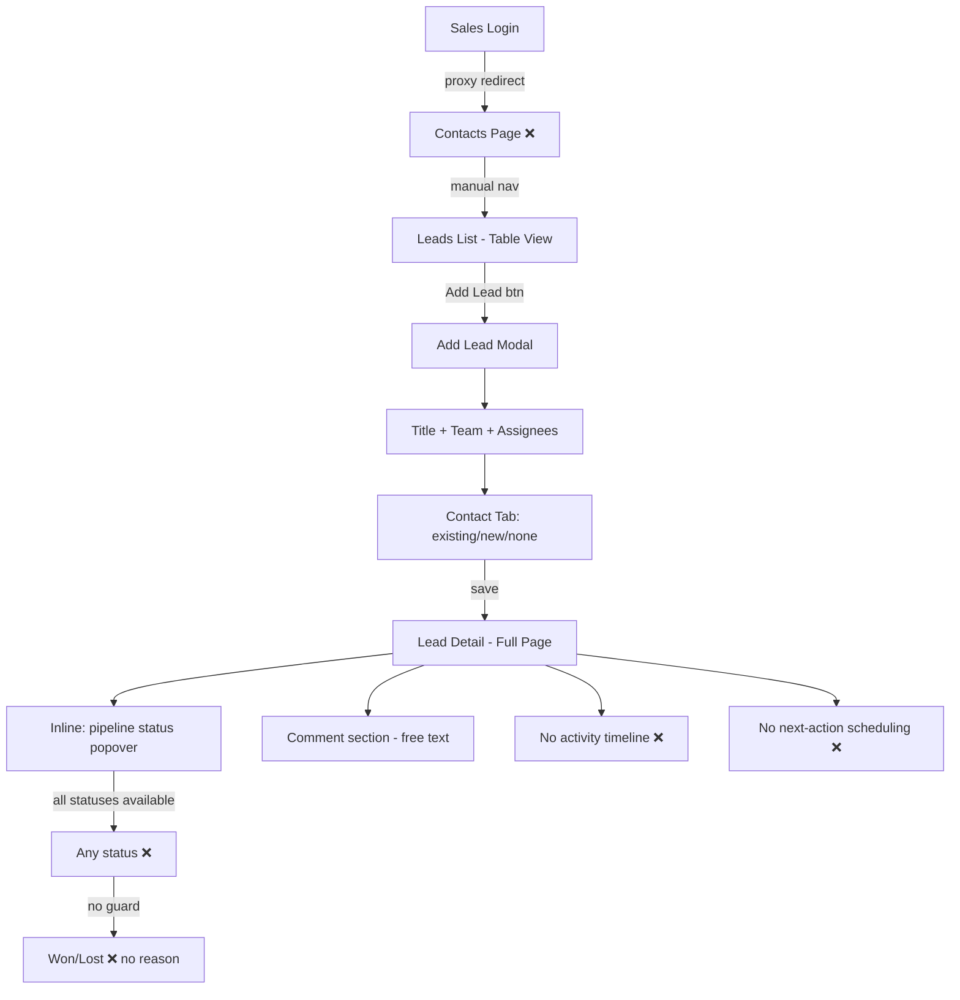
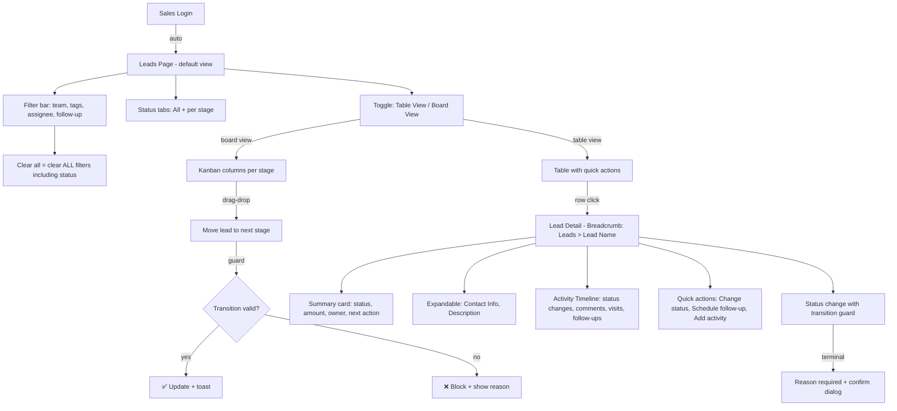
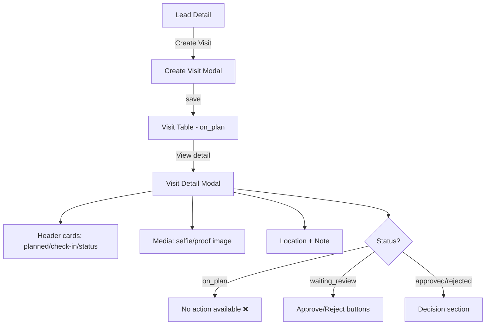
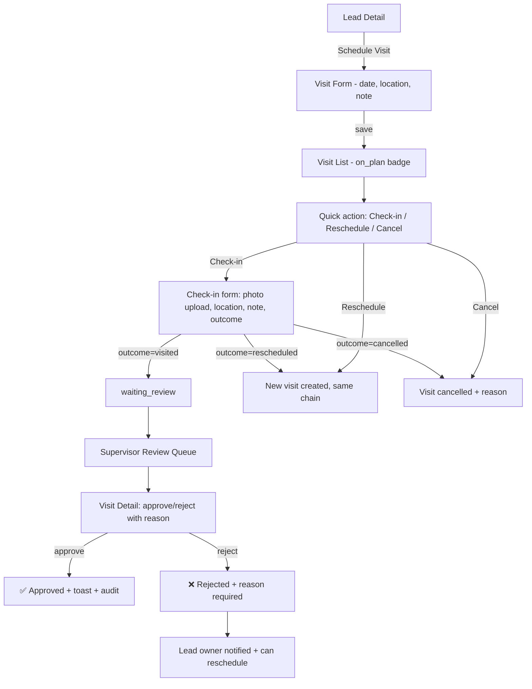
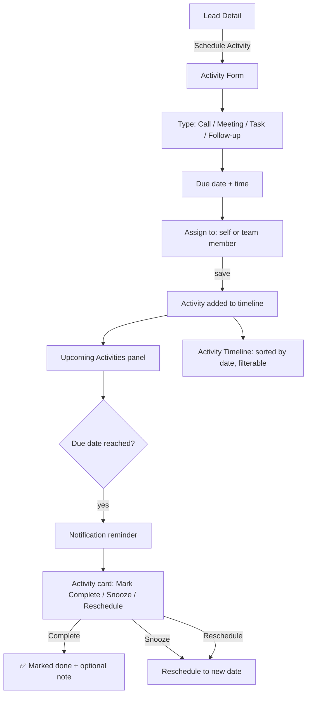

# Assessment Report — UI & Flow Sales SatuInbox

| Metadata | Nilai |
|---|---|
| Version | 1.0 |
| Date | 2026-09-08 |
| Owner | Analyst |
| Author | Dany Christian |
| Scope | Modul Sales / Lead Management: UI pattern, interaction flow, navigation, form UX, feedback, data entry, accessibility, user journey |
| Decision | REVISE_PRD |
| Basis | Prior audit v1.1 + market benchmark v1.0 + 18 sumber eksternal UI/UX + analisis kode FE |

## Executive Summary

- Laporan ini adalah lapisan ketiga: setelah QA assessment v1.1 (defect internal) dan market benchmark v1.0 (gap model CRM), laporan ini memfokuskan pada **UI pattern, interaction design, dan user flow** dari modul Sales SatuInbox — bagaimana user berinteraksi, di mana mereka bingung, dan apa yang seharusnya terjadi secara seamless.
- Analisis kode FE menunjukkan modul Sales menggunakan **table-only view** tanpa opsi board/kanban, **modal penuh** untuk Add Lead, **inline editing terbatas** (hanya pipeline status dan description), **tanpa breadcrumb navigation**, **tanpa loading skeleton**, **tanpa feedback toast di beberapa mutasi kritis**, dan **mixed language** (EN/ID) di label UI.
- Best practice dari 10+ sumber eksternal yang valid [1][2][3][4][5][6][7][8][9][10] menunjukkan: (a) pipeline visualization harus mendukung board view dengan drag-drop [6][10], (b) progressive disclosure wajib untuk form dan detail [1], (c) inline validation harus real-time bukan submit-time [2], (d) breadcrumbs untuk navigasi kedalaman [4], (e) activity timeline dengan next-action terjadwal [5][8], (f) empty states yang mengarahkan aksi [7], (g) toast/feedback untuk setiap mutasi [7].
- **Temuan kritis**: 3 P0 (dead-end visit flow di web, pipeline free-jump tanpa guard di UI, sales landing salah), 6 P1 (no board view, no breadcrumb, no loading skeleton, inconsistent feedback, form validation timing, filter UX misleading), 5 P2 (mixed language, no keyboard shortcuts, no progressive disclosure di detail, no activity timeline, no empty state guidance).
- **Gap total**: 14 temuan UI/Flow (UFG-001 sampai UFG-014) — semuanya baru, tidak duplikat dari v1.1 atau v1.0.

## Sumber & Metode

### Metode

1. **Baca 18 file sumber eksternal** di `_sources/ui-flow/` — ekstraksi best practice UI pattern, interaction design, dan UX principle.
2. **Validasi konten sumber**: dari 18 file, 11 berisi konten substantif valid, 7 lainnya 404/shell tanpa konten. Sumber valid dipakai sebagai dasar benchmark.
3. **Analisis kode FE** — baca komponen kunci Sales module: pages, molecules/sales/*, modal/*, detail/*, table/*, proxy.ts.
4. **Bangun best practice model** dari sumber valid, kelompokkan per capability.
5. **Bandingkan** best practice vs current UI SatuInbox → Gap Matrix (UFG-XXX).
6. **Susun User Journey Redesign** untuk 3 journey kunci dengan diagram Mermaid.
7. **Tanpa runtime test claim** — static analysis + external benchmark.

### Sumber valid (dipakai)

| ID | Sumber | URL | Tipe | Konten utama |
|---|---|---|---|---|
| [1] | NNG — Progressive Disclosure | nngroup.com/articles/progressive-disclosure | UX Article | Defer advanced features to secondary screen; show only important options initially; improves learnability, efficiency, error rate |
| [2] | NNG — Form Validation Guidelines | nngroup.com/articles/errors-forms-design-guidelines | UX Article | Inline validation whenever possible; error messages next to fields; color differentiation; sparing use of modals for errors |
| [3] | NNG — Drag-and-Drop Design | nngroup.com/articles/drag-drop | UX Article | Clear signifiers; grab-handle icons; feedback at all stages; magnetism on drop zones; Trello example |
| [4] | NNG — Breadcrumbs | nngroup.com/articles/breadcrumbs | UX Article | Wayfinding; hierarchical navigation; include current page; start with homepage; mobile truncation |
| [5] | NNG — 10 Usability Heuristics | nngroup.com/articles/ten-usability-heuristics | UX Framework | Visibility of system status; user control & freedom; consistency; error prevention; recognition over recall |
| [6] | Pipedrive — Leads Inbox | support.pipedrive.com/en/article/leads-inbox | Product Doc | Unqualified leads in Leads Inbox; convert to deal; lead must link to contact; filter/sort/custom columns |
| [7] | Pipedrive — Lead Qualification | pipedrive.com/en/blog/sales-lead-qualification | Blog | Criteria: pain/budget/authority/timeline/ICP; scoring frameworks; disqualify vs recycle |
| [8] | Pipedrive — Activities | support.pipedrive.com/en/article/activities | Product Doc | Activities = calls/meetings/tasks/emails; link to deals/leads/contacts; multiple entry points; calendar view |
| [9] | HubSpot — Manage Leads | knowledge.hubspot.com/prospecting/manage-leads-in-the-prospecting-workspace | Product Doc | Owner requirement; unassigned visible in index; board view beta; saved views; Super Admin for post-terminal edit |
| [10] | HubSpot — Object Pipelines | knowledge.hubspot.com/object-settings/set-up-and-customize-your-deal-pipelines-and-deal-stages | Product Doc | Pipelines visualize processes through stages; pipeline rules control editing access; probability per deal stage |
| [11] | HubSpot — Sales Pipeline Blog | blog.hubspot.com/sales/sales-pipeline | Blog | Exit criteria per stage; log why lost; next step wajib; follow-up cadence; forecast from pipeline position |

### Sumber tidak valid (404/shell — tidak dipakai)

HubSpot Board View (404), HubSpot Leads Index (404), HubSpot Tasks (404), Pipedrive Pipeline Mgmt (404), Miro Sales Pipeline (404), Smashing CRM UX (search page only), UXPlanet CRM (search page only), NNG Kanban Boards (404).

## Best Practice Model (cited)

### 1. Pipeline Visualization

> "Pipelines help visualize your processes through stages, which are steps that signal where a record is in a process." [10]

- CRM terbaik mendukung **table view DAN board/kanban view** untuk pipeline. Board view memungkinkan drag-drop antar stage, memberikan visual snapshot posisi deal [9][10].
- Tiap card di board harus menampilkan: judul, amount, owner, stage indicator, quick action [6][9].
- **Table view** tetap diperlukan untuk bulk operations, sorting, filtering detail [6].

### 2. Progressive Disclosure

> "Initially, show users only a few of the most important options. Offer a larger set of specialized options upon request." [1]

- Form dan detail page harus **reveal complexity gradually**: field wajib duluan, field opsional di-expandable section [1].
- **Benefit**: novice users avoid mistakes, advanced users save time, learnability dan efficiency meningkat [1].
- Detail page: tampilkan summary card di level atas, expand sections untuk detail lengkap [1].

### 3. Inline Validation

> "All validation should be inline; that is, as soon as the user has finished filling in a field, an indicator should appear nearby if the field contains an error." [2]

- Error messages **next to fields**, bukan di summary terpisah [2].
- **Color differentiation** (red/orange) + iconography untuk scanning cepat [2].
- Use modals **sparingly** — modals disruptive dan memutus flow [2].
- **Don't validate before input is complete** — tunggu blur/focus-out [2].

### 4. Breadcrumb Navigation

> "Breadcrumbs are an important navigational element that supports wayfinding — making users aware of their current location within the hierarchical structure." [4]

- Wajib untuk **deep pages** (detail lead, detail visit) — user harus tahu di mana mereka dalam hierarchy [4].
- Current page = last item, **not a link** [4].
- On mobile: consider shortening to last level only [4].

### 5. System Status & Feedback

> "The design should always keep users informed about what is going on, through appropriate feedback within a reasonable amount of time." [5]

- Setiap mutasi (create, update, delete, status change) harus memberi **visible feedback** (toast, animation, state change) [5][7].
- Loading states harus **skeleton/progress indicator**, bukan text "Loading..." [5].

### 6. Activity & Next Action

> "If it isn't written down with an owner and a date, it didn't happen." [11]

- Pipeline sehat = setiap lead/deal punya **next step terjadwal** [11][8].
- Activities bisa dibuat dari **multiple entry points**: pipeline view card, detail view, calendar, list view [8].
- Follow-up cadence eksplisit; deal tanpa scheduled next step = tidak sehat [11].

### 7. Drag-Drop Interaction

> "Clear signifiers and clear feedback at all stages of the interaction make drag-and-drop discoverable and easy to use." [3]

- Grab-handle icons atau cursor changes sebagai signifier [3].
- Feedback saat grab: outline, drop shadow, visual offset [3].
- Drop zone **magnetism**: expand size, change color, preview snap position [3].
- **Alternative interaction** wajib ada untuk accessibility [3].

## Current UI Analysis (Evidence from Code)

### A. Layout Pattern

| Aspek | Current State | Evidence |
|---|---|---|
| Leads list view | **Table-only**. Tidak ada board/kanban view. | `ManageLeadsPage.tsx:119-128` — Table component dengan columns dan row click → detail |
| Pipeline status filter | **Tabs** horizontal di atas table. Semua enum status ditampilkan. | `ManageLeadsPage.tsx:44-56` — Tabs/TabsList/TabsTrigger dengan Object.values(LeadPipelineStatusEnum) |
| Detail page layout | **Single column centered** (max-w-300), 2-col grid untuk info cards. Back button only, no breadcrumb. | `ManageLeadDetailPage.tsx:48-68` — flex col, grid-cols-2 untuk LeadInfoCard+SalesDetailCard |
| Add Lead | **Full modal dialog** (max-w-180) dengan tabs (existing/new/none contact). | `AddLeadModal.tsx:950-975` — Dialog/DialogContent |
| Visit history | **Table** di bagian bawah detail page. Tab-based filter (prospect/existing/rejected). | `LeadVisitHistory.tsx:200-225` — Table dengan height 100 |

### B. Navigation Flow

| Aspek | Current State | Evidence |
|---|---|---|
| Sales landing page | **Contacts**, bukan Leads. | `proxy.ts:44` — `salesHomePagePath = (locale) => /${locale}/contacts` |
| List → Detail | Row click navigates ke `/leads/${id}` (full page navigation). | `ManageLeadsPage.tsx:127` — `router.push(/leads/${row.id})` |
| Detail → Back | `router.back()` via arrow button. No breadcrumb. | `LeadDetailHeader.tsx:13` — `router.back()` |
| Detail title | Hardcoded "Detail Lead" — tidak menampilkan nama lead. | `LeadDetailHeader.tsx:16` |
| Side nav | Sales role hanya lihat Contacts dan Leads. | Prior audit UX-005, `SideNavLists.tsx:121-127` |

### C. Modal vs Inline

| Action | Current | Pattern |
|---|---|---|
| Add Lead | Modal (penuh) | ✅ OK untuk complex form, tapi form terlalu panjang tanpa progressive disclosure |
| Create Visit | Modal | ✅ OK |
| View Visit Detail | Modal | ✅ OK, tapi approve/reject di modal bisa disruptive [2] |
| Change Pipeline Status | Inline Popover | ✅ Bagus — quick action |
| Edit Description | Inline Textarea (blur save) | ✅ OK, tapi tanpa loading/error feedback |
| Edit Amount | Inline Input (blur save) | ✅ OK, ada numeric validation |
| Change Team | Inline Cell → Modal | ⚠️ Mixed pattern |
| Change Assignee | Inline Cell | ✅ OK |
| Add Comment | Inline Textarea | ⚠️ Tanpa error feedback |

### D. Form Validation Timing

| Form | Validation | Evidence |
|---|---|---|
| Add Lead (title) | **On change** (real-time) via `useAddLeadForm` — validation muncul saat input | `AddLeadModal.tsx:113` — `isError={!!form.validation.titleError}` |
| Add Lead (contact value) | **On blur** — `handleCheckDuplicate` | `AddLeadModal.tsx:349` — `onBlur={form.handleCheckDuplicate}` |
| Amount edit | **On blur** — numeric check | `SalesDetailCard.tsx:36-49` — handleBlur |
| Description edit | **On blur** — save without validation | `DescriptionCard.tsx:18-21` |
| Visit reject reason | **On attempt** — min length check | `VisitDetailModal.tsx:186-188` — `hasAttemptedReject` |
| Comment | **No validation** — trim check only on submit | `CommentSection.tsx:55` — `if (!content.trim()) return` |

### E. Feedback After Mutation

| Mutation | Success Feedback | Error Feedback | Evidence |
|---|---|---|---|
| Pipeline status change | ✅ Toast (success + error) | ✅ Toast | `LeadPipelineStatusCell.tsx:119-131` |
| Amount update | ❌ None | ❌ None | `SalesDetailCard.tsx:47-48` — mutate tanpa callback |
| Description update | ❌ None | ❌ None | `DescriptionCard.tsx:19-21` — mutate tanpa callback |
| Comment post | ❌ None (clear input) | ❌ None | `CommentSection.tsx:54-67` — onSuccess clears, no onError |
| Visit approve | ✅ Modal closes | ❌ Implicit (pending state) | `VisitDetailModal.tsx:289-291` |
| Visit reject | ✅ Modal closes | ❌ Implicit | `VisitDetailModal.tsx:294-299` |
| Add Lead | ✅ Redirect to detail | ❌ Implicit | `AddLeadModal.tsx:939` — redirect callback |

### F. Empty States

| Context | Empty State | Evidence |
|---|---|---|
| No leads | Generic table empty state (default Table component) | Table component default |
| No contact on lead | Card: "Lead ini belum memiliki contact. Tambahkan..." (Indonesian, good) | `LeadInfoCard.tsx:38-44` |
| No comments | Text: "No Comments" (English) | `CommentSection.tsx:144` |
| No visit | Table empty (default) | Table component default |
| Contact picker (no team) | "Pilih team inbox untuk melihat kontak" (Indonesian) | `AddLeadModal.tsx:555-558` |
| Contact picker (empty) | "Tidak ada kontak" (Indonesian) | `AddLeadModal.tsx:544-549` |

### G. Keyboard Accessibility & Responsiveness

| Aspek | Current State |
|---|---|
| Keyboard shortcuts | **Tidak ada**. Tidak ditemukan keyboard handler global atau shortcut key. |
| Tab order | Standar HTML flow (natural tab order). |
| Mobile responsiveness | Grid-cols-2 pada detail → collapse ke 1 col di mobile (via `sm:` breakpoint di AddLeadModal). Lead table scrollable. Tapi tidak ada mobile-specific layout. |
| Focus management | Modal dialog trap focus (shadcn/ui Dialog). Popover close on outside click. |

## Gap Matrix (UFG-XXX)

| ID | Category | Best Practice Ref | SatuInbox Current | Gap | Priority |
|---|---|---|---|---|---|
| UFG-001 | Layout | Pipeline board/kanban view [3][9][10] | Table-only view; no board/kanban option | User tidak bisa melihat pipeline secara visual snapshot; drag-drop stage transition tidak tersedia; supervisor sulit assess bottleneck | P1 |
| UFG-002 | Navigation | Breadcrumb for deep pages [4] | Back button only, hardcoded "Detail Lead" title [LeadDetailHeader.tsx:16] | User tidak tahu posisi di hierarchy; tidak bisa navigasi ke sibling/parent page; deep-linked user tidak punya context | P1 |
| UFG-003 | Navigation | Sales landing should be primary workspace [9] | Sales landing = Contacts, not Leads [proxy.ts:44] | Sales user harus navigasi manual ke Leads padahal itu modul inti; user baru tidak tahu harus mulai dari mana | P0 |
| UFG-004 | Feedback | Toast on every mutation [5][7] | Amount edit, description edit, comment post = no feedback [SalesDetailCard.tsx:47, DescriptionCard.tsx:19, CommentSection.tsx:54] | User tidak tahu apakah perubahan berhasil atau gagal; silent failure menyebabkan data hilang tanpa recovery | P1 |
| UFG-005 | Form | Inline validation on blur [2] | Contact value: blur OK. Comment: no validation. Description: no validation. Lead title: on-change (too early?) | Inkonsistensi timing validation; beberapa field validate too early (on-change), beberapa tidak sama sekali | P2 |
| UFG-006 | Interaction | Terminal state protection [7][9][11] | Pipeline status shows ALL options in popover [LeadPipelineStatusCell.tsx:76-100] | User bisa loncat new→won langsung; terminal state (won/lost) bisa diubah kembali tanpa guard/reason; tidak ada visual distinction antara forward vs backward transition | P0 |
| UFG-007 | Layout | Progressive disclosure in forms [1] | Add Lead modal = flat form, semua field terlihat sekaligus [AddLeadModal.tsx:960-970] | Form terlalu panjang; novice user overwhelmed; field opsional (business type, office phone, email, title) harus di secondary disclosure level | P2 |
| UFG-008 | Feedback | Loading skeleton/progress [5] | Plain text "Loading..." dan "Lead not found" [ManageLeadDetailPage.tsx:38,44] | No skeleton placeholder; layout shift saat data loaded; error state tidak memberi recovery action | P1 |
| UFG-009 | Layout | Activity timeline / next action [8][11] | Comment section only; no activity log, no next-action scheduling | Lead bisa diam tanpa tindakan; tidak ada jadwal follow-up; tidak ada audit trail visible di UI; comment hanya free text tanpa structured activities | P1 |
| UFG-010 | Interaction | Visit check-in entry point [8] | Visit table hanya "View detail" [VisitTableColumns.tsx:56-72]; detail hanya approve/reject [VisitDetailModal.tsx:308-310] | Dead-end: user bisa buat visit tapi tidak bisa check-in/reschedule/cancel dari web; approval queue tidak terisi dari web | P0 |
| UFG-011 | Layout | Empty states that guide [7] | Mixed: beberapa ada (LeadInfoCard), beberapa generic table empty | No guidance action di empty state table; no illustration; "No Comments" dalam bahasa Inggris | P2 |
| UFG-012 | Layout | Consistent language/locale [7] | Mixed EN/ID: "Lead Detail", "Office Name", "Description" (EN) vs Indonesian tab labels dan help text | Inkonsistensi bahasa mengurangi profesionalisme dan membingungkan user; profile default = Indonesian [satuinbox.yml:17] | P2 |
| UFG-013 | Interaction | Quick actions on list items [6][8] | Row click → detail; inline pipeline status change only | Tidak ada quick action menu (add activity, change status, assign, archive) di list view; semua harus lewat detail page | P2 |
| UFG-014 | Layout | Filter UX clarity [2][5] | "Clear all filters" tidak menghapus pipelineStatus [LeadFilterList.tsx:61-68]; status handled by tabs bukan filter badge | Label "Clear all" misleading; user mengira semua filter terhapus padahal status tab tetap; inconsistency antara tabs dan filter badges | P1 |

## User Journey Redesign

### Journey 1 — Lead Lifecycle: Prospect → Qualify → Pipeline Advance → Won/Lost

**Current Flow:**

**Problems:**
1. Landing salah (Contacts, bukan Leads)
2. Pipeline status bebas loncat tanpa guard
3. Tidak ada next-action / follow-up
4. Tidak ada activity timeline terstruktur
5. Tidak ada board/kanban view

**Recommended Flow:**

### Journey 2 — Visit Lifecycle: Schedule → Check-in → Review → Approve/Reject

**Current Flow:**

**Problems:**
1. `on_plan` visit: no action (check-in/reschedule/cancel) — dead-end
2. Approval queue hanya bisa diisi dari source di luar web
3. Supervisor tidak tahu visit mana yang butuh review

**Recommended Flow:**

### Journey 3 — Activity/Follow-up: Next Action → Reminder → Complete

**Current Flow:** Tidak ada. Comment adalah satu-satunya interaksi terstruktur, dan itu free text tanpa scheduling.

**Recommended Flow:**

## Interaction Pattern Recommendations

### 1. Pipeline View: Board vs Table Toggle

**Recommendation:** Add toggle button di Leads page header: "📋 Table | 📊 Board".

- **Table view** (existing): untuk bulk operations, detailed sorting, filtering.
- **Board view** (new): kanban columns per pipeline stage; drag-drop stage transition; card shows: title, amount badge, assignee avatar, contact name.
- **Drag-drop guard**: BE transition guard harus jalan dulu (P0.2 dari market benchmark); drag-drop hanya boleh untuk valid transitions.
- **Implementation**: reuse existing `Table` component untuk table view; board view = new component dengan column per stage, card component.
- **Ref**: [3][9][10]

### 2. Lead Card: Progressive Disclosure

**Recommendation:** Lead detail page restructure:

- **Always visible** (summary level): Title, Pipeline Status (inline editable), Amount, Assignee, Next Action/Follow-up date.
- **Expandable section 1** — Contact Info: office, name, phone, email, business type, address. Auto-collapse jika lead belum punya contact + CTA "Tambahkan contact".
- **Expandable section 2** — Description: textarea, inline edit.
- **Expandable section 3** — Activity Timeline: status changes, comments, visits, follow-ups sorted by date.
- **Ref**: [1]

### 3. Quick Actions: Inline vs Modal

| Action | Current | Recommended | Ref |
|---|---|---|---|
| Change pipeline status | Inline Popover | ✅ Keep inline, add transition guard + confirmation for terminal | [9] |
| Add comment | Inline Textarea | ✅ Keep inline, add error toast | [2] |
| Schedule follow-up/activity | N/A | **Inline** — small form di sidebar atau popover | [8] |
| Create visit | Modal | ✅ Keep modal (complex form) | - |
| View visit detail | Modal | ✅ Keep modal, add inline approve/reject | - |
| Change team | Inline Cell → Modal | **Modal** — combine team + assignee selection in one step | v1.1 GAP-004 |
| Change assignee | Inline Cell | ✅ Keep inline | - |
| Edit amount | Inline Input | ✅ Keep inline, add toast feedback | [2] |
| Edit description | Inline Textarea | ✅ Keep inline, add toast feedback | [2] |

### 4. Activity Timeline

**Recommendation:** Replace current CommentSection dengan unified Activity Timeline:

- **Types**: Status change, Comment, Visit scheduled/completed/approved, Follow-up scheduled/completed, Assignee change, Team change.
- **Display**: Vertical timeline, newest first, grouped by date. Each item: icon (type-specific), actor name, timestamp, content/summary.
- **Input**: Comment input di bottom (seperti sekarang) + "Schedule Activity" button.
- **Filter**: Toggle per type (comments only, status changes only, all).
- **Ref**: [8][11]

### 5. Status Transition: Terminal State Protection

**Recommendation:** UI-level guard untuk pipeline status:

- **Popover list**: group statuses into "Forward" (next stage) dan "Other" (any stage) dengan separator.
- **Terminal states** (won/lost): render dengan visual distinction (bold border, lock icon).
- **Downgrade/backward transition**: show confirmation dialog dengan "Reason" textarea wajib.
- **Terminal → non-terminal**: require supervisor/admin permission; show lock icon jika tidak punya akses.
- **Ref**: [7][9][11]

### 6. Visit Check-in: Web vs Mobile Decision

**Recommendation:** Sampai keputusan PM diambil (OQ-003/Q-B4 dari v1.1/v1.0):

- **Minimum**: Tambah state copy di visit table dan detail: "Check-in dilakukan via mobile app" dengan icon smartphone.
- **Ideal**: Tambah web check-in form (photo upload via webcam/file, auto-location, note, outcome selection). BE endpoint sudah ada (`POST /visits/:id/check-in`).
- **Supervisor**: Tambah "Review Queue" filter/tab di visit list untuk visit `waiting_review`.
- **Ref**: [8]

### 7. Filter/Search: Progressive Disclosure Pattern

**Recommendation:**

- **Primary filters** (always visible): Pipeline status tabs + Search input + Team inbox dropdown.
- **Secondary filters** (expandable "More filters"): Tags, Assignee, Amount range, Date range, Follow-up date.
- **"Clear all"**: Harus benar-benar clear ALL filters, termasuk pipeline status tab reset ke "All".
- **Active filter badges**: render di bawah filter bar, masing-masing dengan X button. "Clear all" link di kanan.
- **Ref**: [1][6]

## Priority Roadmap

### P0 — Blokir / Harus Sebelum GA

| # | ID | What | Effort |
|---|---|---|---|
| 1 | UFG-003 | Change Sales landing to Leads page (bukan Contacts). Ubah `salesHomePagePath` di proxy.ts. | XS |
| 2 | UFG-006 | Pipeline status transition guard di UI: disable invalid transitions di popover; show confirmation + reason untuk terminal/downgrade. Kombinasikan dengan BE guard dari market benchmark P0.2. | M |
| 3 | UFG-010 | Visit check-in entry point: minimum = state copy "check-in via mobile"; ideal = web check-in form. Decision dari PM. | S-M |

### P1 — Roadmap Terdekat (Setelah P0)

| # | ID | What | Effort |
|---|---|---|---|
| 4 | UFG-001 | Board/kanban view untuk pipeline. Toggle table↔board. Card component. Drag-drop (setelah BE guard ada). | L |
| 5 | UFG-002 | Breadcrumb navigation di detail pages (Leads > [Lead Name]). Reuse LeadTitleSection untuk current page name. | S |
| 6 | UFG-004 | Toast feedback untuk amount update, description update, comment post. Tambah onError handler di semua mutate calls. | S |
| 7 | UFG-008 | Loading skeleton untuk detail page (replace "Loading..." text). Gunakan skeleton component dari UI library. | S |
| 8 | UFG-009 | Activity timeline: unified view status changes + comments + visits + follow-ups. Replace CommentSection. | L |
| 9 | UFG-014 | Fix "Clear all filters" untuk benar-benar clear semua termasuk pipeline status tab. Rename atau fix logic. | XS |

### P2 — Iterasi Lanjut

| # | ID | What | Effort |
|---|---|---|---|
| 10 | UFG-005 | Standardize inline validation timing: blur for text fields, change for select fields, submit for complex. | M |
| 11 | UFG-007 | Progressive disclosure di Add Lead form: basic fields visible, advanced (business type, office phone, email, title) di expandable "More details". | M |
| 12 | UFG-011 | Empty state improvements: illustration + CTA button di empty table ("Buat lead pertama"), contextual help text. | S |
| 13 | UFG-012 | i18n consistency: move semua hardcoded EN labels ke translation namespace. Prioritas: Lead Detail, Description, Amount, Action, Comment. | M |
| 14 | UFG-013 | Quick actions di list row: context menu (⋮) dengan: View, Change status, Schedule activity, Assign, Archive. | M |

## Risks

| Risk | Severity | Description | Mitigation |
|---|---|---|---|
| R-UI-1 | High | Board view tanpa BE transition guard = drag-drop tetap bebas loncat → same UX-001 problem in visual form | Implement BE guard dulu (P0.2 market benchmark), baru board view |
| R-UI-2 | High | Activity timeline tanpa BE audit trail = timeline kosong untuk data lama | Timeline harus backward-compatible: tampilkan data yang ada (comments, visits), graceful empty untuk yang belum |
| R-UI-3 | Medium | Breadcrumb navigation tanpa URL structure yang konsisten → broken links | Pastikan URL structure `/leads/[id]` stabil sebelum implement breadcrumb |
| R-UI-4 | Medium | Board view performance: jika lead count besar per stage, card rendering bisa lambat | Implement virtual scrolling / pagination per column |
| R-UI-5 | Low | Progressive disclosure di form bisa menyebabkan user tidak menemukan field yang dibutuhkan | User testing dengan novice user setelah implement |

## Open Questions

| ID | Question | Owner |
|---|---|---|
| OQ-UI-1 | Apakah board view harus menjadi default atau opsi toggle? Preferensi Sales team? | PM + Sales Lead |
| OQ-UI-2 | Apakah check-in visit bisa diakses dari web, atau mobile-only? Impact ke effort P0.3. | PM/Engineering |
| OQ-UI-3 | Activity timeline harus real-time (socket) atau cukup refetch on focus? | Engineering |
| OQ-UI-4 | Apakah quick actions di list row priority atau cukup akses via detail page? | PM |
| OQ-UI-5 | Bilingual (EN/ID) requirements: apakah Sales module harus full Indonesian atau bilingual? | PM |

## Decision

**Decision: REVISE_PRD**

Rationale: Dua assessment sebelumnya (v1.1 QA dan v1.0 market benchmark) sudah membuktikan tidak ada PRD Sales, ada security scope gaps, dan model data menyimpang dari CRM standar. Assessment UI/Flow ini menambah lapisan: interaksi user saat ini penuh dead-end (visit check-in), feedback gaps (silent failures), navigasi tanpa wayfinding (no breadcrumb), dan visualisasi pipeline terbatas (table-only tanpa board view). Beberapa gap (UFG-003 landing page, UFG-006 terminal state guard, UFG-010 visit dead-end) harus ditutup sebelum GA. Selebihnya masuk roadmap bertahap. PRD Sales harus mendefinisikan interaction model (board vs table default, activity timeline contract, visit check-in channel, progressive disclosure strategy) sebelum implementasi UI dimulai.

## Next Actions

1. **P0.1** — Sales landing page → Leads (ubah proxy.ts, 1 baris).
2. **P0.2** — Pipeline transition guard di UI + BE (kombinasikan dengan rekomendasi market benchmark P0.2).
3. **P0.3** — Visit check-in decision + minimum state copy di web.
4. **P1.1** — Breadcrumb navigation di detail pages.
5. **P1.2** — Toast feedback untuk semua mutate calls yang belum punya.
6. **P1.3** — Loading skeleton di detail page.
7. **P1.4** — Board/kanban view (setelah BE guard).
8. **P1.5** — Activity timeline design + implement.
9. **P1.6** — Fix "Clear all filters" logic.
10. **P2.x** — Validation standardization, progressive disclosure, empty states, i18n, quick actions.

## Change History

| Version | Date | Author | Changes |
|---|---|---|---|
| 1.0 | 2026-09-08 | Dany Christian | Initial UI/Flow assessment: 14 findings (UFG-001 to UFG-014), 3 user journey redesigns, 7 interaction pattern recommendations, priority roadmap P0/P1/P2. |

## Sources

[1] https://www.nngroup.com/articles/progressive-disclosure/ — NNG, Progressive Disclosure (Jakob Nielsen, 2006)
    > "Initially, show users only a few of the most important options. Offer a larger set of specialized options upon request."
    > "Progressive disclosure thus improves 3 of usability's 5 components: learnability, efficiency of use, and error rate."

[2] https://www.nngroup.com/articles/errors-forms-design-guidelines/ — NNG, 10 Design Guidelines for Reporting Errors in Forms (Rachel Krause, 2019)
    > "All validation should be inline; that is, as soon as the user has finished filling in a field, an indicator should appear nearby if the field contains an error."
    > "Keeping error messages next to the fields in error minimizes working-memory load."

[3] https://www.nngroup.com/articles/drag-drop/ — NNG, Drag-and-Drop: How to Design for Ease of Use (Page Laubheimer, 2020)
    > "Clear signifiers and clear feedback at all stages of the interaction make drag-and-drop discoverable and easy to use."
    > "Trello uses several signals to indicate that an item is currently 'grabbed' and is draggable: a slight drop shadow as well as an angle to the object."

[4] https://www.nngroup.com/articles/breadcrumbs/ — NNG, Breadcrumbs: 11 Design Guidelines (Page Laubheimer, 2018)
    > "Breadcrumbs are an important navigational element that supports wayfinding — making users aware of their current location within the hierarchical structure of a website."
    > "Include the Current Page as the Last Item in the Breadcrumb Trail."

[5] https://www.nngroup.com/articles/ten-usability-heuristics/ — NNG, 10 Usability Heuristics (Jakob Nielsen, 1994)
    > "The design should always keep users informed about what is going on, through appropriate feedback within a reasonable amount of time."
    > "Present feedback to the user as quickly as possible (ideally, immediately)."

[6] https://support.pipedrive.com/en/article/leads-inbox — Pipedrive, Leads Inbox
    > "The Leads Inbox in Pipedrive offers a dedicated space to store and organize your unqualified leads. When a lead is ready to move forward, you can convert it into a deal."
    > "A lead must always be linked to a person or organization in Pipedrive, but all other fields are optional."

[7] https://www.pipedrive.com/en/blog/sales-lead-qualification — Pipedrive, Sales Lead Qualification Guide (2026)
    > "Sales lead qualification is the process of identifying high-quality prospects by evaluating their fit and readiness to buy."
    > "Successful sales lead qualification involves defining clear criteria, creating scoring frameworks, automating repetitive tasks and continuously refining your process."

[8] https://support.pipedrive.com/en/article/activities — Pipedrive, Activities
    > "Activities in Pipedrive represent any action you take to move your deals forward, such as calls, meetings, tasks or emails. You can link activities to people, organizations, leads, deals or projects."
    > "There are several places in Pipedrive where you can create activities."

[9] https://knowledge.hubspot.com/prospecting/manage-leads-in-the-prospecting-workspace — HubSpot, Manage Leads
    > "For a lead to appear in the sales workspace, it must have an assigned owner."
    > "Super Admin permissions are required to edit a lead's stage after it has moved to a Qualified or Disqualified stage."

[10] https://knowledge.hubspot.com/object-settings/set-up-and-customize-your-deal-pipelines-and-deal-stages — HubSpot, Object Pipelines
    > "Pipelines help visualize your processes through stages, which are steps that signal where a record is in a process."
    > "Pipeline rules (control editing access, require approval)"

[11] https://blog.hubspot.com/sales/sales-pipeline — HubSpot, Sales Pipeline Walkthrough
    > "Each stage needs an objective exit criterion — such as 'discovery completed with decision maker,' not 'feels warm.'"
    > "If it isn't written down with an owner and a date, it didn't happen."
    > "If you close successfully, you move forward with onboarding or implementation. If not, you need to log why the deal didn't go through."
