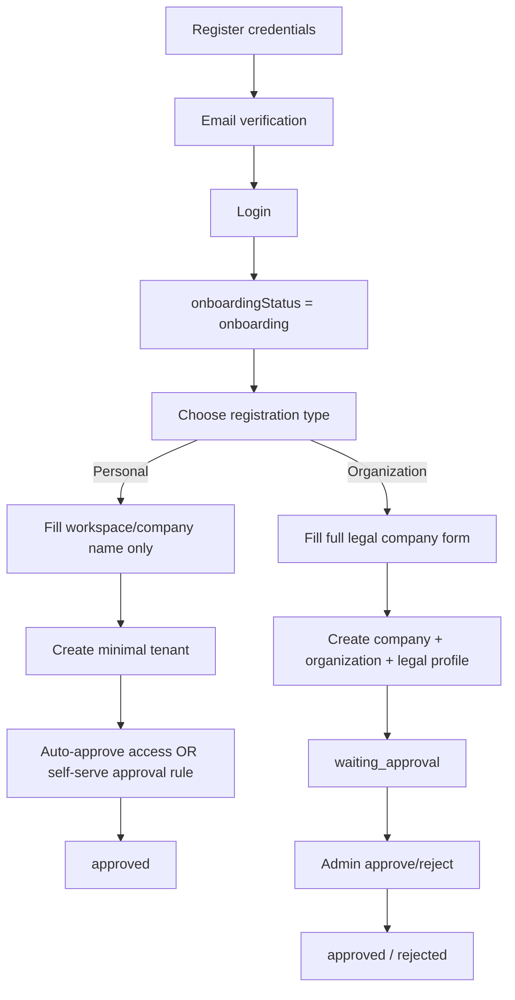

# Assessment Report: Dual Registration Flow for Auth

> **Assessment Type:** Type 1 — Feature Development Analysis + Type 3 — Interconnection Analysis
> **Owner:** Analyst
> **Source PRD / Source Input:** `User request (chat, 2026-06-26): AUTH registration dipecah menjadi 2 flow: perorangan vs grup/perusahaan/organisasi`
> **Assessment Artifact Path:** `Assessments/auth/dual-registration-flow/dual-registration-flow-qa-assessment.md`
> **Version:** `v1.0`
> **Previous Version:** `none`
> **Rules Applied:** `Rules/qa-analysis-rule.md`, `Rules/impact-analysis-rule.md`, `Rules/workflow-rule.md`, `Rules/structure-rule.md`
> **Reference Context:** `Memory/global-memory.md`, `Memory/CLAUDE-fe.md`, `Memory/CLAUDE-be.md`
> **Tanggal Analisa:** 2026-06-26
> **Status:** Draft

---

## 0. Ringkasan Perubahan Analisa

- Initial assessment untuk perubahan flow registration/auth dari 1 jalur menjadi 2 jalur.
- Hasil review: arah produk masuk akal, tetapi implementasi **bukan sekadar tambah 1 field di FE** karena current onboarding, company schema, session gating, dan approval lifecycle masih diasumsikan satu model company verification.
- Temuan paling penting:
  - flow **personal/perorangan** tetap butuh `companyId + organizationId` karena runtime SatuInbox saat ini single-tenant per session
  - schema company saat ini **wajib** legal fields (`businessLicenseNumber`, `identificationNumber`, URL dokumen), sehingga flow personal **tidak bisa** memakai endpoint/model yang sekarang tanpa perubahan backend
  - flag `isVerified` saat ini tersebar ke FE + BE snapshots; jangan dipakai mentah untuk menyamakan “boleh masuk produk” dengan “legal company verified”

---

## 1. Overview

**Feature / Issue:**
Memecah onboarding registration menjadi 2 flow:
1. **Perorangan** → saat onboarding cukup isi nama company/workspace
2. **Grup / Perusahaan / Organisasi** → tetap isi seluruh data legal seperti flow sekarang

**Objective:**
Mengurangi friction onboarding untuk user personal tanpa merusak arsitektur tenant, approval lifecycle, session gating, dan integrasi current company/auth flow.

**Business Context:**
Berdasarkan inspeksi repo saat ini:
- FE credential registration masih 1 flow di `hooks/auth/useRegisterForm.ts` → POST `/auth/register` dengan payload `email`, `fullName`, `password`, `phone`, `username`.
- Setelah email verified, user login dan session default membawa `onboardingStatus=onboarding` (`apps/auth-service/src/app/schemas/auth.schema.ts`, `app/api/auth/[...nextauth]/authOption.ts`).
- Middleware FE memaksa semua user non-`approved` ke `/onboarding` (`apps/omnichannel/proxy.ts`).
- Form onboarding saat ini wajib full legal data (`validations/onboardingSchema.ts`):
  - `businessLicenseNumber`
  - `businessLicenseUrl`
  - `identificationNumber`
  - `identificationUrl`
  - `name`
  - `taxNumber`
- FE onboarding submit ke `/company/register` (`hooks/company/useManageCompanyAPIRequest.ts`).
- API Gateway `/company/register` mengambil owner dari session user saat ini lalu kirim ke company-service (`apps/api-gateway/src/app/company/company.controller.ts`).
- Schema company saat ini mewajibkan legal fields di level database (`apps/company-service/src/app/schemas/company.schema.ts`).
- Saat company terbuat, event `COMPANY_REGISTERED` mengubah owner onboarding status menjadi `waiting_approval`; approval admin baru mengubah ke `approved` (`apps/auth-service/src/app/app.controller.ts`).

**Scope In:**
- analisa perubahan flow auth/onboarding
- evaluasi dampak FE/BE/session/company approval
- rekomendasi desain teknis aman untuk dual flow
- identifikasi risk, dependency, dan phase delivery

**Scope Out:**
- coding implementation
- final PRD drafting
- detailed test case authoring
- billing/package redesign

---

## 2. Decision Summary

### 2.1 Final Decision

**Decision Enum:** `PROCEED_WITH_CAUTION`

**Decision Class:** `CONDITIONAL_GO`

**Decision Statement:**
> Direction feature ini valid dan layak dilanjutkan, tetapi implementasi harus diperlakukan sebagai **auth + onboarding + tenant bootstrap change**, bukan sekadar form split. Flow personal hanya aman bila sistem tetap membuat tenant minimal (`company + organization`) dan memisahkan konsep **access approval** dari **legal/company verification**. Jalur grup/perusahaan bisa tetap reuse flow existing dengan approval manual seperti sekarang.

### 2.2 Required Actions Before Development

- [ ] Lock keputusan apakah flow **personal auto-approve** atau tetap butuh review admin. **Rekomendasi: auto-approve**.
- [ ] Tambahkan field persisted untuk membedakan flow, misalnya `registrationType = PERSONAL | ORGANIZATION`.
- [ ] Refactor contract company agar legal docs **conditional**, bukan mandatory global untuk semua tipe registrasi.
- [ ] Pisahkan makna **akses produk** vs **verifikasi legal entitas**; jangan overload `isVerified` existing.
- [ ] Tetapkan bahwa flow personal tetap membuat `companyId + organizationId` agar tidak merusak runtime single-tenant.
- [ ] Tetapkan apakah user personal nanti bisa **upgrade** menjadi grup/perusahaan dan mengisi legal docs belakangan.

### 2.3 Key Blocking Reasons / Conditions

- Current company schema tidak mengizinkan personal flow karena legal fields masih required.
- Current runtime sangat tenant-dependent (`companyId + organizationId` mandatory di banyak jalur backend).
- Current approval lifecycle mengasumsikan semua onboarding masuk queue approval legal/company.
- Current `isVerified` tersebar ke FE session, company proto, dan people snapshot; maknanya akan ambigu jika personal di-auto-approve.

### 2.4 Complexity and Risk Snapshot

- **Complexity Level:** High
- **Risk Level:** High
- **Primary Impact Areas:** Auth, Onboarding UX, Company Service, Session, People Snapshot, RBAC bootstrap, Approval workflow, Data model

---

## 3. Requirement Summary

### 3.1 Business Rules

| BR ID | Business Rule | Source |
|------|---------------|--------|
| BR-01 | Sistem harus menyediakan 2 jalur onboarding registration: `Perorangan` dan `Grup/Perusahaan/Organisasi`. | User input |
| BR-02 | Jalur `Perorangan` hanya meminta nama company/workspace saat onboarding. | User input |
| BR-03 | Jalur `Grup/Perusahaan/Organisasi` tetap meminta seluruh data legal seperti flow existing. | User input + current onboarding schema |
| BR-04 | Kedua flow tetap harus berakhir pada tenant context yang valid untuk runtime SatuInbox. | Current architecture |
| BR-05 | Approval flow existing tidak boleh dipaksa ke flow personal tanpa rule baru yang jelas. | Current implementation |
| BR-06 | Jalur grup harus tetap kompatibel dengan review/approve/reject existing. | Current implementation |
| BR-07 | Session redirect non-approved ke `/onboarding` harus tetap konsisten setelah split flow. | Current FE middleware |
| BR-08 | Perubahan tidak boleh memutus proses role bootstrap owner/admin saat tenant terbentuk. | Current event flow |

### 3.2 Acceptance Criteria Review

**Minimal acceptance criteria yang implied dari requirement:**
- User baru bisa memilih jenis onboarding sebelum submit data onboarding.
- Jika memilih `Perorangan`, form yang muncul hanya field nama company/workspace.
- Jika memilih `Grup/Perusahaan/Organisasi`, form existing tetap muncul lengkap.
- Setelah submit personal flow, user tidak boleh mentok di state yang butuh legal review tanpa artefak review.
- Setelah submit group flow, current admin approval path harus tetap jalan.
- Session, redirect, dan tenant bootstrap harus konsisten walau flow berbeda.

### 3.3 Assumptions

- Yang berubah terutama adalah **step onboarding**, bukan credential registration awal (`/auth/register`).
- “Nama company” pada flow personal sebenarnya berfungsi sebagai **workspace / tenant display name**, bukan legal company identity.
- User personal tetap butuh tenant entity di backend agar bisa memakai produk.

### 3.4 Clarifications Needed

- Apakah flow personal harus **langsung bisa masuk produk** tanpa approval admin?
- Istilah untuk flow personal mau memakai label apa: `Perorangan`, `Personal`, `Freelancer`, atau `Individual Workspace`?
- Untuk personal flow, apakah label field tetap `Nama Company` atau diubah jadi `Nama Workspace` / `Nama Bisnis`?
- Apakah user personal boleh upgrade ke flow organisasi di kemudian hari?

---

## 4. Current State vs Proposed State

### 4.1 Current State (As-Is)

```mermaid
flowchart TD
  A[Register credentials] --> B[Email verification]
  B --> C[Login]
  C --> D[onboardingStatus = onboarding]
  D --> E[/onboarding]
  E --> F[Submit full company legal form]
  F --> G[/company/register]
  G --> H[Create company + organization]
  H --> I[COMPANY_REGISTERED]
  I --> J[onboardingStatus = waiting_approval]
  J --> K[Admin approve/reject]
  K --> L[approved / rejected]
```

**Observed behavior saat ini:**
- Semua user baru lewat onboarding form yang sama.
- Onboarding form menganggap semua registran adalah entitas yang siap diverifikasi secara legal.
- Company bootstrap + organization bootstrap + approval queue adalah satu paket yang tidak dibedakan berdasarkan tipe registran.

### 4.2 Proposed State (To-Be)



### 4.3 State Transition / Data Flow Notes

**Current effective path:**
`/auth/register` → `/auth/validate-email` → login → FE middleware redirect `/onboarding` → `/company/register` → `company-service.register()` → `COMPANY_REGISTERED` → auth/session `waiting_approval` → admin approve → auth/session `approved`

**Recommended future path:**
- **Shared step:** credential registration + email verification tetap sama
- **Branching step:** type selection dilakukan di onboarding entry
- **Personal path:** tenant bootstrap minimal + direct access rule
- **Organization path:** retain current legal verification path

**Recommended UX note:**
Kalau target perubahan utamanya hanya perbedaan data onboarding, maka titik split paling aman adalah **awal halaman onboarding**, bukan halaman credential register. Ini mengurangi blast radius ke auth register DTO dan menjaga `/auth/register` tetap sederhana.

---

## 5. Impact Analysis

| Dimension | What Changes | What Is Affected | Impact Level | Mitigation / Notes |
|----------|---------------|------------------|--------------|--------------------|
| Module | Tambah branching personal vs organization | FE auth/onboarding, API gateway auth/company, auth-service, company-service, people-service | HIGH | Treat as cross-service change |
| Database | Company legal fields harus jadi conditional / dipisah ke profile baru | `company` schema, snapshots, proto contracts | HIGH | Do not keep current required fields for all flows |
| API | Perlu contract baru untuk registration type | FE request payload, API gateway DTO, proto / service contract | HIGH | Prefer explicit enum, not inferred behavior |
| UI/UX | Onboarding jadi multi-step / branched | register/onboarding pages, copy, validation, resume behavior | MEDIUM | Keep initial credential register unchanged if possible |
| Security / RBAC | Owner role bootstrap harus tetap aman setelah tenant minimal dibuat | auth, people, company events | HIGH | Preserve current role creation/event chain |
| Performance | Dampak kecil, tetapi ada tambahan branch handling | onboarding requests, approval queue filters | LOW | No major query risk expected |
| Integration | Company approval events dan people snapshots akan berubah semantik | auth-service, people-service, session update | HIGH | Explicitly separate access status vs legal verification |
| Reporting / Analytics | Admin onboarding queue bisa perlu filter by registration type | approval dashboard / audit | MEDIUM | Track registration type from day one |
| Financial / Operational | Personal auto-approve bisa menaikkan tenant creation volume | onboarding ops, support, anti-abuse | MEDIUM | add observability + rate limit review |
| Concurrency | Resume/reload setelah pilih type bisa salah branch jika state tidak persisted | FE session/local state, auth record | MEDIUM | persist `registrationType` server-side |
| Migration | Existing users jangan terpengaruh | current approved/waiting/rejected users | LOW | apply only to new registration path |

---

## 6. Dependency Analysis

### 6.1 Dependency Matrix

| Feature / Module | Depends On | Dependency Type | Direction | Notes |
|------------------|------------|-----------------|-----------|-------|
| Personal onboarding branch | auth status + tenant bootstrap | FE + BE | FE onboarding → gateway → company/auth services | still needs tenant context |
| Organization onboarding branch | existing company register flow | FE + BE | FE onboarding → gateway company → company-service | current flow reusable |
| Owner access after onboarding | auth/session onboarding status update | async event | company-service → auth-service/session | must differ by flow |
| Admin approval queue | company legal registration records | async + ops | group flow → company approval | personal may bypass or use different queue |
| User/company snapshot | people-service sync | async event / denormalized snapshot | company-service → people-service | legal field optionality must not break snapshots |
| FE route guarding | NextAuth session onboardingStatus | FE middleware | login/session → `/onboarding` redirect | must remain deterministic |

### 6.2 Shared Resources / Event Mapping

- Shared FE session field: `onboardingStatus`
- Shared tenant context: `companyId + organizationId`
- Shared company entity propagated to FE and people snapshots with `isVerified`
- Shared async events:
  - `COMPANY_REGISTERED`
  - `COMPANY_APPROVE`
  - `COMPANY_REJECTED`
- Shared owner role bootstrap after company creation

**Critical shared-resource finding:**
Current event chain implicitly assumes **tenant created = waiting approval legal review**. Itu tidak cocok langsung untuk flow personal jika tujuannya friction rendah.

---

## 7. Risk Analysis

### 7.1 Risk Matrix

| Risk ID | Scenario | Likelihood | Severity | Level | Mitigation |
|---------|----------|------------|----------|-------|------------|
| R-01 | Flow personal submit sukses tetapi user tetap masuk `waiting_approval` tanpa dasar review yang jelas | High | High | Critical | lock rule: personal auto-approve or dedicated lightweight review |
| R-02 | Personal flow memakai `isVerified=true`, lalu downstream menganggap tenant sudah legal/company-verified | High | High | Critical | split `access status` vs `legal verification status` |
| R-03 | Company schema dibuat nullable tanpa audit semua consumer snapshot/proto | Medium | High | High | full consumer inventory before schema loosen |
| R-04 | Branch selection cuma disimpan di FE state dan hilang saat refresh/login ulang | Medium | Medium | Medium | persist `registrationType` on auth/onboarding record |
| R-05 | Nama company/workspace personal bentrok dengan uniqueness / semantics current company | Medium | Medium | Medium | clarify uniqueness rule and naming semantics |
| R-06 | Personal user ingin upgrade ke organization tapi data model tidak mendukung | Medium | Medium | Medium | define upgrade path early, even if phase 2 |
| R-07 | Approval dashboard tercampur antara legal company applicants dan personal users | Medium | Medium | Medium | add registration type filter + queue separation |
| R-08 | Role bootstrap gagal jika personal path mencoba bypass company creation | Low | Critical | High | never bypass tenant bootstrap |

### 7.2 Worst-Case Scenarios

- User personal tidak bisa masuk produk karena flow baru tetap menggantung di approval queue lama.
- Sistem menandai tenant personal sebagai `verified`, lalu data itu dipakai lintas modul seolah legal company verification sudah lolos.
- Implementasi mencoba menghindari company creation untuk personal, lalu runtime existing gagal karena banyak service mengharuskan `companyId + organizationId`.

---

## 8. Test Strategy

### 8.1 Functional Scope

- register credential existing tetap sukses
- verify email existing tetap sukses
- login existing tetap mengarahkan user baru ke onboarding
- user bisa memilih `Perorangan` vs `Grup/Perusahaan/Organisasi`
- personal flow hanya meminta 1 field nama workspace/company
- group flow tetap meminta semua legal fields existing
- submit personal menghasilkan tenant usable
- submit group menghasilkan entry approval seperti current flow

### 8.2 Regression Scope

- `/auth/register`
- `/auth/validate-email`
- FE middleware `/onboarding` redirect
- `/company/register`
- owner role bootstrap
- admin approve/reject company
- session update setelah approve/reject
- next-auth session hydrate company/organization data

### 8.3 Integration Scope

- company-service → auth-service status updates
- company-service → people snapshot propagation
- FE session refresh setelah onboarding submit
- admin dashboard / approval queue filtering bila nanti ditambah registration type

### 8.4 UAT / Business Validation

- PM validate apakah “nama company” pada personal flow benar-benar cukup
- Ops validate apakah personal flow perlu manual review sama sekali
- Support validate apakah reject/resubmission behavior untuk group masih sama
- Product validate terminology: `company` vs `workspace` vs `organization`

### 8.5 Automation Candidates

- E2E: personal registration happy path
- E2E: organization registration happy path
- E2E: organization approval / rejection path
- API contract tests: conditional validation by `registrationType`
- integration test: event-driven onboarding status update

---

## 9. Production Safety

- **Rollback Strategy:** feature flag / config gate pada onboarding branching; fallback ke current full onboarding flow.
- **Feature Toggle Requirement:** recommended, minimal toggle di FE onboarding chooser + BE conditional validation.
- **Backward Compatibility Notes:** existing users/status records harus untouched; change berlaku hanya untuk registrasi baru.
- **Staged Rollout Recommendation:** internal/staging first, lalu limited rollout untuk registrasi baru.
- **Monitoring / Alerting Needs:** track submit rate per type, stuck `onboarding` > X minutes, stuck `waiting_approval`, approval latency, personal vs organization conversion.
- **Logging / Audit Gaps:** log `registrationType`, onboarding submit payload shape, and final status transition.

---

## 10. Open Questions

| OQ ID | Question | Why It Matters | Blocking? |
|------|----------|----------------|-----------|
| OQ-01 | Apakah personal flow auto-approve? | Menentukan session/status lifecycle | Yes |
| OQ-02 | Untuk personal flow, apakah `nama company` sebenarnya `nama workspace`? | Menentukan copy, schema semantics, uniqueness rule | Yes |
| OQ-03 | Apakah personal user bisa upgrade ke organization nanti? | Menentukan extensibility data model | No |
| OQ-04 | Apakah approval dashboard harus menampilkan personal registration juga? | Menentukan ops flow | No |
| OQ-05 | Apakah billing/package untuk personal berbeda dari organization? | Menentukan future cross-domain impact | No |

---

## 11. Recommendation

### 11.1 Recommendation Rationale

- Perubahan ini **layak** karena memang ada mismatch antara friction current onboarding dan kebutuhan user personal.
- Tapi jalur personal tidak boleh diimplementasikan dengan cara “skip legal field saja” sambil tetap memakai model company existing apa adanya.
- Root architectural constraint-nya adalah: **runtime existing butuh tenant context**, sementara **company schema existing butuh legal identity**. Dua hal ini harus dipisah secara sadar.

### 11.2 Operational Recommendation

| Item | Value |
|------|-------|
| Final Decision Enum | `PROCEED_WITH_CAUTION` |
| Owner for Follow-up | PM + Analyst + FE + BE |
| Required Revisions | PRD/addendum wajib mengunci registration type, approval rule personal, status semantics, schema strategy |
| Suggested Delivery Strategy | Phase split |
| Earliest Safe Next Step | Draft PRD patch/addendum sebelum coding |

### 11.3 Suggested Delivery Strategy

**Phase 1 — Safe MVP**
- Keep `/auth/register` credential step unchanged.
- Add onboarding type selector at start of `/onboarding`.
- Add `registrationType` persisted on auth/onboarding record.
- Implement:
  - `PERSONAL` → minimal form (`name` only), create tenant minimal, auto-approve access
  - `ORGANIZATION` → keep current full legal flow + manual approval
- Add explicit status semantics so personal access is not forced through legal verification queue.

**Phase 2 — Data Model Hardening**
- Separate `access approval` from `legal verification` if not already done in phase 1.
- Normalize snapshot contracts so optional legal fields do not break consumers.
- Add admin queue filter / reporting by registration type.

**Phase 3 — Upgrade Path (Optional but Recommended)**
- Allow personal tenant to upgrade into organization/legal-verified mode.
- Add resubmission or legal-profile completion flow.

---

## 12. Traceability Matrix

PRD Requirement → Analysis Finding → Impact Area → Test Case ID → Status

| Req ID | Requirement | Finding | Impact Area | Test Case | Status |
|--------|-------------|---------|-------------|-----------|--------|
| FR-01 | System provides personal and organization registration paths | Feasible but requires branch persistence | FE + Auth | TC-AUTH-01 | Pending |
| FR-02 | Personal path only asks for company/workspace name | Not possible with current company schema unchanged | Company Service + DB | TC-AUTH-02 | Pending |
| FR-03 | Organization path keeps current full legal onboarding | Existing flow reusable | FE + Company Approval | TC-AUTH-03 | Pending |
| FR-04 | Personal user can continue using product after onboarding | Requires explicit approval rule and tenant bootstrap | Session + Auth + Company | TC-AUTH-04 | Pending |
| FR-05 | Existing group approval path remains intact | Existing event lifecycle can stay for org flow | Company/Auth Events | TC-AUTH-05 | Pending |

---

## 13. Change Log

| Date | Change | Author |
|------|--------|--------|
| 2026-06-26 | Initial assessment created | Hermes |
