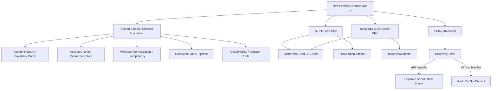

# Change Intake Brief: New External Channel Add-on — TikTok / Tokopedia

> **Artifact Type:** Change Intake Brief  
> **Source Request / BRD:** Current chat — brainstorming requirement before BRD  
> **Artifact Path:** `Assessments/cross-domain/new-external-channel-add-on/new-external-channel-add-on-change-intake-brief.md`  
> **Version:** `v1.0`  
> **Previous Version:** `none`  
> **Rules Applied:** `Rules/requirements-lifecycle-rule.md`, `Rules/workflow-rule.md`, `Rules/impact-analysis-rule.md`, `Rules/structure-rule.md`  
> **Supporting Context:** `Memory/global-memory.md`, `Memory/reference-index.md`, `Memory/CLAUDE-fe.md`, `Memory/CLAUDE-be.md`, multi-agent brainstorming/review output from current session  
> **Tanggal Intake:** 2026-07-30  
> **Owner / Author:** Dany Christian  
> **Engineering Lead:** Naftal Yunior  
> **Status:** Draft — Hold Needs Discovery before BRD

---

## 0. Ringkasan Update Brief

- Initial Phase 0 brief dibuat untuk request penambahan channel baru SatuInbox dari TikTok / Tokopedia sebelum BRD.
- Scope awal dipisah menjadi: TikTok Shop Chat, Tokopedia Buyer-Seller Chat, dan TikTok DM/Social discovery track.
- Routing decision: `SPLIT_REQUEST` + `HOLD_NEEDS_DISCOVERY`, karena API/partner access dan capability matrix belum verified.

---

## 1. Request Snapshot

**Request Summary:**  
SatuInbox ingin menambah channel baru dari platform TikTok dan Tokopedia. User meminta brainstorming requirement generic terlebih dahulu, melihat area requirement apa saja yang perlu disiapkan sebelum dibuat BRD.

**Business Problem:**  
Customer support / seller operations perlu mengelola percakapan marketplace/social dari TikTok dan Tokopedia di SatuInbox, bukan berpindah platform satu per satu.

**Target User / Role / Stakeholder:**
- Seller / merchant user yang menghubungkan toko/platform ke SatuInbox.
- Agent customer support yang membalas chat buyer/customer.
- Supervisor / team lead yang memantau assignment, SLA, dan channel workload.
- Admin / owner yang mengelola connection, billing/add-on, dan channel health.
- Engineering / support internal yang memonitor webhook, token, retry, dan failure.

**Expected Outcome:**
- SatuInbox punya baseline requirement untuk external channel add-on.
- TikTok Shop Chat dan Tokopedia Buyer-Seller Chat dipahami sebagai commerce chat yang bisa reuse UI shell, tetapi tidak boleh disamakan di integration contract.
- TikTok DM/Social diperlakukan sebagai scope terpisah sampai API feasibility jelas.
- BRD berikutnya tidak membawa assumption platform yang belum verified.

**Urgency / Why Now:**  
Discovery diperlukan sebelum BRD agar scope tidak melebar, estimate tidak keliru, dan dependency partner/API access terdeteksi lebih awal.

---

## 2. Change Classification

| Item | Value |
|------|-------|
| Change Class | `MIXED_REQUEST` |
| Primary Domain | `Cross-domain` (`Conversation`, `Channel`, `Contact`, `Settings`, `Billing`, `Notification`, `Analytics`) |
| Request Shape | Add new external channel capability |
| Initial Complexity Signal | High / Critical |
| Needs Split? | Yes |

### Classification Rationale

- Request mencampur beberapa channel dan beberapa platform API dalam satu kebutuhan besar.
- TikTok Shop Chat dan Tokopedia Buyer-Seller Chat sama-sama commerce-chat secara product surface, tetapi beda auth, webhook, event payload, rate limit, identity, media capability, dan support model.
- TikTok DM/Social adalah social-inbox use case, bukan marketplace commerce chat. Feasibility API perlu dibuktikan dulu.
- Scope menyentuh shared entity dan pipeline penting: `Platform`, `Channel`, `AccountChannel`, contact identity, conversation room, webhook ingestion, outbound sending, billing add-on, observability, QA regression.

---

## 3. Current State Verification

### 3.1 PRD Status

| Item | Finding |
|------|---------|
| Relevant existing PRD | No specific TikTok/Tokopedia channel PRD found in current assessment scan. Existing source-of-truth domains: Conversation V2, Ticket V2, WhatsApp Web V2. |
| PRD status | New capability / not yet specified as dedicated PRD in loaded context |
| PRD treatment candidate | New BRD/PRD set after discovery; likely split into foundation + per-platform add-on docs |

### 3.2 Implementation Status

| Surface | Finding | Evidence / Source |
|---------|---------|-------------------|
| FE | Existing app has Settings > Channels surface and Conversation module. Specific TikTok/Tokopedia support not verified in repo source. | `Memory/CLAUDE-fe.md`: settings channels route, conversation module, Zustand conversation filters, Socket.IO. |
| BE | Existing BE has `channel-service`, `conversation-service`, `media-service`, `notification-service`, `payment-service`, and channel-specific services for Instagram, Messenger, WhatsApp API, Email, WhatsApp Web. Specific TikTok/Tokopedia support not verified in repo source. | `Memory/CLAUDE-be.md`: service topology and channel integrations. |
| Runtime / Current Behavior | Current product baseline is omnichannel conversation/ticket platform; new platform requires add-on/integration extension. | `Memory/global-memory.md`, architecture references. |

### 3.3 Related Sources

- `Memory/global-memory.md`: Conversation Room capability matrix note, channel/account-channel capability dependency, chat list/channel filters, contact currently phone-oriented baseline.
- `Memory/reference-index.md`: no direct TikTok/Tokopedia reference listed.
- `Memory/CLAUDE-fe.md`: FE settings channels path, conversation route, Socket.IO, API hooks/state management.
- `Memory/CLAUDE-be.md`: BE channel-service, conversation-service, RabbitMQ, gRPC, API Gateway, media-service, payment-service, existing per-channel service pattern.

---

## 4. Scope Boundary

### 4.1 In Scope — Phase 0 Discovery

- Confirm API/partner feasibility for:
  - TikTok Shop Chat
  - Tokopedia Buyer-Seller Chat
  - TikTok DM/Social
- Build capability matrix per platform:
  - inbound text
  - outbound text
  - image/media support
  - file support
  - read receipt
  - typing indicator
  - order context
  - webhook push
  - polling fallback
  - historical sync
  - outbound restriction / reply window
  - rate limit
- Define common product shell:
  - Settings channel onboarding
  - Inbox list display/filter
  - Room chat render
  - Detail panel external context
  - capability-aware composer
- Define integration backbone requirement:
  - platform registry / enum
  - account-channel connection state
  - adapter per platform
  - webhook normalization
  - idempotency
  - outbound status pipeline
  - token lifecycle
- Define identity/thread model:
  - customer identity key
  - shop/store/account scope
  - external thread key
  - order-linked vs non-order conversation
- Define operational readiness:
  - channel health dashboard
  - structured logs
  - retry/replay tooling
  - support runbook
- Define QA matrix and rollout plan.

### 4.2 In Scope — Candidate Phase 1 Product

Recommended candidate after discovery:

1. **Shared External Channel Foundation**
   - platform registry
   - connection state machine
   - webhook normalization
   - capability gating
   - observability baseline

2. **TikTok Shop Chat Add-on**
   - commerce chat only
   - inbound/outbound text
   - basic media if API supports
   - basic order context if API provides

3. **Tokopedia Buyer-Seller Chat Add-on**
   - commerce chat only
   - inbound/outbound text
   - basic media/file if API supports
   - basic order link/context if API provides

### 4.3 Out of Scope — Until Separate Decision

- TikTok DM/Social committed delivery, unless official API feasibility is confirmed.
- Full order management / fulfillment / dispute handling.
- Cross-platform contact merge between TikTok and Tokopedia.
- Social listening, comment moderation, live chat/live commerce stream handling.
- Broadcast/bulk messaging for marketplace/social channels.
- Bot/automation triggers specific to dispute, seller score, pickup reminder, product catalog, etc.
- Deep analytics per marketplace beyond baseline conversation volume/SLA.
- Scraping or non-compliant integration path.

### 4.4 Protected Existing Behavior

- Existing WhatsApp / Instagram / Messenger / Email / Widget channel behavior must not regress.
- Existing Conversation list filters, assignment, room status (`open`/`closed`), internal notes, search scope, and RBAC visibility must stay valid.
- Existing Contact behavior must not auto-merge external platform identities incorrectly.
- Existing media limits / room attachment behavior must stay channel-capability aware.
- Existing billing/add-on flows must not be bypassed for paid channel activation.
- Existing notification fan-out must not become company-wide noise for user-specific chat events.

---

## 5. Early Impact Flags

| Area | Flag | Notes |
|------|------|-------|
| Shared entity / lifecycle / state | Yes | Adds new platform/account-channel states, external identity, thread mapping, outbound status lifecycle. |
| RBAC / visibility / assignment | Yes | New channel conversations must follow current conversation visibility, team routing, assignment, and permission rules. |
| API / webhook / socket / queue / cron | Yes | Requires auth callback, webhook receiver, normalized event contract, RabbitMQ processing, Socket.IO room/list updates, polling reconciliation. |
| SLA / reporting / export | Yes | New channel dimension may affect SLA, analytics, reports, exports, channel filters. Need decide included/excluded in phase 1. |
| Migration / rollback / feature flag | Yes | Needs per-platform/per-tenant enablement, kill switch, reconnect/disconnect behavior, rollback if webhook/outbound fails. |
| Existing regression scope | Yes | Conversation list, room, detail panel, settings channels, notification, billing/add-on, contact identity, media upload. |

### Early Blast-Radius Notes

- **Direct modules:** Settings Channels, Conversation Inbox, Conversation Room, Conversation Detail, Channel Service, API Gateway, Conversation Service, Media Service, Notification Service, Payment/Add-on, Analytics.
- **Indirect modules:** Contact/People identity, RBAC/visibility, Socket.IO, RabbitMQ consumers, audit logs, support/admin tools.
- **High-risk dependency:** external platform API approval and capability matrix. Without this, BRD scope cannot be committed safely.

---

## 6. Visual Scope Map

---

## 7. Routing Decision

| Item | Value |
|------|-------|
| Routing Decision | `SPLIT_REQUEST` + `HOLD_NEEDS_DISCOVERY` |
| Recommended Next Rules | `Rules/prd-writing-rule.md`, `Rules/qa-analysis-rule.md`, `Rules/impact-analysis-rule.md` after discovery lock; `Rules/test-case-rule.md` after BRD/PRD scope is approved |
| Recommended Next Artifact | Keep this Change Intake Brief as baseline; next can be BRD only after discovery blockers answered |
| Can Proceed to PRD? | No, not safely yet. Can proceed to discovery/BRD skeleton only if open blockers remain explicitly marked. |

### Routing Rationale

- Split is required because one request contains multiple platform products and risk profiles.
- Hold is required because official API access, webhook model, auth model, and capability matrix are not verified yet.
- BRD can start as discovery/business framing, but cannot be finalized until partner/API feasibility is confirmed.

---

## 8. Recommended Scope Split

| Lane | Scope | Recommendation | Reason |
|------|-------|----------------|--------|
| Foundation | Shared external channel backbone | Must define first | Prevent duplicate platform-specific plumbing. |
| TikTok Shop Chat | Commerce buyer-seller chat | Candidate Phase 1 after API access verified | High business value; fits commerce chat pattern. |
| Tokopedia Buyer-Seller Chat | Commerce buyer-seller chat | Candidate Phase 1/2 after API access verified | Similar product surface; different integration contract. |
| TikTok DM/Social | Social DM/inbox | Discovery-only / conditional | API feasibility and product model uncertain; likely separate persona/use case. |

---

## 9. Requirement Buckets For Future BRD

### 9.1 Business / Partnership Requirements

- Confirm official API access path per platform.
- Confirm partner approval / app review / production go-live requirement.
- Confirm rate-limit tier and support SLA.
- Confirm allowed use cases: inbox read, outbound reply, media, order context, automation/bot rules.
- Confirm data retention/deletion policy from platform.

### 9.2 Onboarding / Connection Requirements

- Connect platform from Settings > Channels/Add-on.
- OAuth/authorization callback or platform-specific credential flow.
- Multi-shop/store binding decision.
- Connection status display and reconnect flow.
- Disconnect flow with data retention behavior.

### 9.3 Conversation Product Requirements

- Platform icon and channel filter.
- Shop/store filter if multi-store is in scope.
- Inbox preview and unread handling.
- Room chat text/media rendering.
- Capability-aware composer.
- Basic order/context panel for commerce chat if platform provides.
- Unsupported message fallback.

### 9.4 Backend / Integration Requirements

- Adapter per platform.
- Normalized inbound event contract.
- Outbound command/status contract.
- Webhook signature verification.
- Idempotency / dedupe.
- Token refresh / expiry / revoked handling.
- Poll reconciliation if webhook delivery is incomplete.

### 9.5 Data Requirements

- `platform + accountChannelId + externalCustomerId` as external identity baseline.
- `platform + accountChannelId + externalThreadId` as thread baseline.
- External order/context object kept separate from core message schema where practical.
- Tokens/secrets encrypted at rest.
- Raw payload retained only for limited debug window.

### 9.6 Ops / Observability Requirements

- Webhook success/failure metrics.
- Outbound success/failure metrics.
- Token refresh failure metric.
- Queue backlog / retry / dead-letter monitoring.
- Last webhook/sync timestamp per account-channel.
- Support tool for recent errors and safe replay.

### 9.7 QA Requirements

- Connect/reconnect/disconnect flows.
- Inbound message creation.
- Outbound text/media success/failure.
- Duplicate webhook prevention.
- Out-of-order event handling.
- Same buyer different shop/store.
- Unsupported content fallback.
- Feature flag / kill switch behavior.
- Regression: conversation list, room, detail, assignment, notifications, billing/add-on.

---

## 10. Blocking Questions & Decisions Needed

| ID | Question / Gap | Why It Matters | Blocking? | Owner |
|----|----------------|----------------|-----------|-------|
| OQ-01 | Apakah SatuInbox punya / bisa mendapat official TikTok Shop Chat API access untuk Indonesia? | Tanpa akses official, BRD delivery tidak valid. | Yes | PM / Business / BE |
| OQ-02 | Apakah Tokopedia Buyer-Seller Chat API tersedia untuk partner integration dan apakah endpoint/statusnya stabil? | Menentukan feasibility, auth flow, webhook/polling model. | Yes | PM / Business / BE |
| OQ-03 | Apakah TikTok DM/Social API mendukung third-party agent inbox secara official? | Jika tidak, scope harus dikeluarkan dari BRD delivery. | Yes | PM / Business / BE |
| OQ-04 | Capability matrix final per platform apa saja? | Composer, message renderer, QA, estimate bergantung ke ini. | Yes | BE / FE / PM |
| OQ-05 | Phase 1 mau pilih TikTok Shop dulu, Tokopedia dulu, atau Shared Foundation + one platform? | BRD structure dan delivery plan bergantung ke sequencing. | Yes | PM / Engineering Lead |
| OQ-06 | Apakah multi-shop/multi-store masuk Phase 1? | Data model dan onboarding berubah besar jika multi-store wajib. | Yes | PM / BE / FE |
| OQ-07 | Apakah order context hanya display/deep link atau perlu sync detail order? | Beda besar antara chat add-on dan commerce/order module. | Yes | PM / BE / FE |
| OQ-08 | Apakah new channels masuk SLA/reporting phase 1? | Impact ke analytics/SLA/export dan regression. | No, but should decide before PRD final | PM / QA |
| OQ-09 | Apakah billing/add-on activation wajib untuk phase 1? | Menentukan entitlement, plan gating, and activation flow. | No, if pilot internal only | PM / Business |
| OQ-10 | Apa support/admin tooling minimum untuk pilot? | Tanpa health/error tooling, support production blind. | Yes for production | Support / BE |

---

## 11. Approval / Alignment Targets

| Target | Needed For | Status | Notes |
|--------|------------|--------|-------|
| PM / Analyst | Scope lock and business sequencing | Pending | Dany Christian owner/PM. |
| Engineering Lead | Technical feasibility and effort sanity check | Pending | Naftal Yunior. |
| Business / Partnership | Platform API access validation | Pending | Needed before BRD final. |
| FE Lead | Settings, inbox, room, detail impact sanity check | Pending | Needed before PRD detail. |
| BE Lead | Adapter, webhook, auth, token, data model feasibility | Pending | Needed before PRD detail. |
| QA | Regression and acceptance strategy | Pending | Needed before implementation package. |
| Support / Ops | Channel health and runbook readiness | Pending | Needed before pilot. |

---

## 12. Downstream Reuse Map

| Downstream Artifact | Path | How This Brief Is Reused |
|---------------------|------|--------------------------|
| BRD | `BRD/<future-path>` | discovery baseline, business problem, scope split, blocker list |
| PRD | `PRD/<future-domain>/<future-file>.md` | source scope, capability matrix, current-state baseline |
| Assessment Report | `Assessments/cross-domain/new-external-channel-add-on/new-external-channel-add-on-qa-assessment.md` | source scope, protected behavior, routing rationale |
| QA Pre-Implementation Review | `Test/<future-domain>/<future-feature>-qa-pre-implementation-review.md` | impact flags and regression scope |
| Automation Mapping / Test Spec | `Test/<future-domain>/<future-feature>-automation-mapping.md` | traceability and non-scope guard |

---

## 13. Readiness To Move Beyond Phase 0

### Locked

- Request is a new external channel add-on initiative.
- TikTok Shop Chat and Tokopedia Buyer-Seller Chat should not be treated as the same technical integration.
- TikTok DM/Social should be separate discovery track.
- Shared foundation is needed before or alongside per-platform delivery.
- Phase 0 artifact path is established in `Assessments/cross-domain/new-external-channel-add-on/`.

### Still Open

- Official API/partner access for each platform.
- Final capability matrix per platform.
- Phase 1 sequencing.
- Multi-shop/store scope.
- Order context depth.
- SLA/reporting/billing inclusion.

### Risk If Moving To BRD Now

- BRD may overcommit TikTok DM/Social without API feasibility.
- Estimate may undercount adapter complexity.
- UI may assume unsupported media/actions.
- Data model may accidentally merge external customer identities incorrectly.
- Production support may lack webhook/token health visibility.

### Recommendation

Proceed only to **discovery-backed BRD skeleton** or complete the blocking discovery first. Do not finalize implementation-ready BRD until OQ-01 through OQ-07 are answered.

---

## 14. Change Log

| Date | Change | Author |
|------|--------|--------|
| 2026-07-30 | Initial Change Intake Brief created from brainstorming and reviewer synthesis. | Dany Christian |
