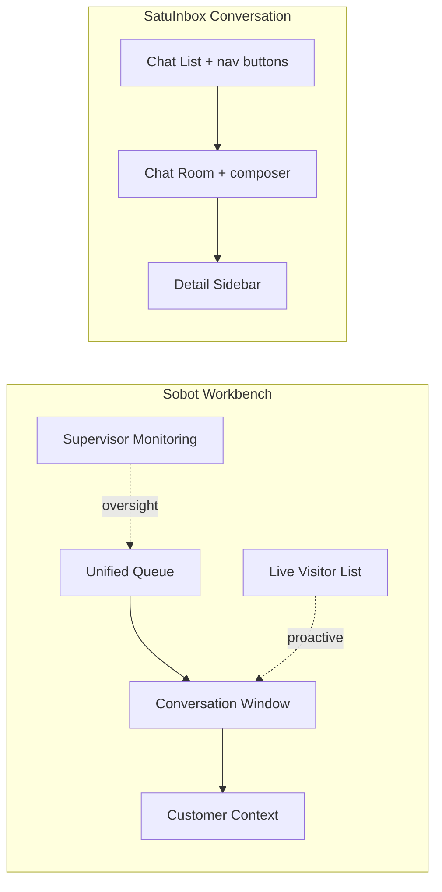
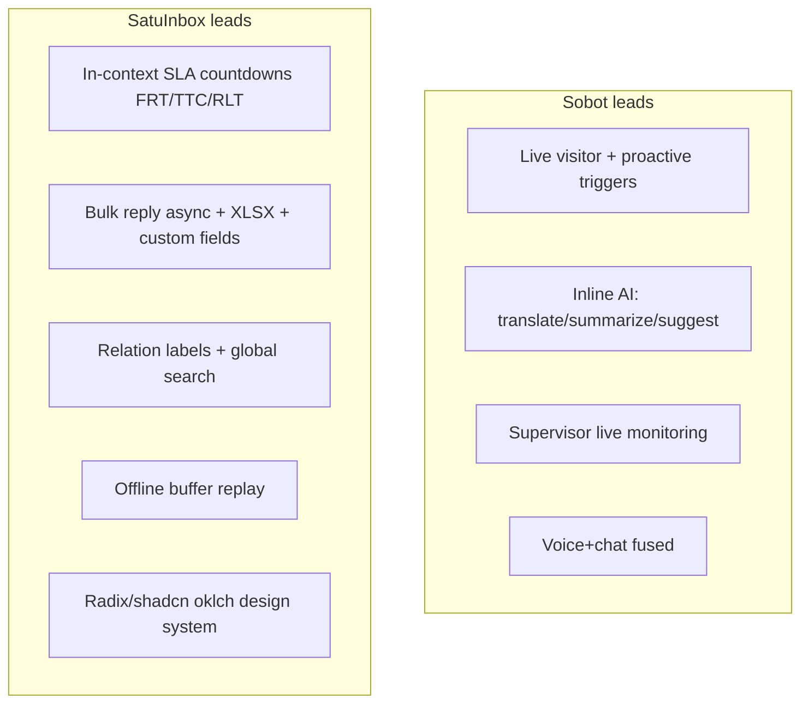

# Sobot Nexus Messaging vs SatuInbox — UI/UX Comparison

> **Analyst:** Dany Christian (Product Manager)
> **Date:** 2026-09-15
> **Scope:** Agent-facing UI/UX of Sobot Live Chat (Nexus Messaging) vs SatuInbox omnichannel dashboard.
> **Nature:** Non-decision-bearing reference (comparative deep-dive), stored in `Assessments/reference/`.

## Evidence Basis & Honesty Note

| Side | Source | Fidelity |
|---|---|---|
| Sobot | `sobot.io/nexus/messaging` (landing), `help.sobot.io` Agent Workbench docs, `sobot.io/article` dashboard guide | **Feature + documented-layout level.** No pixel-level UI capture — I could not load live screenshots into vision. Visual polish/craft claims are inferred from docs, not measured. |
| SatuInbox | `Memory/CLAUDE-fe.md` (v2.8.0 working tree, verified 2026-08-11), `Memory/global-memory.md` (canonical product rules) | **Code-verified architecture + implementation status.** |

This is an **apples-to-oranges base**: Sobot's public material is marketing + help docs (claims), SatuInbox's is verified repo state (what actually ships). Read "Sobot has X" as "Sobot markets/documents X", and "SatuInbox has X" as "X exists in code". Where SatuInbox is stronger it's because we have ground truth; where Sobot looks broader it may be roadmap gloss.

---

## 1. Layout Model

### Sobot — agent workbench (documented)
- **Unified queue-first workspace.** Central hub aggregating chat, chatbot handover, voice, ticket, social into one inbox.
- Conversation window = "command center": message thread + context + tools.
- **Live Visitor List** — real-time browsing visitors (location, current page, dwell time) for proactive outbound chat.
- Agent status controls (availability presence) prominent.
- Supervisor **Monitoring** module: skill-group pressure, live agent status, agent monitoring/whisper.
- Historical Records: My Talks / My Skill Group / My Department scopes.

### SatuInbox — 3-column conversation layout (code-verified)
```
ManageConversationPage
├── ConversationChatLists   (left, virtualized list + nav filters)
├── ConversationChatRoom    (center, messages + composer)
└── ConversationChatDetails (right, contact/context sidebar)
```
- Ticketing uses a **drawer layout** (table + detail drawer + floating bulk-action bar) — distinct pattern from conversations.
- Nav filters as **buttons not tabs**: Your Inbox, Unassigned, All, Closed, Starred, Spam, Junk + Channel/Team scoping.



**Verdict:** Both converge on the canonical 3-pane inbox. Sobot layers a **queue + live-visitor + supervisor-monitoring** cockpit on top (call-center DNA). SatuInbox is **conversation-object centric**, with ticketing split into a separate table/drawer paradigm.

---

## 2. Feature-by-Feature UI Surface

| UX capability | Sobot (documented) | SatuInbox (code-verified) |
|---|---|---|
| Omnichannel unified inbox | ✅ web, app, WhatsApp, FB, IG, Telegram, Discord, LINE, voice, email | ✅ WhatsApp Web/API, widget, IG, Messenger, email (channel/team scoping) |
| Queue + intelligent routing UI | ✅ round-robin / least-busy / skill-based, queue position, caps | ⚠️ Assignment settings + "Assign to Me" + advanced filters; **Round Robin has no PRD yet** (open dependency) |
| Live visitor list (proactive) | ✅ real-time visitors, triggers | ❌ not present |
| Co-browsing | ✅ documented | ❌ not present |
| Canned responses / macros | ✅ AI-personalized, private vs public | ✅ Macros (settings) — no AI personalization layer |
| Auto-translation in composer | ✅ bi-directional, real-time | ❌ not present (i18n is UI locale en/id only) |
| AI assist (summary/intent/reply) | ✅ Sobot AI copilot | ❌ not present |
| Agent presence/status controls | ✅ prominent | ⚠️ shift-hours + member active/inactive; no live presence toggle documented in FE |
| Supervisor monitoring / whisper | ✅ dedicated module | ❌ not present in FE |
| Ticketing surface | ✅ integrated | ✅ **richer**: SLA per-stage, bulk reply (XLSX + async progress), custom fields, RBAC view scopes, snooze |
| SLA metrics in UI | Generic analytics | ✅ **FRT/TTC/RLT/Wait-time** with live countdown, color thresholds (deep, code-level) |
| Bulk actions | Basic agent actions | ✅ extensive (assign, pin, spam, read, star, junk, close, reopen; bulk reply) |
| Relation labels / cross-object linking | ❌ not documented | ✅ v2.8.0 relation labels + global search |
| Voice-note playback / media | Standard attachments | ✅ wavesurfer voice notes, media-chrome, HEIC support, screenshot capture |
| Widget customization | ✅ full brand customization | ✅ widget settings + topics |
| Analytics dashboards | ✅ 300+ metrics | ✅ ApexCharts statistic module (filter by user/role) |

---

## 3. Where Each Wins

### Sobot's UX advantages
1. **Proactive selling surface** — Live Visitor List + behavioral triggers turn the inbox into a lead-gen tool. SatuInbox has no proactive-outbound-from-browsing concept.
2. **AI woven into the composer** — canned-response personalization, auto-translation, reply suggestion, summarization sit inline. SatuInbox composer is manual.
3. **Supervisor cockpit** — real-time monitoring/whisper/skill-group pressure as a first-class module. SatuInbox has analytics but no live supervision UI.
4. **Voice-call fusion** — workbench blends telephony with chat in one pane (call-center heritage).

### SatuInbox's UX advantages
1. **SLA depth in the UI** — live FRT/TTC/RLT/Wait-time countdowns, percentage color thresholds, per-stage ticket SLA breakdown. Sobot exposes analytics but not this granular in-context SLA.
2. **Ticketing rigor** — bulk reply with async job progress, XLSX export, custom-field columns per type, 8-view RBAC scoping. More operationally deep than Sobot's documented ticketing.
3. **Relation labels + global search** — cross-object linking with per-domain independent search (v2.8.0). No Sobot equivalent surfaced.
4. **Realtime resilience UX** — offline message buffer replayed on reconnect (`pending-socket-queue`), so agents don't lose sends on flaky networks. A reliability-UX detail rarely marketed.
5. **Modern token-based design system** — Tailwind v4 oklch tokens, shadcn/Radix atoms→molecules→pages. Accessible, consistent primitives by construction.



---

## 4. UX Gaps SatuInbox Should Weigh

Ordered by likely impact, framed as candidate backlog (not decisions):

1. **Inline auto-translation** — highest ROI for a WhatsApp-heavy SEA product serving cross-language customers. Sobot ships it; SatuInbox has none. Composer-level, bi-directional.
2. **AI reply assist / summarization** — Sobot's copilot is the biggest efficiency delta. SatuInbox composer is fully manual.
3. **Supervisor live-monitoring module** — SatuInbox has analytics-after-the-fact, no real-time floor view. Gap for team leads.
4. **Proactive engagement (live visitor + triggers)** — only relevant if widget-driven web sales matters to SatuInbox's ICP; less so for WhatsApp-first.
5. **Co-browsing** — niche; skip unless enterprise support demand appears.

## 5. UX Gaps Sobot Has vs SatuInbox (SatuInbox is ahead)

1. In-context SLA countdowns per conversation/ticket stage.
2. Bulk reply with live async job progress.
3. Cross-object relation labels + unified global search.
4. Offline-resilient message buffering.

---

## 6. One-Line Summary

**Sobot = AI-assisted, proactive, call-center-rooted cockpit** (breadth of assistive/supervisory UX). **SatuInbox = SLA-rigorous, ticketing-deep, realtime-resilient conversation platform** (operational depth on the WhatsApp-first CS core). The clearest borrowable wins for SatuInbox are **inline translation** and **AI composer assist**; the clearest things Sobot lacks are **granular in-UI SLA** and **relation-label linking**.

> Caveat repeated: Sobot side is documentation/marketing-level, SatuInbox side is code-verified. Any "Sobot has X" needs a live-product check before it becomes a competitive decision. A hands-on Sobot trial (screenshots of the real agent UI) would upgrade this from feature-comparison to true visual UX comparison.
