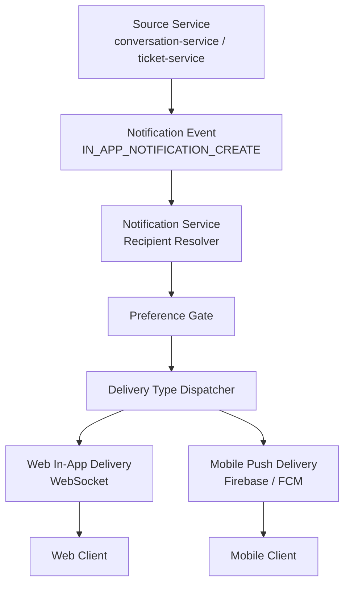
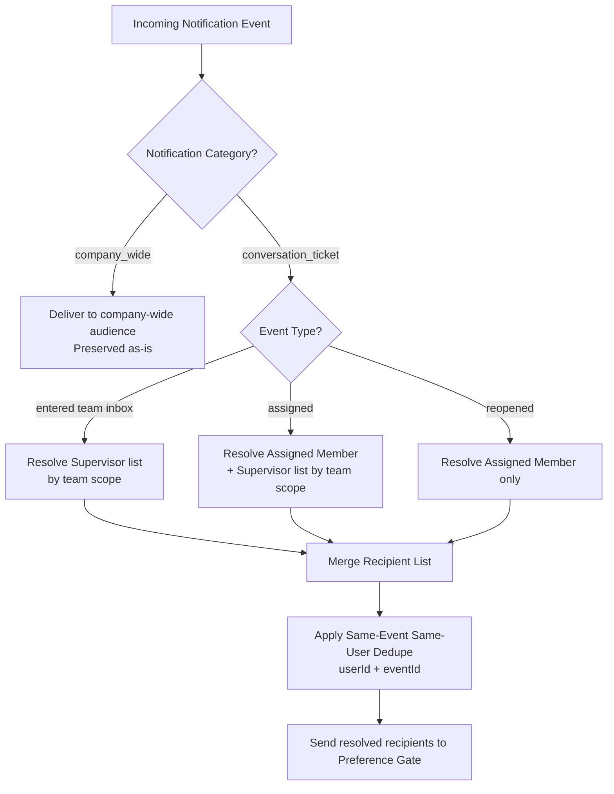
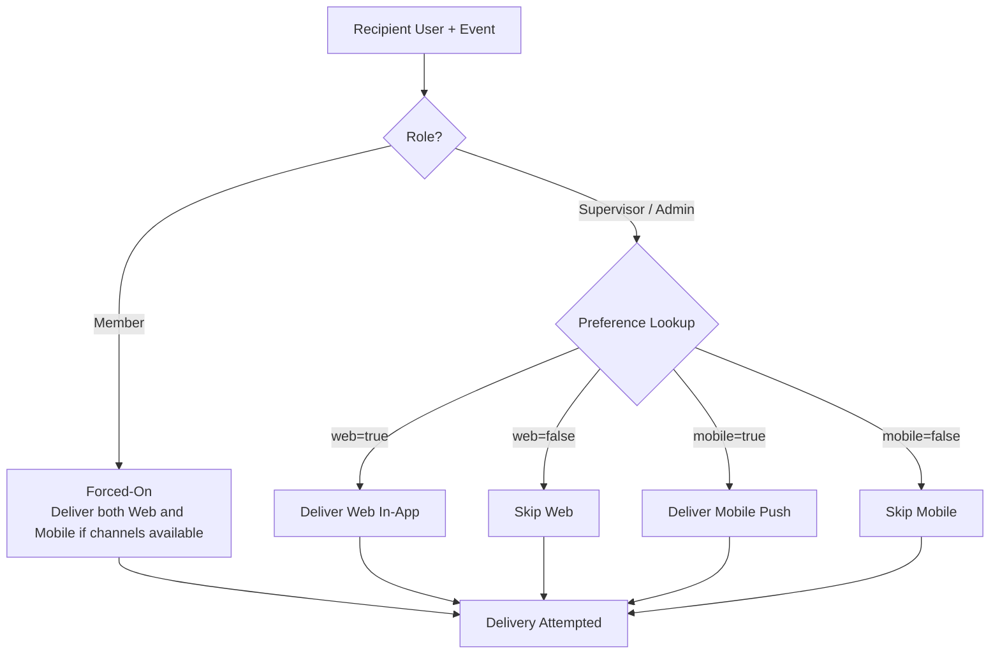
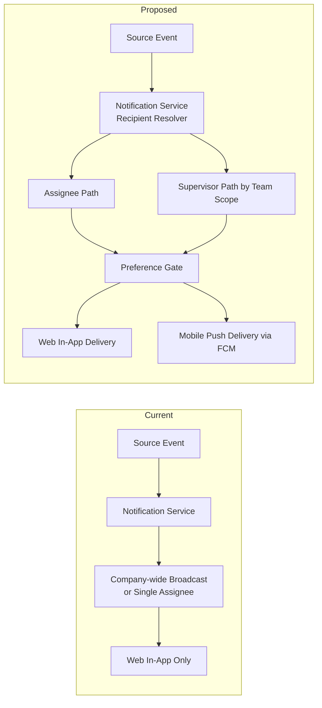

# BRD v0 — Notification Recipient & Channel Expansion

## Document Control
- **Document Type:** BRD v0
- **Feature Name:** Notification Recipient & Channel Expansion
- **Domain:** Cross-domain — Conversation, Ticket, Notification, People, Mobile
- **Author:** Dany Christian
- **Prepared By:** Dany Christian
- **Engineering Lead:** Naftal Yunior
- **Status:** Draft v0 — gap-aware
- **Date:** 2026-07-13
- **Input Reference:** `Assessments/cross-domain/notification-recipient-channel-expansion/notification-recipient-channel-expansion-change-intake-brief.md`

---

## 1. Executive Summary

SatuInbox needs notification behavior that is stricter for operational work items and broader in delivery channel support.

For `conversation` and `ticket`, notification must no longer behave like general company-wide signal. Notification must go to:
- assigned member(s), regardless of role
- supervisor(s) whose scope covers team inbox for relevant intake and assignment events

At the same time, delivery must expand from web-only to:
- web in-app notification
- mobile push notification via Firebase / FCM

Channel controls must be independent:
- web can be disabled while mobile remains on
- mobile can be disabled while web remains on

Non conversation/ticket notification classes remain company-wide.

---

## 2. Business Problem

Current notification behavior is not yet aligned with operational ownership.

Problems:
1. conversation/ticket work items require precise recipient targeting, but notification architecture still contains company-wide pattern that is valid only for non-operational notification classes.
2. supervisor visibility for team inbox intake and assignment is not yet formalized as business behavior.
3. users do not have independent web vs mobile notification controls.
4. mobile push notification does not yet exist.
5. notification behavior must cover both conversation and ticket domains consistently.

Impact:
- users can receive irrelevant noise
- operational stakeholders can miss assignment / intake awareness
- product cannot support channel-specific preference behavior
- mobile experience is incomplete

---

## 3. Business Goal

Build notification behavior that:
1. delivers conversation/ticket alerts only to operationally relevant users
2. preserves company-wide notification only for company-level classes
3. adds mobile push as first-class delivery channel
4. lets users control web and mobile notification independently
5. supports supervisor monitoring of team inbox activity without breaking assignee ownership model

---

## 4. Scope

### In Scope
- Conversation notification recipient refinement
- Ticket notification recipient refinement
- Supervisor notification for:
  - item enters team inbox
  - item gets assigned
- Independent user preference for:
  - web notification enable/disable
  - mobile notification enable/disable
- Mobile push notification via Firebase / FCM
- Backend recipient resolution and channel gating
- People-service integration for supervisor resolution by team inbox / team scope

### Out of Scope
- Email notification
- Full redesign of notification center UX
- Full RBAC redesign
- Replacing websocket architecture
- Changing company-wide notification behavior for billing/wallet/subscription/plan-changed except preserving current validity

---

## 5. Business Rules

### BR-1 — Assignee notification
For every conversation/ticket notification tied to operational ownership, assigned member must receive notification.

### BR-2 — Role-agnostic assignment delivery
Assigned member receives notification regardless of role label. Member, admin, and supervisor remain eligible if assigned.

### BR-3 — Supervisor intake notification
Supervisor receives notification when conversation/ticket enters team inbox, based on supervisor team scope.

### BR-4 — Supervisor assignment notification
Supervisor receives notification when conversation/ticket is assigned within team inbox scope.

### BR-5 — Multi-team supervisor support
A supervisor may belong to multiple teams and must receive notification for all eligible team scopes.

### BR-6 — Web and mobile preference independence
Web and mobile notification preferences are separate. Disabling one channel does not disable the other.

### BR-7 — Default preference state
Default state for both web and mobile notification is ON.

### BR-8 — Channel hard stop
If a channel is disabled for a user, that user must not receive notification through that channel.

### BR-9 — Preference eligibility by role
Only `Supervisor` and `Admin` can configure notification channel preferences.

### BR-10 — Member forced-on behavior
Member users are forced-on permanently and cannot disable conversation/ticket notifications.

### BR-11 — Company-wide exception
Notification classes not tied to conversation/ticket assignee workflow remain allowed to use company-wide delivery.

### BR-12 — Dual-channel delivery allowed
If both web and mobile are enabled, same event may be delivered to both channels.

### BR-13 — Same-event recipient dedupe
If same user qualifies for same event through more than one recipient path, system must deliver only one notification for that event.

---

## 6. Target User / Stakeholder

### Primary Stakeholders
- Assigned agents / members
- Admin users who are direct assignees
- Supervisors monitoring team inbox activity
- Product operations

### Supporting Stakeholders
- Backend engineering
- Frontend web engineering
- Mobile engineering
- QA / automation

---

## 7. Functional Requirements

### FR-1 Assignee notification for conversation
System shall send notification for eligible conversation events to assigned member(s) only, plus eligible supervisors where supervisor rule applies.

### FR-2 Assignee notification for ticket
System shall send notification for eligible ticket events to assigned member(s) only, plus eligible supervisors where supervisor rule applies.

### FR-3 Supervisor intake notification
System shall notify eligible supervisors when conversation/ticket enters a supervised team inbox.

### FR-4 Supervisor assignment notification
System shall notify eligible supervisors when conversation/ticket is assigned in a supervised team inbox.

### FR-5 Web preference control
System shall provide per-user preference to enable/disable web notification delivery for `Supervisor` and `Admin` only.

### FR-6 Mobile preference control
System shall provide per-user preference to enable/disable mobile push notification delivery for `Supervisor` and `Admin` only.

### FR-7 Member forced-on rule
System shall always deliver conversation/ticket notifications to assigned `Member` users because `Member` users cannot disable notification.

### FR-8 Mobile push delivery
System shall deliver mobile notification through Firebase / FCM when mobile notification is enabled and a valid device token exists.

### FR-9 Recipient deduplication
System shall prevent duplicate delivery to same user for same event when user qualifies through multiple recipient paths.

### FR-10 Event separation
System shall keep different events as separate notifications and must not coalesce them into one notification.

### FR-11 Company-wide preservation
System shall preserve current company-wide notification behavior for non conversation/ticket notification classes.

### FR-12 Backward-compatible web path
System shall preserve existing websocket/in-app notification behavior for users whose web notification remains enabled.

### FR-13 Notification category label
System shall distinguish notification category between `company-wide` and `conversation/ticket` notification classes.

---

## 8. Non-Functional Requirements

### NFR-1 Correctness
Conversation/ticket notification must not leak to unrelated users.

### NFR-2 Backward compatibility
Existing company-wide notification for non conversation/ticket classes must not regress.

### NFR-3 Extensibility
Delivery logic should support more than one channel without duplicating recipient resolution per source service.

### NFR-4 Operational simplicity
Implementation should reuse current assignment emitters and current notification-service hub where possible.

### NFR-5 Preference determinism
Channel preference evaluation must be deterministic and consistent across domains.

---

## 9. Current State

### Current confirmed state
1. **Conversation assignment notification already exists**
   - conversation-service emits assigned-user notification per participant
   - reference: `apps/conversation-service/src/app/services/conversation.service.ts:2133-2144, 2585-2618`

2. **Ticket assignment notification already exists**
   - ticket-service emits assigned-user notification per member user id
   - reference: `apps/ticket-service/src/app/services/ticket.service.ts:652-660, 1634-1642, 2070-2102`

3. **Notification-service already acts as centralized notification ingestion hub**
   - receives `IN_APP_NOTIFICATION_CREATE`
   - creates notification record
   - emits websocket-facing event
   - reference: `apps/notification-service/src/app/processors/in-app-notification.processor.ts`

4. **People-service foundations exist but direct supervisor lookup contract not yet confirmed**
   - `GetTeamsByUserId`
   - `GetMembersByIds`
   - reference: `proto/people.proto:38-49, 52-70`

### Current gaps still open
1. exact event source for “conversation enters team inbox” not yet locked
2. exact event source for “ticket enters team inbox” not yet locked
3. exact event payload field carrying `teamId` / `teamInboxId` for supervisor resolution not yet locked
4. exact people-service contract for resolving active supervisor recipients by team scope not yet locked
5. exact API surface for preference management and mobile device token registration not yet locked

---

## 10. Current vs Proposed State

### Current State
- Web notification exists
- Mobile push notification does not exist
- Conversation/ticket assignment notification already emits to direct assignee path
- Supervisor intake/assignment notification is not formalized
- Web/mobile channel preference split does not exist
- Some notification classes still validly use company-wide delivery

### Proposed State
- Web notification remains
- Mobile push notification added via Firebase / FCM
- Conversation/ticket notification uses assignee-specific recipient model
- Supervisor receives intake and assignment notifications by team scope
- Web preference and mobile preference managed independently
- Company-wide delivery preserved only for non conversation/ticket notification classes

---

## 11. Proposed Business Flow

### 11.1 Conversation / Ticket Assignee Flow
1. eligible event occurs in conversation-service or ticket-service
2. source service resolves direct assignee path using existing helper
3. notification event is emitted to notification-service
4. notification-service evaluates recipient preference
5. if web enabled, create in-app notification and emit websocket event
6. if mobile enabled, send FCM push
7. if both channels disabled, skip recipient delivery

### 11.2 Supervisor Flow
1. eligible intake or assignment event occurs
2. system resolves team/team inbox scope
3. system resolves eligible supervisor user IDs for that scope
4. system emits notification event per supervisor recipient
5. notification-service applies web/mobile preference independently
6. same supervisor must not receive duplicate delivery for same event

### 11.3 Company-wide Flow
1. non conversation/ticket company-level event occurs
2. existing company-wide behavior continues
3. this BRD does not redefine that recipient model

### 11.4 Notification Flow Diagrams

The diagrams below describe intended notification behavior. They complement the numbered flows above and must remain consistent with the Business Rules in section 5 and the Event Breakdown in section 12.

#### 11.4.1 High-Level Notification Flow

#### 11.4.2 Recipient Resolution Decision Tree

#### 11.4.3 Preference Gate Decision Tree

#### 11.4.4 Current vs Proposed State Diagram

---

## 12. Notification Event Breakdown (v0)

| Event | Domain | Trigger Summary | Recipient | Delivery Type | Source Channel Coverage | Notification Category | Dedupe Rule | Notes |
|---|---|---|---|---|---|---|---|---|
| Conversation entered team inbox | Conversation | New conversation enters team inbox queue | Supervisor by team scope | both | all supported source channels | conversation_ticket | same-event same-user dedupe = yes; cross-event coalesce = no | exact technical trigger source still TBD |
| Conversation assigned | Conversation | Conversation assigned to member | Assigned member; Supervisor by team scope | both | all supported source channels | conversation_ticket | same-event same-user dedupe = yes; cross-event coalesce = no | assignee event path confirmed in conversation-service |
| Conversation reopened | Conversation | Conversation reopened and routed back into active work | Assigned member only | both | all supported source channels | conversation_ticket | same-event same-user dedupe = yes; cross-event coalesce = no | supervisor behavior on reopen not yet decided |
| Ticket entered team inbox | Ticket | New ticket enters team inbox queue | Supervisor by team scope | both | inherits from originating conversation channel | conversation_ticket | same-event same-user dedupe = yes; cross-event coalesce = no | exact technical trigger source still TBD |
| Ticket assigned | Ticket | Ticket assigned to member | Assigned member; Supervisor by team scope | both | inherits from originating conversation channel | conversation_ticket | same-event same-user dedupe = yes; cross-event coalesce = no | assignee event path confirmed in ticket-service |
| Ticket reopened | Ticket | Ticket reopened and routed back into active work | Assigned member only | both | inherits from originating conversation channel | conversation_ticket | same-event same-user dedupe = yes; cross-event coalesce = no | supervisor behavior on reopen not yet decided |
| Company billing notice | Company | Billing event impacts company | Company-wide | web in-app | n/a | company_wide | n/a | preserved as-is |
| Company subscription status change | Company | Subscription state change on company | Company-wide | web in-app | n/a | company_wide | n/a | preserved as-is |
| Company wallet balance notice | Company | Wallet balance threshold or top-up event | Company-wide | web in-app | n/a | company_wide | n/a | preserved as-is |
| Company plan change | Company | Company plan updated by SuperAdmin or subscription flow | Company-wide | web in-app | n/a | company_wide | n/a | preserved as-is |
| Company system announcement | Company | Product/platform level announcement | Company-wide | web in-app | n/a | company_wide | n/a | preserved as-is |

### 12.1 Events explicitly Out of Scope for v0
The following events are **not covered by this BRD v0**. They may be added in later versions.

| Event | Domain | Reason for exclusion |
|---|---|---|
| Conversation closed | Conversation | Not part of operational ownership alerting in v0 |
| Conversation transferred | Conversation | Team-scope re-evaluation not yet designed |
| Ticket transferred | Ticket | Team-scope re-evaluation not yet designed |
| Ticket status change / resolved | Ticket | Not part of operational alerting in v0 |
| SLA breach notification | Conversation, Ticket | Handled by SLA domain, deferred |
| Internal note mention | Conversation, Ticket | Mention semantics not defined in v0 |

### 12.2 Dedupe window
Same-event same-user dedupe window is defined as the **lifetime of the source event ID**, meaning:
- one delivered notification per (`userId`, `eventId`) pair
- retries of the same event ID must not create additional notifications
- different event IDs are always treated as separate notifications

### 12.3 Reopen supervisor rule
Supervisor is **not notified on reopen** in v0. This is intentional to avoid duplicate alerting when the assignee is already known and re-notified.

## 13. UI-Level Business Rules (v0)

BRD v0 does not define wireframes. It defines only UI-level business rules that must exist in the product experience.

### 13.1 Preference visibility
- Web notification toggle and mobile notification toggle must exist in user settings surface.
- Preference toggles must be **visible only to `Supervisor` and `Admin` roles**.
- Preference toggles must **not** appear in settings surface for `Member` role.

### 13.2 Notification category presentation
- Notification list surface must visually distinguish `conversation_ticket` notifications from `company_wide` notifications.
- Distinction may use label, icon, section grouping, or filter tab.
- Exact visual design is deferred to design phase, but the distinction is mandatory.

### 13.3 Mobile push presentation
- Mobile push notification must show:
  - actor / source context
  - entity type (`conversation` or `ticket`)
  - human-readable entity ID
  - short message describing the trigger
- Tapping the push must open the correct entity view in the mobile app.

### 13.4 Web toast and notification panel
- Web toast must respect existing throttle behavior.
- Web notification panel must reflect the same dedupe rule defined in section 12.2.

### 13.5 Empty state and disabled state
- If both web and mobile preferences are disabled by a `Supervisor` / `Admin`, the user must still be able to see the notification list but must not receive real-time delivery.
- Disabled state must be reflected on the toggle surface so the user understands the current preference state.

## 14. Dependencies

### Backend Dependencies
- conversation-service
- ticket-service
- notification-service
- people-service
- api-gateway

### Client Dependencies
- web app notification preference UI / API integration
- mobile app FCM integration

### External Dependencies
- Firebase / FCM configuration and credentials

---

## 13. Risks / Gaps / Assumptions

### Known Gaps
1. **Intake event gap**
   - Exact technical trigger for “item enters team inbox” not yet confirmed for conversation and ticket.

2. **Supervisor resolution gap**
   - Exact people-service RPC for active supervisor lookup by team/team inbox not yet confirmed.

3. **Payload contract gap**
   - `IN_APP_NOTIFICATION_CREATE` payload currently centers on recipient user ID and entity context.
   - Additional team scope may be needed for supervisor-intake path.

4. **Preference surface gap**
   - Exact endpoint and persistence model for web/mobile preference for `Supervisor` and `Admin` not yet frozen.

5. **Device token lifecycle gap**
   - Exact register/unregister and invalid-token cleanup behavior not yet frozen.

6. **Audit retention gap**
   - Audit/log retention is targeted at 3 months but implementation contract is not yet frozen.

### Working Assumptions For v0
- Existing assignee helpers will be reused, not replaced.
- Notification-service remains central place for channel gating.
- Non conversation/ticket notification classes remain company-wide.
- Supervisor lookup will require small people-service addition, not platform-wide RBAC redesign.
- Same user + same event is deduped into one notification.
- Different events stay separate and are not coalesced.
- Each notification should carry category distinction between `company-wide` and `conversation/ticket`.

---

## 14. Recommendation Before Freeze

This BRD v0 is suitable for:
- business alignment
- scope agreement
- solution direction review

This BRD v0 is **not yet suitable for package freeze** until these are closed:
1. intake event source mapping
2. team/teamInbox payload source
3. people-service supervisor lookup contract
4. preference and device-token API contract

---

## 15. Next Required Artifact

Create **Assessment Report** to close technical gaps and convert this BRD v0 into freeze-ready requirement package.

Assessment should answer:
- exact event-to-recipient matrix
- exact service and file where intake events originate
- exact payload changes needed
- exact people-service contract addition
- exact preference data model and API surface
- regression impact on unread count, websocket path, and notification center behavior

---

## 16. Approval Notes

This document is intentionally gap-aware.

It captures locked business intent and known technical direction, while explicitly deferring unresolved implementation-contract details to next assessment phase.
