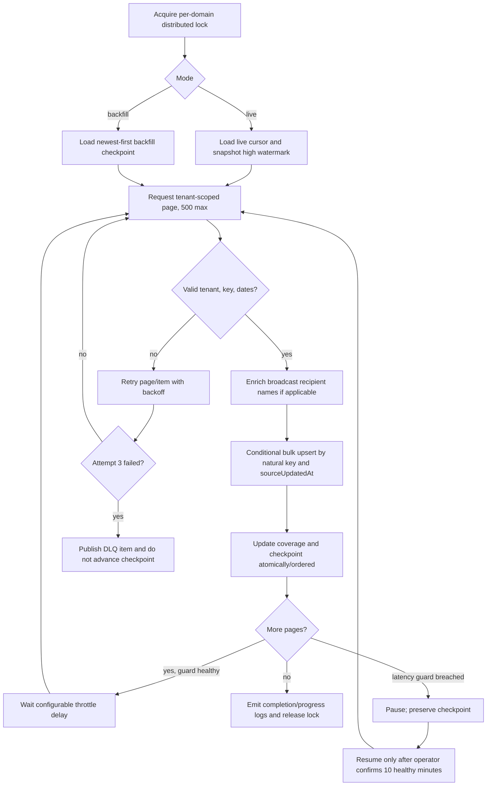

# Advance Export Phase 1 — Sync and Backfill Activity

```mermaid
flowchart TD
    A[Acquire per-domain distributed lock] --> B{Mode}
    B -->|live| C[Load live cursor and snapshot high watermark]
    B -->|backfill| D[Load newest-first backfill checkpoint]
    C --> E[Request tenant-scoped page, 500 max]
    D --> E
    E --> F{Valid tenant, key, dates?}
    F -->|no| G[Retry page/item with backoff]
    F -->|yes| H[Enrich broadcast recipient names if applicable]
    H --> I[Conditional bulk upsert by natural key and sourceUpdatedAt]
    I --> J[Update coverage and checkpoint atomically/ordered]
    J --> K{More pages?}
    K -->|yes, guard healthy| L[Wait configurable throttle delay]
    L --> E
    K -->|no| M[Emit completion/progress logs and release lock]
    K -->|latency guard breached| N[Pause; preserve checkpoint]
    N --> O[Resume only after operator confirms 10 healthy minutes]
    O --> E
    G --> P{Attempt 3 failed?}
    P -->|no| E
    P -->|yes| Q[Publish DLQ item and do not advance checkpoint]
```

---
_Diagram for PRD-A (Foundation) v2.3. Verified against PRD + BE 2026-09-15; no change needed._
