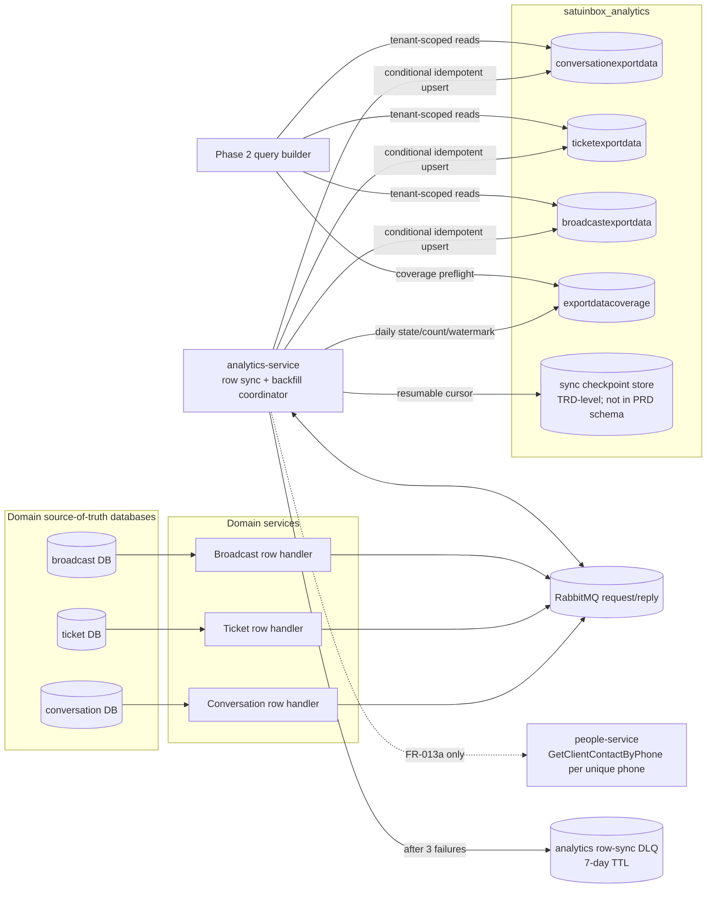

# Advance Export Phase 1 — Data Flow

Trust boundaries:
- Domain services alone read their operational databases.
- Analytics receives materialized rows over RabbitMQ; it never cross-reads a domain database.
- Every request, checkpoint, coverage document, and row carries `companyId` and `organizationId`.

---
_Diagram for PRD-A (Foundation) v2.3. Updated 2026-09-15: MessagePattern name → `ANALYTICS_AGGREGATE_*` (FR-013), people-service enrichment → per-phone `GetClientContactByPhone` (FR-013a, BE-verified). See PRD Revision History._
