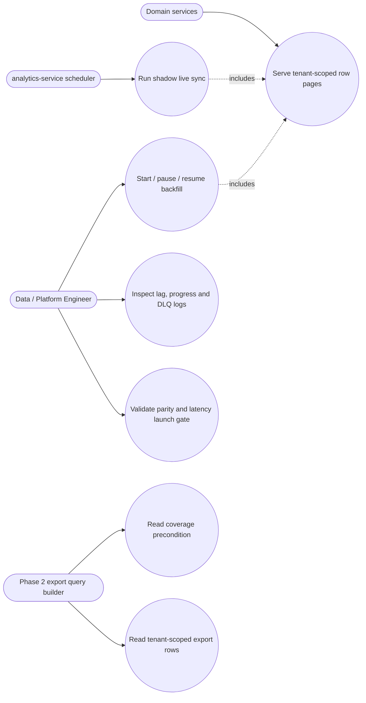

# Advance Export Phase 1 — Use Cases

```mermaid
flowchart LR
    DE([Data / Platform Engineer])
    AS([analytics-service scheduler])
    P2([Phase 2 export query builder])
    DS([Domain services])

    U1((Run shadow live sync))
    U2((Start / pause / resume backfill))
    U3((Inspect lag, progress and DLQ logs))
    U4((Validate parity and latency launch gate))
    U5((Read coverage precondition))
    U6((Read tenant-scoped export rows))
    U7((Serve tenant-scoped row pages))

    DE-->U2
    DE-->U3
    DE-->U4
    AS-->U1
    P2-->U5
    P2-->U6
    DS-->U7
    U1-.includes.->U7
    U2-.includes.->U7
```

---
_Diagram for PRD-A (Foundation) v2.3. Verified against PRD + BE 2026-09-15; no change needed._
