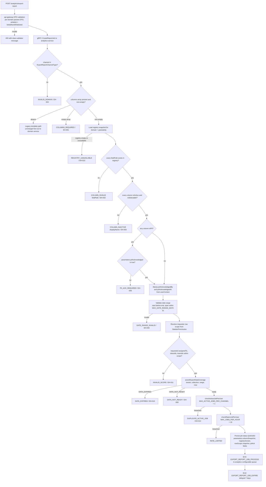
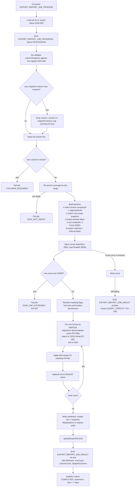

# Advance Export Phase 2 — Configurable Export Activity

Two activities: (A) job creation validation in `analytics-service`
`ExportReportJobService.createReportJob`, and (B) configurable job processing in
the new analytics-owned generator. Both are Phase-2 scope; the legacy per-domain
RMQ fan-out path is untouched and runs in parallel (epic D5, PRD §20.7).

## A. Job creation — validation ladder

The order below is binding. Each gate returns before the next one runs, so a
caller never sees a masked-over failure.

Notes:

- The row-scope predicate is snapshotted at creation (EC-010): a mid-flight
  permission change does not alter an already-queued job.
- `assertExportDataCoverage` is the Phase-1 contract
  (`trd/trd-advance-export-phase-1-row-level-collections.md` §6.6). Its
  evaluation order — expiry before coverage, stale-live-day last — is
  authoritative and must not be reordered here.
- Legacy jobs (no `columns[]`) skip gates F..O entirely and keep their current
  behavior (epic D1 / TRD TD1).

## B. Job processing — configurable generator

Notes:

- Zero rows is a success, not a failure: the workbook is written with the header
  row only and the job completes (EH-014, EC-007).
- `$limit 20001` is deliberate — it detects cap breach without materializing an
  unbounded result set (NFR-004, ASM-003, epic D3 / TRD TD10).
- Streaming XLSX is explicitly out of scope; the writer stays SheetJS in-memory.

---
_Diagram supporting **PRD-B v2.2** (Configurable Column Export). Verified vs PRD-B + BE 2026-09-16: no change (offlinereportjobs, uploadExportFileToS3, processor:79-81 all confirmed accurate)._
