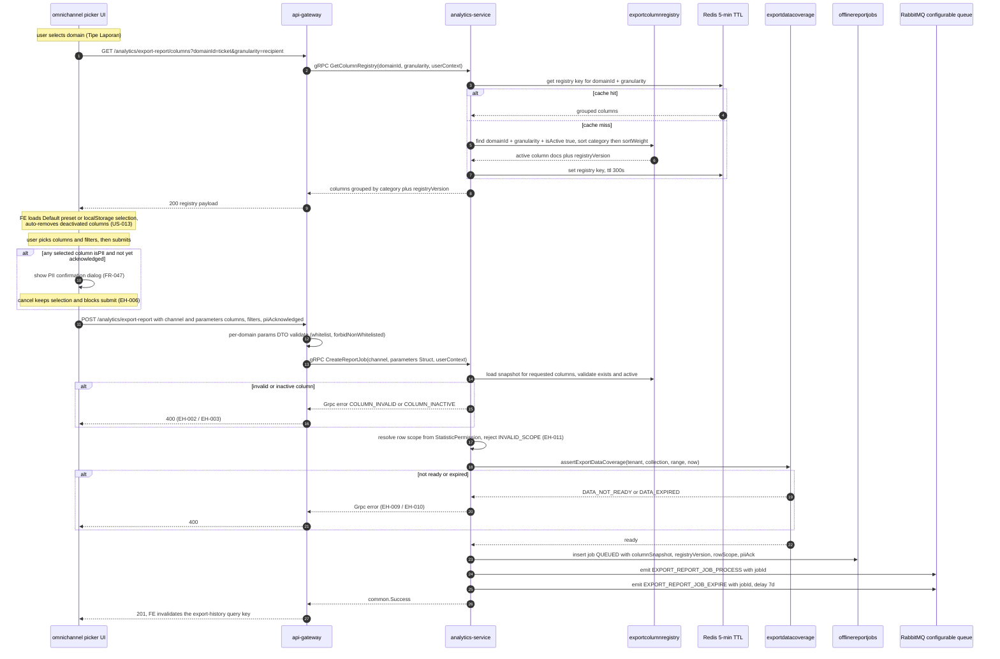
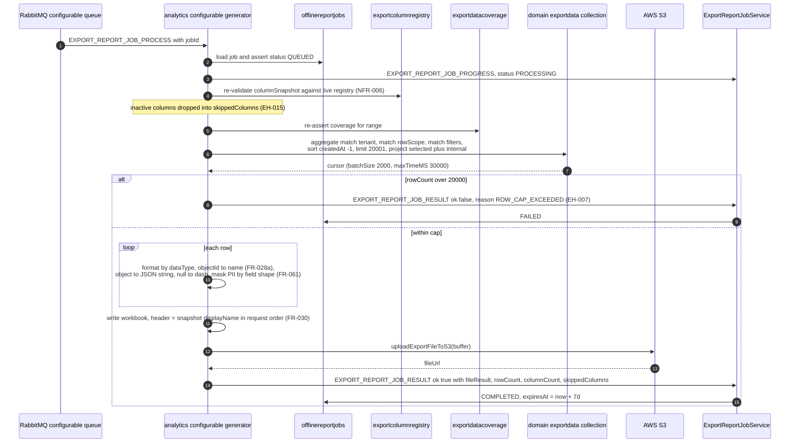

# Advance Export Phase 2 — Configurable Export Sequence

Two sequences: (A) column-picker load + configurable job submission, and
(B) analytics-owned configurable job processing. HTTP surface is unchanged
(`GET/POST /analytics/export-report`,
`apps/api-gateway/src/app/analytics/export-report-job.controller.ts:53,91,138,188,230`);
the new work is a gRPC `GetColumnRegistry` RPC plus configurable-path branches.

## A. Picker load and job submission

## B. Configurable job processing

Notes:

- The generator reads the Phase-1 analytics collections directly (epic D5, PRD
  §20.7). It never fans out to ticket/conversation/broadcast-service and never
  cross-reads a domain operational DB (backend-architecture rule).
- The sole cross-service call anywhere in the export path is Phase-1's
  people-service recipient-name enrichment during sync — not in Phase-2's read
  path.
- Masking is **field-shape and per-permission**: `privacy:view_full_phone` and
  `privacy:view_full_email` are evaluated independently (FR-061, TRD TD8), which
  supersedes the legacy composite OR-check in the shipped processors
  (`apps/ticket-service/src/app/processors/export-job.processor.ts:79-81`).
  Name/free-text PII columns are never run through `maskPhone()` — they are
  governed by the acknowledgment record instead. `senderNumber` is company-owned
  and never masked (PRD FR-004, v2.2).

---
_Diagram supporting **PRD-B v2.2** (Configurable Column Export). Verified vs PRD-B + BE 2026-09-16: no change (offlinereportjobs, uploadExportFileToS3, processor:79-81 all confirmed accurate)._
