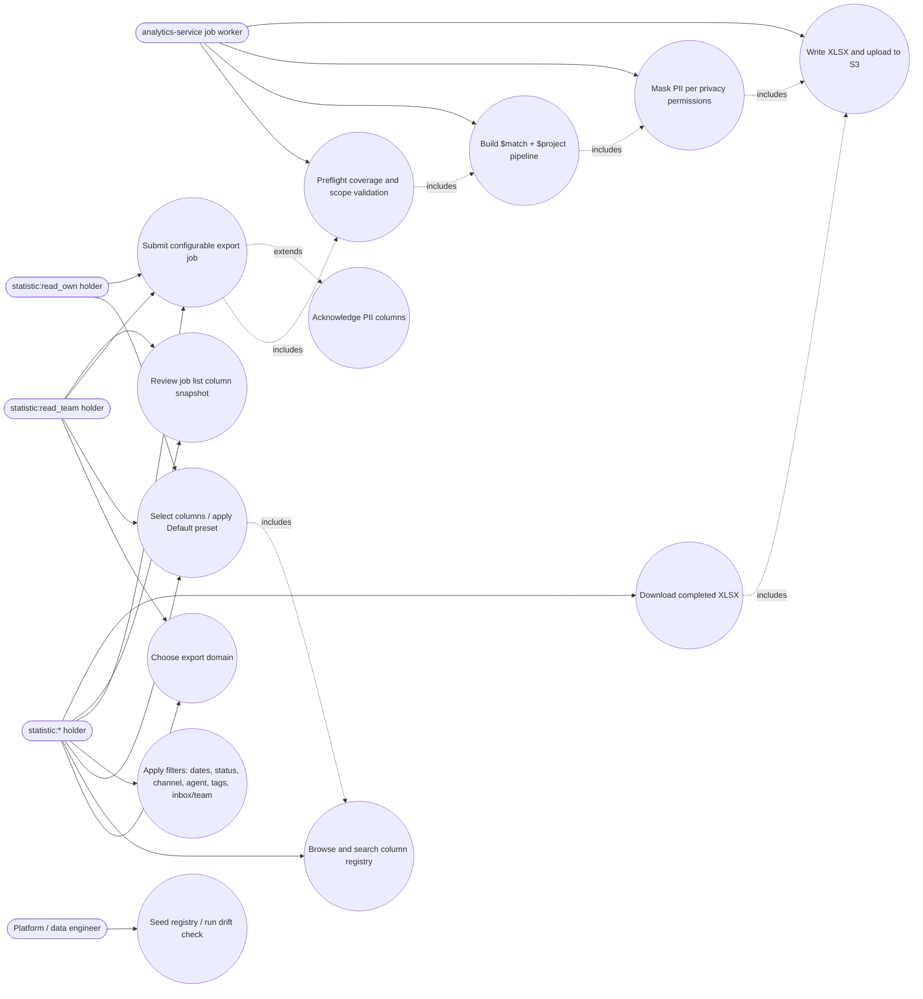

# Advance Export Phase 2 — Use Cases

Column Registry + Configurable Column Export. Actors are RBAC roles, not job
titles: any role holding the named `StatisticPermission` value can perform the
use case (`libs/common/src/lib/constants/default-permission.constant.ts:129-134`).

Scope boundaries encoded above:

- `U4` extends `U6` only when at least one selected column carries
  `isPII: true` (FR-047, FR-048, EH-006).
- `U9` is the coverage + `INVALID_SCOPE` gate (FR-025a, FR-026b). It runs at
  **job creation**, before the job is queued, so an unready or out-of-scope
  request never reaches the worker.
- `U11` masks by **field shape**, evaluating `privacy:view_full_phone` and
  `privacy:view_full_email` **independently** (FR-061, TRD TD8). This deliberately
  supersedes the legacy composite OR-check shipped in the domain processors
  (`apps/ticket-service/src/app/processors/export-job.processor.ts:79-81`), which
  masks everything when either permission is missing and blanks name fields.
- `U13` is operational, not user-facing: the registry is seeded by script and
  guarded by the field-name-aware drift check (FR-064).
- Campaign-granularity aggregation (`$group`) is **not** in this diagram — it is
  the Phase-3 extension of `U10` (FR-029a).

---
_Diagram supporting **PRD-B v2.2** (Configurable Column Export). Reviewed vs PRD-B + BE 2026-09-16: fixed StatisticPermission line ref 131-137 → 129-134._
