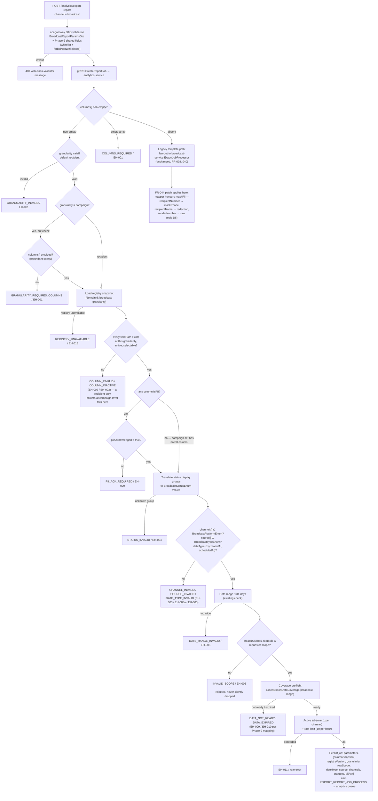

# Advance Export Phase 3 — Broadcast Export Activity

Two activities: (A) broadcast job creation — the Phase-2 ladder extended with the Phase-3
broadcast gates, and (B) campaign-granularity generation in analytics-service
(`BroadcastCampaignPipelineBuilder`, implementing Phase-2's FR-029a extension point).
The legacy broadcast path is untouched apart from the FR-044 mapper patch (§6.7.1 of the
TRD) and is drawn at the end of (A).

## A. Job creation — broadcast validation ladder

The order below is binding. Each gate returns before the next one runs, so a caller never
sees a masked-over failure. Gate numbers match TRD §6.3.2.

## B. Campaign-granularity generation — the aggregation pipeline

Runs inside the Phase-2 `ConfigurableExportProcessor` in analytics-service (epic D5). Stage
order is binding: tenant first, row scope before `$group`, cap after `$group`.

```mermaid
flowchart TD
    S0["Job dequeued from analytics configurable queue"] --> S1["Emit EXPORT_REPORT_JOB_PROGRESS<br/>(one-shot QUEUED → PROCESSING, NFR-013b)"]
    S1 --> S2["Select builder by granularity:<br/>recipient → Phase-2 $match+$project<br/>campaign → BroadcastCampaignPipelineBuilder"]
    S2 -->|recipient| R["Phase-2 recipient path<br/>($match → $sort → $limit 20001 → $project)"]
    S2 -->|campaign| S3

    subgraph S3["$match stage (TRD §6.4.2)"]
        direction TB
        T1["stage[0]: {companyId, organizationId}"] --> T2["append parameters.rowScope snapshot<br/>(epic D4 — BEFORE $group so counts<br/>cannot leak out-of-scope rows)"] --> T3["date range on dateType field<br/>(createdAt OR scheduledAt; null scheduledAt<br/>never matches → excluded, FR-028)"] --> T4["optional: broadcastChannel $in,<br/>source $in, status $in (translated),<br/>creatorUserId $in, teamInboxIdAtSendTime $in"]
    end

    S3 --> S4["$group by {companyId, organizationId, batchId}<br/>(FR-021, FR-025 — batchId = BroadcastBatch._id,<br/>NEVER broadcastId = recipient PK)"]
    S4 --> S5["batch metadata via $first:<br/>batchName ← $batchName (BroadcastBatch.name,<br/>NEVER $broadcastName — recipient-suffixed),<br/>channel, source, dates, creator, team,<br/>senderAccountName, senderNumber, templateUsed"]
    S5 --> S6["counts: totalRecipients = $sum 1;<br/>successCount (delivered),<br/>inProgressCount (pending+processing+sent),<br/>processingCount (raw+text_processing+text_processed+retry),<br/>scheduledCount (schedule), failedCount,<br/>canceledCount, invalidCount;<br/>nonTerminalCount (internal only)"]
    S6 --> S7["$addFields: successRate =<br/>round(successCount/totalRecipients*100, 2),<br/>null when totalRecipients = 0;<br/>campaignStatus = BERLANGSUNG if<br/>nonTerminalCount > 0 else SELESAI (token, TD11)"]
    S7 --> S8["$sort {createdAt: -1}"]
    S8 --> S9["$limit 20001"]
    S9 --> S10["Execute with maxTimeMS 30s<br/>(TD7 timeout guard — no worker thread)"]
    S10 -->|MaxTimeMSExpired| F1["AGGREGATION_TIMEOUT / EH-007<br/>job FAILED, no retry —<br/>same range will time out again"]
    S10 -->|ok| S11{"rows yielded > 20,000?"}
    S11 -->|yes| F2["ROW_CAP_EXCEEDED / EC-004<br/>campaign-cap-exceeded copy;<br/>rejected BEFORE generation (epic D3)"]
    S11 -->|no| S12["$project from columns[]:<br/>batchId ← $_id.batchId (always),<br/>selected columns only,<br/>nonTerminalCount NEVER projected (TD14)"]
    S12 --> S13["Format + mask rows:<br/>null → '-', dates Asia/Jakarta,<br/>campaignStatus token → localised copy,<br/>recipient PII masked (composite OR) —<br/>campaign rows carry no recipient PII at all"]
    S13 --> S14["Zero rows?"]
    S14 -->|yes| S15["COMPLETED with headers-only XLSX<br/>(EH-010 / EH-012 / US-016 AC3)"]
    S14 -->|no| S16["SheetJS in-memory XLSX<br/>(no exceljs, epic D3) →<br/>S3 upload → EXPORT_REPORT_JOB_RESULT:<br/>rowCount, groupCount, aggregation_duration_ms,<br/>generation_duration_ms, file_size_bytes (NFR-018)"]
    S15 --> S16R["set expiresAt = now + 7 days<br/>(EXPIRATION_DELAY_MS, NFR-014)"]
    S16 --> S16R
```

Invariant asserted at this layer (TRD §6.4.3, TD10): the seven count predicates partition
all 12 `BroadcastStatusEnum` values, so `totalRecipients` = exact sum of the seven count
columns — verified by a static partition test and a runtime arithmetic test over a
12-status fixture.

---
_Diagram supporting **PRD-C v2.1** (Broadcast Export). Verified vs PRD-C + BE 2026-09-16: no change (processor:72-74 OR-mask, service:299 _maskPii, FIXED_HEADERS=20, dispatch:379-386, enums 705/1218 all confirmed accurate; totalRecipients 7-count partition matches PRD Appendix A)._
