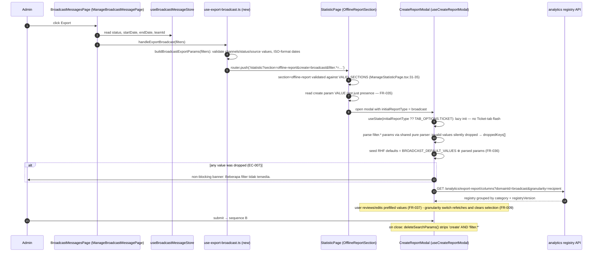
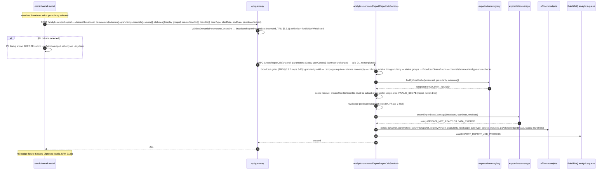
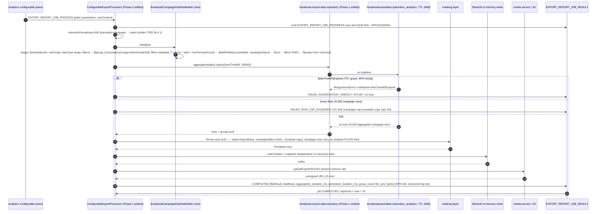

# Advance Export Phase 3 — Broadcast Export Sequence

Three sequences: (A) the redirect from Broadcast > Messages into the Offline Report modal
with URL-param prefill (FR-034..037 — all-new frontend work), (B) broadcast configurable
job submission with the granularity and filter contract, and (C) campaign-granularity
generation in analytics-service. HTTP surface is unchanged from Phase 2
(GET/POST /analytics/export-report,
apps/api-gateway/src/app/analytics/export-report-job.controller.ts:53,91,138,188,230);
Phase 3 adds no endpoint and edits no proto (TRD §11.4).

## A. Redirect from Broadcast > Messages

## B. Broadcast configurable job submission

## C. Campaign-granularity generation (analytics-service, epic D5)

Legacy-path note: a job without columns[] never reaches this sequence — it is
dispatched to broadcast-service's ExportJobProcessor
(apps/analytics-service/src/app/services/export-report-job.service.ts:379-386) and
generated inline by BroadcastExportService (no worker thread,
broadcast-export.service.ts:328-346), with the FR-044 mapper patch applied there
(TRD §6.7.1). Both paths mask recipient PII with the same composite OR rule; senderNumber
is raw on both (epic D8).

---
_Diagram supporting **PRD-C v2.1** (Broadcast Export). Verified vs PRD-C + BE 2026-09-16: no change (processor:72-74 OR-mask, service:299 _maskPii, FIXED_HEADERS=20, dispatch:379-386, enums 705/1218 all confirmed accurate; totalRecipients 7-count partition matches PRD Appendix A)._
