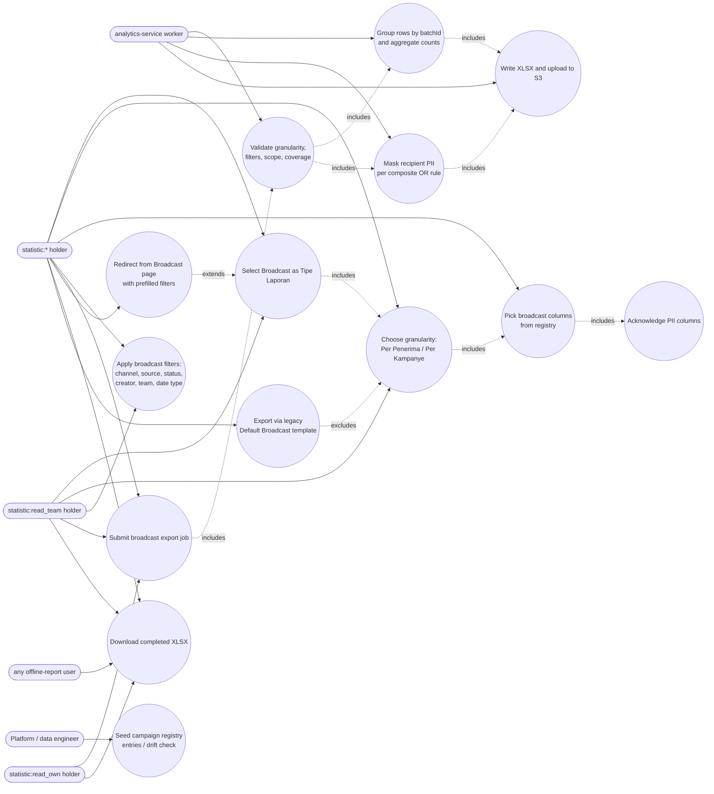

# Advance Export Phase 3 — Broadcast Export Use Cases

Actors are RBAC roles, not job titles: any role holding the named `StatisticPermission`
value (`libs/common/src/lib/constants/default-permission.constant.ts:129-134`) can perform
the use case. Phase 3 adds broadcast-specific UX over the Phase-2 configurable export
system, plus the FR-044 live PII fix that applies to both the configurable and the legacy
broadcast export path.

Scope boundaries encoded above:

- `U4` extends `U6` only when a selected column carries `isPII: true` **and** the
  granularity is `recipient` — the campaign column set has no PII column (FR-041, FR-043,
  NFR-012), so the PII dialog never fires at campaign level.
- `U7` extends `U1`: the redirect preselects the Broadcast tab and seeds the form from URL
  params; every value stays editable before submit (FR-037).
- `U13` **excludes** `U2`: the legacy "Default Broadcast" template path is recipient-level
  only; a campaign-level request without `columns[]` is rejected
  (`GRANULARITY_REQUIRES_COLUMNS`), never downgraded (FR-038..040).
- `U11` applies to **both** `U6` (configurable) and `U13` (legacy): FR-044 patches the
  legacy row mapper (`broadcast-export.service.ts:294-326`) and the configurable path
  applies the same composite OR rule. `senderNumber` is masked in neither — it is the
  company-owned sender number, not recipient PII (epic D8).
- `U2`/`U5` are Admin-usable but Supervisor-reachable; a Supervisor's submitted filters and
  aggregates are scope-constrained by the Phase-2 row-scope predicate applied before the
  `$group` (US-009 AC1).

---
_Diagram supporting **PRD-C v2.1** (Broadcast Export). Reviewed vs PRD-C + BE 2026-09-16: fixed StatisticPermission line ref 131-137 → 129-134. SVG unaffected (change is in prose, not mermaid)._
