# Advance Export Phase 4 — SAP Template Preset Activity Diagram

Companion TRD: [`trd/trd-advance-export-phase-4-sap-template-preset.md`](../trd/trd-advance-export-phase-4-sap-template-preset.md)

Validation order matches the shipped `createReportJob` sequence
(`apps/analytics-service/src/app/services/export-report-job.service.ts:86-128`);
the two new gates (privacy-pair, entitlement) are inserted before job creation.

```mermaid
flowchart TD
    subgraph FE["Frontend - omnichannel app"]
        FE1["User opens Statistic - Offline Report"]
        FE2{"features.sapExportEnabled?"}
        FE3["Tab 'SAP Report' visible"]
        FE4["Select / deselect sheets"]
        FE5["Apply filters: max 31d, status, channel, assignee"]
        FE6["Click Submit"]
        FE7["Toast: Laporan sedang diproses"]
    end

    subgraph GW["api-gateway - HTTP only"]
        GW1["POST /analytics/export-report"]
        GW2["JwtAuthGuard + PermissionsGuard - statistic:read"]
        GW3["Throttle DEFAULT_RATE_LIMIT_MAX = 100 per 60s"]
        GW4["Build UserContext, call gRPC CreateReportJob"]
    end

    subgraph AS["analytics-service - job intake"]
        AS1["gRPC CreateReportJob"]
        AS2{"channel is sap?"}
        AS3["Validate SapReportParamsDto - whitelist, forbidNonWhitelisted"]
        AS4{"Date range within 31 days?"}
        AS5{"At least 1 sheet selected?"}
        AS6{"Duplicate active job - incl. sheets?"}
        AS7{"Active sap jobs under 1?"}
        AS8{"Hourly count under 10?"}
        AS9{"Holds BOTH privacy view_full perms?"}
        AS10{"company.features.sapExportEnabled?"}
        AS10b{"Holds statistic:export_sap?"}
        AS11["Per-sheet row precount under 200000?"]
        AS12["createWithTenant - status QUEUED"]
        AS13["emitWithDelay EXPIRE, 7 days"]
        AS14["dispatchExportJob - sap branch, emit to dedicated sap queue"]
        AS20["Reject: 400 validation or 403 permission"]
    end

    subgraph GEN["SAP generator - analytics-service"]
        G1["Consume EXPORT_REPORT_JOB_PROCESS"]
        G2["Read parameters.sheets"]
        G3["Emit EXPORT_REPORT_JOB_PROGRESS"]
        G4A["Stream ticketexportdata cursor"]
        G4B["Stream conversationexportdata cursor"]
        G4C["gRPC GetAuxIntervals to people-service"]
        G5["Init exceljs stream.xlsx.WorkbookWriter"]
        G6["Per sheet: headers row 1, then stream rows"]
        G7["commit workbook to temp file"]
        G8["Multipart PutObject via aws-sdk client-s3"]
        G9["Emit RESULT COMPLETED with fileResult"]
        G10["Emit RESULT FAILED with retryable flag"]
    end

    subgraph MQ["RabbitMQ"]
        MQ1["EXPORT_REPORT_JOB_PROCESS"]
        MQ2["EXPORT_REPORT_JOB_PROGRESS"]
        MQ3["EXPORT_REPORT_JOB_RESULT"]
        MQ4["EXPORT_REPORT_JOB_EXPIRE - delayed 7d"]
    end

    subgraph PROC["analytics-service processor"]
        P1["handleExportJobProgress - status PROCESSING"]
        P2["handleExportJobResult - COMPLETED, expiresAt now+7d"]
        P3["handleExportJobResult - FAILED, failureReason"]
        P4["handleExportJobExpire - deleteMedia, status EXPIRED"]
    end

    subgraph S3["AWS S3 - shared media bucket"]
        S31["Key companyId / export_reports / uuid_fileName"]
        S32["Presigned GET, 15 min expiry"]
    end

    subgraph DL["Download"]
        D1["User clicks Download in job list"]
        D2["GET /analytics/export-report/:id - cached"]
        D3["Browser fetches xlsx from S3"]
    end

    FE1 --> FE2
    FE2 -->|yes| FE3
    FE2 -->|no| FEX["Tab hidden - existing 3 tabs only"]
    FE3 --> FE4 --> FE5 --> FE6 --> FE7
    FE6 --> GW1 --> GW2 --> GW3 --> GW4 --> AS1
    AS1 --> AS2
    AS2 -->|yes| AS3 --> AS4
    AS4 -->|yes| AS5
    AS5 -->|yes| AS6
    AS6 -->|no| AS7
    AS7 -->|yes| AS8
    AS8 -->|yes| AS10
    AS10 -->|yes| AS10b
    AS10b -->|yes| AS9
    AS9 -->|yes| AS11
    AS11 --> AS12
    AS12 --> AS13 --> MQ4
    AS12 --> AS14 --> MQ1
    AS4 -->|no| AS20
    AS5 -->|no| AS20
    AS6 -->|yes| AS20
    AS7 -->|no| AS20
    AS8 -->|no| AS20
    AS9 -->|no| AS20
    AS10 -->|no| AS20
    AS10b -->|no| AS20
    MQ1 --> G1 --> G2
    G2 --> G3 --> MQ2 --> P1
    G2 --> G4A --> G5
    G2 --> G4B --> G5
    G2 --> G4C --> G5
    G5 --> G6 --> G7 --> G8 --> S31
    G8 -->|ok| G9 --> MQ3 --> P2
    G8 -->|error| G10 --> MQ3
    MQ3 --> P3
    MQ4 --> P4
    P2 --> D1 --> D2 --> S32 --> D3

    classDef gate fill:#f9d5e5,stroke:#333,stroke-width:2px
    classDef newwork fill:#d5e8f9,stroke:#333,stroke-width:2px
    classDef reject fill:#f9c5c5,stroke:#333,stroke-width:2px
    class AS9,AS10,AS10b gate
    class AS3,AS11,AS14,G1,G2,G4A,G4B,G4C,G5,G6,G7,G8,G9,G10 newwork
    class AS20,FEX reject
```

Legend: blue = new code in this phase, pink = new authorization gate,
red = rejection path. Everything unshaded already ships today.
