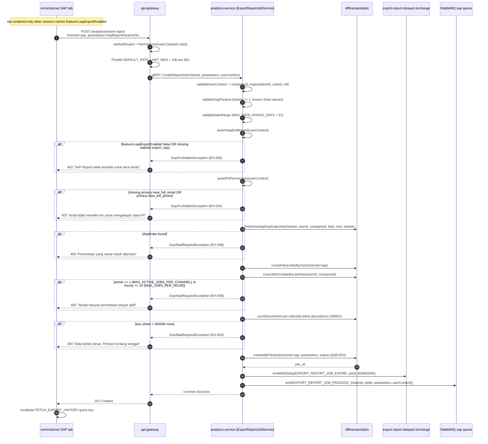
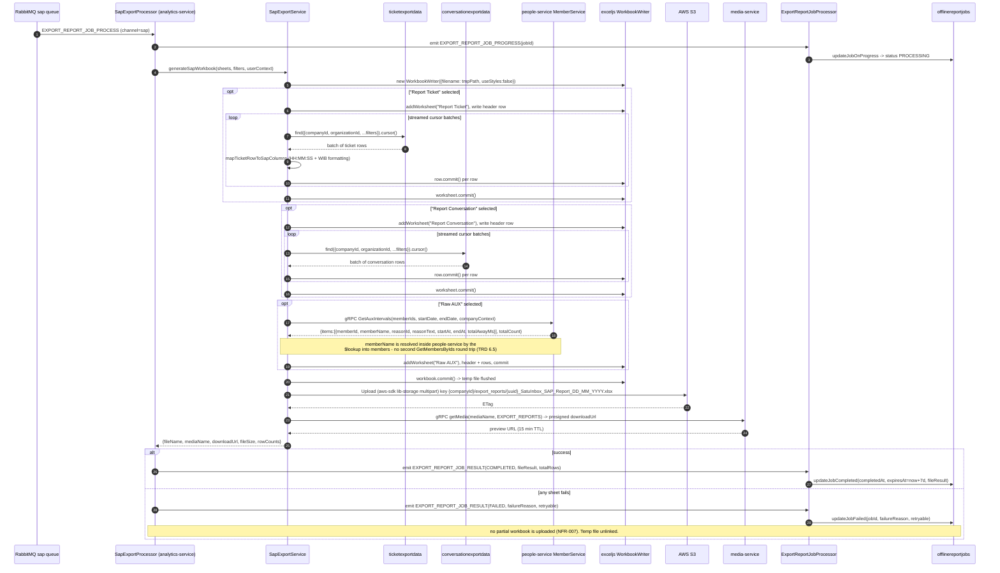
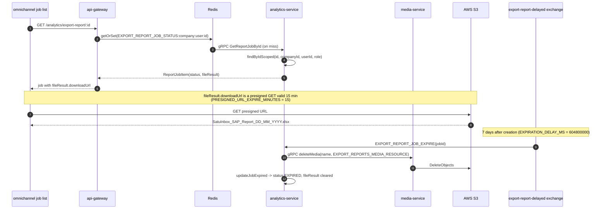

# Advance Export Phase 4 — SAP Template Preset Sequence

Three sequences: (A) SAP job submission with the new entitlement + PII gates,
(B) multi-sheet generation and direct-to-S3 upload, (C) download and expiry.

HTTP surface is unchanged — `POST/GET /analytics/export-report`
(`backend/apps/api-gateway/src/app/analytics/export-report-job.controller.ts:53,91,138,188,230`).
The new work is a `sap` value on `ExportReportChannelType`, a `SapReportParamsDto`,
a new `sap` branch in `dispatchExportJob` emitting to a **dedicated SAP RabbitMQ
queue** consumed by a new in-service processor, a new people-service
`GetAuxIntervals` RPC, and a direct S3 client in analytics-service.

Companion TRD: [`trd/trd-advance-export-phase-4-sap-template-preset.md`](../trd/trd-advance-export-phase-4-sap-template-preset.md)

## A. Submission and validation

## B. Multi-sheet generation and direct-to-S3

## C. Download and expiry

> The expiry path reuses the shipped `expireJob` unchanged
> (`export-report-job.service.ts:245-275`) — which is why §B must write the S3
> object under the **same** `{companyId}/{resource}/{mediaName}` key shape
> media-service builds (`apps/media-service/src/app/app.service.ts:301-314`).
> A different key layout would silently break both download and deletion.

---
_Diagram supporting **PRD-D v2.1** (SAP Template Preset). Reviewed vs PRD-D + BE 2026-09-16: gate order now matches activity (entitlement→PII→duplicate→rate→precount). BE-verified: media key shape, privacy perms enums:96-97, expireJob reuse requires same key layout._
