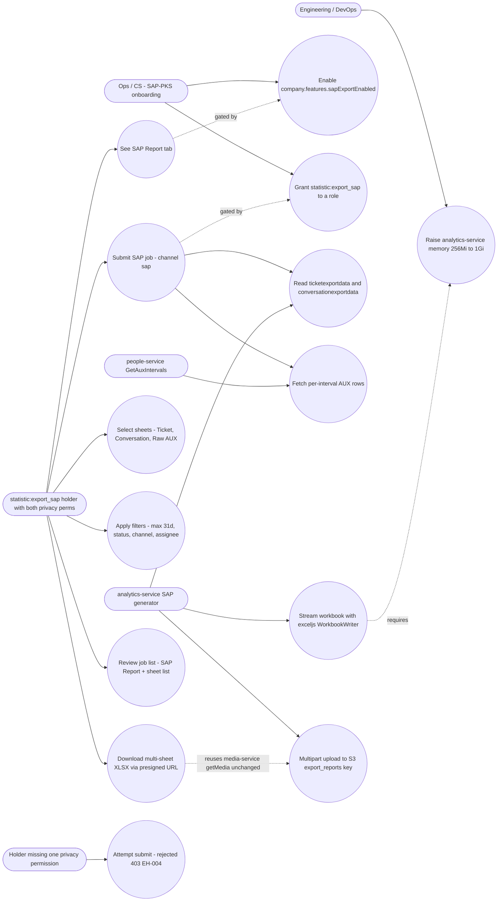
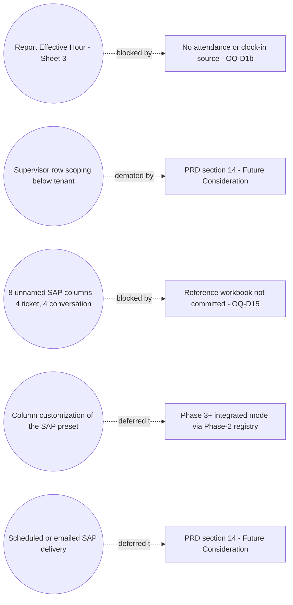

# Advance Export Phase 4 — Use Cases (SAP Template Preset)

Actors are RBAC permission holders, not job titles. SAP job creation requires
**all four** of: `statistic:export_sap` (new), `privacy:view_full_email`,
`privacy:view_full_phone` (`backend/libs/common/src/lib/enums/index.ts:96-97`),
and `company.features.sapExportEnabled = true` (new sub-document). The privacy
pair is a **hard gate** — the job is rejected, not masked (PRD FR-044 / EH-004).

Companion TRD: [`trd/trd-advance-export-phase-4-sap-template-preset.md`](../trd/trd-advance-export-phase-4-sap-template-preset.md)

## Out of scope in this phase

---
_Diagram supporting **PRD-D v2.1** (SAP Template Preset). Verified vs PRD-D + BE 2026-09-16: no change (privacy perms enums:96-97, four-way gate statistic:export_sap + both privacy + features.sapExportEnabled, OQ-D1b/D15 out-of-scope blockers all match PRD)._
