# Unique Inbound Clients per Channel — Activity Diagram

Companion diagram for [`trd/trd-analytics-unique-inbound-clients-per-channel.md`](../trd/trd-analytics-unique-inbound-clients-per-channel.md) (v1.2).

Two flows: (1) daily aggregation (cron → RMQ → widened pre-filter → sidecar `$lookup` → bucketTs → hash → daily rows → monthly rollup → cache invalidation), (2) read path (FE → api-gateway → analytics-service → monthly collection → response).

> Revised in v1.2: the aggregation now runs the OQ-04 pipeline — a widened `createdAt` pre-filter (7-day lookback), a same-DB `$lookup` into `conversationslametrics` projecting only `firstCustomerMessageAt`, the computed `bucketTs = firstCustomerMessageAt ?? createdAt`, and an exact WIB-day match on `bucketTs`. Hashes are 16-byte `BinData` truncations of HMAC-SHA256 (D-21), not 64-char hex. v1.1 changes retained: hashing in conversation-service (D-17), `$project` before `$group` and a batch cap (F-03/F-05), monthly rollup written by the cron (D-18), cache invalidation after the rollup (D-20), audit emit on read (D-19) and an explicit `enabled` branch (F-12).

```mermaid
flowchart TD
    subgraph AGG["Daily Aggregation (01:00 WIB)"]
        A1["Cron fires<br/>AggregationSchedulerService"] --> A2{"UNIQUE_INBOUND_CLIENTS<br/>_ENABLED == true?"}
        A2 -->|No| A_END["Skip — no writes"]
        A2 -->|Yes| A3["Acquire Redis lock"]
        A3 --> A4["Fetch distinct orgs<br/>ANALYTICS_GET_DISTINCT_ORGANIZATIONS"]
        A4 --> A5["For each org:"]
        A5 --> A6["Compute WIB day boundaries<br/>(yesterday + today)"]
        A6 --> A7["Send RMQ:<br/>ANALYTICS_AGGREGATE_UNIQUE_INBOUND_BATCH"]
        A7 --> A8["conversation-service handler:<br/>interpret UTC date as WIB day (F-10)<br/>$match conversations on WIDENED createdAt window<br/>dayStart - 7d to dayEnd (OQ-04 lookback)<br/>filter isGroup / isJunked / isDeleted"]
        A8 --> A9{"Doc count ><br/>MAX_CONVERSATIONS_PER_RUN?"}
        A9 -->|Yes| A10["$limit applied<br/>log.warn batch.truncated<br/>(count is a floor — F-05)"]
        A9 -->|No| A11["Full window processed"]
        A10 --> A12["$lookup conversationslametrics (same DB)<br/>project firstCustomerMessageAt ONLY (OQ-04)"]
        A11 --> A12
        A12 --> A12b["bucketTs = firstCustomerMessageAt ?? createdAt<br/>$match bucketTs in exact WIB day<br/>(D-02 rewrite)"]
        A12b --> A13p["$project identity fields only<br/>then $group by channel code<br/>(F-03 — dedup works at DB level)"]
        A13p --> A13["deriveIdentityKey per identity<br/>(normalize phone / email / referenceId)"]
        A13 --> A14["HMAC-SHA256 in conversation-service<br/>key = ANALYTICS_HMAC_SECRET<br/>input = companyId + ':' + derivedKey<br/>truncate digest to 16 bytes (D-21)"]
        A14 --> A15["Return 16-byte binary hashes over RMQ<br/>(no raw PII in transit — D-17)"]
        A15 --> A16["analytics-service:<br/>bulkUpsert daily rows<br/>($addToSet for idempotency)"]
        A16 --> A17["rollupMonth:<br/>recompute $setUnion across the month<br/>into monthly collection (D-18)"]
        A17 --> A18["DEL Redis summary key<br/>for this company + org + month (D-20)"]
        A18 --> A5
    end

    subgraph READ["Read Path (FE request)"]
        R1["FE: useQueryWithSession<br/>GET /analytics/unique-inbound-clients/summary"] --> R2["api-gateway:<br/>JwtAuthGuard"]
        R2 --> R3{"PermissionsGuard:<br/>has ALL or wildcard?"}
        R3 -->|No| R4["403 Forbidden<br/>(READ / READ_TEAM / READ_OWN<br/>and SALES all denied — F-06, ratified OQ-02)"]
        R3 -->|Yes| R5["Tenant from @RequestContext()<br/>gRPC: GetSummary"]
        R5 --> R6{"Backend gate<br/>enabled?"}
        R6 -->|No| R7["Return enabled=false,<br/>channels=[] (F-12)"]
        R7 --> R8["FE renders 'unavailable' state<br/>— never zeros"]
        R6 -->|Yes| R9["analytics-service:<br/>check Redis cache"]
        R9 --> R10{"Cache hit?"}
        R10 -->|Yes| R11["Return cached response"]
        R10 -->|No| R12["find uniqueinboundclientmonthlymetrics<br/>equality on companyId+orgId+year+month<br/>project channelCode + distinctCount<br/>(index-only, <= 6 docs — D-18)"]
        R12 --> R13["Build response:<br/>channels[], periodStart, periodEnd,<br/>lastUpdatedAt, enabled=true"]
        R13 --> R14["Cache in Redis<br/>(ONE_HOUR TTL)"]
        R14 --> R11
        R11 --> R15["api-gateway emits audit event<br/>fire-and-forget (D-19)"]
        R15 --> R16["FE renders KPI cards<br/>+ donut chart"]
    end
```

