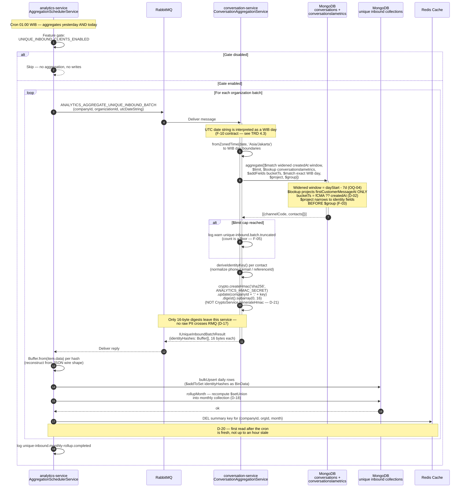
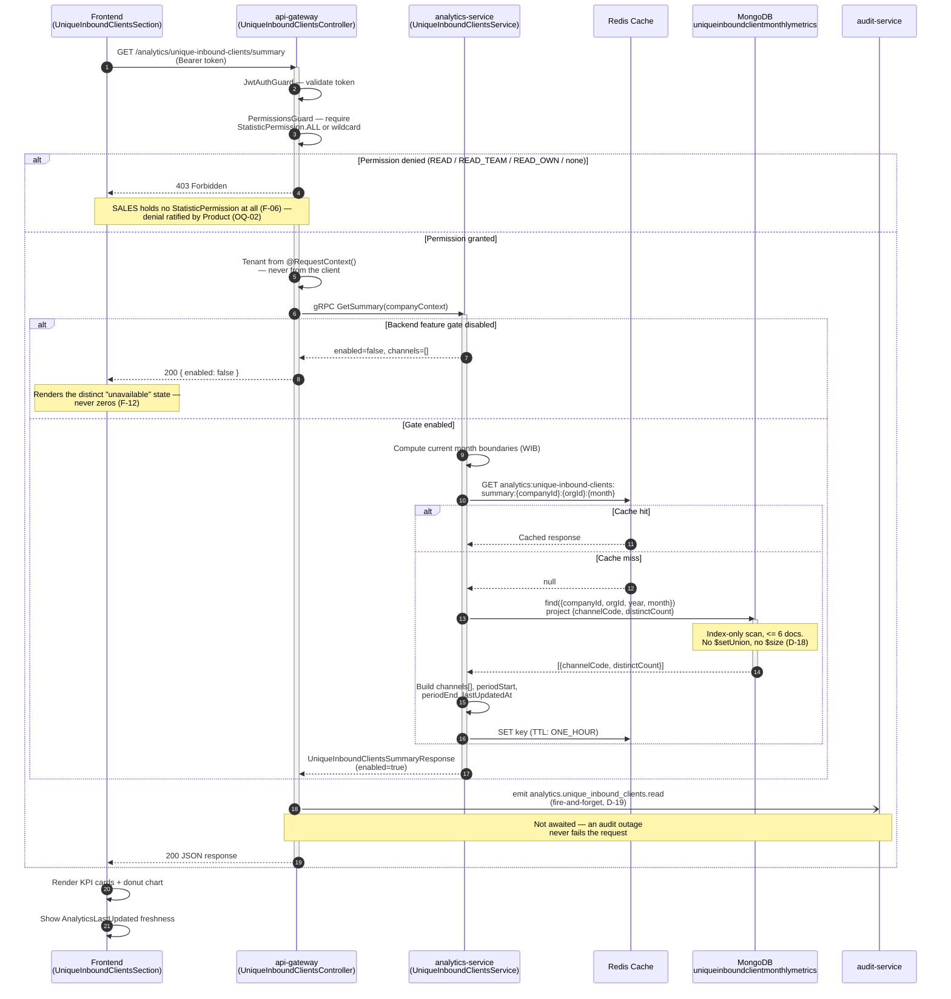

# Unique Inbound Clients per Channel — Sequence Diagrams

Companion diagram for [`trd/trd-analytics-unique-inbound-clients-per-channel.md`](../trd/trd-analytics-unique-inbound-clients-per-channel.md) (v1.2).

Two flows are specified: the **nightly write path** (cron → widened pre-filter → sidecar `$lookup` → bucketTs → hashed aggregation → daily rows → monthly rollup → cache invalidation) and the **dashboard read path** (FE → api-gateway → analytics-service → monthly collection).

> Revised in v1.2 for the OQ-04 rewrite: the conversation-service handler now widens the `createdAt` pre-filter by `UNIQUE_INBOUND_BUCKET_LOOKBACK_DAYS = 7`, runs a same-DB `$lookup` into `conversationslametrics` projecting only `firstCustomerMessageAt`, computes `bucketTs = firstCustomerMessageAt ?? createdAt` and re-matches on the exact WIB day before projecting identity fields. The HMAC output is truncated to **16 bytes and stored as BinData** (D-21) — the v1.1 diagram's 64-char hex digest is superseded. v1.1 changes retained: HMAC in conversation-service (D-17), monthly rollup (D-18), cache invalidation (D-20), audit emit (D-19), `enabled` field (F-12).

---

## 1. Nightly write path (01:00 WIB)

---

## 2. Dashboard read path

