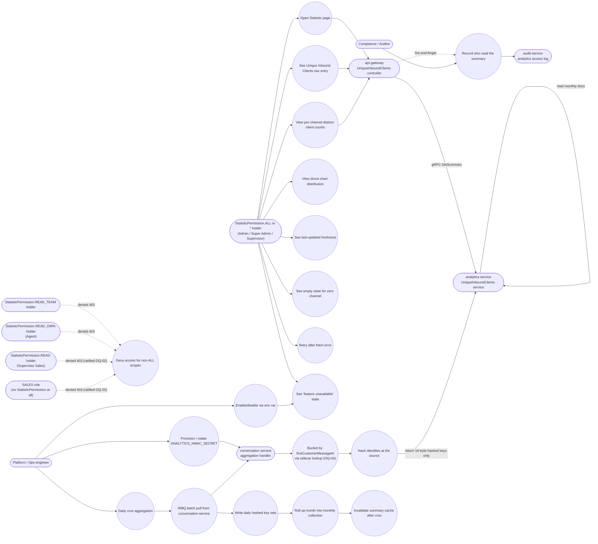

# Unique Inbound Clients per Channel — Use Cases

Companion diagram for [`trd/trd-analytics-unique-inbound-clients-per-channel.md`](../trd/trd-analytics-unique-inbound-clients-per-channel.md) (v1.2).

Actors are RBAC scopes, not job titles: any role holding `StatisticPermission.ALL` or wildcard `*` can perform the use case. Phase 1 is **company-scoped, read-only, monthly summary** — the diagram reflects that scope.

> Revised in v1.2: the daily aggregation use case now includes the OQ-04 bucketing rule (`bucketTs = firstCustomerMessageAt ?? createdAt` via a same-DB `$lookup` into `conversationslametrics`, widened 7-day pre-filter), and the hash width is stated as 16-byte binary (D-21). The denial of `SUPERVISOR_SALES` and `SALES` is now a ratified product decision (OQ-02), not an open question. v1.1 changes retained: SALES removed from permitted actors (F-06), and the operator-facing use cases for monthly rollup, cache invalidation, audit logging and HMAC secret management (D-15/D-18/D-19/D-20).

