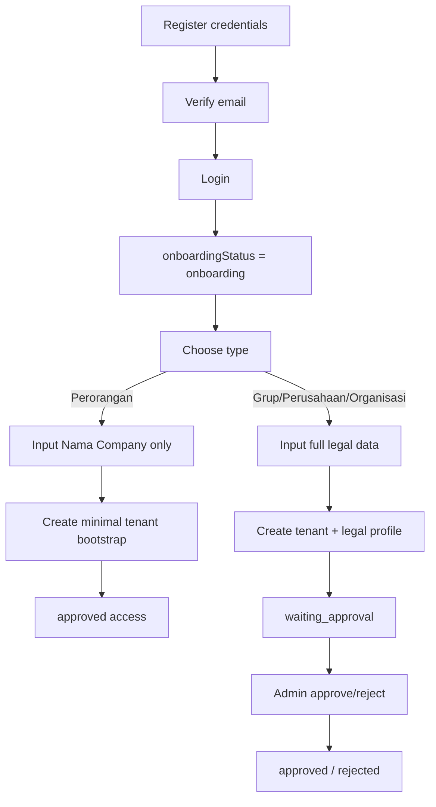

# **PRODUCT REQUIREMENT DOCUMENT**

**Feature**: Dual Registration Flow (Personal vs Group / Company / Organization)  
**Product Manager**: Dany Christian  
**Engineering Lead**: Naftal Yunior  
**Design Lead**: TBD

---

## **1. Revision History**

| Version | Date (Asia/Jakarta) | Author | Changes |
| ----- | ----- | ----- | ----- |
| v1.0 | 2026-06-26 | Hermes | Initial PRD for splitting registration onboarding into Personal and Group / Company / Organization flows while preserving tenant bootstrap and existing organization approval lifecycle. |

---

## **2. Overview**

| Item | Description |
| ----- | ----- |
| Purpose | Reduce onboarding friction for individual users who do not need to submit full legal-company data on day one, while preserving the existing full verification path for company / organization onboarding. |
| Scope | This PRD defines Phase 1 onboarding split behavior after credential registration: Personal flow requires only `Nama Company` during onboarding, while Group / Company / Organization flow keeps the current full legal form and approval lifecycle. |
| Key Capabilities | Onboarding type selection, conditional onboarding form, personal tenant bootstrap, organization legal onboarding, separate access-vs-legal verification behavior, and preserved owner/admin role bootstrap in both flows. |
| Outcome | New users can enter SatuInbox through the flow that matches their business type, without breaking the current single-tenant runtime model (`companyId + organizationId`) or the current organization approval process. |

### **2.1 Scope Definition**

| In Scope | Out of Scope |
| ----- | ----- |
| Split onboarding into `Perorangan` and `Grup / Perusahaan / Organisasi`. | Rewriting the initial credential registration page (`/auth/register`) from scratch. |
| Type selection shown before onboarding form submission. | Removing `companyId + organizationId` requirements from downstream runtime. |
| Personal flow requiring only `Nama Company`. | Multi-workspace per user in Phase 1. |
| Organization flow keeping the current full legal onboarding fields. | Billing/package redesign for personal vs organization users. |
| Personal flow bootstrap that still creates valid tenant context. | Legal document resubmission workflow after rejection, unless separately defined later. |
| Organization flow approval/rejection continuing to use the existing company approval lifecycle. | Replacing the current admin approval dashboard end-to-end in this PRD. |
| Session/onboarding status behavior updates per flow. | Full migration of existing approved users to a new onboarding model. |

### **2.2 Release Scope by Phase**

| Phase | Scope |
| ----- | ----- |
| Phase 1 | Add onboarding type selector, Personal onboarding form (`Nama Company` only), Organization onboarding form (existing full legal form), backend type-aware onboarding processing, preserved tenant bootstrap, and correct session/onboarding status per flow. |
| Phase 2 | Add upgrade path from Personal tenant to Organization legal verification, plus clearer admin filtering/reporting by registration type. |
| Phase 3 | Optional refinement for rejected-organization resubmission flow, operational dashboards, and richer onboarding analytics. |

---

## **3. Problem Statement**

| ID | Problem | Impact |
| ----- | ----- | ----- |
| PS-001 | Current onboarding assumes all new users are registering as a formal company / organization and must submit full legal information. | High friction for individual or small early-stage users who only need a workspace to start using the product. |
| PS-002 | Current onboarding form requires legal-company fields such as business license and identification documents for every new registrant. | Personal users may drop before activation because the flow is too heavy for their use case. |
| PS-003 | Current runtime still depends on `companyId + organizationId` for many services and sessions. | Personal onboarding cannot be solved safely by simply skipping tenant creation. |
| PS-004 | Current approval lifecycle assumes that every onboarding submission is a legal-company verification case. | Personal users risk being trapped in a review queue that does not match their onboarding intent. |
| PS-005 | Current `isVerified` semantics can be interpreted as both product-access readiness and legal/company verification readiness. | Ambiguous data semantics can create downstream bugs in session, snapshot, and admin logic. |

---

## **4. Objectives and Key Results**

| Objective | Key Result |
| ----- | ----- |
| Reduce onboarding friction for personal users. | Personal onboarding requires only 1 business input field (`Nama Company`) in Phase 1. |
| Preserve safe runtime initialization for all new users. | 100% of successfully onboarded users receive valid tenant context (`companyId + organizationId`) before entering the product. |
| Keep organization onboarding reviewable and compliant with current ops flow. | 100% of organization onboarding submissions continue to enter the approval/rejection lifecycle. |
| Separate product-access readiness from legal verification semantics. | Personal users do not enter the legal approval queue by default, and organization legal verification remains explicitly trackable. |
| Avoid regression on auth and owner role bootstrap. | 0 known regressions on credential registration, email verification, login redirect, and owner/admin role bootstrap during rollout validation. |

---

## **5. User Stories and Acceptance Criteria**

| ID | Priority | User Story | Acceptance Criteria |
| ----- | ----- | ----- | ----- |
| US-001 | P0 | As a new user, I want to choose whether I am registering as `Perorangan` or `Grup / Perusahaan / Organisasi` so that the onboarding form matches my business type. | 1. Given I have completed login and am redirected to onboarding, When the onboarding page loads, Then I see a clear choice between `Perorangan` and `Grup / Perusahaan / Organisasi`. 2. Given I have not selected a type yet, When I try to continue, Then the system asks me to choose a type first. |
| US-002 | P0 | As a personal user, I want a lightweight onboarding form so that I can start using the product without uploading legal documents. | 1. Given I select `Perorangan`, When the form is shown, Then only `Nama Company` is required from the business-side onboarding fields. 2. Given I submit a valid personal form, When onboarding succeeds, Then the system creates a usable tenant context and grants product access according to the personal-flow rules. |
| US-003 | P0 | As a company / organization user, I want to keep the existing full onboarding process so that my organization can go through the current verification path. | 1. Given I select `Grup / Perusahaan / Organisasi`, When the form is shown, Then the current legal fields remain required. 2. Given I submit a valid organization form, When onboarding succeeds, Then my account enters the existing company approval lifecycle. |
| US-004 | P0 | As the system, I want both flows to end with valid tenant bootstrap so that downstream services continue to work with the current single-tenant model. | 1. Given personal onboarding succeeds, When bootstrap finishes, Then the user has valid `companyId + organizationId`. 2. Given organization onboarding succeeds, When bootstrap finishes, Then the user also has valid `companyId + organizationId`. |
| US-005 | P0 | As the auth/session system, I want onboarding status to reflect the chosen flow so that route guards and product entry behavior are correct. | 1. Given a personal onboarding submission succeeds, When session state is refreshed, Then the user is no longer blocked by onboarding. 2. Given an organization onboarding submission succeeds, When session state is refreshed, Then the user enters `waiting_approval` behavior until reviewed. |
| US-006 | P1 | As an admin reviewer, I want organization onboarding submissions to remain reviewable while personal onboarding submissions do not pollute the same legal queue. | 1. Given an organization submission is created, When admin reviews pending onboarding, Then the submission is visible in the approval flow. 2. Given a personal submission is created, When admin reviews organization onboarding queue, Then the personal submission does not appear as a legal verification case by default. |
| US-007 | P1 | As a product team, I want future upgrade from Personal to Organization to remain possible so that personal users can become verified business tenants later. | 1. Given a user onboarded via personal flow, When future organization-upgrade capability is introduced, Then the data model can support legal-profile completion without breaking the existing tenant. |

---

## **6. Functional Requirements**

| Category | Requirements |
| ----- | ----- |
| Registration Entry | FR-001 [P0]: System MUST keep the existing credential registration entry (`email`, `fullName`, `username`, `phone`, `password`) available. FR-002 [P0]: The onboarding split in this PRD MUST happen after credential registration and login, not by forcing a full redesign of the initial registration page. |
| Onboarding Type Selection | FR-003 [P0]: System MUST present a type selector on onboarding with two options: `Perorangan` and `Grup / Perusahaan / Organisasi`. FR-004 [P0]: System MUST require the user to select a type before the onboarding form can be submitted. FR-005 [P0]: System MUST persist the chosen registration type as part of onboarding state so the selection is not lost on refresh/session continuation. |
| Personal Flow | FR-006 [P0]: When `Perorangan` is selected, the onboarding form MUST require only `Nama Company` as the business-facing input field in Phase 1. FR-007 [P0]: Personal flow MUST NOT require `businessLicenseNumber`, `businessLicenseUrl`, `identificationNumber`, `identificationUrl`, or `taxNumber` in Phase 1. FR-008 [P0]: Personal flow MUST still create valid tenant bootstrap (`company + organization`) so downstream services can operate normally. FR-009 [P0]: Personal flow MUST result in product access behavior that does not depend on manual legal-company approval. |
| Organization Flow | FR-010 [P0]: When `Grup / Perusahaan / Organisasi` is selected, the onboarding form MUST continue to require the full current legal onboarding data. FR-011 [P0]: Organization flow MUST continue to create `company + organization` through the current tenant bootstrap pattern. FR-012 [P0]: Organization flow MUST continue to use the existing approval/rejection lifecycle after submission. |
| Status and Semantics | FR-013 [P0]: System MUST distinguish registration type between `personal` and `organization` or equivalent enum values. FR-014 [P0]: System MUST distinguish product-access readiness from legal-verification readiness so that personal flow is not treated as a legal approval case by default. FR-015 [P0]: Existing onboarding status behavior (`onboarding`, `waiting_approval`, `approved`, `rejected`) MUST remain deterministic for FE route guarding and session hydration. |
| Session and Redirect | FR-016 [P0]: A user with unfinished onboarding MUST continue to be redirected to onboarding. FR-017 [P0]: A successfully completed personal onboarding flow MUST allow the user to enter the product without waiting for organization approval. FR-018 [P0]: A successfully completed organization onboarding flow MUST transition the user into waiting-approval behavior until reviewed. |
| Approval Queue Behavior | FR-019 [P1]: Organization onboarding submissions MUST remain visible to the approval workflow used today. FR-020 [P1]: Personal onboarding submissions MUST NOT be treated as pending legal-company verification by default. FR-021 [P1]: Admin operations SHOULD be able to distinguish onboarding submissions by registration type in future operational surfaces. |
| Validation Model | FR-022 [P0]: System MUST support conditional onboarding validation by registration type. FR-023 [P0]: Personal flow MUST reject accidental/legal-document requirements in Phase 1. FR-024 [P0]: Organization flow MUST reject incomplete legal submissions the same way the current flow does. |
| Bootstrap and Role Setup | FR-025 [P0]: Owner/admin role bootstrap MUST continue to happen for both flows. FR-026 [P0]: Personal flow MUST NOT bypass tenant bootstrap in a way that leaves the user without valid role/company/organization context. |
| Future Extensibility | FR-027 [P1]: The chosen design SHOULD support future upgrade from personal tenant to organization legal verification flow. FR-028 [P1]: The chosen design SHOULD avoid forcing a destructive tenant recreation during that future upgrade. |
| Non-Side Effects | FR-029 [P0]: Existing approved users MUST NOT be forced back through onboarding because of this change. FR-030 [P0]: Existing organization approval behavior MUST NOT be broken by adding the personal path. FR-031 [P0]: The change MUST NOT remove `companyId + organizationId` assumptions from downstream services in Phase 1. |

---

## **7. Error Handling**

| ID | Type | Handling | UI/UX |
| ----- | ----- | ----- | ----- |
| EH-001 | Missing registration type | Block submission until type is selected. | Show clear validation message near the type selector. |
| EH-002 | Personal onboarding validation error | Reject incomplete or invalid personal data. | Show field-level validation on `Nama Company`. |
| EH-003 | Organization onboarding validation error | Reject incomplete legal-company data. | Preserve current legal form validation behavior and user-facing errors. |
| EH-004 | Tenant bootstrap failure | Do not leave user in half-complete onboarding success state. | Show recoverable error and allow retry without silently entering product. |
| EH-005 | Session refresh/update failure after onboarding success | Prevent stale route-guard behavior where user is sent back to the wrong state. | Show controlled loading/refresh state and re-evaluate session. |
| EH-006 | Personal flow incorrectly routed to legal waiting approval | Treat as invalid behavior. | User must not see company-waiting-approval messaging for a successful personal flow. |
| EH-007 | Organization review conflict | If an organization request is already approved/rejected elsewhere, do not duplicate the finalization. | Refresh current state and show informative message. |

---

## **8. Edge Cases**

| ID | Scenario | Expected Behavior | UI/UX |
| ----- | ----- | ----- | ----- |
| EC-001 | User selects a type, refreshes the page, and returns to onboarding. | The selected type is restored from persisted onboarding state or clearly re-requested without ambiguity. | User should not lose progress silently. |
| EC-002 | User starts as personal but submits organization-only fields through unexpected client behavior. | Backend validation follows registration type and rejects unsupported/mismatched payload shape. | Show safe validation failure. |
| EC-003 | User starts as organization but omits one or more legal fields. | Submission is rejected with the current validation behavior. | Preserve current legal-form UX expectations. |
| EC-004 | Tenant bootstrap partially succeeds but status/session update fails. | System must not grant inconsistent product access or leave orphaned visible success state without valid session context. | Show retry/recovery state. |
| EC-005 | User has completed personal onboarding but session cache still thinks onboarding is incomplete. | Session must be refreshed/reloaded until FE route guard and actual backend state match. | Avoid redirect loop. |
| EC-006 | Existing approved organization user logs in after this feature is released. | User enters product normally and is not shown the new type-selection onboarding screen. | No onboarding regression. |
| EC-007 | Future requirement introduces personal-to-organization upgrade. | Existing personal tenant remains reusable; upgrade adds legal profile instead of forcing user recreation. | Upgrade path can be layered later. |

---

## **9. UI & UX Requirements**

| Component | Description | UX Flow | Related User Story IDs |
| ----- | ----- | ----- | ----- |
| Onboarding type selector | Initial chooser on onboarding page for `Perorangan` vs `Grup / Perusahaan / Organisasi`. | User lands on onboarding, chooses type, then continues to the matching form. | US-001 |
| Personal onboarding form | Lightweight onboarding form for personal users. | User selects `Perorangan`, fills `Nama Company`, submits, and enters product on success. | US-002 |
| Organization onboarding form | Existing legal-company onboarding form. | User selects organization path, fills full legal data, submits, and enters waiting-approval state. | US-003 |
| Post-submit personal success transition | Controlled transition after personal submission. | User sees success/loading state while session is refreshed and then enters product. | US-002, US-005 |
| Post-submit organization waiting state | Waiting-approval state for organization users. | User sees waiting-approval message/state after successful organization submission. | US-003, US-005 |

**UI Copy Notes (Bahasa Indonesia):**
- `Pilih tipe pendaftaran`
- `Perorangan`
- `Grup / Perusahaan / Organisasi`
- `Nama Company`
- `Lanjut`
- `Lengkapi data perusahaan`
- `Pengajuan Anda sedang menunggu approval`
- `Pendaftaran berhasil`

**UX Rules:**
- Personal flow must feel materially lighter than organization flow.
- Type choice must be explicit; do not infer personal vs organization automatically from field behavior.
- The onboarding page must not mix personal and organization required fields in one confusing long form.
- If the user switches type before submit, the form should reset only the fields that do not apply to the new type.

---

## **10. Field & Validation**

| Field | Type | Example | Validation | Required | Default |
| ----- | ----- | ----- | ----- | ----- | ----- |
| registrationType | Enum | `personal`, `organization` | Must be one of the supported onboarding types | Yes | None |
| name | String | `Dany Studio` | Normalized, trimmed, valid display/business name | Yes | Empty |
| businessLicenseNumber | String | `1234567890123` | Existing legal validation | Conditional (`organization`) | Empty / null |
| businessLicenseUrl | String / File URL | `https://.../nib.pdf` | Existing legal validation | Conditional (`organization`) | Empty / null |
| identificationNumber | String | `3174...` | Existing legal validation | Conditional (`organization`) | Empty / null |
| identificationUrl | String / File URL | `https://.../ktp.pdf` | Existing legal validation | Conditional (`organization`) | Empty / null |
| taxNumber | String | `123456789012345` | Existing legal validation | Conditional (`organization`) | Empty / null |
| onboardingStatus | Enum | `onboarding`, `waiting_approval`, `approved`, `rejected` | Must remain compatible with auth/session guard behavior | Derived / persisted | Existing logic |
| legalVerificationStatus | Enum | `not_required`, `pending`, `approved`, `rejected` | Must reflect legal-review state independently from product-access readiness | Derived / persisted | Depends on flow |
| companyId | String | `cmp_xxx` | Valid company identifier | Derived | None |
| organizationId | String | `org_xxx` | Valid organization identifier | Derived | None |

**Validation Rules:**
- For `personal`, only `registrationType` and `name` are required from onboarding business fields in Phase 1.
- For `organization`, all current legal onboarding fields remain required.
- The system must validate payload shape based on `registrationType`, not merely based on which fields happen to be present.
- Internal field naming may differ in implementation, but user-facing behavior must match the rules above.

---

## **11. Non-Functional Requirements**

| Category | Requirement |
| ----- | ----- |
| Performance | Type selection and onboarding form switching SHOULD feel immediate and not require full page reload. |
| Reliability | Onboarding submission MUST remain safe under retry and must not create inconsistent duplicate tenant bootstrap side effects. |
| Security | Tenant context creation MUST remain scoped and valid for both flows. |
| Privacy | Personal flow MUST NOT require collection of legal documents in Phase 1. |
| Observability | The system MUST emit logs/metrics for onboarding type selected, onboarding submit success/failure, bootstrap success/failure, and post-submit status transition. |
| Auditability | Organization approval/rejection actions MUST remain auditable. |
| Accessibility | Type selection and form submission MUST remain keyboard-accessible and clearly labeled. |
| Localization | User-facing onboarding copy MUST remain Bahasa Indonesia compatible and translatable through the existing i18n pattern. |

---

## **12. Dependencies & Risks**

| Dependency or Risk | Owner | Impact | Mitigation |
| ----- | ----- | ----- | ----- |
| Current company schema requires legal fields for all tenants | Engineering | Personal flow cannot work safely with current schema unchanged | Add type-aware contract and conditional legal data persistence strategy |
| Current runtime depends on `companyId + organizationId` | Engineering | Personal flow breaks if tenant bootstrap is skipped | Always create valid tenant context in both flows |
| Current approval lifecycle assumes all onboarding is legal review | Product / Engineering | Personal users may be trapped in wrong waiting state | Separate access readiness from legal verification semantics |
| Current session middleware redirects all non-approved users to onboarding | Engineering | Personal flow may loop if status/session refresh is wrong | Define exact post-submit session update behavior |
| Ambiguous `isVerified` semantics | Product / Engineering | Downstream confusion between access approval and legal verification | Introduce explicit registration/legal verification semantics |
| Future upgrade from personal to organization not yet specified | Product | Risk of data-model dead-end | Keep phase-1 model upgrade-friendly |

---

## **13. Success Metrics**

| KPI | Target | Time Window | Data Source |
| ----- | ----- | ----- | ----- |
| Personal onboarding completion rate | Higher than current full-form baseline for users who choose personal flow | First 30 days after rollout | Onboarding analytics |
| Organization onboarding completion continuity | No material drop caused by the split-flow UX | First 30 days after rollout | Onboarding analytics |
| Personal users stuck in waiting-approval incorrectly | 0 | Ongoing | Auth/session monitoring + support incidents |
| Tenant bootstrap success rate across both flows | 99%+ successful completion | First 30 days after rollout | Backend logs / monitoring |
| Auth/onboarding redirect regressions | 0 critical regressions | Rollout period | QA + production incident tracking |

---

## **14. Future Considerations**

| Topic | Why It Matters Later |
| ----- | ----- |
| Personal-to-organization upgrade | Many users may start personal and become formal organizations later. |
| Rejected organization resubmission | Current reject handling may need a clearer self-service retry loop. |
| Admin queue filtering by registration type | Helps operational visibility after two onboarding types exist. |
| Billing/package differentiation | Personal vs organization plans may diverge later but are not part of this PRD. |
| Richer onboarding analytics | Useful for measuring drop-off and business conversion by type. |

---

## **15. Limitations**

| Limitation | Impact |
| ----- | ----- |
| Phase 1 does not redesign the initial credential registration page. | The main simplification happens in onboarding, not before email verification. |
| Phase 1 does not define the full self-service upgrade workflow from personal to organization. | Product/ops may still need a future addendum for verified-business transition. |
| Phase 1 does not redefine billing/package semantics by registration type. | Commercial policy remains unchanged until a separate PRD exists. |
| Phase 1 does not fully redesign admin approval tooling. | Existing approval capability is reused rather than reimagined. |

---

## **16. Appendix**

| Item | Notes |
| ----- | ----- |
| Glossary | `Personal` = perorangan onboarding path with lightweight business input. `Organization` = group / company / organization onboarding path with legal data. `Tenant bootstrap` = creation of valid `company + organization` context needed by runtime. |
| UI Labels | `Pilih tipe pendaftaran`, `Perorangan`, `Grup / Perusahaan / Organisasi`, `Nama Company`, `Lengkapi data perusahaan`, `Pengajuan Anda sedang menunggu approval`. |
| Assumptions | Initial credential registration stays as-is in Phase 1. Personal flow is intended to be lighter and not depend on legal-company approval. |
| Open Questions | Final wording for `Nama Company` vs `Nama Workspace`; whether personal-to-organization upgrade becomes Phase 2 priority; whether rejected-organization users can resubmit in-place. |
| References | `Assessments/auth/dual-registration-flow/dual-registration-flow-qa-assessment.md`, `PRD/Auth/PRD SuperAdmin - Global Company Access and Tenant Impersonation.md` |

---

## **17. Current vs Proposed Flow Diagrams**

### **17.1 Current Flow**

```mermaid
flowchart TD
  A[Register credentials] --> B[Verify email]
  B --> C[Login]
  C --> D[onboardingStatus = onboarding]
  D --> E[/onboarding]
  E --> F[Submit full legal company form]
  F --> G[/company/register]
  G --> H[Create company + organization]
  H --> I[waiting_approval]
  I --> J[Admin approve/reject]
  J --> K[approved / rejected]
```

### **17.2 Proposed Flow**



---

## **18. State Transition Model**

| Entity | Current State | Action / Trigger | Next State | Allowed Roles | Guard Conditions | Side Effects | Audit Event |
| ----- | ----- | ----- | ----- | ----- | ----- | ----- | ----- |
| Auth Onboarding | `onboarding` | User selects onboarding type | `onboarding` | New user | Valid session exists | Registration type persisted | `onboarding_type_selected` |
| Personal Onboarding | `onboarding` | Submit valid personal onboarding | `approved` | New user | `registrationType = personal` and `name` valid | Tenant bootstrap created, session refreshed | `personal_onboarding_completed` |
| Organization Onboarding | `onboarding` | Submit valid organization onboarding | `waiting_approval` | New user | `registrationType = organization` and legal fields valid | Tenant bootstrap created, legal review case created | `organization_onboarding_submitted` |
| Organization Review Case | `waiting_approval` | Admin approves | `approved` | Authorized reviewer/admin | Submission still pending | Product access granted | `organization_onboarding_approved` |
| Organization Review Case | `waiting_approval` | Admin rejects | `rejected` | Authorized reviewer/admin | Submission still pending | Product access blocked | `organization_onboarding_rejected` |
| Rejected Organization User | `rejected` | Future resubmission flow (out of scope) | TBD | User/admin | Depends on future design | TBD | TBD |

---

## **19. Permission Matrix**

| Role | View Type Selector | Submit Personal Onboarding | Submit Organization Onboarding | Enter Product After Personal Success | Review Organization Approval | Notes |
| ----- | ----- | ----- | ----- | ----- | ----- | ----- |
| New unauthenticated visitor | Denied | Denied | Denied | Denied | Denied | Must complete registration and login first |
| Authenticated new user in onboarding | Allowed | Allowed | Allowed | Conditional on success | Denied | Only for own onboarding path |
| Approved user | Denied | Denied | Denied | Allowed | Denied | Should not be sent back to onboarding |
| Admin / reviewer | Denied | Denied | Denied | N/A | Allowed | Organization review lifecycle only |

---

## **20. API / Event Contract**

| Contract | Method / Event | Producer | Consumer | Request / Payload | Response / Ack | Error Codes | Compatibility Notes |
| ----- | ----- | ----- | ----- | ----- | ----- | ----- | ----- |
| Credential registration | `POST /auth/register` | FE register form | API Gateway / auth-service | existing credential payload | success | existing auth errors | No Phase-1 redesign required |
| Email verification | `POST /auth/validate-email` | FE verification page | API Gateway / auth-service | existing token payload | success | existing token errors | Existing behavior preserved |
| Onboarding submit | `POST /company/register` or equivalent onboarding contract | FE onboarding | API Gateway / company-service | `registrationType` + conditional onboarding payload | success | validation, bootstrap, conflict | Phase 1 may reuse current route with type-aware validation |
| Personal onboarding completion | `personal_onboarding_completed` (logical event/log) | company/auth flow | monitoring/audit | actor, registrationType, companyId, organizationId | ack/log | n/a | Used for observability |
| Organization onboarding submitted | Existing company registration + approval lifecycle events | company/auth flow | auth/session/admin flow | organization legal onboarding payload | success | existing company/register errors | Existing approval flow reused |
| Organization approved | Existing approval event | admin/company flow | auth/session flow | company/user context | success | existing approval errors | Existing lifecycle preserved |
| Organization rejected | Existing rejection event | admin/company flow | auth/session flow | company/user context | success | existing rejection errors | Existing lifecycle preserved |

---

## **21. Migration & Rollout Plan**

| Area | Plan | Owner | Validation | Rollback |
| ----- | ----- | ----- | ----- | ----- |
| Feature Flag | Add onboarding split behind a feature flag for new registrations only. | Product / Engineering | Verify both flows in staging and limited rollout. | Disable flag and return all new users to current full onboarding flow. |
| Backend Validation | Introduce type-aware onboarding validation without breaking existing organization flow. | Engineering | Validate personal and organization submissions separately in staging. | Revert to existing all-organization validation behavior. |
| Session Behavior | Ensure personal success updates product-access state correctly, and organization success keeps waiting-approval behavior. | Engineering / QA | Validate redirect logic end-to-end after login and onboarding submit. | Restore current session-status update behavior. |
| Operations | Keep current organization approval flow active while adding registration-type awareness. | Product / Ops | Check that organization requests still appear in queue and personal requests do not. | Route all new onboarding back to current organization-only flow. |

---

## **22. Data Lifecycle & Retention**

| Data | Owner | Created By | Retention | Archive/Delete Policy | Export Policy | Privacy Notes |
| ----- | ----- | ----- | ----- | ----- | ----- | ----- |
| registrationType | Auth/onboarding owner | User onboarding action | Long-lived with account/onboarding context | Retained with user onboarding history | No export requirement in Phase 1 | Low sensitivity but behavior-critical |
| Personal tenant display/business name | Company/tenant owner | Personal onboarding submit | Long-lived with tenant | Normal tenant lifecycle | Existing tenant export policy if applicable | Not a legal verification document by default |
| Organization legal fields | Company/legal owner | Organization onboarding submit | Long-lived per company/legal policy | Existing company/legal retention policy | Existing policy | Contains sensitive legal identity data |
| Onboarding status | Auth/session owner | System transitions | Long-lived while account exists | Normal auth lifecycle | No Phase-1 export requirement | Drives access gating |
| Legal verification status | Company/legal owner | System/admin transitions | Long-lived while tenant exists | Normal company/legal lifecycle | No Phase-1 export requirement | Must not be conflated with access readiness |

---

## **23. Analytics & Observability Plan**

| Signal | Name | Trigger | Properties | Owner | Alert / Threshold |
| ----- | ----- | ----- | ----- | ----- | ----- |
| Product Event | `onboarding_type_selected` | User chooses onboarding type | userId, registrationType | Product / Data | Monitor distribution |
| Product Event | `onboarding_submitted` | User submits onboarding | userId, registrationType, success/fail | Product / Data | Alert on abnormal fail spikes |
| Log / Metric | `tenant_bootstrap_result` | Bootstrap completes or fails | userId, registrationType, companyId, organizationId, result | Engineering | Alert on failure spike |
| Product Event | `personal_onboarding_completed` | Personal path succeeds | userId, companyId, organizationId | Product / Data | Track completion rate |
| Product Event | `organization_onboarding_waiting_approval` | Organization path succeeds | userId, companyId, organizationId | Product / Data | Track queue volume |
| Audit Event | `organization_onboarding_approved` | Admin approves | actorId, userId, companyId | Engineering / Ops | Operational review |
| Audit Event | `organization_onboarding_rejected` | Admin rejects | actorId, userId, companyId | Engineering / Ops | Operational review |

---

## **24. Concurrency, Rate Limit & Idempotency**

| Scenario | Risk | Required Behavior | Validation |
| ----- | ----- | ----- | ----- |
| User submits onboarding twice due to lag | Duplicate tenant/bootstrap side effects | Submission flow MUST be idempotent or safely deduplicated by user/onboarding context | QA submits duplicate requests intentionally |
| User refreshes during post-submit session update | FE reads stale onboarding status | Session/status refresh MUST converge to the actual backend state without redirect loop | QA refreshes immediately after success |
| Admin reviews organization request concurrently with another reviewer | Conflicting approval/rejection result | First final decision wins; second reviewer sees latest state | QA concurrent approval/rejection simulation |
| User changes onboarding type before final submit | Wrong validation branch applied | System validates against the final selected type only | QA switches type repeatedly before submit |
| Personal onboarding rolled out under feature flag | Mixed rollout behavior for new users | Users must consistently see either the old or new flow, not a half-mixed state | QA rollout smoke checks |

---

## **25. Diagram References**

| Diagram | Location | Purpose |
| ----- | ----- | ----- |
| Current Flow Diagram | Section 17.1 | Show existing onboarding path before split |
| Proposed Flow Diagram | Section 17.2 | Show target onboarding branch behavior after split |
| State Transition Model | Section 18 | Show access and review transitions |
