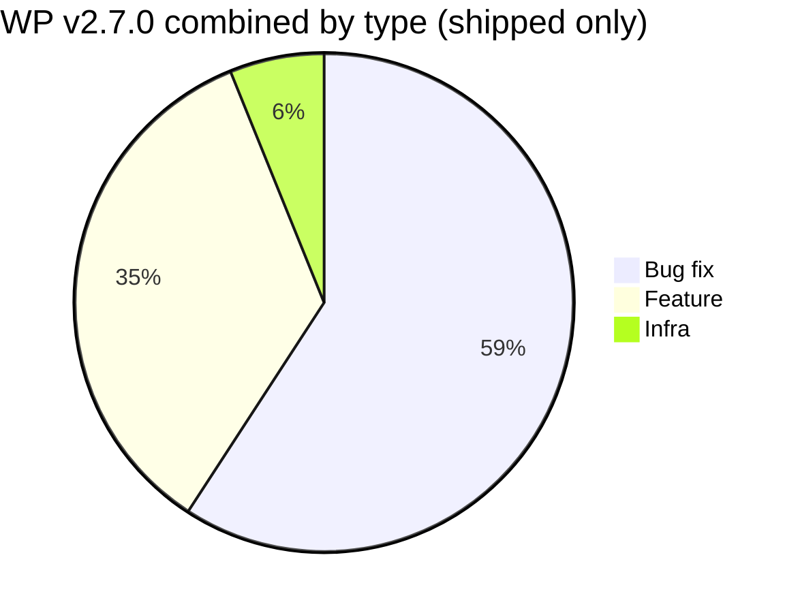

# Release Notes v2.7.0 (termasuk v2.7.0.2 & v2.7.0.3) — Technical

**Product:** SatuInbox · **OpenProject versions:** prod-2.7.0 (id 52), prod-2.7.0.2 (id 84), prod-2.7.0.3 (id 85)
**Source:** OpenProject SatuInbox
**Scope:** Semua WP dengan status `Closed` di ketiga version. WP meeting/admin/task non-produk diexclude.

---

## v2.7.0

### Features

| WP | Judul | Detail teknis |
|---|---|---|
| #1757 | Chatbox Copy Paste from Clipboard Features | Tambah kemampuan copy-paste dari clipboard di chatbox widget. |
| #1820 | Update Baileys lib to v7 rc-10 | Upgrade library Baileys (WA Web engine) ke v7 release candidate 10. |
| #2058 | WhatsApp message utility (contact, poll, event) | Tambah dukungan tipe pesan: contact card, poll, dan event di WhatsApp. |
| #2112 | Conversation - add event assignBy data | Tambah field `assignBy` pada event assignment conversation untuk tracking siapa yang assign. |
| #2140 | Global search suggestion | Implementasi global search — pencarian lintas domain (conversation + ticket). |
| #2209 | Improve ticket room - reply from selected bubble | User bisa reply langsung dari bubble pesan yang dipilih di ticket room. |
| #2277 | Auth - change validation onboarding | Perubahan validasi di flow onboarding (temporary v2.7.0). |
| #2345 | Optimize Filter Count and Spam Filter Query | Optimisasi query filter count dan spam filter untuk performa. |
| #2363 | Spintext - dynamic configuration | Konfigurasi spintext jadi dinamis (temporary v2.7.0). |
| #2393 | Create OPEN API Team inbox | Open API baru untuk team inbox, bisa diakses pihak eksternal. |
| #2434 | Add global search config | Tambah konfigurasi global search di settings. |

### Bug Fixes

| WP | Judul | Root cause / fix |
|---|---|---|
| #1089 | Invoice Filters & Export Not Working | Filter dan export di Settings > Subscription > Payments tidak fungsi; tab state reset saat reload. |
| #1132 | Reopen disconnected channel conversation | Conversation dengan account channel yang sudah disconnect/delete masih bisa di-reopen. |
| #1207 | Broadcast sent with Rp 0 balance | Broadcast bisa terkirim walau token balance Rp 0. |
| #1572 | Notification time UTC instead of local | Notifikasi tampil jam UTC, bukan waktu lokal user. |
| #1619 | Visit History badge arrangement | Badge "Late" dan "Reschedule" di visit history tidak tertata rapi. |
| #1625 | Visit Detail Decision UI mismatch | Tampilan Decision section di visit detail tidak sesuai design. |
| #1708 | Offline Report Status not updating on pagination | Status report offline tidak update saat ganti halaman. |
| #1810 | KPI Counter not synced during pagination | Counter KPI di ticket list tidak sinkron saat paginasi real-time. |
| #1814 | Checkbox overlaps text in Lead filter | Checkbox tumpang tindih dengan text di filter kontak lead. |
| #1823 | Invalid validation phone/email fields | Validasi salah di field nomor telepon dan email perusahaan. |
| #1834 | Empty state missing in Add Prospect | Empty state info hilang di tab Existing Contact pada Add Prospect. |
| #1959 | File compatibility - support HEIC/HEIF | Tambah support file HEIC dan HEIF yang sebelumnya tidak bisa diupload. |
| #1975 | Shift hour change not effecting member | Perubahan shift hour tidak berdampak ke anggota. |
| #2052 | WA Web account channel status inconsistency | Status account channel WhatsApp Web tidak konsisten antar halaman. |
| #2128 | IT Support Conversation Room Broadcast | Bug di room broadcast untuk IT support conversation. |
| #2210 | Mobile autofill data on SALES FORM | Autofill data di form sales pada mobile tidak bekerja benar. |
| #2216 | WA Group messages not displayed | Pesan dari participant tertentu di WhatsApp Group tidak muncul + reply context hilang. |
| #2226 | Ticket → conversation static path URL | Direct dari ticket ke conversation menghasilkan URL statis (bukan dynamic). |
| #2227 | WA API conversation created without message | Conversation terbuat tanpa ada message dari WhatsApp API. |

---

## v2.7.0.2 — Hotfix Performance

### Features

| WP | Judul | Detail teknis |
|---|---|---|
| #2597 | WA Web - change sync process after scan | Pisah queue sync dan inbound; user bisa pilih sync 1 bulan/2 minggu/1 minggu (default: latest). |
| #2611 | Change login flow (Landing Page) | Setelah login user masuk landing page dengan progress bar (simulasi workspace loading) sebelum masuk Conversation. |
| #2646 | SLA event-driven instead of cron | Perhitungan SLA ganti dari cron ke event-driven, kurangi query write/read overload. |
| #2647 | Improvement round robin | Batch loop assign (5 per member), kurangi frekuensi cron. |
| #2649 | FE minimalis workspace | Workspace tampil minimalis — accordion collapsed by default, fetch data saat diaktifkan. |
| #2650 | Cron analytics once per day | Analytics pre-compute cukup jalan sekali per hari (00:00 GMT+7). |

### Bug Fixes

| WP | Judul | Root cause / fix |
|---|---|---|
| #2455 | Double Message | Pesan kadang terkirim dobel. |
| #2509 | Blank Screen and Loading Issue | Blank screen karena connection pool habis; fix: bump max pool size ke 50 untuk conversation service + tambah indexing DB. |
| #2531 | Maximum call stack in inbound (circular reference) | WA group message crash karena `handleSenderInfo()` pass live Mongoose subdocument (circular) ke `mapMongoToProto()`; fix: extract 4 field saja + tambah WeakSet recursion guard di libs/common. |

### Infra / Internal

| WP | Judul | Detail |
|---|---|---|
| #2597 (env) | WhatsApp history-sync backfill isolation | Env baru: `RABBITMQ_BACKFILL_PREFETCH=3`, `WHATSAPP_HISTORY_SYNC_MAX_AGE_DAYS=30`, `HISTORY_SYNC_BACKFILL_QUEUE_ENABLED=true`. |
| Per-service pool size | MongoDB connection pool per service | Env: `MONGODB_CONVERSATION_MAX_POOL_SIZE=50` (bumped), lainnya default 10. |

---

## v2.7.0.3 — Hotfix

### Bug Fixes

| WP | Judul | Root cause / fix |
|---|---|---|
| #2716 | FIX - RMQ export job | RabbitMQ consumer ack error (`precondition_failed: unknown delivery tag`); fix: restart container + tambah auto-heal monitoring script. |
| #2717 | FIX - Conversation room title | Bug di tampilan judul room conversation. |
| #2718 | Export offline return 0 data | Export offline menghasilkan 0 data; fix: payload export pakai `memberId` bukan `userId`. |
| #2719 | Conversation subject email too long | Subject email conversation >100 char tidak ter-truncate; fix: truncate + tooltip. |

### Infra / Internal

| WP | Judul | Detail |
|---|---|---|
| #2274 | Investigation spike MongoDB | Investigasi root cause MongoDB spike post v2.7.0: kombinasi refetch storm FE + latency `/conversation/count` + write contention dari mention/LID/Baileys upgrade. |

---

## Excluded from this doc (meetings/admin/meta, no product content)
v2.7.0: #2158, #2162, #2163, #2230, #2251, #2261, #2293, #2427
v2.7.0.2: #2644 (hotfix checklist), #2712 (deploy task)
v2.7.0.3: #2727 (deploy task)
