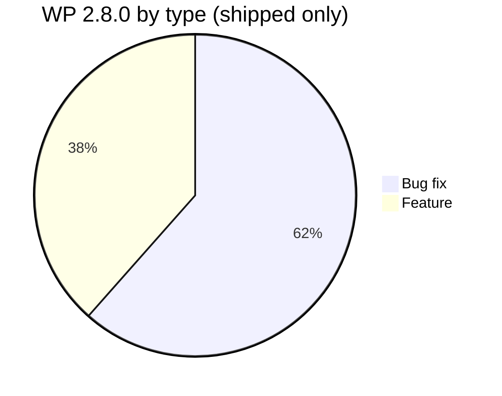

# Release Notes v2.8.0 — Technical

**Product:** SatuInbox · **OpenProject version id:** 62 · **Source:** OpenProject SatuInbox, version=prod-2.8.0
**Scope:** WP dengan status `Closed`/`Tested` di bawah version 2.8.0. Item `New`/`In testing`/`Test failed`/`In progress` (belum shipped) dikeluarkan — lihat "Not shipped" di bawah.

## Features

| WP | Judul | Detail teknis |
|---|---|---|
| #1632 | Omnichannel Inbox / Related Conversations Grouping | Groups related conversations dalam omnichannel inbox. |
| #1633 | Ticketing / Related Tickets and Ticket Merge Suggestion | Suggest related tickets + merge ticket. |
| #2360 | Instagram: Reconnect Expired Channel Instead of Delete + Re-create | Channel Instagram expired sekarang bisa reconnect di tempat, gak perlu delete + setup ulang. Scope: apps/instagram, apps/channel-service (BE) + Instagram add-on settings UI (FE). |
| #2711 | Improvement Round robin | Batch delivery rules di round-robin conversation assignment (batch 10), cegah bottleneck distribusi. |
| #2739 | Integrate satuinbox contact with lincah contact via OPEN API | Sync contact module SatuInbox ↔ Lincah contacts lewat Open API Lincah. |
| #2836 | Hapus Relasi (Unlink Relation Label) | Fitur unlink relation label (single + bulk) — sebelumnya tidak ada di codebase sama sekali. Modal konfirmasi + route API baru. Split dari issue 2 di WP #2607. |
| #2903 | Auto-assign unassigned conversations when a channel is added to a team | Auto-assign conversation orphan ke team saat channel-nya ditambahkan, ganti manual sync. Root cause: handler `TEAM_ACCOUNT_CHANNEL_ADDED` di conversation-service cuma append channel tanpa assign conversation lama. |
| #2953 | OPEN API - baileys - validate number | Open API validasi nomor WhatsApp via Baileys, untuk integrasi Salfok. |
| #2969 | Global Search — fuzzy/typo-tolerant matching | Tambah fuzzy matching di global search biar setara search di conversation list — sebelumnya Atlas relevance scoring cuma exact/prefix/partial ladder. |
| #3140 | Add widget chatbox.id for lincah company | Widget live chat chatbox.id khusus company Lincah. |

## Bug Fixes

| WP | Judul | Root cause / fix |
|---|---|---|
| #2228 | Global Search - improvement autotag after search | Hasil global search jadi clickable/selectable, bulk tagging relation-label per domain. |
| #2410 | Global Search Suggestion - Improvement Performance | P95 60x di atas threshold PRD (60s vs 1.5s) + 97% failure rate di 50-VU concurrent load — fixed. |
| #2607 | Global Search - error opening related conversation | Row click salah trigger checkbox; tombol "Hapus Relasi" hilang (2 issue terpisah). |
| #2622 | Global Search - cross domain selection not disabled | User bisa pilih Conversation + Ticket result bersamaan — sekarang dicegah. |
| #2660 | Global Search - tag relasi edited value not synced to modal | Edit value di Tag Relasi (bulk action bar) tidak kebawa ke modal Beri Tag Relasi. |
| #2665 | Global Search - UI/UX Polish Collection | Kumpulan minor fix: cursor/hover, toast message clarity, status tracking (Open/Fixed/New). |
| #2700 | Widget anomaly socket event - FLACKY | Widget message kadang skip/drop (setiap pesan pertama) setelah server restart/release. |
| #2732 | Global search Atlas $search fails on tenants >1000 conv/ticket | `MongoServerError: query has expanded into too many sub-queries — maxClauseCount` overflow — di-fix dengan chunking candidate-id list di bawah limit Lucene. |
| #2905 | Global Search - ticket relation label badges not appear | Badge relation label ticket tidak render walau tersimpan setelah bulk "Beri Tag Relasi". |
| #2906 | Global Search - relation label no char limit + UI error | Tambah limit char, fix modal/UI overflow untuk label panjang (2 issue di modal Beri Tag Relasi). |
| #2915 | Global Search - label not sync to current data relation list | Badge stale tetap muncul setelah label dihapus dari conversation detail sampai hard refresh. |
| #2916 | Conversation - unable to copy/paste in Ticket Creation modal | Copy/paste di modal create ticket tidak jalan. |
| #2958 | Broadcast Template - Meta-created WA templates never sync to DB | Template dibuat langsung di Meta Business Manager (bukan lewat template builder SatuInbox) gak pernah muncul di local DB. |
| #2981 | Global Search - Bug UI modal "Lepas Label Relasi" | Modal error saat nama relation label >45 karakter. |
| #2982 | Global Search - can't delete relation label 40+ char | Release/unlink action error untuk label ≥40 char. |
| #3104 | Inbox - chat list preview not truncated | Message preview text tidak konsisten truncate dengan ellipsis, overflow. |

## Infra / Internal (non user-facing, included for tech record)

- #2340 Cost Server Optimize — pindah instance Cricket ke dev, hapus instance QA, cut cost.
- #2394 Research Topology MongoDB Optimizations — investigasi optimisasi.
- #2538 Research Performance Improvement - CONVERSATION — kandidat root cause loading lambat: round robin, global search, export, inbound rate tinggi, socket new message.
- #2832 Deployment v2.8.0 — env var baru: `TEMPLATE_SYNC_CRON_ENABLED`, `TEMPLATE_SYNC_INTERVAL_MS=900000` (15 menit), `GLOBAL_SEARCH_CANDIDATE_CACHE_ENABLED`.
- #2962 Merge data-cy FE — merge test automation data-cy.
- #3154 Add alert notification error to google chat — alert pod restart/pod-down ke Google Chat.
- #3197 Grooming requirement temporary close, shopee chat, call function — requirement gathering untuk pause conversation/ticket + Shopee chat + call function.

## Not shipped (excluded, status ≠ Closed/Tested)

| WP | Judul | Status |
|---|---|---|
| #2373 | Broadcast - Improvement template (whatsapp api) | Test failed |
| #3204 | Monitoring Release v2.8.0 | In progress |

## Excluded from this doc (meetings/admin, no product content)
#2318, #2656, #2709, #2710, #2714, #2736, #2792, #2911, #2934, #2942, #2943, #2966, #3111, #3147, #3148, #3212, #3258, #3259
