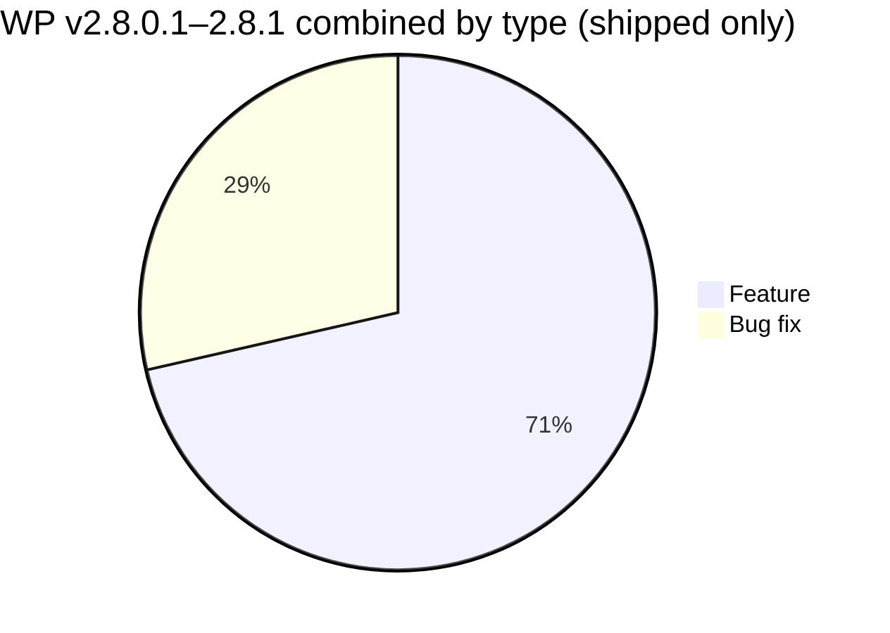

# Release Notes v2.8.0.1 (termasuk v2.8.0.2, v2.8.0.3 & v2.8.1) — Technical

**Product:** SatuInbox · **OpenProject versions:** prod-2.8.0.1 (id 94), prod-2.8.0.2 (id 95), prod-2.8.0.3 (id 96), prod-2.8.1 (id 87)
**Source:** OpenProject SatuInbox
**Scope:** WP dengan status `Closed`/`Tested` di keempat version. Item `In progress`/`Waiting Merge Request`/`New` (belum shipped) diexclude ke section "Not shipped". WP meeting/admin/research non-produk diexclude.

---

## v2.8.0.1

### Features

| WP | Judul | Detail teknis |
|---|---|---|
| #3226 | RLT ke Statistic Pre-Aggregation + Frontend | RLT (`firstAgentReplyAt − firstAgentAssignmentAt`) diwire full pipeline sebagai metrik responsiveness ke-4 (bareng ART/FRT/TTC): sync people-service, pre-aggregation analytics-service, expose api-gateway, summary card + line chart di FE Statistic → Responsiveness dengan breakdown org/team/agent/platform. Conversation-only. BE `eb6eeb7e`, FE `3be94d57`. |

### Infra

- #3255 Deployment v2.8.0.1 — Closed.

---

## v2.8.0.2 — Hotfix

### Features

| WP | Judul | Detail teknis |
|---|---|---|
| #3248 | RLT SLA breakdown (`slaRltSuccess`) — parity dengan FRT/TTC | RLT dapat SLA-success: `SLASettingMetricEnum.RESPONSE_LEAD_TIME` configurable, boolean `slaRltSuccess`, card "In SLA/Over SLA" di Settings + Statistic. Default threshold 5 menit. `SLASettingResolverService` fallback chain + `rlt` branch; `ConversationSLAMetrics` gains `rltSnapshotConfiguredMs`/`slaRltSuccess`; proto `ResponsivenessSLABreakdownResponse.rltSla` tag 3. Backfill script `backfill-sla-rlt-success.js` (dry-run-first). |

### Bug Fixes

| WP | Judul | Root cause / fix |
|---|---|---|
| #3243 | Team filter di Statistic Responsiveness gak search backend | Filter cuma nyaring 25 team pertama yang sudah kebuka lokal, gak pernah hit backend. Root cause: `useResponsivenessFilterOptions.ts` panggil `useGetTeamList({ search: '' })` dengan search kosong hardcoded + `shouldFilterOption` default `true` (cmdk client-side). Fix: debounced search + `limit: 50` + wire `onSearchChange`/`shouldFilterOption: false` (1 file, +13/-2). |

### Infra

- #3256 Deployment v2.8.0.2 — Closed. Backfill script `tools/scripts/db/backfill-sla-rlt-success.js` (dry-run-first) dijalankan saat deploy ini.

---

## v2.8.0.3 — Hotfix

### Bug Fixes

| WP | Judul | Root cause / fix |
|---|---|---|
| #3250 | Supervisor bisa pilih team mana saja di filter Responsiveness | Filter abaikan per-user scope. Root cause: `ResponsivenessFilterOptions.tsx` gak forward `analyticsContext` ke hook, jadi `isMyOwnTeam` tak dikirim. Gating pakai `role.code === SUPERVISOR` (konsisten dgn `shouldScopeByTeam` dll). Fix 2 file (+10/-5). |

---

## v2.8.1

### Features

| WP | Judul | Detail teknis |
|---|---|---|
| #2373 | Broadcast — Improvement template (WhatsApp API) dengan media | Template sebelumnya cuma plain-text header + body variable. Improvement: broadcast template dengan media (image/video/document di header). |
| #2907 | Agent Dashboard — permission access ke statistic page | Agent Statistic Access (mini dashboard) — guard fix, logic fix, export fix, backfill. |
| #3155 | Agent Dashboard — Statistic Parameter Improvement | Filter consistency fix + parameter metric baru. |

---

## Not shipped (excluded, status ≠ Closed/Tested)

| WP | Version | Judul | Status |
|---|---|---|---|
| #2331 | 2.8.1 | SuperAdmin Global Company Access — Phase 1 | In progress |
| #2697 | 2.8.1 | Notification Service Improvement | In progress |
| #3156 | 2.8.1 | Agent Dashboard — Statistic Interactive Dashboard (Drill-Down) | In progress |
| #2901 | 2.8.1 | MongoDB read preference — per-service/per-query override + `secondaryPreferred` | Waiting Merge Request |
| #3257 | 2.8.0.3 | Deployment v2.8.0.3 | New |

## Excluded from this doc (meetings/admin/research, no product content)
#2965, #2970, #2974, #3247, #3275, #3305, #3359, #3392, #3393 — dan 28 WP v2.8.1 status New/Specified/Confirmed/In specification/Rejected/On hold.
