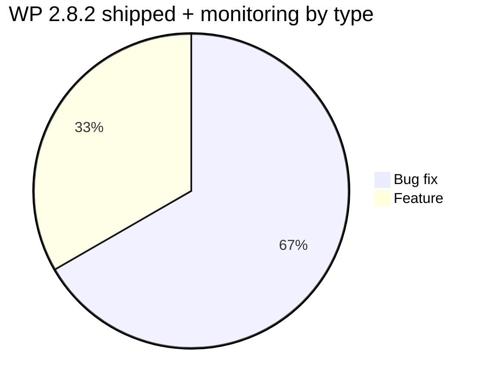

# Release Notes v2.8.2 — Technical

**Product:** SatuInbox · **OpenProject version id:** 88 · **Source:** OpenProject SatuInbox, version=prod-2.8.2
**Scope:** WP status `Closed`/`Tested` = shipped (section Features & Bug Fixes). WP status `In testing` = **sudah rilis, fase monitoring** (user sudah bisa pakai) — lihat section "Released — Monitoring Phase". Item `Confirmed`/`Developed` yang belum rilis diexclude.

## Features (shipped — Closed/Tested)

| WP | Judul | Detail teknis |
|---|---|---|
| #266 | WhatsApp Group Mention | Mention peserta grup WhatsApp via trigger `@` langsung dari SatuInbox: search by display name/nomor, multiple mention, mention metadata terstruktur, rendering/highlight, badge Internal, permission-based access. |
| #3156 | Agent Dashboard — Statistic Interactive Dashboard (Drill-Down) | Card statistic clickable, navigate-with-filter, drill endpoint, modal result. Cross-domain Analytics + Conversation + Ticket. |
| #3498 | Broadcast Template — tambah kolom `created at` | Tambah kolom `created at` sebelum kolom `updated at` di list template broadcast. |
| #3690 | Webhook inbound message — Salfok (Partner Verification Relay) | Relay pesan inbound ke outbound webhook untuk verifikasi partner. Trigger di conversation inbound path, cross-domain Platform/Integration. |

## Bug Fixes (shipped — Closed/Tested)

| WP | Judul | Root cause / fix |
|---|---|---|
| #3522 | Conversation — bulk action close (agent metrics tidak ke-finalize) | Root cause: asymmetric write/read agent metrics — row dibuat keyed pada **participant**, tapi di-lookup pada **requester** saat close. 3 call site (`closeConversation:1704`, `junkConversation:3542`, `bulkJunkConversations:6175`) kirim `closingAgentId: userId` (requester). Fix attribution: lookup pakai participant yang benar. |
| #3565 | SLA TTC dihitung pakai shift closing user, bukan shift agent penangan | SLA business-hours TTC dihitung terhadap shift **closing user** (supervisor/admin yang gak pernah di-assign), bukan agent penangan → `slaTtcSuccess` dievaluasi terhadap office hours/timezone salah. Beda dari #3522, bug ini **menulis** row → nilai salah tersimpan diam-diam, kontaminasi data SLA historis. |
| #3588 | Non-credited participant tetap di active agent-metrics set setelah multi-participant close | Saat conversation ≥2 participant di-close, cuma row agent yang credited di-finalize; row participant lain `agentTtcMs` tetap unset → conversation closed dihitung selamanya sebagai active assignment. Split dari #3522. Fix di `agent-conversation-metrics.service`. |
| #3644 | Analytics — Ticket KPI card tidak muncul | `GET /api/analytics/ticket/counts` return HTTP 500 karena request dilayani legacy Redash path, dan Redash data source-nya mati. Fix: routing ke pre-aggregation path (bukan Redash). |

## Released — Monitoring Phase (status `In testing`, user sudah bisa pakai)

> Sudah rilis ke produksi dan bisa digunakan user, masih dalam pemantauan sebelum ditutup penuh.

| WP | Type | Judul | Root cause / fix |
|---|---|---|---|
| #2208 | Bug | WhatsApp API — handle account channel status update | Dua defect di `apps/whatsapp-api`: (1) webhook account status (`ACCOUNT_UPDATE`/`ACCOUNT_BANNED`/`ACCOUNT_REINSTATED` dll) sudah dideklarasi tapi gak ada producer/consumer (resolver tak terdaftar); (2) defect channel-status terkait. |
| #3328 | Bug | notification-service crash saat RabbitMQ consumer_timeout (reminder-queue) | Incident prod 2026-08-20: crash `406 PRECONDITION_FAILED — delivery acknowledgement timed out` (1.800.000 ms). Root cause: `reminder-queue` jalan `noAck: false` (`createRabbitMQDelayedQueueMicroservice`), NestJS tahan delivery unacked lewat `consumer_timeout` → broker force-close channel → proses crash. |
| #3367 | Bug | Instagram token refresh queue stuck — 540 message unacked | Queue `instagram-token-refresh` numpuk 540 message unacked, gak pernah drain. Pola `noAck: false` delayed-queue sama (`main.utils.ts:283`, `apps/instagram/src/main.ts:45`); token long-lived 60-hari reschedule via `x-delayed-message` tapi delivery numpuk unacked. |
| #3599 | Bug | Conversation group type (isGroup salah `false` untuk grup) | Kasus Lion Parcel: scan ~600 grup, mayoritas conversation dibuat `isGroup:false` (seharusnya `true`); nama grup harus sync saat ada grup baru, bukan menampilkan `remoteJID`. |

## Excluded from this doc (belum rilis / admin, no product content)
#3574 (judul ticket tidak provide special char stripe — status Confirmed, belum rilis), #3689 (Analytics translation key tampil mentah di donut chart — status Confirmed, belum rilis), #3713 (onboarding QA intern — admin).
